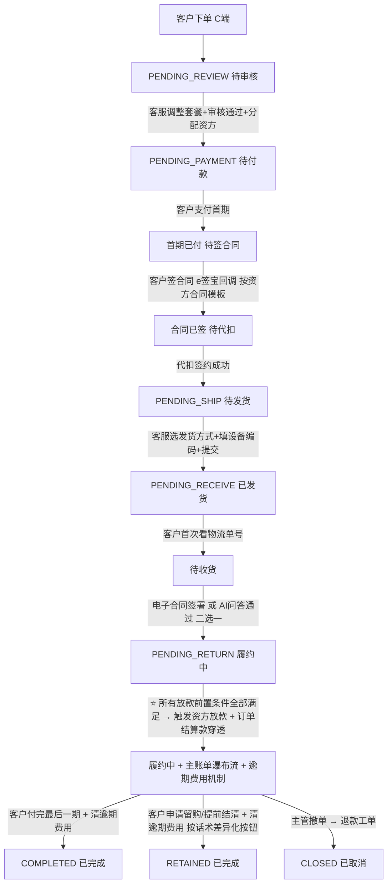

# 长租订单全生命周期与客服操作手册

> P0 业务文档(2026-05-27)。
> 长租订单从客户下单到归还的**完整 6 阶段**流程,逐阶段定义:客服操作 / 客户感知 / 系统动作 / 字段 / 状态流转。

> **⚠️ V0.2 修订(2026-05-27)v1.5**:
> - **§7.3 整体重写**:订单结算款穿透不再"由监管锁回调触发",改为"**资方放款条件全部满足时触发**"
> - 监管锁上锁仅是"资方放款前置条件之一",**不是触发器**
> - 资方放款机制详见新文档 `资方管理/04_资方放款条件与触发机制.md`
> - 这样设计支持未来增加任何新前置条件(公证 / 人脸 / 担保人 / 资方终审 等),不需要改主流程

> **⚠️ V0.2 Peer Review 修订(2026-05-27)v1.6**:
> - 商家订单在合同签署前开放商家侧字段修改能力。
> - 仅限 `cooperation_mode = self_operate`,联营订单 / 平台订单不开放。
> - 修改后必须重新生成订单确认快照、触发客户重新确认并写变更日志。

> **⚠️ V0.2 修订(2026-05-27)v1.4**:
> 三模式命名 + 履约中 / 逾期费用 字眼 + 资方分配 + 资方话术差异化按钮(保留)

> **⚠️ V0.2 修订(2026-05-27)v1.3 / 2026-05-26 v1.2 / v1.1**:违约金机制 / 8 状态(保留,字眼按 v1.5 统一)

---

## 1. 总览

```
阶段 0 客户下单
   ↓
阶段 1 待审核   ⭐ 核心(客服调整套餐 + 生成图片 + 确认订单进入支付 + 风控审批 + 分配资方)
   ↓
阶段 2 待付款   (首期一笔支付 → 自动发起合同 → 自动发起代扣)
   ↓
阶段 3 待发货   (选发货方式 + 填设备编码,编码不可改)
   ↓
阶段 4 待收货   (电子合同 / AI 问答 二选一,必须通过)
   ↓
阶段 5 待归还   (履约中,⭐ 多前置条件全部满足后触发资方放款 + 逾期费用机制)
   ↓
归还 / 留购 / 提前结清 / 完成
```

**C 端 8 状态对照**:审核中 / 待付款 / 待签约 / 已发货 / 待收货 / **履约中** / 已完成 / 全部订单(详见 09 文档)

---

## 2. 阶段 0:客户下单(C 端)

(内容同 v1.3,无修改)

订单状态:`PENDING_REVIEW`(待审核)

**客户 C 端展示:"审核中"**(Tab + 详情页状态;**不显示预估时间**;**不显示门店/资方/客服等**)

---

## 3. 阶段 1:待审核 ⭐ 核心阶段(v1.4 新增资方分配)

主要内容同 v1.3。**关键补充:联营订单 / 平台订单经审核通过后需进入"资方分配"环节**:

```
联营订单 / 平台订单审核通过
   ↓
进入"资方分配"工作台
   ↓
系统按风控规则推荐资方:
   ├─ 优质订单 + 蓝海银行授信余额够 → 推荐蓝海银行
   ├─ 不符合银行标准 + 平台愿接 → 推荐平台自营
   └─ 都不符合 → 提示驳回订单
   ↓
运营审核确认资方(或调整推荐)
   ↓
系统自动:
   ├─ 锁定 order.funding_source / order.funder_id
   ├─ 加载 order.contract_template_id(从资方继承)
   └─ 加载 order.terminology_template_id(从资方继承)
```

详细流程见 `04_待审核与资方分配.md` v2.0 + `资方管理/03_风控规则与资方分配.md`。

### 3.1 商家订单合同签署前字段修改(v1.6 新增)

适用条件:

| 条件 | 规则 |
|---|---|
| 合作模式 | 仅 `self_operate` 商家订单 |
| 订单状态 | `PENDING_REVIEW` / `PENDING_PAYMENT` |
| 合同状态 | 客户合同未签署 |
| 操作端 | 商家端 / 运营端异常介入 |
| 不适用 | 联营订单、平台订单、合同已签订单 |

商家可修改字段:

| 字段 | 说明 |
|---|---|
| 商品 / SKU / 规格 | 可换同商品或同类目商品,按商品权限控制 |
| 期数 | 改期数后重新生成账单 |
| 首期应付 | 独立修改 |
| 保证金 | 独立修改 |
| 增值服务 | 添加、移除、改价 |
| 设备价 / 订单总额 | 触发指导价校验和分摊重算 |

修改后的系统动作:

```text
商家修改字段
   ↓
系统校验:商家订单 + 合同未签 + 设备价指导价规则
   ↓
重新生成订单费用明细和订单确认图片
   ↓
写入 order_change_log
   ↓
客户 C 端显示“订单内容已更新,请重新确认”
   ↓
客户确认后才允许继续支付 / 签约
```

剩余期数重算规则:
1. 修改订单总额后,剩余未付期数按等额分摊生成默认方案。
2. 商家如有逐期自定义权限,可进入高级模式逐期填写。
3. 保证金独立计算,不参与剩余期数分摊。
4. 平台综合服务费按新订单总额重新计算。
5. 历史确认快照保留,新快照作为当前有效版本。

数据模型:

```sql
order_change_log
- log_id          bigint PK
- order_id        bigint FK
- change_type     enum -- product / sku / installments / down_payment / deposit / addon / total_price / multiple
- before_value    json
- after_value     json
- changed_by      bigint
- operator_role   enum -- merchant / merchant_staff / platform_csr
- change_reason   text
- customer_confirm_status enum -- pending / confirmed / expired
- created_at      datetime
```

---

## 4. 阶段 2:待付款

(内容同 v1.3,无修改)

**v1.4 补充**:客户签的合同模板**按订单的资金来源决定**:
- 平台自营 → 《租赁服务协议》(标准三方)
- 蓝海银行 → 《蓝海银行赊销合同》

---

## 5. 阶段 3:待发货

(内容同 v1.3,无修改)

---

## 6. 阶段 4:待收货 ⭐ 含验收确认机制

(内容同 v1.3,无修改)

---

## 7. 阶段 5:待归还(履约中)⭐ v1.5 整体重写资方放款触发机制

### 7.1 订单进入正常履约期

```
订单状态:PENDING_RETURN(待归还,C 端显示"履约中")
客户在 C 端可看到:
  - 主账单瀑布流(每一期 + 剩余应付)
  - 任意期可点 [立即支付](严格顺序:必须先付完之前的期,详见 09 §3.2)
  - 当期付完后可点 [申请留购] 或 [提前结清](按订单话术模板)
  - 逾期费用账单(独立区块,逾期产生,详见 11 文档)
```

详细 C 端展示见 `09_C端订单状态与账单支付.md`。

### 7.2 订单详情页放款状态展示(后台)

订单详情页**合同状态 / 代扣签约状态附近**新增资方放款状态区块(后台显示,**C 端不显示**):

```
┌──────────────────────────────────────────────────┐
│ 合同状态:        ✓ 已签署                          │
│ 代扣状态:        ✓ 已签约                          │
│ 监管锁状态:      ✓ 已上锁                          │
│ 资金来源:        蓝海银行                            │
│                                                    │
│ 资方放款状态:    ⏳ 待放款(条件未全部满足)         │
│   前置条件检查清单:                                 │
│   ✓ 风控审批通过                                   │
│   ✓ 客户合同已签                                   │
│   ✓ 代扣已签约                                     │
│   ✓ 首期已付                                       │
│   ✓ 设备已交付                                     │
│   ✓ 客户已确认收货                                 │
│   ✓ 收货后验证通过                                 │
│   ✓ 监管锁已上锁                                   │
│   ⏳ 蓝海银行终审通过(等待)                       │
│                                                    │
│   完成情况:8/9                                    │
│   [手动触发条件检查]  [查看检查日志]                │
└──────────────────────────────────────────────────┘

✓ 已放款的展示:

┌──────────────────────────────────────────────────┐
│ 资方放款状态:    ✓ 已放款 ¥5,000(2026-05-26 15:30)│
│ 资金链路:                                          │
│   蓝海银行 → 平台对公(BL2026052712345)            │
│   → 通联备付金(TL2026052712345)                   │
│   → 门店子台账(MSA20260527001)                    │
│ 资方应收余额:   ¥5,000                            │
└──────────────────────────────────────────────────┘
```

详细字段定义见 `资方管理/04_资方放款条件与触发机制.md`。

### 7.3 资方放款触发机制 ⭐ v1.5 整体重写

> **核心变化**:本版起,**订单结算款不再由"监管锁回调"单一事件触发**,而是由"**资方放款条件全部满足**"触发。
> - 监管锁上锁只是众多放款条件之一
> - 未来可增加任何新条件(公证 / 人脸活体 / 担保人 / 资方终审 等)
> - 不同资方可配置不同的条件清单

#### 7.3.1 商家订单(self_operate)

```
商家订单不触发资方放款
(门店自己出资,无需平台代付订单结算款)
后续由客户每月支付时的月度分账给门店
```

#### 7.3.2 联营订单 / 平台订单 — 多前置条件检查机制 ⭐

详细机制见 `资方管理/04_资方放款条件与触发机制.md`。本节摘要业务流程:

```
任何前置条件状态变化 → 触发"放款条件检查":
  - 风控审批通过
  - 资方已分配
  - 客户合同已签 (按资方对应合同模板)
  - 代扣已签约
  - 首期已付
  - 设备已交付
  - 客户已确认收货
  - 收货后验证通过(电子合同 / AI 问答 二选一)
  - 监管锁已上锁
  - 资方扩展条件(蓝海银行:征信授权 / 转让确认书 / 终审等)
  - 未来任何新条件
   ↓
系统按资方配置检查所有条件
   ├─ 全部满足 → 触发放款流程(§7.3.3)
   └─ 未全部满足 → 等待,记录日志
   ↓
事件丢失兜底:每 5 分钟定时任务复查
```

#### 7.3.3 放款流程(按 funding_source 分支)

【分支 A】funding_source = platform_self(平台自营资金)

```
① 检查平台自营授信额度是否充足
② 平台对公账户出资 = 设备价 × 出资比例
③ 实时充值通联备付金账户(< 1 分钟)
④ 充值到门店子台账(订单结算款入账)
⑤ 更新资方台账(资方=平台自营)
⑥ 更新平台自营授信额度
⑦ 写资方放款流水(funder_disbursement_log)
⑧ 推送商家端"订单结算款 ¥XXX 已到账"

例:联营 50/50,¥5,000 × 50% = ¥2,500
例:平台订单 100%,¥5,000 × 100% = ¥5,000
```

【分支 B】funding_source = funder_blue_ocean(蓝海银行赊销)

```
① 检查蓝海银行授信额度是否充足
② 平台调用蓝海银行放款 API
   POST /api/v1/blue-ocean/disbursement
   {
     "order_id": "OD2026001",
     "amount": 5000.00,
     "customer_info": {...},
     "device_info": {...}
   }
③ 蓝海银行接收 + 终审(若条件清单要求)+ 放款到平台对公账户
④ 平台对公账户实时充值通联备付金账户(< 1 分钟)
⑤ 充值到门店子台账(订单结算款入账)
⑥ 更新资方台账(资方=蓝海银行)
⑦ 更新蓝海银行授信额度
⑧ 写资方放款流水(funder_disbursement_log,带 bank_serial_no)
⑨ 推送商家端"订单结算款 ¥XXX 已到账"

例:平台订单 100%,¥5,000 = 蓝海银行授信占用 ¥5,000
```

### 7.4 关键设计

- **放款不再依赖单一事件触发**,而是多条件检查机制(§7.3.2)
- 任何前置条件状态变化都会触发一次检查 + 5 分钟定时兜底
- 不同资方可配不同的条件清单(可扩展)
- 监管锁上锁是众多条件之一,**不再是触发器**
- 商家订单不触发资方放款(门店自营)
- 联营订单 / 平台订单按出资比例计算放款金额
- 资方授信额度在放款时自动占用,完成 / 撤单时自动释放
- 任何资金动作都同步更新资方台账,确保资金链路闭环

### 7.5 资方放款异常兜底(v1.5 更新)

| 异常 | 处理 |
|---|---|
| 商家未及时上锁(超 24h)| 客服催促 |
| 商家长时间不上锁(超 7 天)| 进入主管审核 + 强制人工标记 |
| 主管手动标记"已上锁" | 触发放款条件检查 + 写"人工标记"日志 |
| 监管锁回调到达但其他条件未满足 | 仍然等待,直到全部满足才放款 |
| 平台对公账户已收钱但通联充值失败 | 系统重试 3 次 + 财务异常队列(详见 07 文档) |
| 通联充值成功但门店子台账未更新 | 系统对账兜底 |
| **蓝海银行 API 调用失败** | 系统自动重试 3 次 + 异常队列 |
| **蓝海银行终审拒绝** | 异常队列 + 客服联系客户;**可降级为平台自营**(详见资方 04 §6.4) |
| **资方授信额度不足** | 提交时风控阻拦;若已审核完成发生,异常队列 + 主管审核 |
| **条件检查任务漏跑** | 5 分钟兜底定时任务自动复查 |

### 7.6 在租期逾期费用机制(同 v1.4,字眼一致)

详细规则见 `11_违约金账单与规则配置.md`(v1.1 已统一字眼为"逾期费用账单与规则配置")。

#### 7.6.1 逾期费用生成

- 系统每日凌晨 1 点定时任务扫描所有"履约中"订单
- 检查每一期主账单是否逾期(到期日 + 1 < today)
- 已逾期但未生成逾期费用账单 → 新建
- 已生成逾期费用账单 → 累计天数 +1,重算金额
- 客户支付当期主账单后 → 该期逾期费用停止累计

#### 7.6.2 逾期费用规则配置

| 合作模式 | 规则配置位 |
|---|---|
| 商家订单 | 商家在自己后台配置 |
| 联营订单 | 平台统一配置 |
| 平台订单 | 平台统一配置 |

#### 7.6.3 客服后台操作

详细权限矩阵 + 操作日志见 11 §10。所有减免必须填原因 + 留痕。

#### 7.6.4 客户 C 端展示

```
逾期费用账单(独立于主账单)
  来源期数  累计天 原始金额 减免  实付   操作
  第3期    5天    ¥50    -¥20  ¥30   [立即支付][咨询客服]
           已减免 ¥20(运营调整)
```

#### 7.6.5 提前结清 / 归还前的强制结清

```
客户申请留购 / 提前结清(按订单话术模板)或 归还
   ↓
检查是否有未结清逾期费用?
   ├─ 否 → 正常流程
   └─ 是 → 必须先结清逾期费用
            ├─ [一并结清后提前结清] → 金额 += 逾期费用合计 + 一笔支付
            └─ [先支付逾期费用] → 跳转逾期费用支付页
```

---

## 8. 阶段 6:归还 / 留购 / 提前结清 / 完成(同 v1.4)

### 8.1 三种结局

| 结局 | 状态 | C 端展示 |
|---|---|---|
| 客户归还设备 | COMPLETED | 已完成 |
| 客户完成留购 / 提前结清 | RETAINED | 已完成 |
| 撤单 / 关闭 | CLOSED | 已完成(已取消)|

按 09 文档 v1.2 决策,C 端不再细分"已归还/已留购",统一显示"已完成"。

### 8.2 归还 / 留购 / 提前结清前的逾期费用清算

无论哪种结局,在订单关闭前**必须清算所有逾期费用**(详见 7.6.5)。

### 8.3 归还流程

(沿用现有 03_订单详情.md 和 05_订单关闭退款与售后.md 的逻辑,本文档不重复)

### 8.4 留购 / 提前结清触发(按资方话术差异化按钮)

客户在 C 端任意一期点 [申请留购] 或 [提前结清](按订单的话术模板)。详见 09 §3.4。

#### 标准租赁话术(平台自营资金)

```
按钮:[申请留购]
检查:当期已付清 + 之前期已付清 + 无未结逾期费用
弹窗:留购确认
完成提示:设备所有权将归您所有
法律性质:留购(应收账款转让对价已收清,设备所有权转移)
```

#### 蓝海银行赊销话术

```
按钮:[提前结清]
检查:当期已付清 + 之前期已付清 + 无未结逾期费用
弹窗:提前结清确认
完成提示:本订单已全部还清,不再产生费用
法律性质:提前还款(银行借款已全部清偿,设备本就归客户)
```

支付完成后 → 订单 → 已完成。

---

## 9. 完整状态流转图(v1.5 修订)



---

## 10. 各阶段订单顶部固定信息条(后台,**C 端不可见**)同 v1.4

```
┌────────────────────────────────────────────────────────────┐
│ 订单状态:        [当前状态标签]                              │
│ 合作模式:        商家订单 / 联营订单(50/50)/ 平台订单       │
│ 资金来源:        平台自营 / 蓝海银行 / 其他资方              │
│ 资方:           平台自营资金 / 蓝海银行                      │
│ 合同模板:        标准租赁 v1.0 / 蓝海银行赊销 v2.3           │
│ 话术模板:        标准租赁话术 / 蓝海银行赊销话术              │
│ 商家名称:        XXX 公司                                   │
│ 门店名称:        XXX 店(分配后展示)                       │
│ 做单客服:        XXX(自动标记,接单时固化)                │
│ 风险标记:        (跳过代扣的订单显示"风险订单"红标签)       │
│ 逾期费用状态:    (有逾期费用的订单显示"⚠️ 有逾期费用 ¥XX")  │
│ 资方放款状态:    ⏳ 待放款(8/9 条件已满足)/ ✓ 已放款       │
│ 资方应收余额:    ¥X,XXX                                    │
└────────────────────────────────────────────────────────────┘
```

**C 端客户视角**:**完全不展示**合作模式 / 资金来源 / 资方 / 合同模板 / 话术模板 / 资方应收余额 / 放款状态。

---

## 11. 客服操作权限矩阵(v1.5 修订)

| 动作 | 客服 | 客服主管 | 运营主管 |
|---|---|---|---|
| 接单 | ✅ | ✅ | ✅ |
| 调整套餐(联营/平台订单)| ✅ | ✅ | ✅ |
| 调整套餐(商家订单,合同未签)| 仅异常介入 | ✅ | ✅ |
| 商家订单异常介入 - 改价 | 仅异常介入 | ✅ | ✅ |
| 商家订单异常介入 - 驳回 | ✅ | ✅ | ✅ |
| 分配资方(联营/平台订单)| ✅(系统推荐 + 确认)| ✅ | ✅ |
| 手动调整资方推荐 | ❌ | ✅ | ✅ |
| 更换资方(合同签署前)| ❌ | ✅(2FA)| ✅(2FA)|
| 分配门店(平台订单)| ✅(需工号)| ✅ | ✅ |
| 生成办单图片 | ✅ | ✅ | ✅ |
| 确认订单进入支付 | ✅ | ✅ | ✅ |
| 生成首付二维码 | ✅ | ✅ | ✅ |
| 发起银行卡代扣 | ✅ | ✅ | ✅ |
| 跳过代扣 | ❌ | ❌ | ✅ |
| 切换收货验收方式 | ✅ | ✅ | ✅ |
| 主管手动标记收货已完成(兜底)| ❌ | ❌ | ✅ |
| 标记监管锁状态(后台代操作 / V1)| ❌ | ✅ | ✅ |
| 发起补充合同 - 设备编码 | ✅ | ✅ | ✅ |
| 发起补充合同 - 资方/门店/规格 | ❌ | ✅ | ✅ |
| **手动触发资方放款条件检查** ⭐ v1.5 | ✅ | ✅ | ✅ |
| **查看资方放款条件检查日志** ⭐ v1.5 | ✅ | ✅ | ✅ |
| **手动触发资方放款(资方放款失败时)** ⭐ v1.5 | ❌ | ❌ | ✅(留痕)|
| **触发资方降级(蓝海→平台自营)** ⭐ v1.5 | ❌ | ❌ | ✅(2FA + 留痕)|
| 查看逾期费用账单 | ✅ | ✅ | ✅ |
| 修改逾期费用原始金额 | ✅(留痕)| ✅ | ✅ |
| 单期手动减免逾期费用 | ✅ | ✅ | ✅ |
| 全额减免单期逾期费用 | ✅ | ✅ | ✅ |
| 批量减免全订单逾期费用 | ❌ | ❌ | ✅ |
| 修改平台逾期费用规则 | ❌ | ❌ | ✅ |
| 修改商家逾期费用规则 | 商家自己 | 商家自己 | ✅ |
| 撤单订单(分账已发生 → 走线下退款工单)| ❌ | ✅(2FA)| ✅(2FA)|
| 确认门店线下转账到位 | ❌ | ✅ | ✅ |

### 11.1 商家侧字段修改权限(v1.6 新增)

| 动作 | 商家老板 | 商家管理员 | 店长 | 店员 |
|---|---|---|---|---|
| 修改商品/SKU | ✅ | 可配置 | ❌ | ❌ |
| 修改期数 | ✅ | 可配置 | ❌ | ❌ |
| 修改首期应付 | ✅ | 可配置 | ❌ | ❌ |
| 修改保证金 | ✅ | 可配置 | ❌ | ❌ |
| 修改增值服务 | ✅ | 可配置 | 可配置 | ❌ |
| 修改设备价/订单总额 | ✅ | 可配置 + 二次确认 | ❌ | ❌ |
| 重新发送客户确认 | ✅ | ✅ | 可配置 | ❌ |

所有动作仅限商家订单且合同未签署。联营订单 / 平台订单在商家端不展示上述按钮。

---

## 12. 与其他文档的关系(v1.5 更新)

| 文档 | 关系 |
|---|---|
| `04_待审核与资方分配.md` v2.0 ⭐ | 本文档阶段 1 的详细工作台 PRD + 资方分配流程 |
| `07_平台订单门店分配.md` | 本文档阶段 1 [调整套餐] 中分配门店的详细 PRD |
| `09_C端订单状态与账单支付.md` v1.2 ⭐ | C 端客户视角:统一中性话术 + 按资方话术差异化按钮 |
| `10_订单撤单与补充合同.md` v2.0 ⭐ | 撤单退款资金链路 + 退款工单 |
| `11_违约金账单与规则配置.md` v1.1 | 逾期费用独立账单 + 规则可配 |
| `财务管理/07_门店结算账户与资金穿透架构.md` v2.2 | 订单结算款穿透 + 资方台账 |
| `财务管理/08_订单合作模式与收益分配规则.md` v1.1 | 三种合作模式的分账规则 |
| `资方管理/01_资方主体与授信管理.md` | 资方主表 / 授信额度 / 模板配置 |
| `资方管理/02_话术模板与合同模板管理.md` | 模板设计 + 切换机制 |
| `资方管理/03_风控规则与资方分配.md` | 风控审批 + 资方分配 |
| **`资方管理/04_资方放款条件与触发机制.md`** ⭐ v1.5 新增 | **资方放款前置条件清单 + 事件驱动检查机制 + 放款流程 + 降级策略** |
| `话术规范/01_平台统一中性话术规范.md` | C 端字眼对照表 + 资方话术差异化 |
| `03_订单详情.md` v1.1 | 订单详情页布局 |
| `02_状态字典与订单状态机.md` | 状态枚举来源 |
| `05_订单关闭退款与售后.md` | 归还/留购/关闭流程 |
| `06_改价补资料与客服IM.md` | 客服 IM 联动机制 |
| `监管锁管理/01_监管锁配置与订单控制.md` | 监管锁状态作为资方放款前置条件之一 |
| `合同公证/` | 合同 / 公证状态作为资方放款前置条件之一 |

---

## 13. 修订记录

| 日期 | 版本 | 修订 |
|---|---|---|
| 2026-05-26 | v1.0 / v1.1 / v1.2 | 初版 + 8 状态新口径 + 违约金机制 |
| 2026-05-27 | v1.3 | 整体清理"采购款 / 采购账户 / 软钱包"术语 |
| 2026-05-27 | v1.4 | 三模式命名 + 履约中 / 逾期费用 字眼 + §7.3 按 funding_source 分支(平台自营 / 蓝海银行)+ 资方台账 + 留购按资方话术差异化按钮 |
| 2026-05-27 | **v1.5** | **§7.3 整体重写资方放款触发机制**:1. 不再由"监管锁回调"单一事件触发,改为"**多前置条件全部满足才触发**"(事件驱动 + 5 分钟兜底);2. 监管锁上锁仅是放款条件之一,不再是触发器;3. 支持未来扩展任何新条件(公证 / 人脸活体 / 担保人 / 资方终审 等),不需要改主流程;4. §7.2 订单详情页放款状态展示完整重写;5. §7.5 异常兜底新增蓝海银行 API / 终审拒绝 / 条件检查任务漏跑;6. §10 顶部信息条新增"资方放款状态(8/9 条件满足)";7. §11 权限矩阵新增"手动触发条件检查 / 查看检查日志 / 手动触发放款 / 触发资方降级";8. §12 新增引用资方管理 04 文档 + 合同公证 + 监管锁管理 |
| 2026-05-27 | **v1.6** | 新增商家订单合同签署前字段修改能力:仅商家订单 + 合同未签;支持商品/SKU/期数/首期/保证金/增值服务/设备价/订单总额修改;客户需重新确认;新增 `order_change_log` |
