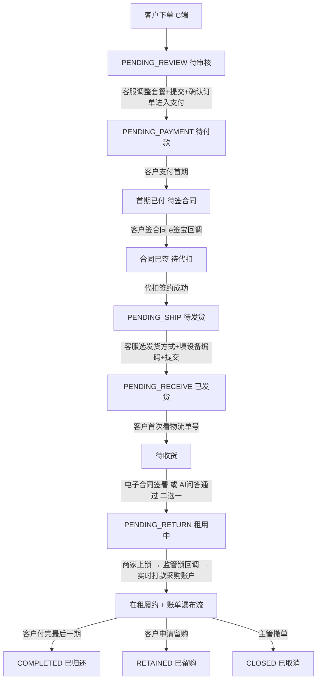

# 长租订单全生命周期与客服操作手册

> P0 业务文档(2026-05-26)。
> 长租订单从客户下单到归还的**完整 6 阶段**流程,逐阶段定义:客服操作 / 客户感知 / 系统动作 / 字段 / 状态流转。
> 本文档是运营客服日常操作的**主操作手册**,把分散在 04 / 07 / 03 等文档的关键节点串起来,确保运营理解一致。

> **⚠️ V0.2 修订(2026-05-26)v1.1**:
> - 客户感知层:C 端订单状态精简到 **8 个**(详见 09 文档),**不显示提货门店**
> - 阶段 1:门店订单运营介入只能驳回**不能改价**(Q4)
> - 阶段 1:客户在 IM 回复"确认"即可,客服肉眼判定(Q7)
> - 阶段 2:代扣失败兜底 — 客服切银行卡代扣 → 仍失败可主管批准跳过(Q9)
> - 阶段 2:客户长时间不签合同 — 24h 催 + 7 天进异常队列(Q8)
> - 阶段 3:设备编码**不可改**(同步合同必须准确),改错走"补充合同"流程(Q11)
> - 阶段 4:电子合同 / AI 问答**必须二选一通过**,不允许两个都失败取消(Q12)
> - 阶段 5:监管锁回调 → 实时打款到**采购账户(软钱包)**,门店自行提现(Q13)
> - 新增引用 `09_C端订单状态与账单支付.md`、`10_订单撤单与补充合同.md`

---

## 1. 总览

```
阶段 0 客户下单
   ↓
阶段 1 待审核   ⭐ 核心(客服调整套餐 + 生成图片 + 确认订单进入支付)
   ↓
阶段 2 待付款   (首期一笔支付 → 自动发起合同 → 自动发起代扣)
   ↓
阶段 3 待发货   (选发货方式 + 填设备编码,编码不可改)
   ↓
阶段 4 待收货   (电子合同 / AI 问答 二选一,必须通过)
   ↓
阶段 5 待归还   (在租中,监管锁回调实时打款采购账户)
   ↓
归还/留购/完成
```

**C 端 8 状态对照**:审核中 / 待付款 / 待签约 / 已发货 / 待收货 / 租用中 / 已完成 / 全部订单(详见 09 文档)

---

## 2. 阶段 0:客户下单(C 端)

### 2.1 三种入口

| 入口 | 订单类型 | 后续流程差异 |
|---|---|---|
| 扫门店专属码 | 门店订单 / 分红订单 | 商家自审(门店订单)或运营审核(分红订单) |
| 扫平台通用商品码 | 平台订单 | 运营审核 + 客服需手工分配履约门店 |

### 2.2 客户操作

```
扫码 → 选规格/套餐 → 填资料 → 实名 → 风控授权 → 协议勾选 → 提交订单
```

### 2.3 订单创建后

订单状态:`PENDING_REVIEW`(待审核)

**客户 C 端展示:"审核中"** (Tab + 详情页状态;**不显示预估时间**;**不显示门店/资方/客服等**)

---

## 3. 阶段 1:待审核 ⭐ 核心阶段

### 3.1 客服待办

客服进入"运营端 > 订单管理 > 待审核与资方分配"工作台,接到订单。

### 3.2 订单详情界面顶部固定字段

```
┌────────────────────────────────────────────────────────────┐
│ ← 订单详情 #20260526001                                       │
├────────────────────────────────────────────────────────────┤
│ 顶部信息条(全程固定显示,**仅后台可见**)                       │
│  订单状态:  待审核                                            │
│  商家名称:  北京鼎租商贸有限公司                                │
│  门店名称:  鼎租新街口店(分红/门店订单已知;平台订单待分配)    │
│  资方名称:  (待分配 / 已分配:XXX)                            │
│  做单客服:  小张(2026-05-26 接单)                            │
│  订单类型:  门店订单 / 分红订单 / 平台订单                       │
└────────────────────────────────────────────────────────────┘
```

**注意**:
- "做单客服 XXX"在客服第一次接单时**自动标记并固化**,不可改(除非主管复核改派)
- 商家名 / 门店名 / 资方名是后台展示,**C 端客户完全不可见**

### 3.3 客服核心动作

#### 动作 1:核对订单与客户资料

- 客户身份证 / 实名信息 / 风控报告
- 商品规格 / 期数 / 套餐
- 客户上传的资料(地址证明 / 流水截图等)

#### 动作 2:**[调整套餐]** 按钮 ⭐(分红订单 + 平台订单可用,门店订单不可用)

**重要**:门店订单**不开放**调整套餐;运营异常介入门店订单时**只能驳回**,**不能改价**(Q4)。门店端 / 商家端有自己的办单助手改价能力。

点击 [调整套餐] → 弹出"**类办单助手**"界面:

```
┌──────────────────────────────────────────────────────┐
│ 调整套餐  #20260526001                                  │
├──────────────────────────────────────────────────────┤
│ 商品基础信息(只读)                                      │
│  商品名称:  iPhone 15 Pro Max 256G 黑色                 │
│  指导价:    ¥9,999                                     │
├──────────────────────────────────────────────────────┤
│ 履约门店(平台订单必填,分红订单已知)                      │
│  [搜索门店:支持门店名/编码/主体/收款户名] → 多维度展示    │
│  详见 07_平台订单门店分配.md(分配逻辑、防错、二次确认)  │
├──────────────────────────────────────────────────────┤
│ 套餐配置                                                │
│  设备价:        [____]                                  │
│  首付金额:      [____]                                  │
│  期数:          [9 期 ▼]                               │
│  月供:          [____](系统自动计算)                  │
│  押金:          [____](留购可抵扣)                    │
│                                                          │
│  各期账单 + 留购价(预计算,展示给客服核对)             │
│  ┌──────────────────────────────────────────────────┐ │
│  │ 期数 │ 付款日期    │ 本期金额 │ 当期留购价        │ │
│  │ 第1期 │ 2026-05-25 │ ¥10.00  │ ¥6,040.00         │ │
│  │ 第2期 │ 2026-06-25 │ ¥568.75 │ ¥5,471.25         │ │
│  │ ...   │ ...         │ ...     │ ...                │ │
│  │ 第9期 │ 2027-01-25 │ ¥568.75 │ ¥1,490.00         │ │
│  │  (留购总价 ¥6,050.00)                             │ │
│  └──────────────────────────────────────────────────┘ │
├──────────────────────────────────────────────────────┤
│ 增值服务(后台配置,可多选)                              │
│  ☐ 公证费                ¥298                          │
│  ☐ 设备管理费            ¥150                          │
│  ☐ 碎屏险                ¥99                           │
│  ☐ 意外险                ¥199                          │
│  (增值服务清单由后台「配置管理 > 增值服务」维护)         │
├──────────────────────────────────────────────────────┤
│ 资方配置(分红订单)                                     │
│  资方:          [搜索资方 ▼]                            │
│  出资比例:      [80% ▼]  (门店出资 20%)                │
│  资方出资金额:  ¥X,XXX(系统自动计算)                  │
├──────────────────────────────────────────────────────┤
│ 首期一笔支付汇总                                        │
│  首期租金:      ¥XXX                                   │
│  押金:          ¥XXX                                   │
│  增值服务:      ¥XXX                                   │
│  ────────────────────────                            │
│  首期总额:      ¥X,XXX(客户一笔支付)                  │
├──────────────────────────────────────────────────────┤
│ 代扣方案(客服判断,Q10)                                │
│  ○ 不需要代扣                                          │
│  ○ 支付宝代扣                                          │
│  ○ 银行卡代扣                                          │
│  (客服根据订单金额/客户信用判断,无商品默认配置)         │
├──────────────────────────────────────────────────────┤
│  [生成办单图片]    [提交]                                │
└──────────────────────────────────────────────────────┘
```

**关键约束**:
- 门店订单**不开放**调整套餐(商家自己用办单助手生成,客服只能核对)
- 分红订单 + 平台订单可调整;平台订单**必须分配门店**才能提交
- 增值服务清单由后台「配置管理 > 增值服务」维护,客服只能勾选不能新增
- 出资比例展示文案:**"出资比例 80%(门店出资 20%)"**
- **每期金额 + 当期留购价**在调整套餐时预计算并写入数据库,后续 C 端账单瀑布流直接读取(详见 09 §3)
- 代扣方案由客服判断,**无商品级默认配置**

#### 动作 3:**[生成办单图片]**

点击后,系统生成一张**办单图片**(类似商家端办单助手成图,字段同 §3.3 表格):

**用途**:
- 客服**下载图片** → 通过任意通讯渠道(微信/钉钉/短信)发给**商家**
- 商家与客户确认费用 → 客户在 IM 回复"确认"
- **客服肉眼判定**客户已确认(Q7)→ 进入下一步

**注意**:
- **不需要再次推送给客户**(客户从下单起在 C 端就能看到订单、合同、账单)
- 系统**不对接 IM 自动发送**,客服手动操作(灵活)
- 客户在 IM 回复"确认"二字即视为确认,**留痕在 IM 工单中**

#### 动作 4:**[提交]**

点击 [提交] → 订单的套餐、门店、资方、增值服务、各期账单、留购价等信息**写入数据库**,但订单状态**仍停留在 PENDING_REVIEW**。

此时订单详情页可展示**新的账单信息**供客服 / 商家查看,但还没推给客户支付。

#### 动作 5:**[确认订单进入支付]** 按钮

客服与商家、客户确认无误后,点击 [确认订单进入支付] →

```
系统动作:
1. 订单状态:PENDING_REVIEW → PENDING_PAYMENT(待付款)
2. 写操作日志:操作人、工号、时间、订单快照
3. 客户 C 端订单状态变更通知(站内消息 + 推送)
4. C 端 Tab 从"审核中" → "待付款"
5. 客户 C 端看到首期支付入口
```

### 3.4 状态变更总结

```
PENDING_REVIEW(待审核)
  ↓ 客服 [调整套餐] → [提交] → 与商家/客户在 IM 确认 → [确认订单进入支付]
PENDING_PAYMENT(待付款)
```

---

## 4. 阶段 2:待付款

### 4.1 客户 C 端

订单状态:`PENDING_PAYMENT` → C 端 Tab "**待付款**"

客户看到:
- 首期支付总额(一笔)
- [立即支付] 按钮
- 支付方式:支付宝 / 微信 / 通联 / 信联 等(后台配置)

### 4.2 客服界面

```
┌──────────────────────────────────────────────────────┐
│ 待付款 - 客服操作面板                                    │
├──────────────────────────────────────────────────────┤
│ 首期总额:        ¥2,196                                │
│  ├ 首期租金:    ¥760                                  │
│  ├ 押金:        ¥500                                  │
│  └ 增值服务:    ¥397                                  │
├──────────────────────────────────────────────────────┤
│ [生成首付二维码] 按钮                                    │
│  → 弹窗显示二维码图片                                    │
│  → 客服下载图片发给客户                                  │
├──────────────────────────────────────────────────────┤
│ 待办状态:                                              │
│  □ 首期支付       ⏳ 待客户支付                        │
│  □ 电子合同签署   ⏳ 待发起                            │
│  □ 代扣签约       ⏳ 待发起                            │
└──────────────────────────────────────────────────────┘
```

### 4.3 系统串行动作(全自动)

```
客户支付首期成功
  ↓ 支付回调
系统自动发起电子合同(e签宝接口)
  ↓ 合同推送到客户 C 端
  ↓ C 端 Tab 从"待付款" → "待签约"
客户在 C 端签电子合同
  ↓ e签宝回调
系统标记"电子合同 已签署"
  ↓ 自动发起代扣签约
  ├─ 支付宝代扣:客户在 C 端点击签约
  ├─ 银行卡代扣:客服后台点击发起(可选)
  └─ 不需要代扣:跳过
  ↓ 代扣签约完成
系统标记"代扣 已签约"
  ↓ 三项全部完成(✓首付 + ✓合同 + ✓代扣)
订单自动跳转 → PENDING_SHIP(待发货)
  ↓ C 端 Tab 保持"待签约"(直至发货)→ 发货后跳"已发货"
```

### 4.4 客户支付失败 / 不响应

| 场景 | 处理 |
|---|---|
| 客户支付超时(默认 24h)| 订单进入"待付款 - 超时"队列,客服催办 |
| 客户支付失败 | 系统记录失败原因,客户可重试 |
| 客户主动取消(已付款)| 走撤单流程(详见 10 文档),客服同意后退款 |

### 4.5 客户长时间不签合同(Q8 决策)

| 阶段 | 处理 |
|---|---|
| 合同发起 + 24 小时内 | C 端推送提醒(站内 + 短信) |
| 合同发起 + 24 小时 | 客服外呼提醒 |
| 合同发起 + 7 天 | 进入运营异常队列,主管处理(联系客户 / 撤单 / 延期)|

### 4.6 银行卡代扣的客服触发

- 若订单配置为"需要银行卡代扣",合同签完后**客服后台点 [发起银行卡代扣]** 按钮
- 触发 → 客户 C 端收到代扣签约任务 → 客户签 → 回调
- 若订单配置为"仅支付宝代扣"或"不需代扣",此步骤跳过

### 4.7 代扣失败兜底(Q9 决策)

```
支付宝代扣失败
  ↓
默认尝试:客服切换到银行卡代扣
  ↓
银行卡代扣仍失败
  ↓
方案 A:客户重新尝试(默认)
方案 B:运营主管批准 → 跳过代扣 → 订单标记"风险订单" → 继续进入待发货
   ↓ 后续:客户必须每期手动支付(在 C 端账单瀑布流操作,详见 09 §3)
```

**风险订单标记**:跳过代扣的订单会在订单详情页打"风险订单"红标签,运营定期跟进。

---

## 5. 阶段 3:待发货

### 5.1 客服 / 门店端操作

```
┌──────────────────────────────────────────────────────┐
│ 待发货 - 操作面板                                       │
├──────────────────────────────────────────────────────┤
│ 客户:        闫**  138****7755                         │
│ 商品:        iPhone 15 Pro Max 256G 黑色                │
│ 收货地址:    北京市朝阳区...                            │
├──────────────────────────────────────────────────────┤
│ 发货方式 *                                              │
│ ○ 门店自提                                              │
│ ○ 顺丰物流                                              │
│ ○ 京东物流                                              │
│ ○ 其他物流(后台可配)                                  │
├──────────────────────────────────────────────────────┤
│ 设备编码 *(选发货方式后展示输入框,提交后不可改)         │
│ [____________________]                                  │
│ (支持 IMEI / SN / VIN,根据品类自动校验)                │
│                                                          │
│ ⚠️ 警告:设备编码将同步至合同,提交后不可修改             │
│ ⚠️ 如填写错误需变更,请走"补充合同"流程(见 10 文档)     │
│                                                          │
│ 物流单号(选物流方式时必填)                              │
│ [____________________]                                  │
├──────────────────────────────────────────────────────┤
│ 发货凭证(可选,上传图片)                                │
│ [+ 上传]                                                │
├──────────────────────────────────────────────────────┤
│  [提交发货]                                             │
└──────────────────────────────────────────────────────┘
```

### 5.2 操作约束

| 校验项 | 规则 |
|---|---|
| 发货方式 | 必选 |
| 设备编码 | 必填;系统校验唯一性(全平台唯一);格式按品类校验;**提交后不可改**(Q11) |
| 物流单号 | 选物流时必填;门店自提可空 |
| 发货凭证 | 选填;门店自提建议上传客户取货签字照 |

### 5.3 设备编码填错处理(Q11)

```
发货已提交,发现编码填错
   ↓
**不可直接修改**(已写入合同)
   ↓
客服 / 主管发起"补充合同"流程(详见 10 文档 §2)
   ├─ 选变更类型:device_code(设备编码)
   ├─ 填写正确编码 + 上传证明
   ├─ 主管审批 → 系统生成补充合同 PDF
   └─ 客户在 C 端签补充合同 → 字段更新
```

### 5.4 提交后

```
订单状态:PENDING_SHIP → PENDING_RECEIVE(待收货)
设备状态:DEVICE_AVAILABLE → DEVICE_LOCKED(已锁定 - 在途)
C 端 Tab 跳转:"待签约" → "已发货"
客户 C 端展示:
  - 物流单号(若有)
  - 物流公司
  - "已发货,等待签收"
  - 客户首次进入订单详情查看物流单号 → C 端 Tab 自动切换"已发货" → "待收货"
```

---

## 6. 阶段 4:待收货 ⭐ 含验收确认机制

### 6.1 双通道验收(系统设置默认 + 客服可手动切换,**必须二选一通过**,Q12)

后台配置:**默认验收方式 = 电子合同 / AI 问答**

```
客户点 [确认收货] 按钮
  ↓
系统判断默认验收方式
  ├─ 默认 = 电子合同
  │    → 调起电子合同(收货确认条款)
  │    → 客户在 C 端签字
  │    → e签宝回调"合同已签署"
  │    → 订单 → PENDING_RETURN(待归还)
  │    → C 端 Tab 跳转"待收货" → "租用中"
  │
  └─ 默认 = AI 问答
       → 调起 AI 语音问答
       → 客户语音回答(设备状况、使用流程、风险告知)
       → AI 自动识别准确率
       ├─ 达标 → 订单 → PENDING_RETURN
       └─ 不达标 → 进入"待人工介入"队列
                    → 客服可手动切换电子合同方式
```

### 6.2 客服手动切换(Q12)

当默认方式失败时,客服可**手动发起另一种方式**:

```
[切换为电子合同验收]   (当 AI 问答失败时)
[切换为 AI 问答验收]   (当电子合同失败时)
```

**关键约束(Q12)**:
- **两种方式必须二选一通过**,不允许两个都失败 → 取消订单
- 如果客户拒签电子合同 + AI 问答也通不过 → 客服外呼 + 运营主管介入
- 长时间僵持 → 主管手动标记"已收货"(留痕)或撤单(已发货后撤单需主管 + 走售后)

### 6.3 AI 问答规则

| 项 | 规则 |
|---|---|
| 问题数量 | 后台配置 5-10 题 |
| 准确率阈值 | ≥ 80% 通过(后台可调) |
| 语音质量校验 | 时长 / 清晰度 / 是否有人声 |
| 重试机会 | 3 次,失败转人工 |
| 失败兜底 | 转电子合同 / 客服外呼复核 / 主管手动标记 |

### 6.4 状态变更

```
PENDING_RECEIVE(待收货)
  ↓ 电子合同 已签 / AI 问答 通过
PENDING_RETURN(待归还,即在租中)
  ↓ C 端 Tab 跳转"待收货" → "租用中"
```

---

## 7. 阶段 5:待归还(在租中)

### 7.1 订单进入正常履约期

```
订单状态:PENDING_RETURN(待归还,即长租在租中)
C 端 Tab:租用中
客户在 C 端可看到:
  - 账单瀑布流(每一期 + 留购价)
  - 任意期可点 [立即支付](需先付完之前的期,详见 09 §3)
  - 当期付完后可点 [申请留购]
```

详细 C 端展示见 `09_C端订单状态与账单支付.md`。

### 7.2 监管锁状态展示(后期接入)

订单详情页**合同状态 / 代扣签约状态附近**新增一行(后台显示,**C 端不显示**):

```
┌──────────────────────────────────────┐
│ 合同状态:      ✓ 已签署                │
│ 代扣状态:      ✓ 已签约                │
│ 监管锁状态:    ✓ 已上锁  ⭐ 后台显示    │
│ 采购款打款:    ✓ 已实时打款            │
└──────────────────────────────────────┘
```

### 7.3 监管锁上锁时机与触发动作(Q13)

```
客户 [确认收货] 完成(电子合同 或 AI 问答 通过)
  ↓ 订单进入 PENDING_RETURN
商家现场给设备上锁(监管锁系统操作)
  ↓ 监管锁系统通过 Webhook 回调到平台
系统:
  ├─ 订单字段 lock_status = LOCKED
  ├─ **实时触发"打采购款"** ⭐ 关键
  │    → 平台资金账户 → 商家**采购账户(软钱包)**
  │    → 不需财务审核,系统实时打款
  └─ 推送通知商家:"采购款已到账 + 当前余额"
```

**采购账户(软钱包)说明**:
- 与现有的"分账钱包/佣金钱包"**完全分离**
- 仅接收采购款(平台一次性付给商家的设备款)
- 门店可在**商家 PC 端 > 财务钱包 > 采购账户** 看到余额并自助提现
- 提现需财务复核(防止异常提现)

**详细资金路径**:见后续待编写的 `11_软钱包架构.md`(待补)

### 7.4 关键设计

- 监管锁上锁**不阻塞订单进度**(收货完成即进入待归还/租用中)
- 上锁动作单独走,作为**采购款打款的触发条件**
- 上锁前打不了采购款,防止设备未锁就打款给商家(资金风险)

### 7.5 监管锁系统回调失败兜底

| 异常 | 处理 |
|---|---|
| 监管锁系统超时未回调 | 进入运营预警 + 客服联系商家核实 |
| 商家未及时上锁(超 24h)| 客服催促 |
| 商家长时间不上锁(超 7 天)| 进入主管审核 + 强制人工标记 |
| 主管手动标记"已上锁" | 触发实时打款 + 写"人工标记"日志 |

---

## 8. 阶段 6:归还 / 留购 / 完成

### 8.1 三种结局

| 结局 | 状态 | C 端展示 |
|---|---|---|
| 客户归还设备 | COMPLETED | 已完成(子标签:已归还)|
| 客户完成留购 | RETAINED | 已完成(子标签:已留购,设备归您所有)|
| 撤单 / 关闭 | CLOSED | 已完成(子标签:已取消)|

### 8.2 归还流程

(沿用现有 03_订单详情.md 和 05_订单关闭退款与售后.md 的逻辑,本文档不重复)

### 8.3 留购触发

客户在 C 端任意一期 [申请留购],详见 09 §3.4。
- 必须先付完当期才能点
- 弹出留购明细 → 客户确认 → 调起支付通道 → 完成
- 订单 → 已完成(已留购)→ 设备所有权归客户

---

## 9. 完整状态流转图



---

## 10. 各阶段订单顶部固定信息条(后台,**C 端不可见**)

```
┌────────────────────────────────────────────────────────┐
│ 订单状态:    [当前状态标签]                              │
│ 商家名称:    XXX 公司                                    │
│ 门店名称:    XXX 店(分配后展示)                        │
│ 资方名称:    XXX 资方(分红/平台订单展示)               │
│ 做单客服:    XXX(自动标记,接单时固化)                 │
│ 订单类型:    门店/分红/平台                              │
│ 风险标记:    (跳过代扣的订单显示"风险订单"红标签)        │
└────────────────────────────────────────────────────────┘
```

**C 端客户视角的对照(Q1/Q2 决策)**:
- 客户**只能看到** C 端 8 状态(详见 09 文档)
- 商家名 / 门店名 / 资方名 / 做单客服 / 订单类型 / 风险标记 **全部不暴露给客户**
- **不再显示"提货门店"**(本轮决策)

---

## 11. 客服操作权限矩阵

| 动作 | 客服 | 客服主管 | 运营主管 |
|---|---|---|---|
| 接单 | ✅ | ✅ | ✅ |
| 调整套餐(分红/平台订单) | ✅ | ✅ | ✅ |
| 调整套餐(门店订单) | ❌ | ❌ | ❌ |
| **门店订单异常介入 - 改价**(Q4) | ❌ | ❌ | ❌ |
| **门店订单异常介入 - 驳回**(Q4) | ✅ | ✅ | ✅ |
| 分配门店(平台订单) | ✅(需工号) | ✅ | ✅ |
| 生成办单图片 | ✅ | ✅ | ✅ |
| 确认订单进入支付 | ✅ | ✅ | ✅ |
| 生成首付二维码 | ✅ | ✅ | ✅ |
| 发起银行卡代扣 | ✅ | ✅ | ✅ |
| **跳过代扣**(Q9) | ❌ | ❌ | ✅ |
| 切换收货验收方式 | ✅ | ✅ | ✅ |
| **主管手动标记收货已完成**(Q12 兜底)| ❌ | ❌ | ✅ |
| 标记监管锁状态(后台代操作 / V1)| ❌ | ✅ | ✅ |
| **发起补充合同 - 设备编码** | ✅ | ✅ | ✅ |
| **发起补充合同 - 资方/门店/规格** | ❌ | ✅ | ✅ |
| 触发打采购款 | 系统自动(监管锁回调) | - | - |

---

## 12. 与其他文档的关系

| 文档 | 关系 |
|---|---|
| `04_待审核与资方分配.md` | 本文档阶段 1 的详细工作台 PRD |
| `07_平台订单门店分配.md` | 本文档阶段 1 [调整套餐] 中分配门店的详细 PRD |
| **`09_C端订单状态与账单支付.md`** ⭐ | C 端客户视角:8 状态 / 账单瀑布流 / 任意期支付 / 留购触发 |
| **`10_订单撤单与补充合同.md`** ⭐ | 撤单 7 阶段处理 + 补充合同流程 |
| `03_订单详情.md` | 订单详情页的整体布局 |
| `02_状态字典与订单状态机.md` | 状态枚举来源 |
| `05_订单关闭退款与售后.md` | 归还/留购/关闭流程 |
| `06_改价补资料与客服IM.md` | 客服 IM 联动机制 |

---

## 13. 修订记录

| 日期 | 版本 | 修订 |
|---|---|---|
| 2026-05-26 | v1.0 | 初版,完整定义长租订单 6 阶段流程 + 客服操作动作 + 系统串行机制 + 监管锁触发逻辑 |
| 2026-05-26 | v1.1 | 1. 同步 8 状态新口径(去掉提货门店);2. 阶段 1 门店订单运营介入只能驳回不能改价(Q4);3. 阶段 1 客户在 IM 回复"确认"即视为确认(Q7);4. 阶段 2 客户长时间不签合同:24h 催 + 7 天异常(Q8);5. 阶段 2 代扣失败兜底:切银行卡 → 主管批准跳过(Q9);6. 阶段 2 代扣方案由客服判断(Q10);7. 阶段 3 设备编码不可改,改错走补充合同(Q11);8. 阶段 4 收货必须二选一通过(Q12);9. 阶段 5 监管锁回调实时打款采购账户软钱包(Q13);10. 各期账单 + 留购价在调整套餐时预计算;11. 引用 09 / 10 新增文档 |
