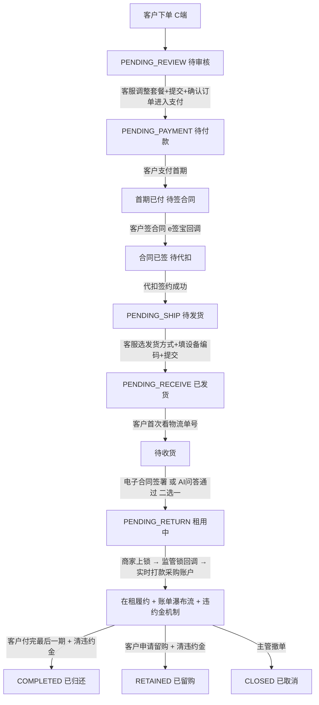

# 长租订单全生命周期与客服操作手册

> P0 业务文档(2026-05-26)。
> 长租订单从客户下单到归还的**完整 6 阶段**流程,逐阶段定义:客服操作 / 客户感知 / 系统动作 / 字段 / 状态流转。
> 本文档是运营客服日常操作的**主操作手册**,把分散在 04 / 07 / 03 等文档的关键节点串起来,确保运营理解一致。

> **⚠️ V0.2 修订(2026-05-26)v1.2**:
> - 阶段 5 在租中新增**违约金机制**说明(引用 11 文档:独立账单 / 规则可配 / 减免日志 / 留购前必清)
> - §11 权限矩阵新增违约金减免与规则配置权限

> **⚠️ V0.2 修订(2026-05-26)v1.1**:
> - 客户感知层:C 端订单状态精简到 **8 个**(详见 09 文档),**不显示提货门店**
> - 阶段 1:门店订单运营介入只能驳回**不能改价**(Q4)
> - 阶段 1:客户在 IM 回复"确认"即可,客服肉眼判定(Q7)
> - 阶段 2:代扣失败兜底 — 客服切银行卡代扣 → 仍失败可主管批准跳过(Q9)
> - 阶段 2:客户长时间不签合同 — 24h 催 + 7 天进异常队列(Q8)
> - 阶段 3:设备编码**不可改**(同步合同必须准确),改错走"补充合同"流程(Q11)
> - 阶段 4:电子合同 / AI 问答**必须二选一通过**,不允许两个都失败取消(Q12)
> - 阶段 5:监管锁回调 → 实时打款到**采购账户(软钱包)**,门店自行提现(Q13)
> - 新增引用 `09_C端订单状态与账单支付.md`、`10_订单撤单与补充合同.md`

---

## 1. 总览

```
阶段 0 客户下单
   ↓
阶段 1 待审核   ⭐ 核心(客服调整套餐 + 生成图片 + 确认订单进入支付)
   ↓
阶段 2 待付款   (首期一笔支付 → 自动发起合同 → 自动发起代扣)
   ↓
阶段 3 待发货   (选发货方式 + 填设备编码,编码不可改)
   ↓
阶段 4 待收货   (电子合同 / AI 问答 二选一,必须通过)
   ↓
阶段 5 待归还   (在租中,监管锁回调实时打款采购账户 + 逾期违约金机制)
   ↓
归还/留购/完成
```

**C 端 8 状态对照**:审核中 / 待付款 / 待签约 / 已发货 / 待收货 / 租用中 / 已完成 / 全部订单(详见 09 文档)

---

## 2. 阶段 0:客户下单(C 端)

(内容同 v1.1,无修改)

订单状态:`PENDING_REVIEW`(待审核)

**客户 C 端展示:"审核中"** (Tab + 详情页状态;**不显示预估时间**;**不显示门店/资方/客服等**)

---

## 3. 阶段 1:待审核 ⭐ 核心阶段

(内容同 v1.1,无修改 — 包含调整套餐 / 生成办单图片 / 确认订单进入支付)

---

## 4. 阶段 2:待付款

(内容同 v1.1,无修改 — 包含支付串行 / 代扣失败兜底 / 长时间不签合同处置)

---

## 5. 阶段 3:待发货

(内容同 v1.1,无修改 — 选发货方式 + 填设备编码 + 编码不可改走补充合同)

---

## 6. 阶段 4:待收货 ⭐ 含验收确认机制

(内容同 v1.1,无修改 — 电子合同 / AI 问答 二选一必须通过)

---

## 7. 阶段 5:待归还(在租中)⭐ v1.2 新增违约金机制

### 7.1 订单进入正常履约期

```
订单状态:PENDING_RETURN(待归还,即长租在租中)
C 端 Tab:租用中
客户在 C 端可看到:
  - 租金账单瀑布流(每一期 + 留购价)
  - 任意期可点 [立即支付](严格顺序:必须先付完之前的期,详见 09 §3.2)
  - 当期付完后可点 [申请留购]
  - 违约金账单(独立区块,逾期产生,详见 11 文档)
```

详细 C 端展示见 `09_C端订单状态与账单支付.md`。

### 7.2 监管锁状态展示(后期接入)

订单详情页**合同状态 / 代扣签约状态附近**新增一行(后台显示,**C 端不显示**):

```
┌──────────────────────────────────────┐
│ 合同状态:      ✓ 已签署                │
│ 代扣状态:      ✓ 已签约                │
│ 监管锁状态:    ✓ 已上锁  ⭐ 后台显示    │
│ 采购款打款:    ✓ 已实时打款            │
└──────────────────────────────────────┘
```

### 7.3 监管锁上锁时机与触发动作(Q13)

```
客户 [确认收货] 完成(电子合同 或 AI 问答 通过)
  ↓ 订单进入 PENDING_RETURN
商家现场给设备上锁(监管锁系统操作)
  ↓ 监管锁系统通过 Webhook 回调到平台
系统:
  ├─ 订单字段 lock_status = LOCKED
  ├─ **实时触发"打采购款"** ⭐ 关键
  │    → 平台资金账户 → 商家**采购账户(软钱包)**
  │    → 不需财务审核,系统实时打款
  └─ 推送通知商家:"采购款已到账 + 当前余额"
```

**采购账户(软钱包)说明**:
- 与现有的"分账钱包/佣金钱包"**完全分离**
- 仅接收采购款(平台一次性付给商家的设备款)
- 门店可在**商家 PC 端 > 财务钱包 > 采购账户** 看到余额并自助提现
- 提现需财务复核(防止异常提现)

### 7.4 关键设计

- 监管锁上锁**不阻塞订单进度**(收货完成即进入待归还/租用中)
- 上锁动作单独走,作为**采购款打款的触发条件**
- 上锁前打不了采购款,防止设备未锁就打款给商家(资金风险)

### 7.5 监管锁系统回调失败兜底

| 异常 | 处理 |
|---|---|
| 监管锁系统超时未回调 | 进入运营预警 + 客服联系商家核实 |
| 商家未及时上锁(超 24h)| 客服催促 |
| 商家长时间不上锁(超 7 天)| 进入主管审核 + 强制人工标记 |
| 主管手动标记"已上锁" | 触发实时打款 + 写"人工标记"日志 |

### 7.6 在租期违约金机制 ⭐ v1.2 新增

详细规则见 `11_违约金账单与规则配置.md`。核心要点摘要:

#### 7.6.1 违约金生成

- 系统每日凌晨 1 点定时任务扫描所有"租用中"订单
- 检查每一期租金是否逾期(到期日 + 1 < today)
- 已逾期但未生成违约金账单 → 新建
- 已生成违约金账单 → 累计天数 +1,重算金额
- 客户支付当期租金后 → 该期违约金停止累计

#### 7.6.2 违约金规则配置(Q22)

| 订单类型 | 规则配置位 |
|---|---|
| 门店订单 | **商家在自己后台配置**(商家 PC 端 > 商家资料 > 违约金规则)|
| 分红订单 | **平台统一配置**(后台 > 配置管理 > 违约金规则)|
| 平台订单 | **平台统一配置**(同上)|

支持两种算法:
- `fixed`:固定金额/天(如 ¥10/天)
- `percent`:按当期金额比例/天(如 0.05%/天)

可配单日封顶 + 总额封顶。**规则快照写入订单**,后续平台改规则不影响已生效订单。

#### 7.6.3 客服后台操作

| 动作 | 权限 |
|---|---|
| 查看违约金账单 | 客服可查 |
| 修改违约金原始金额 | 客服可改(留痕)|
| 单期手动减免(部分)| 客服可减(必填原因 + 留痕)|
| 全额减免(单期清零)| 客服可清零(留痕)|
| 批量减免(全订单清零)| 运营主管 |
| 修改平台规则 | 运营主管 |
| 修改商家规则 | 商家自己(只可改自己门店订单规则)|

详细权限矩阵 + 操作日志见 11 §10。

#### 7.6.4 客户 C 端展示(Q24)

```
违约金账单(独立于租金账单)
  来源期数  累计天 原始金额 减免  实付   操作
  第3期    5天    ¥50    -¥20  ¥30   [立即支付][咨询客服]
           已减免 ¥20(运营调整)
```

- 已减免的违约金显示"已减免 ¥XX(运营调整)"标识
- 全额减免的违约金显示"已免除"+ 灰色
- 客户可单独支付违约金(不会影响租金支付)

#### 7.6.5 留购 / 归还前的强制结清(Q25)

```
客户申请留购或归还
   ↓
检查是否有未结清违约金?
   ├─ 否 → 正常流程
   └─ 是 → 必须先结清违约金
            ├─ [一并结清后留购] → 留购金额 += 违约金合计 + 一笔支付
            └─ [先支付违约金] → 跳转违约金支付页
```

主管全额减免后,可跳过结清检查。

---

## 8. 阶段 6:归还 / 留购 / 完成

### 8.1 三种结局

| 结局 | 状态 | C 端展示 |
|---|---|---|
| 客户归还设备 | COMPLETED | 已完成(子标签:已归还)|
| 客户完成留购 | RETAINED | 已完成(子标签:已留购,设备归您所有)|
| 撤单 / 关闭 | CLOSED | 已完成(子标签:已取消)|

### 8.2 归还 / 留购前的违约金清算

无论归还还是留购,在订单关闭前**必须清算所有违约金**(详见 7.6.5)。

### 8.3 归还流程

(沿用现有 03_订单详情.md 和 05_订单关闭退款与售后.md 的逻辑,本文档不重复)

### 8.4 留购触发

客户在 C 端任意一期 [申请留购],详见 09 §3.4。
- 必须先付完当期才能点
- 必须无未结违约金
- 弹出留购明细 → 客户确认 → 调起支付通道 → 完成
- 订单 → 已完成(已留购)→ 设备所有权归客户

---

## 9. 完整状态流转图



---

## 10. 各阶段订单顶部固定信息条(后台,**C 端不可见**)

```
┌────────────────────────────────────────────────────────┐
│ 订单状态:    [当前状态标签]                              │
│ 商家名称:    XXX 公司                                    │
│ 门店名称:    XXX 店(分配后展示)                        │
│ 资方名称:    XXX 资方(分红/平台订单展示)               │
│ 做单客服:    XXX(自动标记,接单时固化)                 │
│ 订单类型:    门店/分红/平台                              │
│ 风险标记:    (跳过代扣的订单显示"风险订单"红标签)        │
│ 违约金状态:  (有违约金的订单显示"⚠️ 有违约金 ¥XX")     │
└────────────────────────────────────────────────────────┘
```

**C 端客户视角的对照(Q1/Q2 决策)**:
- 客户**只能看到** C 端 8 状态(详见 09 文档)
- 商家名 / 门店名 / 资方名 / 做单客服 / 订单类型 / 风险标记 **全部不暴露给客户**
- **不再显示"提货门店"**(本轮决策)

---

## 11. 客服操作权限矩阵(v1.2 新增违约金)

| 动作 | 客服 | 客服主管 | 运营主管 |
|---|---|---|---|
| 接单 | ✅ | ✅ | ✅ |
| 调整套餐(分红/平台订单) | ✅ | ✅ | ✅ |
| 调整套餐(门店订单) | ❌ | ❌ | ❌ |
| 门店订单异常介入 - 改价(Q4) | ❌ | ❌ | ❌ |
| 门店订单异常介入 - 驳回(Q4) | ✅ | ✅ | ✅ |
| 分配门店(平台订单) | ✅(需工号) | ✅ | ✅ |
| 生成办单图片 | ✅ | ✅ | ✅ |
| 确认订单进入支付 | ✅ | ✅ | ✅ |
| 生成首付二维码 | ✅ | ✅ | ✅ |
| 发起银行卡代扣 | ✅ | ✅ | ✅ |
| 跳过代扣(Q9) | ❌ | ❌ | ✅ |
| 切换收货验收方式 | ✅ | ✅ | ✅ |
| 主管手动标记收货已完成(Q12 兜底)| ❌ | ❌ | ✅ |
| 标记监管锁状态(后台代操作 / V1)| ❌ | ✅ | ✅ |
| 发起补充合同 - 设备编码 | ✅ | ✅ | ✅ |
| 发起补充合同 - 资方/门店/规格 | ❌ | ✅ | ✅ |
| 触发打采购款 | 系统自动(监管锁回调) | - | - |
| **查看违约金账单**(Q23)| ✅ | ✅ | ✅ |
| **修改违约金原始金额**(Q23)| ✅ | ✅ | ✅ |
| **单期手动减免违约金**(Q23)| ✅ | ✅ | ✅ |
| **全额减免单期违约金**(Q23)| ✅ | ✅ | ✅ |
| **批量减免全订单违约金**(Q23)| ❌ | ❌ | ✅ |
| **修改平台违约金规则**(Q22)| ❌ | ❌ | ✅ |
| **修改商家违约金规则**(Q22)| 商家自己 | 商家自己 | ✅ |

---

## 12. 与其他文档的关系

| 文档 | 关系 |
|---|---|
| `04_待审核与资方分配.md` | 本文档阶段 1 的详细工作台 PRD |
| `07_平台订单门店分配.md` | 本文档阶段 1 [调整套餐] 中分配门店的详细 PRD |
| `09_C端订单状态与账单支付.md` ⭐ | C 端客户视角:8 状态 / 账单瀑布流 / 任意期支付 / 留购触发 / 违约金 C 端展示 |
| `10_订单撤单与补充合同.md` ⭐ | 撤单 7 阶段处理 + 补充合同流程 |
| **`11_违约金账单与规则配置.md`** ⭐ | **违约金独立账单 + 规则可配(商家/平台) + 减免日志 + 留购前必清(Q22-Q25)** |
| `03_订单详情.md` | 订单详情页的整体布局 |
| `02_状态字典与订单状态机.md` | 状态枚举来源 |
| `05_订单关闭退款与售后.md` | 归还/留购/关闭流程 |
| `06_改价补资料与客服IM.md` | 客服 IM 联动机制 |

---

## 13. 修订记录

| 日期 | 版本 | 修订 |
|---|---|---|
| 2026-05-26 | v1.0 | 初版,完整定义长租订单 6 阶段流程 + 客服操作动作 + 系统串行机制 + 监管锁触发逻辑 |
| 2026-05-26 | v1.1 | 1. 同步 8 状态新口径(去掉提货门店);2. 阶段 1 门店订单运营介入只能驳回不能改价(Q4);3. 阶段 1 客户在 IM 回复"确认"即视为确认(Q7);4. 阶段 2 客户长时间不签合同:24h 催 + 7 天异常(Q8);5. 阶段 2 代扣失败兜底:切银行卡 → 主管批准跳过(Q9);6. 阶段 2 代扣方案由客服判断(Q10);7. 阶段 3 设备编码不可改,改错走补充合同(Q11);8. 阶段 4 收货必须二选一通过(Q12);9. 阶段 5 监管锁回调实时打款采购账户软钱包(Q13);10. 各期账单 + 留购价在调整套餐时预计算;11. 引用 09 / 10 新增文档 |
| 2026-05-26 | v1.2 | 1. 阶段 5 (§7.6) 新增**在租期违约金机制**完整说明(生成 / 规则配置 / 客服操作 / C 端展示 / 留购前必清);2. §8 归还 / 留购前必清违约金;3. §10 顶部信息条新增"违约金状态"字段;4. §11 权限矩阵新增违约金减免与规则配置权限(Q22-Q25 落地);5. 引用 11 文档 |
