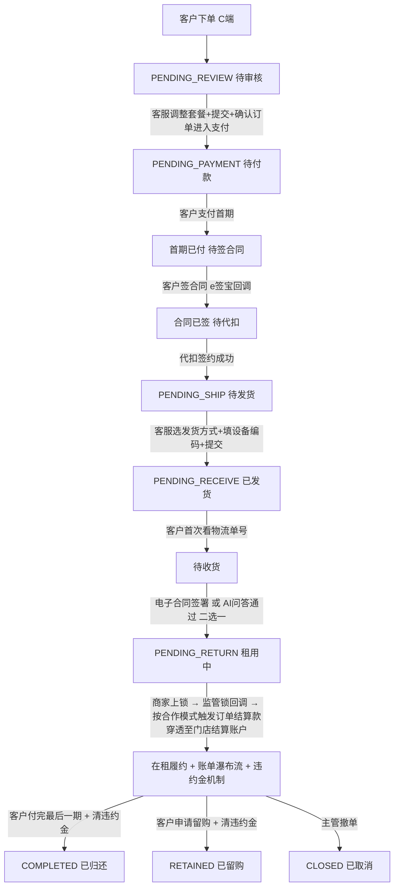

# 长租订单全生命周期与客服操作手册

> P0 业务文档(2026-05-26)。
> 长租订单从客户下单到归还的**完整 6 阶段**流程,逐阶段定义:客服操作 / 客户感知 / 系统动作 / 字段 / 状态流转。
> 本文档是运营客服日常操作的**主操作手册**,把分散在 04 / 07 / 03 等文档的关键节点串起来,确保运营理解一致。

> **⚠️ V0.2 修订(2026-05-27)v1.3**:
> - **整体清理"采购款 / 采购账户"术语**(经合规复核,违反合同口径)
> - 阶段 5 (§7.3) 监管锁回调动作改为:**触发"订单结算款"穿透到门店结算账户**(对接 07 文档单账户钱包架构)
> - 阶段 5 (§7.2) 后台展示"采购款打款"改为"订单结算款入账"
> - §10 顶部信息条 / §11 权限矩阵相应更新
> - 后台订单类型展示口径:门店订单 / 分红订单 / 平台订单(沿用商家熟悉叫法,但财务后台用合作模式)

> **⚠️ V0.2 修订(2026-05-26)v1.2**:违约金机制(保留)
> **⚠️ V0.2 修订(2026-05-26)v1.1**:8 状态 / 各项业务决策(保留)

---

## 1. 总览

```
阶段 0 客户下单
   ↓
阶段 1 待审核   ⭐ 核心(客服调整套餐 + 生成图片 + 确认订单进入支付)
   ↓
阶段 2 待付款   (首期一笔支付 → 自动发起合同 → 自动发起代扣)
   ↓
阶段 3 待发货   (选发货方式 + 填设备编码,编码不可改)
   ↓
阶段 4 待收货   (电子合同 / AI 问答 二选一,必须通过)
   ↓
阶段 5 待归还   (在租中,监管锁回调 → 订单结算款穿透至门店结算账户 + 逾期违约金机制)
   ↓
归还/留购/完成
```

**C 端 8 状态对照**:审核中 / 待付款 / 待签约 / 已发货 / 待收货 / 租用中 / 已完成 / 全部订单(详见 09 文档)

---

## 2. 阶段 0:客户下单(C 端)

(内容同 v1.2,无修改)

订单状态:`PENDING_REVIEW`(待审核)

**客户 C 端展示:"审核中"** (Tab + 详情页状态;**不显示预估时间**;**不显示门店/资方/客服等**)

---

## 3. 阶段 1:待审核 ⭐ 核心阶段

(内容同 v1.2,无修改 — 包含调整套餐 / 生成办单图片 / 确认订单进入支付)

---

## 4. 阶段 2:待付款

(内容同 v1.2,无修改 — 包含支付串行 / 代扣失败兜底 / 长时间不签合同处置)

---

## 5. 阶段 3:待发货

(内容同 v1.2,无修改 — 选发货方式 + 填设备编码 + 编码不可改走补充合同)

---

## 6. 阶段 4:待收货 ⭐ 含验收确认机制

(内容同 v1.2,无修改 — 电子合同 / AI 问答 二选一必须通过)

---

## 7. 阶段 5:待归还(在租中)⭐ v1.3 修订订单结算款机制

### 7.1 订单进入正常履约期

```
订单状态:PENDING_RETURN(待归还,即长租在租中)
C 端 Tab:租用中
客户在 C 端可看到:
  - 租金账单瀑布流(每一期 + 留购价)
  - 任意期可点 [立即支付](严格顺序:必须先付完之前的期,详见 09 §3.2)
  - 当期付完后可点 [申请留购]
  - 违约金账单(独立区块,逾期产生,详见 11 文档)
```

详细 C 端展示见 `09_C端订单状态与账单支付.md`。

### 7.2 监管锁状态展示(v1.3 改名)

订单详情页**合同状态 / 代扣签约状态附近**新增一行(后台显示,**C 端不显示**):

```
┌──────────────────────────────────────────────┐
│ 合同状态:        ✓ 已签署                       │
│ 代扣状态:        ✓ 已签约                       │
│ 监管锁状态:      ✓ 已上锁  ⭐ 后台显示          │
│ 订单结算款:      ✓ 已结算 ¥2,500(联营 50%)    │
│ 通联充值流水:    ✓ TL2026052712345              │
└──────────────────────────────────────────────┘
```

### 7.3 监管锁上锁时机与触发动作(v1.3 整体重写)⭐

```
客户 [确认收货] 完成(电子合同 或 AI 问答 通过)
  ↓ 订单进入 PENDING_RETURN
商家现场给设备上锁(监管锁系统操作)
  ↓ 监管锁系统通过 Webhook 回调到平台
系统按订单合作模式判断处理:

  自营订单(self_operate):
     不触发订单结算款入账
     (门店自己出资,无需平台代付)

  联营订单(joint_venture):
     ✅ 触发订单结算款入账
     金额 = 设备价 × 平台出资比例(例:¥5,000 × 50% = ¥2,500)
     法律性质:应收账款转让对价(平台联营出资款)
     
  应收账款受让订单(receivables_assignment):
     ✅ 触发订单结算款入账
     金额 = 设备价 × 100%(例:¥5,000 × 100% = ¥5,000)
     法律性质:应收账款转让对价(平台 100% 受让)

资金穿透流程(详见 07 文档 §5.3):
  1. 平台对公账户收钱(自有资金 / 联营出资方资金)
  2. 实时充值通联备付金账户(< 1 分钟内)
  3. 通联充值成功 → 门店结算账户余额 += amount
  4. 门店端推送:"订单结算款 ¥XXX 已到账"

订单字段更新:
  - lock_status = LOCKED
  - settlement_at_activation = timestamp(订单结算款入账时间)
  - settlement_amount = amount
  - tonglian_topup_id = 通联充值流水号
```

**核心要点(v1.3)**:
- **统一术语**:不再叫"采购款 / 采购账户",改为"订单结算款 / 门店结算账户"
- 法律性质明确为"**应收账款转让对价**"(对齐合同口径)
- 资金不再"直接打款",而是"穿透通联备付金账户",平台不沉淀
- 门店端单一"我的钱包"承接所有归属门店的资金(详见 07 文档)

### 7.4 关键设计(v1.3 修订)

- 监管锁上锁**不阻塞订单进度**(收货完成即进入待归还/租用中)
- 上锁动作单独走,作为**订单结算款穿透的触发条件**
- 上锁前不触发订单结算款,防止设备未锁就打款给商家(资金风险)
- 自营订单**不触发**订单结算款入账,只有客户每月支付时的月度分账
- 联营订单 / 受让订单按合作模式锁定的出资比例 / 受让比例计算入账金额

### 7.5 监管锁系统回调失败兜底

| 异常 | 处理 |
|---|---|
| 监管锁系统超时未回调 | 进入运营预警 + 客服联系商家核实 |
| 商家未及时上锁(超 24h)| 客服催促 |
| 商家长时间不上锁(超 7 天)| 进入主管审核 + 强制人工标记 |
| 主管手动标记"已上锁" | 触发订单结算款穿透 + 写"人工标记"日志 |
| **平台对公账户已收钱但通联充值失败** | 系统重试 + 财务异常队列(详见 07 文档 §5.6) |
| **通联充值成功但门店子台账未更新** | 系统对账兜底 |

### 7.6 在租期违约金机制(v1.2 保留)

详细规则见 `11_违约金账单与规则配置.md`。核心要点摘要:

#### 7.6.1 违约金生成

- 系统每日凌晨 1 点定时任务扫描所有"租用中"订单
- 检查每一期租金是否逾期(到期日 + 1 < today)
- 已逾期但未生成违约金账单 → 新建
- 已生成违约金账单 → 累计天数 +1,重算金额
- 客户支付当期租金后 → 该期违约金停止累计

#### 7.6.2 违约金规则配置(Q22)

| 合作模式 | 规则配置位 |
|---|---|
| 自营订单 | 商家在自己后台配置 |
| 联营订单 | 平台统一配置 |
| 应收账款受让订单 | 平台统一配置 |

支持两种算法:
- `fixed`:固定金额/天(如 ¥10/天)
- `percent`:按当期金额比例/天(如 0.05%/天)

可配单日封顶 + 总额封顶。**规则快照写入订单**,后续平台改规则不影响已生效订单。

#### 7.6.3 客服后台操作

| 动作 | 权限 |
|---|---|
| 查看违约金账单 | 客服可查 |
| 修改违约金原始金额 | 客服可改(留痕)|
| 单期手动减免(部分)| 客服可减(必填原因 + 留痕)|
| 全额减免(单期清零)| 客服可清零(留痕)|
| 批量减免(全订单清零)| 运营主管 |
| 修改平台规则 | 运营主管 |
| 修改商家规则 | 商家自己(只可改自营订单规则)|

详细权限矩阵 + 操作日志见 11 §10。

#### 7.6.4 客户 C 端展示(Q24)

```
违约金账单(独立于租金账单)
  来源期数  累计天 原始金额 减免  实付   操作
  第3期    5天    ¥50    -¥20  ¥30   [立即支付][咨询客服]
           已减免 ¥20(运营调整)
```

- 已减免的违约金显示"已减免 ¥XX(运营调整)"标识
- 全额减免的违约金显示"已免除"+ 灰色
- 客户可单独支付违约金(不会影响租金支付)

#### 7.6.5 留购 / 归还前的强制结清(Q25)

```
客户申请留购或归还
   ↓
检查是否有未结清违约金?
   ├─ 否 → 正常流程
   └─ 是 → 必须先结清违约金
            ├─ [一并结清后留购] → 留购金额 += 违约金合计 + 一笔支付
            └─ [先支付违约金] → 跳转违约金支付页
```

主管全额减免后,可跳过结清检查。

---

## 8. 阶段 6:归还 / 留购 / 完成

### 8.1 三种结局

| 结局 | 状态 | C 端展示 |
|---|---|---|
| 客户归还设备 | COMPLETED | 已完成(子标签:已归还)|
| 客户完成留购 | RETAINED | 已完成(子标签:已留购,设备归您所有)|
| 撤单 / 关闭 | CLOSED | 已完成(子标签:已取消)|

### 8.2 归还 / 留购前的违约金清算

无论归还还是留购,在订单关闭前**必须清算所有违约金**(详见 7.6.5)。

### 8.3 归还流程

(沿用现有 03_订单详情.md 和 05_订单关闭退款与售后.md 的逻辑,本文档不重复)

### 8.4 留购触发

客户在 C 端任意一期 [申请留购],详见 09 §3.4。
- 必须先付完当期才能点
- 必须无未结违约金
- 弹出留购明细 → 客户确认 → 调起支付通道 → 完成
- 订单 → 已完成(已留购)→ 设备所有权归客户

---

## 9. 完整状态流转图(v1.3 修订)



---

## 10. 各阶段订单顶部固定信息条(后台,**C 端不可见**)v1.3 修订

```
┌────────────────────────────────────────────────────────┐
│ 订单状态:        [当前状态标签]                          │
│ 商家名称:        XXX 公司                                │
│ 门店名称:        XXX 店(分配后展示)                    │
│ 资金来源:        平台自有 / 联营出资方(若有)            │
│ 做单客服:        XXX(自动标记,接单时固化)             │
│ 合作模式:        自营订单 / 联营订单(50/50)/ 应收账款受让│
│ 风险标记:        (跳过代扣的订单显示"风险订单"红标签)    │
│ 违约金状态:      (有违约金的订单显示"⚠️ 有违约金 ¥XX")  │
│ 订单结算款状态:  ✓ 已结算 ¥2,500 (联营 / 受让订单)      │
└────────────────────────────────────────────────────────┘
```

**C 端客户视角的对照(Q1/Q2 决策)**:
- 客户**只能看到** C 端 8 状态(详见 09 文档)
- 商家名 / 门店名 / 资金来源 / 做单客服 / 合作模式 / 风险标记 / 订单结算款状态 **全部不暴露给客户**
- **不再显示"提货门店"**(本轮决策)

---

## 11. 客服操作权限矩阵(v1.3 修订)

| 动作 | 客服 | 客服主管 | 运营主管 |
|---|---|---|---|
| 接单 | ✅ | ✅ | ✅ |
| 调整套餐(联营/受让订单) | ✅ | ✅ | ✅ |
| 调整套餐(自营订单) | ❌ | ❌ | ❌ |
| 自营订单异常介入 - 改价(Q4) | ❌ | ❌ | ❌ |
| 自营订单异常介入 - 驳回(Q4) | ✅ | ✅ | ✅ |
| 分配门店(平台订单 / 受让订单) | ✅(需工号) | ✅ | ✅ |
| 生成办单图片 | ✅ | ✅ | ✅ |
| 确认订单进入支付 | ✅ | ✅ | ✅ |
| 生成首付二维码 | ✅ | ✅ | ✅ |
| 发起银行卡代扣 | ✅ | ✅ | ✅ |
| 跳过代扣(Q9) | ❌ | ❌ | ✅ |
| 切换收货验收方式 | ✅ | ✅ | ✅ |
| 主管手动标记收货已完成(Q12 兜底)| ❌ | ❌ | ✅ |
| 标记监管锁状态(后台代操作 / V1)| ❌ | ✅ | ✅ |
| 发起补充合同 - 设备编码 | ✅ | ✅ | ✅ |
| 发起补充合同 - 资方/门店/规格 | ❌ | ✅ | ✅ |
| **触发订单结算款穿透** ⭐ | 系统自动(监管锁回调) | - | - |
| **手动补发订单结算款穿透**(异常时) ⭐ | ❌ | ❌ | ✅(留痕) |
| 查看违约金账单(Q23)| ✅ | ✅ | ✅ |
| 修改违约金原始金额(Q23)| ✅ | ✅ | ✅ |
| 单期手动减免违约金(Q23)| ✅ | ✅ | ✅ |
| 全额减免单期违约金(Q23)| ✅ | ✅ | ✅ |
| 批量减免全订单违约金(Q23)| ❌ | ❌ | ✅ |
| 修改平台违约金规则(Q22)| ❌ | ❌ | ✅ |
| 修改商家违约金规则(Q22)| 商家自己 | 商家自己 | ✅ |

---

## 12. 与其他文档的关系(v1.3 更新)

| 文档 | 关系 |
|---|---|
| `04_待审核与资方分配.md` | 本文档阶段 1 的详细工作台 PRD |
| `07_平台订单门店分配.md` | 本文档阶段 1 [调整套餐] 中分配门店的详细 PRD |
| `09_C端订单状态与账单支付.md` ⭐ | C 端客户视角:8 状态 / 账单瀑布流 / 任意期支付 / 留购触发 / 违约金 C 端展示 |
| `10_订单撤单与补充合同.md` ⭐ | 撤单 7 阶段处理 + 补充合同流程 |
| `11_违约金账单与规则配置.md` ⭐ | 违约金独立账单 + 规则可配(商家/平台) + 减免日志 + 留购前必清(Q22-Q25)|
| **`财务管理/07_门店结算账户与资金穿透架构.md`** ⭐ | **订单结算款穿透架构 + 资金路径 + 通联备付金** |
| **`财务管理/08_订单合作模式与收益分配规则.md`** ⭐ | **三种合作模式的出资 / 分账 / 会计处理详细规则** |
| `03_订单详情.md` | 订单详情页的整体布局 |
| `02_状态字典与订单状态机.md` | 状态枚举来源 |
| `05_订单关闭退款与售后.md` | 归还/留购/关闭流程 |
| `06_改价补资料与客服IM.md` | 客服 IM 联动机制 |

---

## 13. 修订记录

| 日期 | 版本 | 修订 |
|---|---|---|
| 2026-05-26 | v1.0 | 初版,完整定义长租订单 6 阶段流程 + 客服操作动作 + 系统串行机制 + 监管锁触发逻辑 |
| 2026-05-26 | v1.1 | 同步 8 状态新口径(去掉提货门店);各项业务决策(Q4/Q7/Q8/Q9/Q10/Q11/Q12/Q13);引用 09/10 文档 |
| 2026-05-26 | v1.2 | §7.6 新增违约金机制完整说明(生成 / 规则配置 / 客服操作 / C 端展示 / 留购前必清);§8 归还/留购前必清违约金;§11 权限矩阵新增违约金权限;引用 11 文档 |
| 2026-05-27 | **v1.3** | **整体清理"采购款 / 采购账户 / 软钱包"术语**:1. §7.2 后台显示从"采购款打款"改为"订单结算款入账";2. §7.3 监管锁回调动作完全重写 — 按合作模式判断(自营不触发 / 联营按平台出资比例 / 受让按 100%),资金通过通联备付金穿透到门店结算账户;3. §7.5 异常处理新增穿透失败场景;4. §10 顶部信息条新增"资金来源 / 合作模式 / 订单结算款状态";5. §11 权限矩阵改"触发打采购款"为"触发订单结算款穿透";6. §12 关联文档新增财务管理 07 / 08 |
