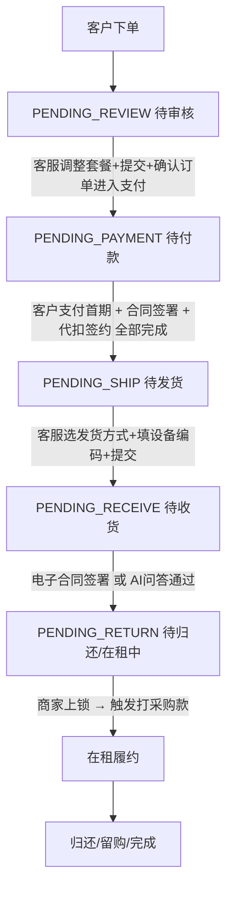

# 长租订单全生命周期与客服操作手册

> P0 业务文档(2026-05-26)。
> 长租订单从客户下单到归还的**完整 6 阶段**流程,逐阶段定义:客服操作 / 客户感知 / 系统动作 / 字段 / 状态流转。
> 本文档是运营客服日常操作的**主操作手册**,把分散在 04 / 07 / 03 等文档的关键节点串起来,确保运营理解一致。

---

## 1. 总览

```
阶段 0 客户下单
   ↓
阶段 1 待审核   ⭐ 核心(客服调整套餐 + 生成图片 + 确认订单进入支付)
   ↓
阶段 2 待付款   (首期一笔支付 → 自动发起合同 → 自动发起代扣)
   ↓
阶段 3 待发货   (选发货方式 + 填设备编码)
   ↓
阶段 4 待收货   (电子合同 / AI 问答 二选一)
   ↓
阶段 5 待归还   (在租中,后期接监管锁状态)
   ↓
归还/留购/完成
```

---

## 2. 阶段 0:客户下单(C 端)

### 2.1 三种入口

| 入口 | 订单类型 | 后续流程差异 |
|---|---|---|
| 扫门店专属码 | 门店订单 / 分红订单 | 商家自审(门店订单)或运营审核(分红订单) |
| 扫平台通用商品码 | 平台订单 | 运营审核 + 客服需手工分配履约门店 |

### 2.2 客户操作

```
扫码 → 选规格/套餐 → 填资料 → 实名 → 风控授权 → 协议勾选 → 提交订单
```

### 2.3 订单创建后

订单状态:`PENDING_REVIEW`(待审核)

客户 C 端展示:**"平台审核中"**(不显示具体子状态、不显示预估时间)

---

## 3. 阶段 1:待审核 ⭐ 核心阶段

### 3.1 客服待办

客服进入"运营端 > 订单管理 > 待审核与资方分配"工作台,接到订单。

### 3.2 订单详情界面顶部固定字段

```
┌────────────────────────────────────────────────────────────┐
│ ← 订单详情 #20260526001                                       │
├────────────────────────────────────────────────────────────┤
│ 顶部信息条(全程固定显示)                                       │
│  订单状态:  待审核                                            │
│  商家名称:  北京鼎租商贸有限公司                                │
│  门店名称:  鼎租新街口店(分红/门店订单已知;平台订单待分配)    │
│  资方名称:  (待分配 / 已分配:XXX)                            │
│  做单客服:  小张(2026-05-26 接单)                            │
│  订单类型:  门店订单 / 分红订单 / 平台订单                       │
└────────────────────────────────────────────────────────────┘
```

**注意**:
- "做单客服 XXX"在客服第一次接单时**自动标记并固化**,不可改(除非主管复核改派)
- 商家名 / 门店名 / 资方名是后台展示,**C 端客户不可见**(C 端只在合同签署后展示"提货门店")

### 3.3 客服核心动作

#### 动作 1:核对订单与客户资料

- 客户身份证 / 实名信息 / 风控报告
- 商品规格 / 期数 / 套餐
- 客户上传的资料(地址证明 / 流水截图等)

#### 动作 2:**[调整套餐]** 按钮 ⭐(分红订单 + 平台订单可用,门店订单不可用)

点击 [调整套餐] → 弹出"**类办单助手**"界面:

```
┌──────────────────────────────────────────────────────┐
│ 调整套餐  #20260526001                                  │
├──────────────────────────────────────────────────────┤
│ 商品基础信息(只读)                                      │
│  商品名称:  iPhone 15 Pro Max 256G 黑色                 │
│  指导价:    ¥9,999                                     │
├──────────────────────────────────────────────────────┤
│ 履约门店(平台订单必填,分红订单已知)                      │
│  [搜索门店:支持门店名/编码/主体/收款户名] → 多维度展示    │
│  详见 07_平台订单门店分配.md(分配逻辑、防错、二次确认)  │
├──────────────────────────────────────────────────────┤
│ 套餐配置                                                │
│  设备价:        [____]                                  │
│  首付金额:      [____]                                  │
│  期数:          [12 期 ▼]                              │
│  月供:          [____](系统自动计算)                  │
│  留购价:        [____]                                  │
│  押金:          [____]                                  │
├──────────────────────────────────────────────────────┤
│ 增值服务(后台配置,可多选)                              │
│  ☐ 公证费                ¥298                          │
│  ☐ 设备管理费            ¥150                          │
│  ☐ 碎屏险                ¥99                           │
│  ☐ 意外险                ¥199                          │
│  (增值服务清单由后台「配置管理 > 增值服务」维护)         │
├──────────────────────────────────────────────────────┤
│ 资方配置(分红订单)                                     │
│  资方:          [搜索资方 ▼]                            │
│  出资比例:      [80% ▼]  (门店出资 20%)                │
│  资方出资金额:  ¥X,XXX(系统自动计算)                  │
├──────────────────────────────────────────────────────┤
│ 首期一笔支付汇总                                        │
│  首期租金:      ¥XXX                                   │
│  押金:          ¥XXX                                   │
│  增值服务:      ¥XXX                                   │
│  ────────────────────────                            │
│  首期总额:      ¥X,XXX(客户一笔支付)                  │
├──────────────────────────────────────────────────────┤
│  [生成办单图片]    [提交]                                │
└──────────────────────────────────────────────────────┘
```

**关键约束**:
- 门店订单**不开放**调整套餐(商家自己用办单助手生成,客服只能核对)
- 分红订单 + 平台订单可调整;平台订单**必须分配门店**才能提交
- 增值服务清单由后台「配置管理 > 增值服务」维护,客服只能勾选不能新增
- 出资比例展示文案:**"出资比例 80%(门店出资 20%)"**(不用"等效出资")

#### 动作 3:**[生成办单图片]**

点击后,系统生成一张**办单图片**(类似商家端办单助手成图):

```
┌────────────────────────────────────┐
│        【满点租赁】订单确认             │
├────────────────────────────────────┤
│ 客户:        闫**                    │
│ 商品:        iPhone 15 Pro Max 256G  │
│ 设备价:      ¥9,999                  │
│ 首付金额:    ¥1,299                  │
│ 期数:        12 期                   │
│ 月供:        ¥760                    │
│ 留购价:      ¥1,899                  │
│ 押金:        ¥500                    │
│ 增值服务:    公证费 ¥298 + 碎屏险 ¥99│
│ ──────────────────────             │
│ 首期一笔支付:¥2,196                  │
└────────────────────────────────────┘
```

**用途**:
- 客服**下载图片** → 通过任意通讯渠道(微信/钉钉/短信)发给**商家**
- 商家与客户确认费用 → 客户在 IM 回复"确认"
- 客服肉眼判定客户已确认 → 进入下一步

**注意**:
- **不需要再次推送给客户**(客户从下单起在 C 端就能看到订单、合同、账单)
- 系统**不对接 IM 自动发送**,客服手动操作(灵活)

#### 动作 4:**[提交]**

点击 [提交] → 订单的套餐、门店、资方、增值服务等信息**写入数据库**,但订单状态**仍停留在 PENDING_REVIEW**。

此时订单详情页可展示**新的账单信息**供客服 / 商家查看,但还没推给客户支付。

#### 动作 5:**[确认订单进入支付]** 按钮

客服与商家、客户确认无误后,点击 [确认订单进入支付] →

```
系统动作:
1. 订单状态:PENDING_REVIEW → PENDING_PAYMENT(待付款)
2. 写操作日志:操作人、工号、时间、订单快照
3. 客户 C 端订单状态变更通知(站内消息 + 推送)
4. 客户 C 端看到首期支付入口
```

### 3.4 状态变更总结

```
PENDING_REVIEW(待审核)
  ↓ 客服 [调整套餐] → [提交] → 与商家/客户确认 → [确认订单进入支付]
PENDING_PAYMENT(待付款)
```

---

## 4. 阶段 2:待付款

### 4.1 客户 C 端

订单状态:`PENDING_PAYMENT`

客户看到:
- 首期支付总额(一笔)
- [立即支付] 按钮
- 支付方式:支付宝 / 微信(可配)

### 4.2 客服界面

```
┌──────────────────────────────────────────────────────┐
│ 待付款 - 客服操作面板                                    │
├──────────────────────────────────────────────────────┤
│ 首期总额:        ¥2,196                                │
│  ├ 首期租金:    ¥760                                  │
│  ├ 押金:        ¥500                                  │
│  └ 增值服务:    ¥397                                  │
├──────────────────────────────────────────────────────┤
│ [生成首付二维码] 按钮                                    │
│  → 弹窗显示二维码图片                                    │
│  → 客服下载图片发给客户                                  │
├──────────────────────────────────────────────────────┤
│ 待办状态:                                              │
│  □ 首期支付       ⏳ 待客户支付                        │
│  □ 电子合同签署   ⏳ 待发起                            │
│  □ 代扣签约       ⏳ 待发起                            │
└──────────────────────────────────────────────────────┘
```

### 4.3 系统串行动作(全自动)

```
客户支付首期成功
  ↓ 支付回调
系统自动发起电子合同(e签宝接口)
  ↓ 合同推送到客户 C 端
客户在 C 端签电子合同
  ↓ e签宝回调
系统标记"电子合同 已签署"
  ↓ 自动发起代扣签约
  ├─ 支付宝代扣:客户在 C 端点击签约
  └─ 银行卡代扣:客服后台点击发起(可选)
  └─ 不需要代扣:跳过
  ↓ 代扣签约完成
系统标记"代扣 已签约"
  ↓ 三项全部完成(✓首付 + ✓合同 + ✓代扣)
订单自动跳转 → PENDING_SHIP(待发货)
```

### 4.4 客户支付失败 / 不响应

| 场景 | 处理 |
|---|---|
| 客户支付超时(默认 24h) | 订单进入"待付款 - 超时"队列,客服催办 |
| 客户支付失败 | 系统记录失败原因,客户可重试 |
| 客户主动取消 | 订单 → CLOSED;已收资料按规则处理 |

### 4.5 银行卡代扣的客服触发

- 若订单配置为"需要银行卡代扣",合同签完后**客服后台点 [发起银行卡代扣]** 按钮
- 触发 → 客户 C 端收到代扣签约任务 → 客户签 → 回调
- 若订单配置为"仅支付宝代扣"或"不需代扣",此步骤跳过

---

## 5. 阶段 3:待发货

### 5.1 客服 / 门店端操作

```
┌──────────────────────────────────────────────────────┐
│ 待发货 - 操作面板                                       │
├──────────────────────────────────────────────────────┤
│ 客户:        闫**  138****7755                         │
│ 商品:        iPhone 15 Pro Max 256G 黑色                │
│ 收货地址:    北京市朝阳区...                            │
├──────────────────────────────────────────────────────┤
│ 发货方式 *                                              │
│ ○ 门店自提                                              │
│ ○ 顺丰物流                                              │
│ ○ 京东物流                                              │
│ ○ 其他物流(后台可配)                                  │
├──────────────────────────────────────────────────────┤
│ 设备编码 *(选发货方式后展示输入框)                       │
│ [____________________]                                  │
│ (支持 IMEI / SN / VIN,根据品类自动校验)                │
│                                                          │
│ 物流单号(选物流方式时必填)                              │
│ [____________________]                                  │
├──────────────────────────────────────────────────────┤
│ 发货凭证(可选,上传图片)                                │
│ [+ 上传]                                                │
├──────────────────────────────────────────────────────┤
│  [提交发货]                                             │
└──────────────────────────────────────────────────────┘
```

### 5.2 操作约束

| 校验项 | 规则 |
|---|---|
| 发货方式 | 必选 |
| 设备编码 | 必填;系统校验唯一性(全平台唯一);格式按品类校验 |
| 物流单号 | 选物流时必填;门店自提可空 |
| 发货凭证 | 选填;门店自提建议上传客户取货签字照 |

### 5.3 提交后

```
订单状态:PENDING_SHIP → PENDING_RECEIVE(待收货)
设备状态:DEVICE_AVAILABLE → DEVICE_LOCKED(已锁定 - 在途)
客户 C 端展示:
  - 物流单号(若有)
  - 物流公司
  - "已发货,等待签收"
```

---

## 6. 阶段 4:待收货 ⭐ 含验收确认机制

### 6.1 双通道验收(系统设置默认 + 客服可手动切换)

后台配置:**默认验收方式 = 电子合同 / AI 问答**

```
客户点 [确认收货] 按钮
  ↓
系统判断默认验收方式
  ├─ 默认 = 电子合同
  │    → 调起电子合同(收货确认条款)
  │    → 客户在 C 端签字
  │    → e签宝回调"合同已签署"
  │    → 订单 → PENDING_RETURN(待归还)
  │
  └─ 默认 = AI 问答
       → 调起 AI 语音问答
       → 客户语音回答(设备状况、使用流程、风险告知)
       → AI 自动识别准确率
       ├─ 达标 → 订单 → PENDING_RETURN
       └─ 不达标 → 进入"待人工介入"队列
                    → 客服可手动切换电子合同方式
```

### 6.2 客服手动切换

当默认方式失败时,客服可**手动发起另一种方式**:

```
[切换为电子合同验收]   (当 AI 问答失败时)
[切换为 AI 问答验收]   (当电子合同失败/客户拒签时)
```

### 6.3 AI 问答规则

| 项 | 规则 |
|---|---|
| 问题数量 | 后台配置 5-10 题 |
| 准确率阈值 | ≥ 80% 通过(后台可调) |
| 语音质量校验 | 时长 / 清晰度 / 是否有人声 |
| 重试机会 | 3 次,失败转人工 |
| 失败兜底 | 转电子合同 / 客服外呼复核 |

### 6.4 状态变更

```
PENDING_RECEIVE(待收货)
  ↓ 电子合同 已签 / AI 问答 通过
PENDING_RETURN(待归还,即在租中)
```

---

## 7. 阶段 5:待归还(在租中)

### 7.1 订单进入正常履约期

```
订单状态:PENDING_RETURN(待归还,即长租在租中)
按期生成账单 → 代扣月供 → 直到归还或留购
```

### 7.2 监管锁状态展示(后期接入)

订单详情页**合同状态 / 代扣签约状态附近**新增一行:

```
┌──────────────────────────────────────┐
│ 合同状态:      ✓ 已签署                │
│ 代扣状态:      ✓ 已签约                │
│ 监管锁状态:    ✓ 已上锁  ⭐ 新增字段     │
└──────────────────────────────────────┘
```

### 7.3 监管锁上锁时机与触发动作

```
客户 [确认收货] 完成(电子合同 或 AI 问答 通过)
  ↓ 订单进入 PENDING_RETURN
商家现场给设备上锁(手机锁屏 / 监管 App 等)
  ↓ 商家在系统标记"已上锁"
系统:
  ├─ 订单字段 lock_status = LOCKED
  ├─ 触发"打采购款"动作 ⭐ 关键
  │    → 平台 / 资方按约定打款给商家
  └─ 推送商家钱包账单
```

**关键设计**:
- 监管锁上锁**不阻塞订单进度**(收货完成即进入待归还)
- 上锁动作单独走,作为**采购款打款的触发条件**
- 上锁前打不了采购款,防止设备未锁就打款给商家

---

## 8. 阶段 6:归还 / 留购 / 完成

(此阶段沿用现有 03_订单详情.md 和 05_订单关闭退款与售后.md 的逻辑,本文档不重复)

---

## 9. 完整状态流转图



---

## 10. 各阶段订单顶部固定信息条

```
┌────────────────────────────────────────────────────────┐
│ 订单状态:    [当前状态标签]                              │
│ 商家名称:    XXX 公司                                    │
│ 门店名称:    XXX 店(分配后展示)                        │
│ 资方名称:    XXX 资方(分红/平台订单展示)               │
│ 做单客服:    XXX(自动标记,接单时固化)                 │
│ 订单类型:    门店/分红/平台                              │
└────────────────────────────────────────────────────────┘
```

**C 端客户视角的对照**:
- 客户**只能看到**订单状态 + 提货门店(签约后)
- 商家名 / 资方名 / 做单客服 / 订单类型 **全部不暴露给客户**

---

## 11. 客服操作权限矩阵

| 动作 | 客服 | 客服主管 | 运营主管 |
|---|---|---|---|
| 接单 | ✅ | ✅ | ✅ |
| 调整套餐(分红/平台订单) | ✅ | ✅ | ✅ |
| 调整套餐(门店订单) | ❌ | ❌ | ✅(异常介入) |
| 分配门店(平台订单) | ✅(需工号) | ✅ | ✅ |
| 生成办单图片 | ✅ | ✅ | ✅ |
| 确认订单进入支付 | ✅ | ✅ | ✅ |
| 生成首付二维码 | ✅ | ✅ | ✅ |
| 发起银行卡代扣 | ✅ | ✅ | ✅ |
| 切换收货验收方式 | ✅ | ✅ | ✅ |
| 标记监管锁状态(后台代操作) | ❌ | ✅ | ✅ |
| 触发打采购款 | ❌ | ❌ | ✅(主管审批) |

---

## 12. 与其他文档的关系

| 文档 | 关系 |
|---|---|
| `04_待审核与资方分配.md` | 本文档阶段 1 的详细工作台 PRD |
| `07_平台订单门店分配.md` | 本文档阶段 1 [调整套餐] 中分配门店的详细 PRD |
| `03_订单详情.md` | 订单详情页的整体布局 |
| `02_状态字典与订单状态机.md` | 状态枚举来源 |
| `05_订单关闭退款与售后.md` | 归还/留购/关闭流程 |
| `06_改价补资料与客服IM.md` | 客服 IM 联动机制 |

---

## 13. 修订记录

| 日期 | 版本 | 修订 |
|---|---|---|
| 2026-05-26 | v1.0 | 初版,完整定义长租订单 6 阶段流程 + 客服操作动作 + 系统串行机制 + 监管锁触发逻辑 |
