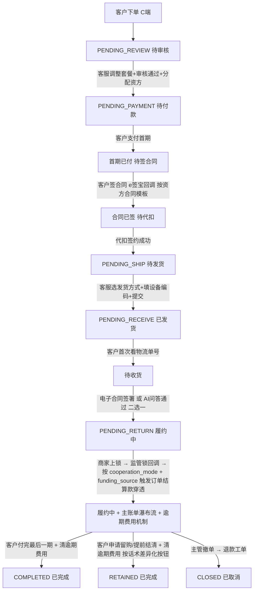

# 长租订单全生命周期与客服操作手册

> P0 业务文档(2026-05-27)。
> 长租订单从客户下单到归还的**完整 6 阶段**流程,逐阶段定义:客服操作 / 客户感知 / 系统动作 / 字段 / 状态流转。

> **⚠️ V0.2 修订(2026-05-27)v1.4**:
> - 三种合作模式命名统一为 **商家订单 / 联营订单 / 平台订单**(后台 + 商家端)
> - C 端状态"租用中"统一改为"**履约中**"(对齐 09 文档统一中性话术)
> - C 端字眼"违约金"统一改为"**逾期费用**"
> - **§7.3 新增按资金来源处理监管锁回调**(平台自营走标准流程;蓝海银行赊销走资方放款流程)
> - §7.3 新增"资方授信额度自动增减"
> - §10 顶部信息条新增"资金来源 / 合同模板 / 话术模板"字段
> - §11 权限矩阵补充资方分配 / 退款工单相关动作

> **⚠️ V0.2 修订(2026-05-27)v1.3**:整体清理"采购款 / 采购账户"术语(保留)
> **⚠️ V0.2 修订(2026-05-26)v1.2 / v1.1**:违约金机制 / 8 状态(保留,字眼按 v1.4 统一)

---

## 1. 总览

```
阶段 0 客户下单
   ↓
阶段 1 待审核   ⭐ 核心(客服调整套餐 + 生成图片 + 确认订单进入支付 + 分配资方)
   ↓
阶段 2 待付款   (首期一笔支付 → 自动发起合同 → 自动发起代扣)
   ↓
阶段 3 待发货   (选发货方式 + 填设备编码,编码不可改)
   ↓
阶段 4 待收货   (电子合同 / AI 问答 二选一,必须通过)
   ↓
阶段 5 待归还   (履约中,监管锁回调 → 按资金来源处理订单结算款 + 逾期费用机制)
   ↓
归还 / 留购 / 提前结清 / 完成
```

**C 端 8 状态对照**:审核中 / 待付款 / 待签约 / 已发货 / 待收货 / **履约中** / 已完成 / 全部订单(详见 09 文档)

---

## 2. 阶段 0:客户下单(C 端)

(内容同 v1.3,无修改)

订单状态:`PENDING_REVIEW`(待审核)

**客户 C 端展示:"审核中"** (Tab + 详情页状态;**不显示预估时间**;**不显示门店/资方/客服等**)

---

## 3. 阶段 1:待审核 ⭐ 核心阶段(v1.4 新增资方分配)

主要内容同 v1.3。**关键补充:联营订单 / 平台订单经审核通过后需进入"资方分配"环节**:

```
联营订单 / 平台订单审核通过
   ↓
进入"资方分配"工作台
   ↓
系统按风控规则推荐资方:
   ├─ 优质订单 + 蓝海银行授信余额够 → 推荐蓝海银行
   ├─ 不符合银行标准 + 平台愿接 → 推荐平台自营
   └─ 都不符合 → 提示驳回订单
   ↓
运营审核确认资方(或调整推荐)
   ↓
系统自动:
   ├─ 锁定 order.funding_source / order.funder_id
   ├─ 加载 order.contract_template_id(从资方继承)
   └─ 加载 order.terminology_template_id(从资方继承)
```

详细流程见 `04_待审核与资方分配.md` v2.0 + `资方管理/03_风控规则与资方分配.md`。

---

## 4. 阶段 2:待付款

(内容同 v1.3,无修改)

**v1.4 补充**:客户签的合同模板**按订单的资金来源决定**:
- 平台自营 → 《租赁服务协议》(标准三方)
- 蓝海银行 → 《蓝海银行赊销合同》

---

## 5. 阶段 3:待发货

(内容同 v1.3,无修改)

---

## 6. 阶段 4:待收货 ⭐ 含验收确认机制

(内容同 v1.3,无修改)

---

## 7. 阶段 5:待归还(履约中)⭐ v1.4 按资金来源处理监管锁回调

### 7.1 订单进入正常履约期

```
订单状态:PENDING_RETURN(待归还,C 端显示"履约中")
客户在 C 端可看到:
  - 主账单瀑布流(每一期 + 剩余应付)
  - 任意期可点 [立即支付](严格顺序:必须先付完之前的期,详见 09 §3.2)
  - 当期付完后可点 [申请留购] 或 [提前结清](按订单话术模板)
  - 逾期费用账单(独立区块,逾期产生,详见 11 文档)
```

详细 C 端展示见 `09_C端订单状态与账单支付.md`。

### 7.2 监管锁状态展示(后台 v1.4 更新)

订单详情页**合同状态 / 代扣签约状态附近**新增一行(后台显示,**C 端不显示**):

```
┌──────────────────────────────────────────────────┐
│ 合同状态:        ✓ 已签署                          │
│ 代扣状态:        ✓ 已签约                          │
│ 监管锁状态:      ✓ 已上锁                          │
│ 资金来源:        蓝海银行(funder_blue_ocean)       │
│ 订单结算款:      ✓ 已结算 ¥5,000(100%)            │
│ 资方放款流水:    BL2026052712345                    │
│ 通联充值流水:    ✓ TL2026052712345                  │
│ 资方应收余额:    ¥5,000                            │
└──────────────────────────────────────────────────┘
```

### 7.3 监管锁上锁时机与触发动作(v1.4 按资金来源分支)⭐

```
客户 [确认收货] 完成(电子合同 或 AI 问答 通过)
  ↓ 订单进入 PENDING_RETURN
商家现场给设备上锁(监管锁系统操作)
  ↓ 监管锁系统通过 Webhook 回调到平台
系统按订单 cooperation_mode + funding_source 判断处理:
```

#### 7.3.1 商家订单(self_operate)

```
不触发订单结算款入账
(门店自己出资,无需平台代付)
后续由客户每月支付时的月度分账给门店
```

#### 7.3.2 联营订单(joint_venture)

```
所有联营订单当前默认 funding_source = platform_self(MVP 阶段)

资金流:
  ① 平台自营资金:平台对公账户出资 = 设备价 × 平台出资比例
  ② 实时充值通联备付金账户(< 1 分钟)
  ③ 充值到门店子台账(订单结算款入账)
  ④ 同步更新资方台账(funder_receivable_ledger):
     - transferred_amount += amount
     - outstanding_balance += amount
  ⑤ 同步更新资方授信额度:
     - funder.credit_limit_used += amount
     - funder.credit_limit_left -= amount

例:¥5,000 × 50% = ¥2,500 进入门店结算账户;平台自营授信占用 ¥2,500
```

#### 7.3.3 平台订单(receivables_assignment)— 按 funding_source 分支 ⭐ v1.4 新增

```
平台订单可能有两种 funding_source(由阶段 1 资方分配决定):

【分支 A】funding_source = platform_self(平台自营资金)

资金流:
  ① 平台对公账户出资 = 设备价 × 100%
  ② 实时充值通联备付金账户(< 1 分钟)
  ③ 充值到门店子台账(订单结算款入账)
  ④ 同步更新资方台账(资方=平台自营):
     - transferred_amount += amount
     - outstanding_balance += amount
  ⑤ 同步更新平台自营授信额度:
     - funder.credit_limit_used += amount

例:¥5,000 × 100% = ¥5,000 进入门店结算账户;平台自营授信占用 ¥5,000

【分支 B】funding_source = funder_blue_ocean(蓝海银行赊销)⭐ v1.4 新增

资金流:
  ① 平台向蓝海银行发起放款请求(API 或线下确认)
     - 请求金额:设备价 × 100% = ¥5,000
     - 关联订单 ID + 客户身份验证
  ② 蓝海银行审核 + 放款到平台对公账户
     - 收到银行放款 ¥5,000
     - 写 platform_passthrough_log:direction=in, source=funder_blue_ocean
  ③ 平台对公账户实时充值通联备付金账户(< 1 分钟)
  ④ 充值到门店子台账(订单结算款入账)
  ⑤ 同步更新资方台账(资方=蓝海银行):
     - transferred_amount += ¥5,000
     - outstanding_balance += ¥5,000
  ⑥ 同步更新蓝海银行授信额度:
     - funder.credit_limit_used += ¥5,000
     - funder.credit_limit_left -= ¥5,000
  ⑦ 写资方放款流水(funder_disbursement_log)

例:¥5,000 进入门店结算账户;蓝海银行授信占用 ¥5,000
关键差异:资金来自蓝海银行而非平台自营
```

### 7.4 关键设计

- 监管锁上锁**不阻塞订单进度**(收货完成即进入待归还/履约中)
- 上锁动作单独走,作为**订单结算款穿透的触发条件**
- 上锁前不触发订单结算款,防止设备未锁就打款给商家(资金风险)
- 商家订单**不触发**订单结算款入账,只有客户每月支付时的月度分账
- 联营订单 / 平台订单按合作模式 + 资金来源锁定的比例计算入账金额
- **资方授信额度自动增减**(详见 7.3.2 / 7.3.3 / 7.3.4)
- 任何资金动作都同步更新**资方台账 + 资方授信额度**,确保资金链路闭环

### 7.5 监管锁系统回调失败兜底

| 异常 | 处理 |
|---|---|
| 监管锁系统超时未回调 | 进入运营预警 + 客服联系商家核实 |
| 商家未及时上锁(超 24h)| 客服催促 |
| 商家长时间不上锁(超 7 天)| 进入主管审核 + 强制人工标记 |
| 主管手动标记"已上锁" | 触发订单结算款穿透 + 写"人工标记"日志 |
| 平台对公账户已收钱但通联充值失败 | 系统重试 + 财务异常队列(详见 07 文档 §5.6) |
| 通联充值成功但门店子台账未更新 | 系统对账兜底 |
| **资方放款失败(蓝海银行)** ⭐ | 财务异常队列 + 客服联系银行 + 可能切换 funding_source 为平台自营 |
| **资方授信额度不足** ⭐ | 提交时风控阻拦;若已审核完成发生,异常队列 + 主管审核 |

### 7.6 在租期逾期费用机制(v1.4 字眼调整)

详细规则见 `11_违约金账单与规则配置.md`(v1.1 已统一字眼为"逾期费用账单与规则配置")。核心要点摘要:

#### 7.6.1 逾期费用生成

- 系统每日凌晨 1 点定时任务扫描所有"履约中"订单
- 检查每一期主账单是否逾期(到期日 + 1 < today)
- 已逾期但未生成逾期费用账单 → 新建
- 已生成逾期费用账单 → 累计天数 +1,重算金额
- 客户支付当期主账单后 → 该期逾期费用停止累计

#### 7.6.2 逾期费用规则配置

| 合作模式 | 规则配置位 |
|---|---|
| 商家订单 | 商家在自己后台配置 |
| 联营订单 | 平台统一配置 |
| 平台订单 | 平台统一配置 |

支持两种算法:
- `fixed`:固定金额/天(如 ¥10/天)
- `percent`:按当期金额比例/天(如 0.05%/天)

可配单日封顶 + 总额封顶。**规则快照写入订单**,后续平台改规则不影响已生效订单。

#### 7.6.3 客服后台操作

详细权限矩阵 + 操作日志见 11 §10。所有减免必须填原因 + 留痕。

#### 7.6.4 客户 C 端展示(v1.4 字眼调整)

```
逾期费用账单(独立于主账单)
  来源期数  累计天 原始金额 减免  实付   操作
  第3期    5天    ¥50    -¥20  ¥30   [立即支付][咨询客服]
           已减免 ¥20(运营调整)
```

- 已减免的展示"已减免 ¥XX(运营调整)"标识
- 全额减免的展示"已免除"+ 灰色
- 客户可单独支付逾期费用(不强制同时付当期)

#### 7.6.5 提前结清 / 归还前的强制结清

```
客户申请留购 / 提前结清(按订单话术模板)或 归还
   ↓
检查是否有未结清逾期费用?
   ├─ 否 → 正常流程
   └─ 是 → 必须先结清逾期费用
            ├─ [一并结清后提前结清] → 金额 += 逾期费用合计 + 一笔支付
            └─ [先支付逾期费用] → 跳转逾期费用支付页
```

主管全额减免后,可跳过结清检查。

---

## 8. 阶段 6:归还 / 留购 / 提前结清 / 完成(v1.4 按资方话术差异化)

### 8.1 三种结局(v1.4 简化)

| 结局 | 状态 | C 端展示 |
|---|---|---|
| 客户归还设备 | COMPLETED | 已完成 |
| 客户完成留购 / 提前结清 | RETAINED | 已完成 |
| 撤单 / 关闭 | CLOSED | 已完成(已取消)|

按 09 文档 v1.2 决策,C 端不再细分"已归还/已留购",统一显示"已完成"。

### 8.2 归还 / 留购 / 提前结清前的逾期费用清算

无论哪种结局,在订单关闭前**必须清算所有逾期费用**(详见 7.6.5)。

### 8.3 归还流程

(沿用现有 03_订单详情.md 和 05_订单关闭退款与售后.md 的逻辑,本文档不重复)

### 8.4 留购 / 提前结清触发(v1.4 按资方话术差异化按钮)

客户在 C 端任意一期点 [申请留购] 或 [提前结清](按订单的话术模板)。详见 09 §3.4。

#### 标准租赁话术(平台自营资金)

```
按钮:[申请留购]
检查:当期已付清 + 之前期已付清 + 无未结逾期费用
弹窗:留购确认
完成提示:设备所有权将归您所有
法律性质:留购(应收账款转让对价已收清,设备所有权转移)
```

#### 蓝海银行赊销话术

```
按钮:[提前结清]
检查:当期已付清 + 之前期已付清 + 无未结逾期费用
弹窗:提前结清确认
完成提示:本订单已全部还清,不再产生费用
法律性质:提前还款(银行借款已全部清偿,设备本就归客户)
```

支付完成后 → 订单 → 已完成。

---

## 9. 完整状态流转图(v1.4 修订)



---

## 10. 各阶段订单顶部固定信息条(后台,**C 端不可见**)v1.4 修订

```
┌────────────────────────────────────────────────────────────┐
│ 订单状态:        [当前状态标签]                              │
│ 合作模式:        商家订单 / 联营订单(50/50)/ 平台订单       │
│ 资金来源:        平台自营 / 蓝海银行 / 其他资方              │
│ 资方:           平台自营资金 / 蓝海银行                      │
│ 合同模板:        标准租赁 v1.0 / 蓝海银行赊销 v2.3           │
│ 话术模板:        标准租赁话术 / 蓝海银行赊销话术              │
│ 商家名称:        XXX 公司                                   │
│ 门店名称:        XXX 店(分配后展示)                       │
│ 做单客服:        XXX(自动标记,接单时固化)                │
│ 风险标记:        (跳过代扣的订单显示"风险订单"红标签)       │
│ 逾期费用状态:    (有逾期费用的订单显示"⚠️ 有逾期费用 ¥XX")  │
│ 订单结算款状态:  ✓ 已结算 ¥2,500 (联营 / 平台订单)          │
│ 资方应收余额:    ¥X,XXX                                    │
└────────────────────────────────────────────────────────────┘
```

**C 端客户视角**:**完全不展示**合作模式 / 资金来源 / 资方 / 合同模板 / 话术模板 / 资方应收余额。

---

## 11. 客服操作权限矩阵(v1.4 修订)

| 动作 | 客服 | 客服主管 | 运营主管 |
|---|---|---|---|
| 接单 | ✅ | ✅ | ✅ |
| 调整套餐(联营/平台订单)| ✅ | ✅ | ✅ |
| 调整套餐(商家订单)| ❌ | ❌ | ❌ |
| 商家订单异常介入 - 改价(Q4)| ❌ | ❌ | ❌ |
| 商家订单异常介入 - 驳回(Q4)| ✅ | ✅ | ✅ |
| **分配资方(联营/平台订单)** ⭐ | ✅(系统推荐 + 确认)| ✅ | ✅ |
| **手动调整资方推荐** ⭐ | ❌ | ✅ | ✅ |
| **更换资方(合同签署前)** ⭐ | ❌ | ✅(2FA)| ✅(2FA)|
| 分配门店(平台订单)| ✅(需工号)| ✅ | ✅ |
| 生成办单图片 | ✅ | ✅ | ✅ |
| 确认订单进入支付 | ✅ | ✅ | ✅ |
| 生成首付二维码 | ✅ | ✅ | ✅ |
| 发起银行卡代扣 | ✅ | ✅ | ✅ |
| 跳过代扣(Q9)| ❌ | ❌ | ✅ |
| 切换收货验收方式 | ✅ | ✅ | ✅ |
| 主管手动标记收货已完成(Q12 兜底)| ❌ | ❌ | ✅ |
| 标记监管锁状态(后台代操作 / V1)| ❌ | ✅ | ✅ |
| 发起补充合同 - 设备编码 | ✅ | ✅ | ✅ |
| 发起补充合同 - 资方/门店/规格 | ❌ | ✅ | ✅ |
| 触发订单结算款穿透 | 系统自动(监管锁回调)| - | - |
| 手动补发订单结算款穿透(异常时)| ❌ | ❌ | ✅(留痕)|
| **手动触发资方放款重试(蓝海银行)** ⭐ | ❌ | ❌ | ✅(留痕)|
| 查看逾期费用账单 | ✅ | ✅ | ✅ |
| 修改逾期费用原始金额 | ✅(留痕)| ✅ | ✅ |
| 单期手动减免逾期费用 | ✅ | ✅ | ✅ |
| 全额减免单期逾期费用 | ✅ | ✅ | ✅ |
| 批量减免全订单逾期费用 | ❌ | ❌ | ✅ |
| 修改平台逾期费用规则 | ❌ | ❌ | ✅ |
| 修改商家逾期费用规则 | 商家自己 | 商家自己 | ✅ |
| **撤单订单**(分账已发生 → 走线下退款工单) ⭐ | ❌ | ✅(2FA)| ✅(2FA)|
| **确认门店线下转账到位** ⭐ | ❌ | ✅ | ✅ |

---

## 12. 与其他文档的关系(v1.4 更新)

| 文档 | 关系 |
|---|---|
| `04_待审核与资方分配.md` v2.0 ⭐ | **本文档阶段 1 的详细工作台 PRD + 资方分配流程** |
| `07_平台订单门店分配.md` | 本文档阶段 1 [调整套餐] 中分配门店的详细 PRD |
| `09_C端订单状态与账单支付.md` v1.2 ⭐ | C 端客户视角:统一中性话术 + 按资方话术差异化按钮 |
| `10_订单撤单与补充合同.md` v2.0 ⭐ | **撤单退款资金链路(分账已发生强制线下退款)** |
| `11_违约金账单与规则配置.md` v1.1 | 逾期费用独立账单 + 规则可配 + 减免日志 + 提前结清前必清 |
| `财务管理/07_门店结算账户与资金穿透架构.md` v2.2 ⭐ | 订单结算款穿透 + 资金路径 + 通联备付金 + 资方台账 |
| `财务管理/08_订单合作模式与收益分配规则.md` v1.1 | 三种合作模式的出资 / 分账 / 会计处理详细规则 |
| **`资方管理/01_资方主体与授信管理.md`** ⭐ | 资方主表 / 授信额度 / 合同模板 / 话术模板 |
| **`资方管理/02_话术模板与合同模板管理.md`** ⭐ | 模板设计 + 切换机制 |
| **`资方管理/03_风控规则与资方分配.md`** ⭐ | 风控审批 + 资方分配 |
| **`话术规范/01_平台统一中性话术规范.md`** ⭐ | C 端字眼对照表 + 资方话术差异化 |
| `03_订单详情.md` v1.1 | 订单详情页布局 |
| `02_状态字典与订单状态机.md` | 状态枚举来源 |
| `05_订单关闭退款与售后.md` | 归还/留购/关闭流程 |
| `06_改价补资料与客服IM.md` | 客服 IM 联动机制 |

---

## 13. 修订记录

| 日期 | 版本 | 修订 |
|---|---|---|
| 2026-05-26 | v1.0 / v1.1 / v1.2 | 初版 + 8 状态新口径 + 违约金机制 |
| 2026-05-27 | v1.3 | 整体清理"采购款 / 采购账户 / 软钱包"术语 |
| 2026-05-27 | **v1.4** | 1. 三模式命名统一为商家/联营/平台订单;2. C 端字眼调整("租用中"→"履约中","违约金"→"逾期费用");3. **§7.3 按 funding_source 分支处理监管锁回调**(平台自营 / 蓝海银行赊销);4. §7.3 新增资方台账 + 授信额度自动增减;5. §7.5 新增资方放款失败 / 授信不足异常;6. §8.4 留购按资方话术差异化按钮(申请留购 vs 提前结清);7. §10 顶部信息条新增资金来源/资方/合同模板/话术模板;8. §11 权限矩阵新增"分配资方/更换资方/手动重试资方放款/确认门店线下转账";9. §12 关联文档新增资方管理 + 话术规范 |
