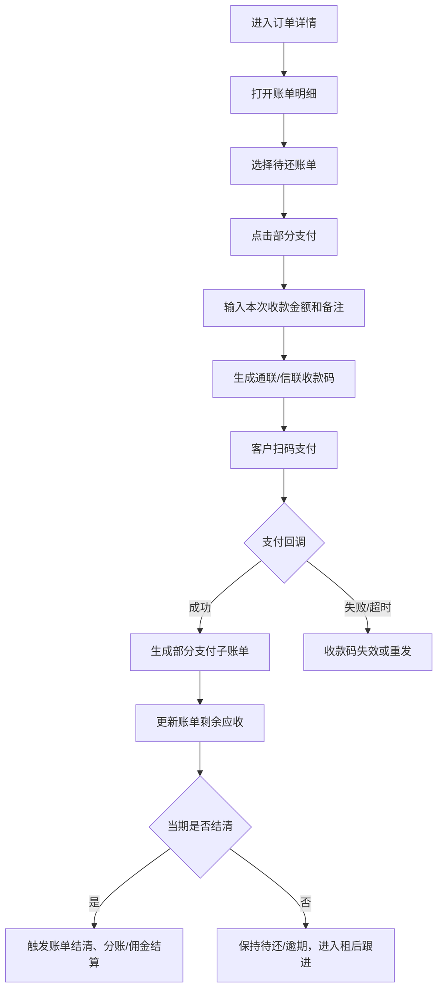

# 账单部分支付收款码

> **⚠️ V0.2 Stage 6 同步修订(2026-05-27)v1.1**:
> - 同步展示用语:商家订单 / 联营订单 / 平台订单 / 履约中 / 逾期费用。
> - 底层字段、接口、枚举不变;资金账户、退款工单、五边对账以 Stage 6 核心财务文档为准。

> 页面级 PRD 草案。
> 来源参考：无界租《账单部分支付收款码操作文档》。
> 口径：满点系统后续调起自有通联/信联收款码，不照搬无界租原支付通道限制。

---

## 1. 页面说明

| 项 | 内容 |
|---|---|
| 页面名称 | 账单部分支付收款码 |
| 所属端 | 运营端 |
| 入口路径 | 订单详情 > 账单明细 > 部分支付 |
| 使用角色 | 财务、审核客服、租后客服、平台管理员 |
| 核心目标 | 客户无法一次付清当期账单时，发起指定金额收款码并同步账单、分账和租后状态 |

---

## 2. 使用场景

1. 客户当前账单应付金额较高，只能先支付一部分。
2. 租后催收过程中，客户先还部分金额。
3. 客服审核后允许客户通过收款码补交部分费用。
4. 商家订单、联营订单、平台订单都可使用，但权限和结算规则可不同。

---

## 3. 核心规则

| 规则 | 说明 |
|---|---|
| 按账单发起 | 必须选择某一期账单，不能脱离账单随意收款 |
| 金额限制 | 本次收款金额必须大于 0，且不超过该期剩余应收 |
| 一码一次 | 收款码支付成功或过期后不可重复使用 |
| 未结清仍逾期 | 当期账单未全额结清时，订单仍保持逾期/待支付状态 |
| 分账延后 | 分红、平台订单建议当期账单结清后再触发正式分账和渠道佣金 |
| 全链路对账 | 收款、回调、子账单、退款、分账、钱包变动必须可追溯 |

---

## 4. 发起流程

---

## 5. 弹窗字段

| 字段 | 类型 | 说明 |
|---|---|---|
| 订单号 | 只读 | 当前订单 |
| 账单期数 | 只读 | 第 N 期 |
| 本期应收 | 只读 | 原始应收金额 |
| 已收金额 | 只读 | 本期已支付金额 |
| 剩余应收 | 只读 | 最大可收金额 |
| 本次收款金额 | 金额输入 | 必填，不超过剩余应收 |
| 收款通道 | 下拉 | 通联、信联，后续可扩展 |
| 有效期 | 下拉 | 例如 10 分钟、30 分钟、2 小时 |
| 备注 | 文本 | 必填或按角色配置 |

---

## 6. 财务影响

| 动作 | 影响 |
|---|---|
| 支付成功 | 生成部分支付流水、子账单、订单日志 |
| 当期未结清 | 不触发正式分账、渠道佣金、资方收益结算 |
| 当期结清 | 按订单类型触发分账、抽佣、渠道佣金、钱包入账 |
| 退款 | 只允许对单笔部分支付流水发起退款，需保留原支付账户和退款流水 |
| 冲正 | 财务可发起冲正，必须写明原因并进入审核 |

---

## 7. 权限控制

| 权限 | 说明 |
|---|---|
| 查看账单 | 可查看账单明细 |
| 发起部分支付 | 可生成收款码 |
| 作废收款码 | 可作废未支付收款码 |
| 退款/冲正 | 财务审核权限 |
| 导出 | 可导出部分支付流水和对账单 |

---

## 修订记录

| 日期 | 版本 | 说明 |
|---|---|---|
| 2026-05-27 | v1.1 | Stage 6 术语同步:商家/联营/平台订单 + 履约中/逾期费用;底层字段、接口、枚举不变。 |
