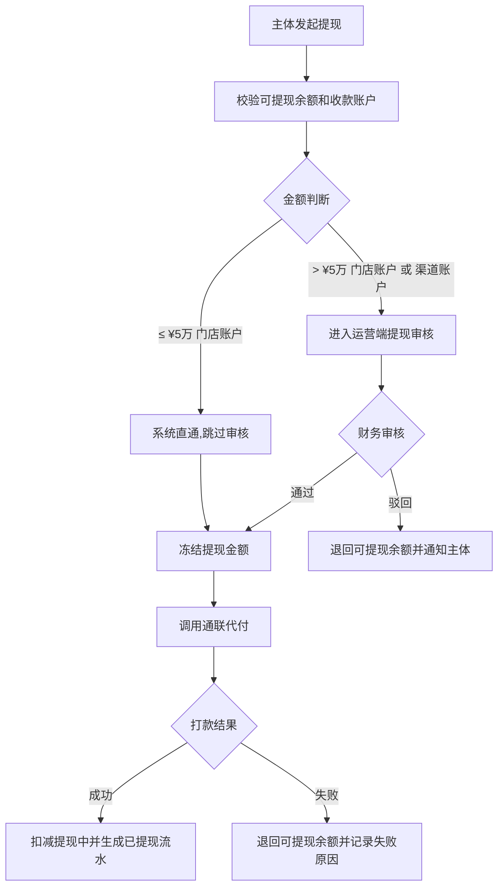

# 钱包、分账、提现与对账

> 页面级 PRD 草案。
> 目标:把三种合作模式的钱流、分账、钱包、提现、渠道佣金、对账异常统一起来,避免订单和财务各算各的。

> **⚠️ V0.2 重大修订(2026-05-27)v1.2**:
> - **整体清理"采购账户 / 软钱包"术语**(经合规复核,违反合同口径,可能触发税务穿透认定)
> - 三类订单口径**重命名**:门店订单 → 自营订单;分红订单 → 联营订单;平台订单 → 应收账款受让订单(后台用语;商家端 UI 保留通俗叫法)
> - 引入"**门店结算账户 + 通联备付金穿透**"统一架构(单账户钱包)
> - 分账规则按合作模式重新定义(详见 §6)
> - 详细规则见 `财务管理/07_门店结算账户与资金穿透架构.md` + `财务管理/08_订单合作模式与收益分配规则.md`

> **⚠️ V0.2 修订(2026-05-26)v1.1**:(已被 v1.2 推翻,仅保留历史记录)

---

## 1. 页面说明

| 项 | 内容 |
|---|---|
| 页面名称 | 钱包、分账、提现与对账 |
| 所属端 | 运营端 |
| 入口路径 | 财务管理 > 钱包账户 / 分账明细 / 提现审核 / 对账中心 |
| 使用角色 | 财务、平台管理员、运营主管、审核客服只读 |
| 核心目标 | 统一管理门店结算账户、渠道账户、平台收入账户、对账异常 |

财务管理不是订单详情里的附属信息,而是全系统的钱流总账。订单、账单、支付、分账、提现、退款、冲正、对账都必须落到这里。

---

## 2. 核心口径(v1.2 重写)

1. **三种合作模式**(`cooperation_mode`)都进入财务总账:
   - 自营订单(`self_operate`):门店全额出资 + 平台综合服务
   - 联营订单(`joint_venture`):双方按比例共同出资,按出资比例分润
   - 应收账款受让订单(`receivables_assignment`):平台支付受让对价,平台拿全部应收

2. **平台综合服务费**统一按客户租金的固定比例收(默认 2%,后台可配),三种模式都适用。**留在平台对公账户**(平台收入,不穿透备付金)。

3. **设备使用费部分(客户租金 - 服务费)**按合作模式分账:
   - 自营订单:100% 给门店
   - 联营订单:按出资比例分给门店和平台台账
   - 应收账款受让订单:100% 给平台台账

4. **门店端只有一个"我的钱包"**(订单结算账户),所有归属门店的钱(订单结算款 / 月度分账 / 联营分润 / 平台奖励 / 平台返利 / 财务调整)统一进入。

5. **资金穿透原则**:平台收到任何归属门店的钱,实时(< 1 分钟)按 1:1 充值到通联备付金,**平台对公账户不沉淀**。

6. 所有钱包变动都必须有来源单据:订单、账单、支付流水、退款、冲正、提现、奖励规则、返利规则、调账审批。

7. 财务动作不得只改展示字段,必须生成流水和日志。

8. 通联备付金账户技术实现:**单备付金主账户 + 系统内门店子台账**(详见 07 文档 §3.1)。

---

## 3. 财务菜单(v1.2 重构)

```
财务管理
├─ 钱包账户
│  ├─ 门店结算账户(我的钱包) ⭐ 主要
│  ├─ 渠道账户
│  ├─ 平台收入账户(平台综合服务费 / 应收账款受让溢价收益)
│  └─ 平台成本账户(通联通道费 / 接口费 等)
├─ 分账明细(按合作模式分类)
├─ 提现审核
├─ 对账中心
│  ├─ 平台对公账户 ↔ 通联备付金账户(穿透对账)
│  ├─ 通联备付金账户内部子台账对账
│  └─ 业务订单 ↔ 资金流转对账
├─ 退款与冲正
└─ 财务配置
```

V1 暂不开放独立资方端 / 联营出资方端,运营端代管。

---

## 4. 账户模型(v1.2 重写)

| 账户类型 | 账户主体 | 入账来源 | 出账来源 | 可提现 |
|---|---|---|---|---|
| **门店结算账户(我的钱包)** ⭐ | 商家(商家级,一个商家一个账户) | 订单结算款(联营/受让订单生效)/ 月度分账(三模式)/ 平台奖励 / 返利 / 财务调整 | 提现 / 平台扣款 / 财务调整 | **是,自助提现(千二手续费,> ¥5万 需财务审核)** |
| 渠道账户 | 渠道推广主体 | 联营/受让订单佣金 | 提现 / 冲正 | 是 |
| 平台收入账户 | 平台 | 综合服务费 / 应收账款受让溢价 / 利润分成 / 接口计费 | 退款 / 成本结算 | 否 |
| 平台成本账户 | 平台 | 内部记账 | 通联通道费 / 风控成本 / 接口成本 | 否 |
| 通联备付金账户(平台名义,持牌通道) | 平台(在通联) | 平台对公账户穿透充值 | 通联代付(到门店银行卡 / 联营方银行卡) | - (技术性账户,不直接面对商家) |

### 4.1 门店结算账户的余额模型

| 余额字段 | 说明 |
|---|---|
| `balance_total` | 余额合计 |
| `balance_pending` | 在途余额(平台对公已收钱,通联充值确认中) |
| `balance_available` | 可提现余额 |
| `balance_withdrawing` | 提现中余额(已申请提现,通联代付未到账) |
| `total_received` | 历史累计入账 |
| `total_withdrawn` | 历史累计提现 |
| `total_fee` | 历史累计手续费 |

### 4.2 门店结算账户的入账类型(7 类)

详见 `07 文档 §3.3`:

| `entry_type` | 中文 | 触发场景 |
|---|---|---|
| `order_settlement` | 订单结算款 | 联营/受让订单监管锁回调 |
| `monthly_split` | 月度分账 | 客户每期租金支付后 |
| `joint_venture_profit` | 联营分润 | (并入月度分账,实际作为同一类入账) |
| `platform_reward` | 平台奖励 | 平台主动给的奖励 |
| `platform_rebate` | 平台返利 | 渠道返利 / 推广提成 |
| `platform_deduction` | 平台扣款 | 违约金扣减 / 罚款(出账) |
| `withdrawal` | 提现 | 门店主动提现(出账) |
| `financial_adjustment` | 财务调整 | 财务人工调账(经审批) |

---

## 5. 钱包账户页

### 5.1 筛选条件

| 字段 | 类型 | 说明 |
|---|---|---|
| 账户主体 | 搜索 | 商家、门店、渠道 |
| **账户类型** | 下拉 | 门店结算账户 / 渠道账户 / 平台收入 / 平台成本 |
| 状态 | 下拉 | 正常、冻结、停用、提现限制 |
| 余额区间 | 金额区间 | 可提现 / 在途 / 提现中 |
| 渠道来源 | 下拉 | 渠道账户筛选 |
| 最近变动时间 | 日期区间 | 按流水时间 |

### 5.2 列表字段

| 字段 | 说明 |
|---|---|
| 账户主体 | 名称、类型、所属商家/渠道 |
| 收款账户状态 | 已实名、待授权、授权失败、需线下授权 |
| 余额合计 | 合计 |
| 可提现余额 | 可申请提现 |
| 在途余额 | 平台对公已收钱,通联充值中 |
| 提现中 | 提现申请处理中 |
| 累计入账 | 历史累计入账 |
| 累计提现 | 历史累计提现 |
| 最近变动 | 最近流水时间和摘要 |

### 5.3 账户详情(门店结算账户)

详见 `07 文档 §7.2-§7.5`,核心展示:

1. **基础资料**:主体、收款账户、实名状态、通联子台账 ID
2. **余额概览**:可提现 / 在途 / 提现中 / 累计入账 / 累计提现 / 累计手续费
3. **资金明细**(统一展示所有 entry_type,按时间倒序)
4. **提现记录**:申请、审核、打款、失败、驳回
5. **冻结记录**:冻结原因、关联订单、解除条件
6. **操作日志**:人工调账、冻结、解冻、提现审核、收款账户变更

---

## 6. 分账规则(v1.2 重写,按合作模式)

### 6.1 客户每期租金的通用拆分

```
客户支付 ¥500
   ↓
平台对公账户(过路)
   ↓
拆分(合同口径):
   ├─ 平台综合服务费 = ¥500 × 服务费率(默认 2%)= ¥10  → 留对公户(平台收入)
   └─ 设备使用费 = ¥490                                  → 穿透通联备付金
```

平台综合服务费**留在平台对公账户**(已是平台的服务收入,不算客户资金沉淀,合规)。

设备使用费部分按合作模式分账(详见 §6.2-§6.4)。

### 6.2 自营订单分账(`self_operate`)

| 步骤 | 规则 |
|---|---|
| 1 | 客户支付每期租金 ¥500 |
| 2 | 扣平台综合服务费 ¥10(留对公户) |
| 3 | 剩余 ¥490 全额穿透到门店结算账户(`entry_type=monthly_split`) |
| 4 | 写流水 + 通联充值凭证 |

**门店订单**(自营)不触发`order_settlement`入账,只有`monthly_split`。

### 6.3 联营订单分账(`joint_venture`,以 50:50 为例)

#### 阶段 1:订单生效(监管锁回调)

| 步骤 | 规则 |
|---|---|
| 1 | 监管锁回调成功 |
| 2 | 平台支付应收账款转让对价 = 设备价 × 平台出资比例 = ¥5,000 × 50% = ¥2,500 |
| 3 | ¥2,500 穿透到门店结算账户(`entry_type=order_settlement`) |

#### 阶段 2:客户每期付款

| 步骤 | 规则 |
|---|---|
| 1 | 客户支付每期租金 ¥500 |
| 2 | 扣平台综合服务费 ¥10(留对公户) |
| 3 | 设备使用费 ¥490 穿透到通联备付金 |
| 4 | 按出资比例分配:¥245 → 门店结算账户 + ¥245 → 平台子台账 |
| 5 | 写流水(门店:`monthly_split` ¥245;平台:内部记账) |

### 6.4 应收账款受让订单分账(`receivables_assignment`)

#### 阶段 1:订单生效

| 步骤 | 规则 |
|---|---|
| 1 | 监管锁回调成功 |
| 2 | 平台支付应收账款转让对价 = 设备价 × 100% = ¥5,000 |
| 3 | ¥5,000 全额穿透到门店结算账户(`entry_type=order_settlement`) |

#### 阶段 2:客户每期付款

| 步骤 | 规则 |
|---|---|
| 1 | 客户支付每期租金 ¥500 |
| 2 | 扣平台综合服务费 ¥10(留对公户) |
| 3 | 设备使用费 ¥490 穿透到通联备付金 |
| 4 | 全额进平台子台账(应收账款受让回款) |
| 5 | 门店不分账(应收账款已转让) |

### 6.5 渠道佣金

仅在联营订单 / 受让订单触发,门店自营订单不触发渠道佣金。

| 模式 | 渠道佣金来源 |
|---|---|
| 联营订单 | 从平台分润中扣除 |
| 受让订单 | 从受让溢价中扣除 |

---

## 7. 分账明细页

| 字段 | 说明 |
|---|---|
| 分账单号 | 系统生成 |
| 订单号 | 关联订单 |
| 账单期数 | 第几期账单(订单结算款入账填"订单生效") |
| 合作模式 | 自营 / 联营 / 受让 |
| 支付流水 | 对应支付或部分支付流水(monthly_split)/ 监管锁回调(order_settlement) |
| 分账状态 | 待分账、已分账、分账失败、已冲正 |
| 平台综合服务费 | 留对公户的服务费 |
| 门店入账 | 金额、入账类型、入账账户 |
| 平台台账入账 | 金额、对应资金来源(联营出资方 / 应收账款受让)|
| 渠道佣金 | 金额、规则版本、渠道账户 |
| 失败原因 | 通道失败、账户异常、金额不平、人工冻结 |

分账失败必须进入财务异常队列,允许重试,每次重试保留日志。

---

## 8. 提现审核

### 8.1 提现来源

| 来源 | 提交端 | 审核端 | 审核规则 |
|---|---|---|---|
| **门店结算账户提现** ⭐ | 商家 PC 端 | 运营端财务 | **≤ ¥5万 系统直通,> ¥5万 财务主管审核** |
| 渠道提现 | 渠道 H5 | 运营端财务 | 全部需审核 |
| 财务调账 | 运营端财务 | 运营端财务主管 | 全部需审核 |

员工账号不能发起提现,也不能查看钱包。

### 8.2 提现审核字段

| 字段 | 说明 |
|---|---|
| 提现单号 | 系统生成 |
| 账户主体 | 商家、渠道 |
| 提现金额 | 不得超过可提现余额 |
| **手续费** | 门店结算账户:千二(0.2%,可配)/ 渠道:按渠道规则 |
| 收款账户 | 脱敏展示,明文需权限 |
| 实名状态 | 必须已实名或有授权文件 |
| 关联流水 | 提现对应的可提现流水 |
| 审核状态 | 待审核、通过、驳回、打款中、成功、失败 |
| 审核意见 | 必填(大额审核) |

### 8.3 提现流程



---

## 9. 对账中心

### 9.1 对账范围

| 对账对象 | 对账内容 |
|---|---|
| 支付通道 | 支付成功金额、退款金额、手续费、回调状态 |
| 代扣通道 | 代扣签约、扣款成功、扣款失败、解约 |
| **平台对公账户 ↔ 通联备付金账户**(穿透对账) ⭐ | 客户支付 → 平台对公账户入账;平台扣服务费后,设备使用费部分实时充值通联备付金。两边金额必须严格对账 |
| **通联备付金账户内部子台账**(对账) ⭐ | 通联备付金主账户余额 = 所有子台账之和(门店子台账 + 平台子台账) |
| 分账账单 | 分账金额、平台综合服务费、入账账户、失败重试 |
| 钱包余额 | 期初、入账、出账、冻结、提现、期末 |
| 渠道佣金 | 佣金规则、订单归属、结算状态 |
| 门店结算账户余额(系统记录) ↔ 通联子台账余额 | 严格一致,差额需立即查 |

### 9.2 异常类型

| 异常 | 处理 |
|---|---|
| 支付成功但订单未更新 | 重试回调或人工关联 |
| 订单已更新但支付通道无流水 | 标记高风险,禁止分账 |
| **平台对公账户已收钱但通联充值失败** ⭐ | 系统重试 + 财务异常队列 + 人工补穿 |
| **通联充值成功但门店子台账未更新** ⭐ | 系统对账兜底 + 财务核实 |
| **门店结算账户余额(系统记录)与通联子台账余额不一致** ⭐ | 禁止提现 + 财务复核 |
| **同一订单收到重复监管锁回调** ⭐ | 系统幂等校验,只处理首次 |
| 提现打款失败 | 退回余额,记录失败原因 |
| 渠道佣金重复 | 冻结重复佣金并等待复核 |
| 客户租金支付金额与应收金额不符 | 进入对账异常 |

---

## 10. 权限与日志

| 动作 | 权限 | 日志 |
|---|---|---|
| 查看自己结算账户 | 商家本人 | 查看日志 |
| 查看所有账户 | 财务 / 管理员 | 查看日志 |
| 查看收款账户明文 | 财务高权限 | 敏感查看日志 |
| 发起提现 | 商家老板 / 管理员 | 提现申请日志 |
| 审核提现(小额自动) | 系统 | 系统日志 |
| 审核提现(大额) | 财务主管 + | 审核日志 |
| 冻结 / 解冻余额 | 财务主管 | 冻结日志 |
| 冲正 | 财务主管 + 二次确认 | 冲正日志 |
| 人工调账 | 最高财务权限 + 多级审批 | 调账审批和操作日志 |
| 导出对账单 | 财务导出权限 | 导出日志 |
| **审核门店结算账户开户申请** ⭐ | 财务客服 + | 开户审核日志 |
| **手动冻结门店结算账户** ⭐ | 财务主管 / 运营主管 | 冻结日志 |
| **手动补充值通联备付金**(异常时) ⭐ | 财务主管 + 留痕 | 补充值日志 |

---

## 11. 待确认

1. 渠道佣金是按月度分账时扣,还是订单完结时一次性结?
2. 门店订单(自营)平台综合服务费是否有最低 / 封顶?
3. 通联代付的实际接入费率 / 手续费率,需要采购确认。
4. 大额提现审核阈值 ¥5 万是否合适?
5. 联营订单的"投资收益"科目能否避免增值税,需税务师最终确认。

---

## 12. 修订记录

| 日期 | 版本 | 修订 |
|---|---|---|
| 2026-05-24 | v1.0 | 初版,定义 4 类账户 + 三类订单分账规则 + 提现审核 + 对账机制 |
| 2026-05-26 | v1.1 | 增加"采购账户(软钱包)"作为第 5 类账户(已被 v1.2 推翻) |
| 2026-05-27 | **v1.2** | **整体重写**:1. **清理"采购账户 / 软钱包"术语**;2. 三类订单口径重命名(自营/联营/受让);3. §3 财务菜单重构,引入"门店结算账户"为主账户;4. §4 账户模型重写,门店结算账户对应通联备付金子台账;5. §6 分账规则完全重写,按合作模式适用不同规则;6. §8 提现审核标准化(小额直通 + 大额审核);7. §9 对账中心新增"平台对公 ↔ 通联备付金"穿透对账;8. 详细规则引用 07 / 08 新文档 |
