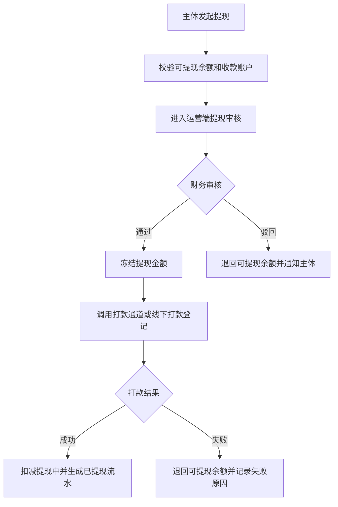

# 钱包、分账、提现与对账

> 页面级 PRD 草案。
> 目标：把三类订单的钱流、分账、钱包、提现、渠道佣金、对账异常统一起来，避免订单和财务各算各的。

---

## 1. 页面说明

| 项 | 内容 |
|---|---|
| 页面名称 | 钱包、分账、提现与对账 |
| 所属端 | 运营端 |
| 入口路径 | 财务管理 > 钱包账户 / 分账明细 / 提现审核 / 对账中心 |
| 使用角色 | 财务、平台管理员、运营主管、审核客服只读 |
| 核心目标 | 统一管理门店钱包、商家钱包、资方账户、渠道佣金、平台抽佣、提现和对账异常 |

财务管理不是订单详情里的附属信息，而是全系统的钱流总账。订单、账单、支付、分账、提现、退款、冲正、对账都必须落到这里。

---

## 2. 核心口径

1. 三类订单都要进入财务总账。
2. 门店订单默认平台抽佣 2%，可按商家或订单调整，抽佣后剩余进入门店/商家钱包。
3. 分红订单先按出资比例拆分给门店和资方，再从双方份额分别扣平台抽佣。
4. 平台订单默认资方或平台资金承接，门店不参与主要分账；如有协作服务费或渠道佣金，按配置生成。
5. 渠道佣金只统计分红订单和平台订单，门店自营订单默认不统计。
6. 当期账单未结清时，分红订单和平台订单建议不触发正式分账和渠道佣金。
7. 所有钱包变动都必须有来源单据：订单、账单、支付流水、退款、冲正、提现或人工调账审批。
8. 财务动作不得只改展示字段，必须生成流水和日志。

---

## 3. 财务菜单

```
财务管理
├─ 钱包账户
│  ├─ 商家/门店钱包
│  ├─ 资方账户
│  └─ 渠道账户
├─ 分账明细
├─ 提现审核
├─ 对账中心
├─ 退款与冲正
└─ 财务配置
```

V1 可以先不开放独立资方端，但运营端必须能维护资方账户和资方账单。

---

## 4. 账户模型

| 账户类型 | 账户主体 | 入账来源 | 出账来源 | 可提现 |
|---|---|---|---|---|
| 商家/门店钱包 | 入驻商家、门店 | 门店订单收益、分红订单门店份额、协作服务费 | 平台抽佣、接口计费、退款、提现 | 是 |
| 资方账户 | 资方 | 分红订单资方份额、平台订单收益 | 平台抽佣、退款、提现、冲正 | 是，V1 可由运营代提/审核 |
| 渠道账户 | 渠道推广主体 | 分红订单佣金、平台订单佣金 | 提现、冲正 | 是 |
| 平台收入账户 | 平台 | 抽佣、服务费、接口计费、公证/风控加价收入 | 退款、成本结算 | 否 |
| 平台成本账户 | 平台 | 内部记账 | 风控、合同、公证、支付通道成本 | 否 |

账户余额拆成：

| 余额字段 | 说明 |
|---|---|
| 待结算余额 | 已产生但未过结算条件或账期 |
| 可提现余额 | 满足结算条件，可申请提现 |
| 冻结余额 | 退款、争议、风控、租后异常冻结 |
| 提现中余额 | 已提交提现但未打款完成 |
| 已提现金额 | 历史累计提现成功 |

---

## 5. 钱包账户页

### 5.1 筛选条件

| 字段 | 类型 | 说明 |
|---|---|---|
| 账户主体 | 搜索 | 商家、门店、资方、渠道 |
| 账户类型 | 下拉 | 商家/门店、资方、渠道、平台收入 |
| 状态 | 下拉 | 正常、冻结、停用、提现限制 |
| 余额区间 | 金额区间 | 可提现、冻结、待结算 |
| 渠道来源 | 下拉 | 渠道账户筛选 |
| 最近变动时间 | 日期区间 | 按钱包流水时间 |

### 5.2 列表字段

| 字段 | 说明 |
|---|---|
| 账户主体 | 名称、类型、所属商家/渠道 |
| 收款账户状态 | 已实名、待授权、授权失败、需线下授权 |
| 待结算余额 | 还未满足结算条件 |
| 可提现余额 | 可申请提现 |
| 冻结余额 | 争议或异常冻结 |
| 提现中 | 提现申请处理中 |
| 累计收入 | 历史累计入账 |
| 累计提现 | 历史提现成功 |
| 最近变动 | 最近流水时间和摘要 |

### 5.3 账户详情

账户详情必须展示：

1. 基础资料：主体、收款账户、实名状态、授权状态。
2. 余额概览：待结算、可提现、冻结、提现中、累计收入。
3. 流水明细：订单、账单、支付、分账、抽佣、佣金、提现、退款、冲正。
4. 提现记录：申请、审核、打款、失败、驳回。
5. 冻结记录：冻结原因、关联订单、解除条件。
6. 操作日志：人工调账、冻结、解冻、提现审核、收款账户变更。

---

## 6. 分账规则

### 6.1 门店订单

| 步骤 | 规则 |
|---|---|
| 1 | 客户支付或账单结清 |
| 2 | 计算平台抽佣，默认 2%，可按商家/订单覆盖 |
| 3 | 扣除平台抽佣 |
| 4 | 剩余进入商家/门店钱包 |
| 5 | 生成平台抽佣流水、门店入账流水、账单结算记录 |

门店订单不默认产生渠道佣金，也不需要资方账户。

### 6.2 分红订单

| 步骤 | 规则 |
|---|---|
| 1 | 客户每期账单结清 |
| 2 | 按订单锁定的门店占比、资方占比拆分 |
| 3 | 从门店份额扣平台抽佣 |
| 4 | 从资方份额扣平台抽佣 |
| 5 | 扣后分别进入门店钱包和资方账户 |
| 6 | 如存在渠道来源，按渠道佣金规则生成渠道待结算 |

示例口径只用于理解：门店占比 20%，资方占比 80%，平台抽佣 2%，则双方各自份额都扣 2% 后入账。

### 6.3 平台订单

| 步骤 | 规则 |
|---|---|
| 1 | 客户每期账单结清 |
| 2 | 按资方/平台配置生成资方收益或平台收益 |
| 3 | 扣除平台抽佣或服务费 |
| 4 | 如配置门店协作收益，生成门店钱包入账 |
| 5 | 如存在渠道来源，生成渠道佣金 |

平台订单的门店收益不是默认出资收益，而是可配置的协作服务费或推广收益。

---

## 7. 分账明细页

| 字段 | 说明 |
|---|---|
| 分账单号 | 系统生成 |
| 订单号 | 关联订单 |
| 账单期数 | 第几期账单 |
| 订单类型 | 门店订单、分红订单、平台订单 |
| 支付流水 | 对应支付或部分支付流水 |
| 分账状态 | 待分账、已分账、分账失败、已冲正 |
| 门店入账 | 金额、抽佣、入账账户 |
| 资方入账 | 金额、抽佣、入账账户 |
| 渠道佣金 | 金额、规则版本、渠道账户 |
| 平台收入 | 抽佣、服务费、接口计费 |
| 失败原因 | 通道失败、账户异常、金额不平、人工冻结 |

分账失败必须进入财务异常队列，允许重试，但每次重试都要保留日志。

---

## 8. 提现审核

### 8.1 提现来源

| 来源 | 提交端 | 审核端 |
|---|---|---|
| 商家/门店提现 | 商家 PC 端、门店手机端老板账号 | 运营端财务 |
| 渠道提现 | 渠道 H5 | 运营端财务 |
| 资方提现 | V1 可运营代处理，后续资方端提交 | 运营端财务 |

员工账号不能发起提现，也不能查看钱包。

### 8.2 提现审核字段

| 字段 | 说明 |
|---|---|
| 提现单号 | 系统生成 |
| 账户主体 | 商家、门店、资方、渠道 |
| 提现金额 | 不得超过可提现余额 |
| 收款账户 | 脱敏展示，明文需权限 |
| 实名状态 | 必须已实名或有授权文件 |
| 关联流水 | 提现对应的可提现流水 |
| 审核状态 | 待审核、通过、驳回、打款中、成功、失败 |
| 审核意见 | 必填 |

### 8.3 提现流程



---

## 9. 对账中心

### 9.1 对账范围

| 对账对象 | 对账内容 |
|---|---|
| 支付通道 | 支付成功金额、退款金额、手续费、回调状态 |
| 代扣通道 | 代扣签约、扣款成功、扣款失败、解约 |
| 分账账单 | 分账金额、抽佣、入账账户、失败重试 |
| 钱包余额 | 期初、入账、出账、冻结、提现、期末 |
| 渠道佣金 | 佣金规则、订单归属、结算状态 |
| 资方账单 | 出资订单、回款、收益、提现 |

### 9.2 异常类型

| 异常 | 处理 |
|---|---|
| 支付成功但订单未更新 | 重试回调或人工关联 |
| 订单已更新但支付通道无流水 | 标记高风险，禁止分账 |
| 分账金额不等于账单实收 | 进入分账异常 |
| 钱包余额不平 | 财务复核，禁止提现 |
| 提现打款失败 | 退回余额，记录失败原因 |
| 渠道佣金重复 | 冻结重复佣金并等待复核 |

---

## 10. 权限与日志

| 动作 | 权限 | 日志 |
|---|---|---|
| 查看钱包 | 财务/管理员/主体本人 | 查看日志 |
| 查看收款账户明文 | 财务高权限 | 敏感查看日志 |
| 发起提现 | 主体老板或管理员 | 提现申请日志 |
| 审核提现 | 财务审核权限 | 审核日志 |
| 冻结/解冻余额 | 财务主管 | 冻结日志 |
| 冲正 | 财务主管 + 二次确认 | 冲正日志 |
| 人工调账 | 最高财务权限 | 调账审批和操作日志 |
| 导出对账单 | 财务导出权限 | 导出日志 |

---

## 11. 待确认

1. 资方账户 V1 是否完全由运营代管，还是给资方开放只读登录。
2. 门店订单平台抽佣是否有最低金额或封顶金额。
3. 渠道佣金是按账单结清结算，还是按订单首付成功先计待结算。
