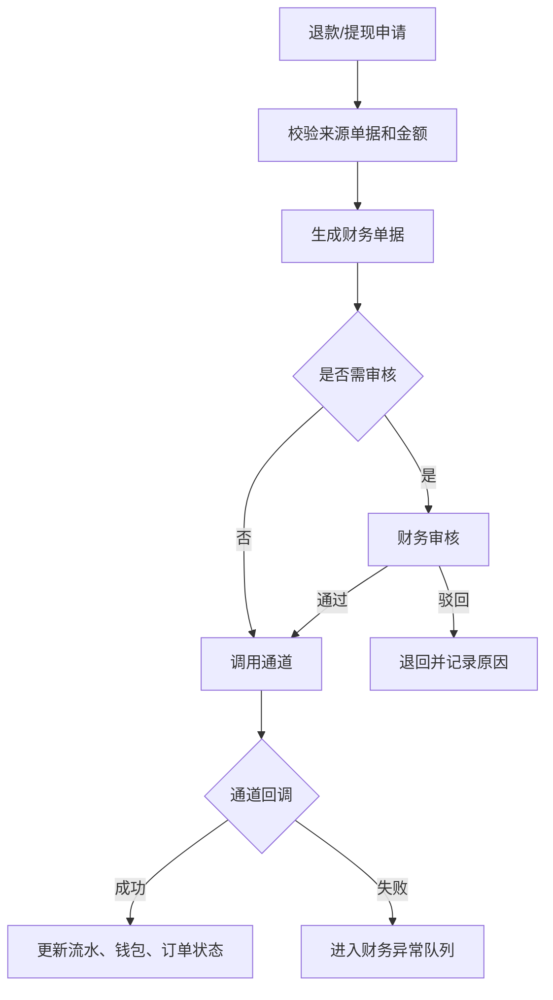

# 退款冲正与打款通道

> **⚠️ V0.2 Stage 6 同步修订(2026-05-27)v1.1**:
> - 同步展示用语:商家订单 / 联营订单 / 平台订单 / 履约中 / 逾期费用。
> - 底层字段、接口、枚举不变;资金账户、退款工单、五边对账以 Stage 6 核心财务文档为准。

> 页面级 PRD 草案。
> 目标：把退款、冲正、提现打款、通道回调、失败重试和财务审批独立成高风险财务流程。

---

## 1. 页面说明

| 项 | 内容 |
|---|---|
| 页面名称 | 退款冲正与打款通道 |
| 所属端 | 运营端 |
| 入口路径 | 财务管理 > 退款冲正 / 打款通道 / 异常队列 |
| 使用角色 | 财务、财务主管、平台管理员、运营主管 |
| 核心目标 | 统一处理客户退款、分账冲正、渠道/商家/资方提现打款、打款失败和人工复核 |

---

## 2. 核心口径

1. 退款、冲正、打款都必须有来源单据，不能手工改余额。
2. 原流水不允许删除，冲正只能生成反向流水。
3. 已分账后的退款，必须联动门店结算账户、资方账户、渠道佣金和平台收入。
4. 提现打款必须先冻结提现金额，成功后扣减，失败后退回可提现余额。
5. 打款通道支持线上通道和线下登记，线下登记也必须上传凭证并审核。
6. 所有财务高风险动作需要二次确认和操作日志。

---

## 3. 页面结构

```
财务管理
├─ 退款列表
├─ 冲正列表
├─ 打款列表
├─ 打款通道配置
└─ 财务异常队列
```

---

## 4. 退款列表

### 4.1 筛选条件

| 字段 | 类型 | 说明 |
|---|---|---|
| 退款单号 | 文本 | 精确查询 |
| 订单号 | 文本 | 关联订单 |
| 退款来源 | 下拉 | 客户、商家、平台、系统 |
| 订单类型 | 下拉 | 商家订单、联营订单、平台订单 |
| 退款状态 | 下拉 | 待审核、已驳回、退款中、成功、失败 |
| 支付通道 | 下拉 | 支付宝、微信、通联、信联、线下 |
| 申请时间 | 日期区间 | 按申请时间 |

### 4.2 退款字段

| 字段 | 说明 |
|---|---|
| 退款单号 | 系统生成 |
| 订单号 | 关联订单 |
| 原支付流水 | 原始支付单 |
| 可退金额 | 系统计算 |
| 退款金额 | 本次申请金额 |
| 退款明细 | 租金、押金、服务费、公证费、增值服务、部分支付 |
| 分账影响 | 是否需要冲正、冻结或扣回 |
| 审核状态 | 待审、通过、驳回 |
| 通道状态 | 调用中、成功、失败、待重试 |

### 4.3 已分账退款与 `refund_workflow`

已发生结算穿透或资方放款的订单,退款不再只靠单张退款单闭环,必须生成 `refund_workflow` 工单并锁定后续业务动作:

| 节点 | 要求 |
|---|---|
| 工单生成 | 记录订单、责任方、客户应退、门店应补、资方应还原金额 |
| 门店资金到位 | 余额足够则自动扣减 `refund_deduction`;余额不足则等待门店线下转账确认 |
| 客户退款 | 门店资金到位后再触发原路退款或人工退款 |
| 资方还原 | `funding_source != platform_self` 时同步资方台账和资方退款状态 |
| 工单完成 | 客户退款、资方还原、内部流水全部闭环后置为 completed |

`refund_workflow.status` 统一使用全局状态字典: `pending / merchant_paid / refunded_customer / refunded_funder / completed`。

---

## 5. 冲正列表

| 字段 | 说明 |
|---|---|
| 冲正单号 | 系统生成 |
| 来源类型 | 退款、人工调账、对账异常、佣金扣回 |
| 原流水 | 被冲正流水 |
| 冲正账户 | 门店结算账户、资方账户、渠道账户、平台收入账户 |
| 冲正金额 | 反向金额 |
| 余额处理 | 立即扣回、冻结后续入账、待人工处理 |
| 状态 | 待处理、已完成、失败 |
| 原因 | 必填 |

钱包余额不足时，不允许静默失败，应进入异常队列并冻结后续可提现余额。

---

## 6. 打款列表

| 字段 | 说明 |
|---|---|
| 打款单号 | 系统生成 |
| 提现单号 | 来源提现单 |
| 主体类型 | 商家、门店、资方、渠道 |
| 主体名称 | 脱敏展示 |
| 打款金额 | 本次打款金额 |
| 收款账户 | 脱敏展示，明文需权限 |
| 打款方式 | 通道打款、线下打款 |
| 打款状态 | 待打款、打款中、成功、失败 |
| 失败原因 | 通道返回或人工填写 |

---

## 7. 打款通道配置

| 字段 | 说明 |
|---|---|
| 通道名称 | 通联、信联、银行代付、线下登记等 |
| 支持主体 | 商家、门店、资方、渠道 |
| 单笔限额 | 最小和最大金额 |
| 日限额 | 每日打款上限 |
| 手续费承担方 | 平台、主体、按配置 |
| 是否启用 | 开关 |
| 回调地址 | 系统内部配置，不前端展示敏感参数 |
| 失败重试 | 自动重试次数和间隔 |

通道密钥、账号密码等敏感配置只能存在环境变量或后端安全配置，不进入 PRD、前端或普通日志。

---

## 8. 流程



---

## 9. 异常队列

| 异常 | 处理 |
|---|---|
| 退款通道失败 | 重试或人工处理 |
| 打款失败 | 退回提现金额或重试 |
| 冲正余额不足 | 冻结后续入账 |
| 支付成功但无订单 | 人工认领或原路退款 |
| 订单已关闭但分账未撤回 | 生成冲正任务 |
| 对账不平 | 禁止相关账户提现 |

---

## 10. 权限与日志

| 动作 | 权限 | 要求 |
|---|---|---|
| 查看退款 | 财务/客服 | 按角色显示金额 |
| 审核退款 | 财务 | 审核意见必填 |
| 发起冲正 | 财务主管 | 二次确认 |
| 审核打款 | 财务 | 二次确认 |
| 线下打款登记 | 财务主管 | 上传凭证 |
| 查看收款账户明文 | 财务高权限 | 敏感查看日志 |
| 重试通道 | 财务/技术支持 | 记录重试次数 |

---

## 11. 待确认

1. 线下打款是否 V1 就开放，还是只作为异常处理。
2. 退款审核是否按金额分级审批。
3. 通道手续费是否计入平台成本账户。

---

## 修订记录

| 日期 | 版本 | 说明 |
|---|---|---|
| 2026-05-27 | v1.1 | Stage 6 术语同步:商家/联营/平台订单 + 履约中/逾期费用;底层字段、接口、枚举不变。 |
