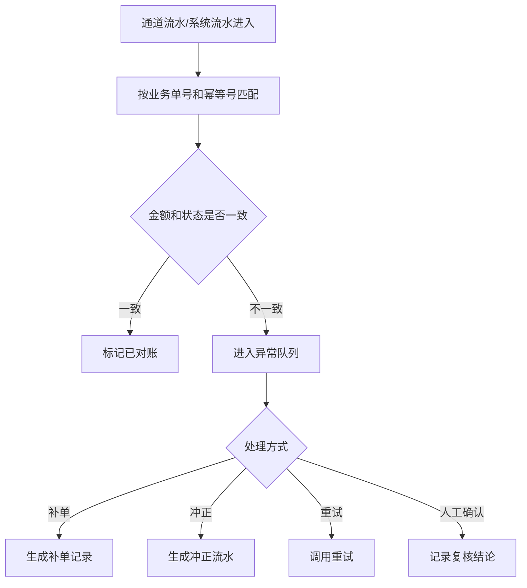

# 对账中心与通道流水

> **⚠️ V0.2 Stage 6 同步修订(2026-05-27)v1.1**:
> - 同步展示用语:商家订单 / 联营订单 / 平台订单 / 履约中 / 逾期费用。
> - 底层字段、接口、枚举不变;资金账户、退款工单、五边对账以 Stage 6 核心财务文档为准。

> 页面级 PRD 草案。
> 目标：把支付、退款、分账、提现、接口计费、通道回调和平台内部流水统一对账，避免订单显示成功但订单/账单、支付通道、门店结算账户、提现打款、内部资金来源台账五边不一致。

---

## 1. 页面说明

| 项 | 内容 |
|---|---|
| 页面名称 | 对账中心与通道流水 |
| 所属端 | 运营端 |
| 入口路径 | 财务管理 > 对账中心 / 通道流水 / 对账异常 |
| 使用角色 | 财务、财务主管、平台管理员、技术支持只读 |
| 核心目标 | 核对订单账单、支付通道、钱包分账、提现打款和接口计费 |
| 关联模块 | 订单详情、钱包分账、退款冲正、打款通道、操作日志 |

---

## 2. 核心口径

1. 对账中心是财务总账校验入口，不是简单流水列表。
2. 每笔钱必须能追溯到业务单据、通道流水、钱包流水和会计口径摘要。
3. 通道回调成功不等于业务最终成功，必须和订单、账单、钱包状态匹配。
4. 对账异常不能静默，只能进入异常队列、人工处理或自动重试。
5. 对账修复不能改原流水，只能生成补单、冲正、重试或人工确认记录。

---

## 3. 页面结构

```text
财务管理
├─ 对账概览
├─ 支付通道流水
├─ 退款通道流水
├─ 分账流水
├─ 提现打款流水
├─ 接口计费流水
└─ 对账异常队列
```

---

## 4. 对账概览

| 指标 | 说明 |
|---|---|
| 今日支付金额 | 通道成功且业务确认的金额 |
| 今日退款金额 | 退款成功金额 |
| 今日分账金额 | 已分账金额 |
| 今日提现金额 | 打款成功金额 |
| 待对账流水 | 尚未完成对账 |
| 异常流水 | 金额不平、状态冲突、缺单 |
| 待人工处理 | 需要财务确认的异常 |

概览支持按通道、订单类型、商家、资方、日期下钻。

---

## 5. 通用筛选

| 字段 | 类型 | 说明 |
|---|---|---|
| 业务单号 | 文本 | 订单、账单、提现、退款、分账单 |
| 通道流水号 | 文本 | 支付或打款通道返回 |
| 订单类型 | 下拉 | 商家订单、联营订单、平台订单 |
| 商家/门店 | 搜索 | 订单归属 |
| 资方 | 搜索 | 联营/平台订单 |
| 渠道 | 搜索 | 渠道佣金相关 |
| 通道 | 下拉 | 支付、退款、打款、线下 |
| 状态 | 下拉 | 成功、失败、处理中、异常、已冲正 |
| 金额区间 | 金额 | 支持范围 |
| 交易时间 | 日期范围 | 通道交易时间 |
| 对账时间 | 日期范围 | 系统对账时间 |

---

## 6. 支付通道流水

| 字段 | 说明 |
|---|---|
| 通道流水号 | 通道返回 |
| 订单号/账单号 | 关联业务 |
| 支付场景 | 首付、账单、部分支付、留购、补款 |
| 支付通道 | 支付宝、微信、通联、信联、线下等 |
| 通道金额 | 通道返回金额 |
| 业务金额 | 系统账单金额 |
| 通道状态 | 成功、失败、处理中 |
| 业务状态 | 已确认、待确认、冲突 |
| 分账状态 | 待分账、已分账、失败 |

异常示例：

1. 通道成功但业务无订单。
2. 通道成功但账单金额不一致。
3. 业务已支付但通道未成功。
4. 同一幂等号重复回调。

---

## 7. 分账与钱包对账

| 字段 | 说明 |
|---|---|
| 分账单号 | 系统生成 |
| 原支付流水 | 来源 |
| 订单类型 | 商家订单、联营订单、平台订单 |
| 门店入账 | 金额、抽佣、账户 |
| 资方入账 | 金额、抽佣、账户 |
| 渠道佣金 | 金额、账户 |
| 平台收入 | 抽佣、服务费、接口计费 |
| 钱包流水 | 是否已生成 |
| 状态 | 待分账、已分账、失败、已冲正 |

分账对账必须校验：来源支付金额 = 各方入账 + 平台收入 + 费用调整 + 未结算冻结。

### 7.1 五边对账口径(Stage 6)

| 对账边 | 核对内容 |
|---|---|
| 订单/账单 | 订单应收、实收、退款、撤单锁状态 |
| 支付通道 | 通联/信联/微信/支付宝等通道流水 |
| 门店结算账户 | `settlement_entry` 入账、扣减、提现冻结 |
| 提现打款 | 提现申请、代付流水、失败退回 |
| 内部资金来源台账 | 内部资金来源放款、资方应收台账、退款还原 |

任意一边金额或状态不一致,进入对账异常队列,不得直接改原流水。

---

## 8. 提现打款流水

| 字段 | 说明 |
|---|---|
| 打款单号 | 系统生成 |
| 提现单号 | 来源提现 |
| 主体类型 | 商家、门店、资方、渠道 |
| 打款通道 | 线上通道或线下登记 |
| 提现金额 | 申请金额 |
| 打款金额 | 实际打款 |
| 钱包扣减 | 是否已扣减 |
| 通道状态 | 成功、失败、处理中 |
| 对账状态 | 已平、异常、待人工 |

打款失败时必须退回提现中余额，不能让资金卡在中间状态。

---

## 9. 接口计费流水

| 字段 | 说明 |
|---|---|
| 计费单号 | 系统生成 |
| 商家/门店 | 调用主体 |
| 费用项 | 风控、大数据、合同、公证、短信等 |
| 关联订单 | 如有 |
| 调用次数 | 按次或套餐 |
| 应扣金额 | 规则计算 |
| 实扣金额 | 实际扣费 |
| 扣费状态 | 成功、失败、欠费、免计费 |
| 规则版本 | 调用时配置版本 |

接口计费失败可以限制后续调用，但不能影响已完成的客户必要流程。

---

## 10. 对账异常队列

| 异常类型 | 处理方式 |
|---|---|
| 缺业务单 | 人工认领、挂账、原路退回 |
| 金额不平 | 冻结分账，财务复核 |
| 状态冲突 | 以人工复核结论为准，保留回调日志 |
| 重复回调 | 幂等忽略并记录 |
| 分账失败 | 重试或冲正 |
| 提现失败 | 退回余额或重试 |
| 接口扣费失败 | 补扣、减免或限制调用 |

异常处理动作必须有处理意见、处理人、处理时间和关联修复流水。

---

## 11. 对账流程



---

## 12. 权限与导出

| 操作 | 权限 |
|---|---|
| 查看流水 | 财务、管理员 |
| 查看通道敏感字段 | 高权限，记录敏感查看日志 |
| 处理异常 | 财务主管 |
| 导出对账文件 | 财务权限 |
| 发起冲正 | 财务主管二次确认 |
| 重试通道 | 财务/技术支持 |

导出文件默认脱敏，不包含通道密钥、完整收款账号、完整证件号。

---

## 修订记录

| 日期 | 版本 | 说明 |
|---|---|---|
| 2026-05-27 | v1.1 | Stage 6 术语同步;对账口径升级为订单/账单、支付通道、门店结算账户、提现打款、内部资金来源台账五边对账。 |
