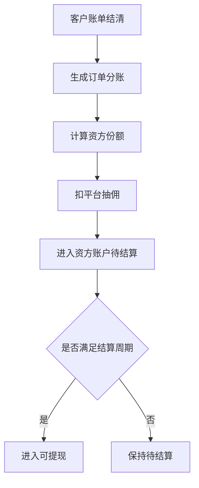

# 资方订单与账单

> 页面级 PRD 草案。
> 目标：在运营端集中查看资方被分配的订单、出资占用、回款、分账、提现和对账，后续可作为资方只读端的数据基础。

---

## 1. 页面说明

| 项 | 内容 |
|---|---|
| 页面名称 | 资方订单与账单 |
| 所属端 | 运营端 |
| 入口路径 | 资方管理 > 资方订单 / 资方账单 |
| 使用角色 | 运营主管、审核客服、财务、平台管理员 |
| 核心目标 | 查看资方参与的分红订单和平台订单，核对出资、回款、分账、逾期和提现 |

---

## 2. 资方订单列表

### 2.1 筛选条件

| 字段 | 类型 | 说明 |
|---|---|---|
| 资方 | 搜索下拉 | 按资方筛选 |
| 订单号 | 文本 | 精确查询 |
| 订单类型 | 下拉 | 分红订单、平台订单 |
| 商家/门店 | 搜索 | 订单来源 |
| 商品 | 文本 | 模糊搜索 |
| 客户 | 文本 | 权限内查询，列表脱敏 |
| 订单状态 | 下拉 | 待审核、待签约、待发货、在租、逾期、完成、关闭 |
| 分账状态 | 下拉 | 待分账、已分账、异常 |
| 下单时间 | 日期区间 | 默认最近 30 天 |

### 2.2 列表字段

| 字段 | 说明 |
|---|---|
| 订单号 | 关联订单 |
| 资方 | 当前分配资方 |
| 订单类型 | 分红订单、平台订单 |
| 商家/门店 | 订单来源 |
| 商品 | 商品、规格、租期 |
| 设备价/资金需求 | 分配时计算基础 |
| 出资比例 | 分红订单为 20%-80%，平台订单默认 100% |
| 出资金额 | 额度占用金额 |
| 已回款 | 已入资方账户金额 |
| 待回款 | 后续应回 |
| 逾期金额 | 逾期账单资方相关金额 |
| 分账状态 | 待分账、已分账、异常 |

---

## 3. 资方订单详情

| 标签 | 内容 |
|---|---|
| 订单摘要 | 订单、商家、客户脱敏、商品、租期 |
| 分配信息 | 分配人、分配时间、比例、出资金额、规则版本 |
| 合同支付 | 合同、支付、代扣、发货状态 |
| 账单回款 | 每期账单、实收、资方份额、抽佣、入账 |
| 逾期风险 | 逾期状态、租后跟进、催收状态 |
| 操作日志 | 分配、更换、分账、冲正、提现 |

---

## 4. 资方账单

| 字段 | 说明 |
|---|---|
| 账单号 | 系统生成 |
| 资方 | 账单主体 |
| 结算周期 | 日、周、月、手动 |
| 应回金额 | 周期内资方应收 |
| 已回金额 | 实际已回 |
| 平台抽佣 | 从资方份额扣除 |
| 可提现金额 | 满足结算条件 |
| 冻结金额 | 争议、退款、逾期风险 |
| 提现中 | 已申请提现 |
| 对账状态 | 未对账、已对账、异常 |

---

## 5. 账单生成规则

退款、冲正、逾期、客诉争议会影响资方账单的可提现金额。

---

## 6. 资方提现

V1 可由运营端代处理资方提现，后续开放资方端只读和申请。

| 字段 | 说明 |
|---|---|
| 可提现余额 | 资方账户满足结算条件金额 |
| 提现金额 | 本次提现 |
| 收款账户 | 脱敏展示 |
| 审核状态 | 待审、通过、驳回、打款中、成功、失败 |
| 打款流水 | 关联财务打款通道 |

---

## 7. 异常处理

| 异常 | 处理 |
|---|---|
| 分账失败 | 进入财务异常队列 |
| 订单退款 | 生成资方冲正或冻结 |
| 客户逾期 | 标记风险，不一定立即冻结 |
| 资方更换 | 合同/支付前允许，已分账后走冲正 |
| 对账不平 | 禁止提现，财务复核 |

---

## 8. 待确认

1. 资方账单结算周期是否按资方配置，还是全平台统一。
2. 客户逾期是否自动冻结资方未提现收益。
3. 资方只读端是否在 V1 开放。
