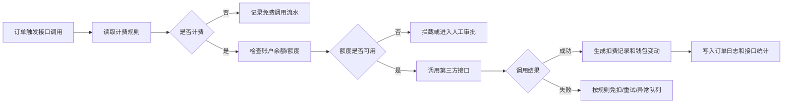

# 商家接口计费配置

> **Stage 6 术语同步(2026-05-27)**: 本文档已按 Stage 6 统一为商家、联营、平台订单、订单结算款、我的钱包、履约中、逾期费用、留购、保证金等展示术语；数据库字段、API 路径、英文枚举保持不变。

> 页面级 PRD 草案。
> 来源参考：无界租《商户接口收费功能操作文档》。
> 口径：无界租文档里的“商户”在满点系统中对应“商家/门店主体”。

---

## 1. 页面说明

| 项 | 内容 |
|---|---|
| 页面名称 | 商家接口计费配置 |
| 所属端 | 运营端 |
| 入口路径 | 配置管理 > 商家接口计费配置 |
| 使用角色 | 平台管理员、运营配置人员、财务、风控负责人 |
| 核心目标 | 配置商家调用平台风控、合同、公证、大数据等能力时的计费规则 |

---

## 2. 业务口径

1. 商家订单是商家自营订单，但可能消耗平台提供的大数据、风控、合同、公证、OCR、人脸识别等能力，所以要支持默认向商家计费。
2. 联营订单、平台订单由平台主控链路，是否向商家计费按订单类型和商家覆盖规则决定。
3. 计费不是人工记账，必须由接口调用流水驱动，自动生成扣费记录和钱包变动。
4. 平台人员代商家发起报告、合同、公证时，弹窗必须确认费用承担方。

---

## 3. 配置层级

| 层级 | 说明 |
|---|---|
| 平台默认 | 全平台统一接口计费基准 |
| 订单类型覆盖 | 商家订单、联营订单、平台订单分别设置 |
| 商家覆盖 | 单个商家可设置特殊计费规则、欠费额度、开关 |
| 接口项覆盖 | 某个接口可单独设置单价、计费主体、是否计费 |

继承优先级：

```text
接口项覆盖 > 商家覆盖 > 订单类型覆盖 > 平台默认
```

---

## 4. 计费项目

| 项目 | 触发节点 | 是否默认计费 | 说明 |
|---|---|---|---|
| 实名/人脸识别 | 客户提交资料、人工复核 | 可配置 | 按成功调用或实际计费回调扣费 |
| OCR 识别 | 身份证、营业执照、银行卡识别 | 可配置 | 可并入资料审核服务费，也可单独计费 |
| 大数据报告 | 下单审核、人工发起 | 默认可计费 | 商家订单建议默认向商家计费 |
| 风控报告 | 审核客服发起 | 默认可计费 | 需要记录报告编号和订单编号 |
| 合同签署 | 发起电子合同 | 可配置 | 可按合同发起次数或签署完成计费 |
| 公证服务 | 发起公证 | 可配置 | 费用可由客户、商家、平台承担 |
| 短信通知 | 验证码、催收、签署提醒 | 可配置 | 按发送成功条数计费 |
| 收款码/支付通道 | 部分支付、主动支付 | 可配置 | 通道手续费进入财务对账 |

---

## 5. 字段设计

| 字段 | 类型 | 说明 |
|---|---|---|
| 接口名称 | 文本 | 例如大数据报告、合同签署 |
| 接口编码 | 文本 | 系统内部唯一编码 |
| 适用订单类型 | 多选 | 商家订单、联营订单、平台订单 |
| 费用承担方 | 下拉 | 商家、平台、资方、客户、按订单类型 |
| 计费方式 | 下拉 | 按成功调用、按发起次数、按回调成功、手动确认 |
| 单价 | 金额 | 支持 0 元 |
| 扣费账户 | 下拉 | 商家钱包、平台成本账户、资方账户 |
| 可用余额阈值 | 金额 | 低于阈值限制调用或提醒 |
| 允许欠费额度 | 金额 | 新商家可配置负数额度，成熟商家可要求正余额 |
| 余额不足处理 | 下拉 | 禁止调用、进入审批、平台垫付、仅提醒 |
| 是否启用 | 开关 | 停用后不再产生新计费 |
| 生效时间 | 时间 | 支持立即生效或定时生效 |

---

## 6. 调用和扣费流程



---

## 7. 数据看板

| 维度 | 指标 |
|---|---|
| 商家 | 调用次数、成功次数、失败次数、扣费金额、欠费金额 |
| 接口 | 调用量、成功率、成本、收入、异常率 |
| 订单类型 | 商家订单、联营订单、平台订单消耗对比 |
| 操作人 | 人工发起次数、代商家发起次数、费用承担方 |
| 财务 | 已扣费、待扣费、退费、冲正、欠费 |

---

## 8. 权限与日志

1. 只有平台管理员、运营配置人员可修改计费配置。
2. 财务可查看计费明细、冲正和导出，不默认允许修改规则。
3. 商家端可查看自己的接口使用和扣费明细。
4. 每次接口调用、扣费、冲正、配置变更都必须进入操作日志。
