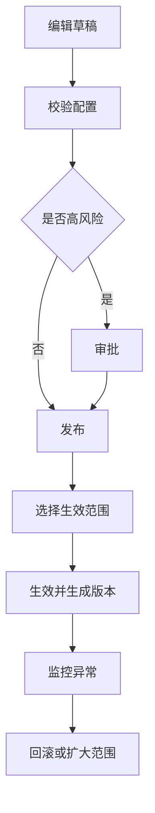

# 配置版本与灰度发布

> **Stage 6 术语同步(2026-05-27)**: 本文档已按 Stage 6 统一为商家、联营、平台订单、订单结算款、我的钱包、履约中、逾期费用、留购、保证金等展示术语；数据库字段、API 路径、英文枚举保持不变。

> 页面级 PRD 草案。
> 目标：让链路配置、租赁规则、财务规则、审核策略、商品同步规则可以版本化发布、灰度、回滚，并保留历史订单快照。

---

## 1. 页面说明

| 项 | 内容 |
|---|---|
| 页面名称 | 配置版本与灰度发布 |
| 所属端 | 运营端 |
| 入口路径 | 配置管理 > 配置版本 |
| 使用角色 | 平台管理员、运营配置、财务主管、技术支持 |
| 核心目标 | 管理配置草稿、发布、生效范围、灰度、回滚和历史快照 |

---

## 2. 版本对象

| 配置 | 示例 |
|---|---|
| 链路配置 | 支付、合同、公证、风控、发货 |
| 租赁模式 | 长租、短租、小时/天/周/月 |
| 审核策略 | 资料要求、风控动作、拒绝原因 |
| 财务规则 | 抽佣、结算账期、提现阈值、冻结 |
| 商品同步 | 办单助手同步字段、增值服务 |
| 渠道佣金 | 固定金额、比例、账期、冻结 |

---

## 3. 发布流程

---

## 4. 生效范围

| 范围 | 说明 |
|---|---|
| 全平台 | 新订单默认使用 |
| 订单类型 | 商家订单、联营订单、平台订单 |
| 指定商家 | 单商家覆盖 |
| 指定商品/规格 | 商品规则 |
| 指定地区 | 后续预留 |
| 灰度比例 | 按比例或白名单 |

历史订单使用创建时配置快照，除非明确执行迁移或重算。

---

## 5. 版本字段

| 字段 | 说明 |
|---|---|
| 版本号 | 系统生成 |
| 配置类型 | 链路、财务、审核等 |
| 生效范围 | 平台、订单类型、商家、商品 |
| 状态 | 草稿、待审批、已发布、已停用、已回滚 |
| 生效时间 | 立即或定时 |
| 发布人 | 操作账号 |
| 变更说明 | 必填 |
| 风险等级 | 普通、高风险 |
| 回滚版本 | 可选 |

---

## 6. 回滚规则

1. 回滚只影响新订单和新任务。
2. 已发起合同、支付、分账的订单不自动回滚。
3. 财务规则回滚需要财务主管确认。
4. 回滚必须记录原因和影响范围。

---

## 7. 校验

发布前必须校验：

| 校验 | 示例 |
|---|---|
| 必填项 | 合同模板、支付通道、分账账户 |
| 互斥项 | 同一订单类型不能同时选择冲突主控 |
| 金额规则 | 抽佣比例、提现阈值范围 |
| 权限 | 发布人是否有配置权限 |
| 影响范围 | 是否影响已启用商家或商品 |
