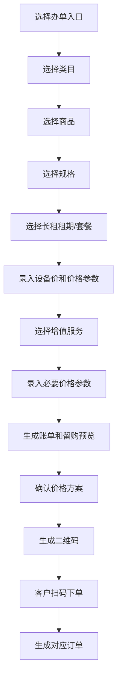

# 办单助手三入口

> **Stage 6 术语同步(2026-05-27)**: 本文档已按 Stage 6 统一为商家、联营、平台订单、订单结算款、我的钱包、履约中、逾期费用、留购、保证金等展示术语；数据库字段、API 路径、英文枚举保持不变。

> 页面级 PRD 草案。
> 目的：定义门店手机端办单助手如何分别创建 `商家订单 / 联营订单 / 平台订单`，并把商品、价格方案、二维码、客户下单和后台审核串起来。

---

## 1. 页面说明

| 项 | 内容 |
|---|---|
| 页面名称 | 办单助手三入口 |
| 所属端 | 门店手机端 |
| 入口路径 | 门店管理首页 > 办单助手 |
| 使用角色 | 门店老板、门店管理员、店员账号 |
| 核心目标 | 门店快速选择商品、生成价格方案和二维码，客户扫码后形成对应类型订单 |

---

## 2. 核心口径

1. 办单助手拆成三个入口：`商家订单`、`联营订单`、`平台订单`。
2. 三个入口可以共用 UI 框架，但数据来源、审核主体、资金归属、可用配置不同。
3. 办单助手价格计算和展示逻辑参考 `joezjyan-bot/calculator` 中 `phone-rent` 的逻辑，不沿用旧系统计算器逻辑。
4. 商品是否出现在办单助手，由商品/规格维度的 `是否同步办单助手` 控制。
5. 生成二维码时必须生成价格方案快照，客户扫码下单后按快照锁价。
6. 店员账号只能办单和查看自己的待办，不允许查看钱包、分账、配置、全量订单。
7. 当前办单助手第一版只展示长租办单字段；短租不在本版继续细化，后续由完整短租需求包嫁接进来。
8. 车辆、手机等实物交付在发货/交付节点填写设备识别码，并按配置上传人机/人车合照。

---

## 3. 入口选择页

```text
办单助手
├─ 商家订单
│  └─ 门店自营，门店自己审核，使用商家自己的商品/费率/增值服务
├─ 联营订单
│  └─ 门店出设备或部分资金，选择配资比例，提交平台审核
└─ 平台订单
   └─ 门店完全送单给平台，平台审核并匹配资方
```

| 入口 | 展示名 | 使用对象 | 审核主体 | 配置来源 |
|---|---|---|---|---|
| 商家订单 | 商家订单 | 商家自营订单 | 门店/商家 | 商家 PC 端配置 |
| 联营订单 | 联营订单 | 门店参与出资或出设备 | 运营平台 | 运营端配置 |
| 平台订单 | 平台订单 | 门店送单给平台 | 运营平台 | 运营端配置 |

入口展示规则：

1. 未入驻审核通过的门店不可进入办单助手。
2. 未完成必要签章授权或收款账户配置时，可进入但生成二维码前提示补齐。
3. 店员账号只展示老板分配给它的入口。
4. 如果某入口在链路配置中心被停用，则该入口隐藏或置灰。

---

## 4. 共用办单流程

三个入口的共用流程：



共用字段：

| 字段 | 说明 |
|---|---|
| 商品类目 | 手机、电动车、平板、手表等 |
| 商品 | 只展示当前入口可用且已同步的商品 |
| 规格 | 全新、二手、成色、容量、颜色、是否含电池等 |
| 租赁模式 | 当前固定展示长租；短租后续独立需求包接入 |
| 租期 | 长租期数/套餐，按配置展示可选项 |
| 设备价 | 三个入口都必须填写或从商品指导价带入，是保证金、账单、留购和分账计算基础 |
| 首期实付 | 计算生成，可按权限调整 |
| 后续账单 | 计算生成 |
| 保证金/补充保证金 | 按配置生成 |
| 增值服务 | 按入口、商品、规格展示 |
| 公证费/服务费/设备管理费 | 可作为增值服务或链路费用 |
| 留购价 | 按计算逻辑生成 |
| 二维码有效期 | 默认可配置，过期后需重新生成 |

---

## 5. 商家订单入口

### 5.1 数据来源

| 数据 | 来源 |
|---|---|
| 商品 | 商家自己的已审核商品 |
| 规格 | 商家商品规格 |
| 费率/价格 | 商家 PC 端商家订单配置 |
| 增值服务 | 商家配置的商家订单增值服务 |
| 合同模板 | 商家自有模板或平台提供模板，按配置 |
| 审核规则 | 商家/门店自审 |

### 5.2 流程

1. 门店选择 `商家订单`。
2. 选择商家商品和规格。
3. 选择长租租期/套餐。
4. 录入或确认设备价。
5. 选择商家增值服务。
6. 生成账单、保证金、服务费、留购价。
7. 生成二维码。
8. 客户扫码下单。
9. 订单进入商家订单列表，由门店/商家自审。
10. 审核通过后按商家配置走合同、支付、发货/交付。

### 5.3 规则

1. 商家订单不进入运营端常规审核，但运营端可监管、查看、客诉处理、租后查看和抽佣。
2. 商家订单默认不分配资方。
3. 平台抽佣默认 2%，可按商家覆盖。
4. 商家订单产生的钱包入账、提现、对账仍需进入平台财务总账。

---

## 6. 联营订单入口

### 6.1 数据来源

| 数据 | 来源 |
|---|---|
| 商品 | 运营端同步到联营订单助手的商品 |
| 规格 | 运营端允许联营订单使用的规格 |
| 费率/价格 | 运营端联营订单配置 |
| 增值服务 | 运营端联营订单增值服务 |
| 资方规则 | 运营端资方管理 |
| 审核规则 | 运营端审核 |

### 6.2 联营专属字段

| 字段 | 类型 | 说明 |
|---|---|---|
| 需求配资比例 | 下拉 | 20%-80%，具体档位由运营端配置 |
| 门店出资额 | 计算 | 设备价 - 资方出资额 |
| 资方出资额 | 计算 | 设备价 × 需求配资比例 |
| 门店分账占比 | 计算 | 通常等于门店出资占比 |
| 资方分账占比 | 计算 | 通常等于资方出资占比 |
| 分账/收益预览 | 只读 | 仅门店老板、商家后台和运营后台可见，不展示给客户 |

说明：`设备价` 是三个办单入口的共用必填字段，不是联营订单专属字段。联营订单只是在设备价基础上额外选择需求配资比例，并生成资方出资、门店出资和后台收益测算。

示例口径：

```text
设备价 5000
需求配资比例 80%
资方出资 4000
门店等效出资 1000
客户每笔回款按门店 20%、资方 80% 分账
再从双方份额分别扣平台抽佣
```

### 6.3 流程

1. 门店选择 `联营订单`。
2. 选择商品、规格、长租租期、增值服务。
3. 录入或确认设备价。
4. 选择需求配资比例。
5. 系统生成门店出资、资方出资、分账/收益预览；该预览只给门店老板/商家后台/运营后台看。
6. 生成二维码。
7. 客户扫码下单并提交资料。
8. 订单进入运营端待审核。
9. 审核客服分配资方。
10. 后续由运营端发起合同、授权、公证、支付、发货/交付。

### 6.4 规则

1. 联营订单必须由运营平台审核。
2. 联营订单生成二维码时不直接确定资方，资方由运营端审核时分配。
3. 联营订单可允许门店联系客服，但最终审核、资方、财务主控在运营端。
4. 客户支付后按出资比例分账，门店钱包和资方账户都要有明细。

---

## 7. 平台订单入口

### 7.1 数据来源

| 数据 | 来源 |
|---|---|
| 商品 | 运营端同步到平台订单助手的商品 |
| 规格 | 运营端允许平台订单使用的规格 |
| 费率/价格 | 运营端平台订单配置 |
| 增值服务 | 运营端平台订单增值服务 |
| 资方规则 | 运营端资方管理 |
| 审核规则 | 运营端审核 |

### 7.2 流程

1. 门店选择 `平台订单`。
2. 选择商品、规格、长租租期、增值服务。
3. 录入或确认设备价。
4. 系统生成价格方案、账单和留购预览。
5. 生成二维码。
6. 客户扫码下单并提交资料。
7. 订单进入运营端待审核。
8. 审核客服分配资方或执行方。
9. 商家 PC 端和门店手机端可查看订单进度。
10. 待审核状态可点击 `联系客服`，调起 IM 并推送订单信息。

### 7.3 规则

1. 平台订单由运营端主控审核、资方、合同、支付和财务。
2. 门店不出资，不参与主要分账；如有协作收益或渠道佣金，按平台配置生成。
3. 平台订单默认也可以是门店发货，但发货主体可配置为门店、商家、平台或资方。
4. 页面、接口和二维码来源统一使用 `平台订单`。

---

## 8. 价格方案和二维码

办单助手每次生成二维码前，必须先生成价格方案。

| 字段 | 说明 |
|---|---|
| price_plan_id | 价格方案编号 |
| order_type | 商家订单、联营订单、平台订单 |
| merchant_id / store_id | 商家和门店 |
| operator_id | 办单员工 |
| product_id / sku_id | 商品和规格 |
| lease_mode | 当前固定为长租；短租后续独立需求包接入 |
| lease_quantity | 长租期数/套餐 |
| service_items | 增值服务快照 |
| bill_preview | 账单预览 |
| buyout_price | 留购价 |
| deposit | 保证金/补充保证金 |
| funding_ratio | 联营订单配资比例，客户侧不展示 |
| delivery_owner | 默认发货主体 |
| expires_at | 二维码过期时间 |

规则：

1. 客户扫码后按 `price_plan_id` 锁定价格，不读取当前商品实时价格。
2. 二维码过期后不可下单，需要重新生成。
3. 价格方案生成后，门店修改商品或规格不影响旧二维码。
4. 客服审核改价时，必须生成新价格版本，并保留旧版本。
5. 二维码页面不展示后台敏感字段，如成本价、资方内部规则。

---

## 9. 短租接入边界和长租设备识别码

短租需要设备库存支持，但当前第一版办单助手不展示短租入口、短租计费单位和短租下单字段。本版不继续拆短租需求，后续由公司内部完成完整短租需求包后再嫁接进来。后端只需要保留可接入位置：商品/规格扩展、设备库存扩展、订单子类型扩展、账单计费扩展、履约证据扩展。

当前长租版本只在发货/交付节点填写设备识别码：

| 场景 | 规则 |
|---|---|
| 生成二维码前 | 不要求选择具体设备，只生成价格方案快照 |
| 客户下单后 | 审核、合同、支付等流程按订单推进 |
| 发货/交付 | 填写 IMEI/SN/VIN 等设备识别码，上传交付材料 |
| 短租库存 | 后续短租需求包单独处理预约、锁定、取还和回库 |
| 归还验收 | 长租记录归还照片和订单状态；短租后续再联动设备库存状态 |

交付照片：

1. 设备类订单可要求上传设备实拍。
2. 电动车/车辆类可要求上传人车合照。
3. 手机/数码类可要求上传人机合照。
4. 是否必填按类目、订单类型、商家配置控制。

---

## 10. 客户扫码后的状态

| 订单类型 | 客户扫码后 | 后台状态 |
|---|---|---|
| 商家订单 | 填写资料、确认订单 | 门店待审核 / 待支付 / 待签约，按商家配置 |
| 联营订单 | 填写资料、确认订单 | 运营待审核 / 待分配资方 |
| 平台订单 | 填写资料、确认订单 | 运营待审核 / 待分配资方或执行方 |

客户侧待办可能包括：

1. 填写资料。
2. 实名和扫脸。
3. 绑定银行卡或支付。
4. 等待审核。
5. 签署合同。
6. 办理公证。
7. 确认收货或签收。

---

## 11. 员工账号权限

| 能力 | 老板/管理员 | 店员 |
|---|---|---|
| 使用办单助手 | 是 | 是，按授权入口 |
| 查看自己办的订单 | 是 | 是 |
| 查看门店全部订单 | 是 | 可配置 |
| 查看钱包 | 是 | 否 |
| 修改商品/费率 | 是 | 否 |
| 配置增值服务 | 是 | 否 |
| 审核商家订单 | 是 | 可配置 |
| 关闭订单/退款 | 高权限 | 否 |

规则：

1. 店员账号用手机号和密码登录。
2. 店员账号默认只用于办单、扫码、查看待办。
3. 店员生成二维码、修改价格参数、上传交付材料都要记录操作日志。

---

## 12. 异常和失败态

| 场景 | 处理 |
|---|---|
| 商品未同步 | 助手不展示该商品 |
| 规格未同步 | 助手不展示该规格 |
| 价格配置缺失 | 禁止生成二维码，提示补配置 |
| 增值服务冲突 | 禁止生成或提示移除冲突项 |
| 二维码过期 | 客户扫码提示已过期，门店重新生成 |
| 客户中途退出 | 保留草稿或释放价格方案，按有效期配置 |
| 设备识别码缺失 | 发货/交付阶段禁止提交，提示填写 IMEI/SN/VIN |
| 联营比例未配置 | 联营订单入口置灰或提示联系平台 |
| 平台链路停用 | 对应入口隐藏或置灰 |

---

## 13. 日志

必须记录：

1. 办单入口。
2. 商品、规格、租期、增值服务选择。
3. 价格方案生成。
4. 二维码生成、过期、扫码。
5. 客户下单成功或失败。
6. 店员账号操作。
7. 设备绑定、释放和归还验收。
8. 交付材料上传。
9. 价格修改和重新生成。
