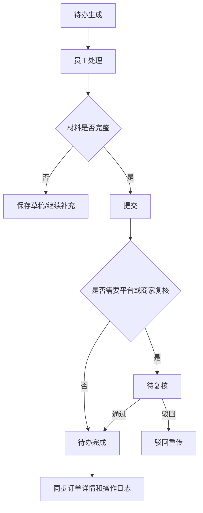

# 门店待办与交付材料

> **Stage 6 术语同步(2026-05-27)**: 本文档已按 Stage 6 统一为商家、联营、平台订单、订单结算款、我的钱包、履约中、逾期费用、留购、保证金等展示术语；数据库字段、API 路径、英文枚举保持不变。

> 页面级 PRD 草案。
> 目标：把门店手机端办单后的交付、补资料、发货、签收、归还验收做成待办队列，承接订单详情和照片证据链。

---

## 1. 页面说明

| 项 | 内容 |
|---|---|
| 页面名称 | 门店待办与交付材料 |
| 所属端 | 门店手机端 |
| 入口路径 | 门店首页 > 待办任务；办单助手 > 订单待办 |
| 使用角色 | 门店老板、门店管理员、店长、店员 |
| 核心目标 | 让门店现场人员只处理自己需要做的任务：交付材料、发货、补资料协助、签收、归还验收 |

员工账号进入门店端后，默认只看办单助手和待办任务，不看钱包、分账、提现和经营大盘。

---

## 2. 待办来源

| 来源 | 说明 |
|---|---|
| 办单助手生成订单 | 客户扫码后形成订单，产生资料、审核、交付相关待办 |
| 运营端审核要求 | 平台订单、联营订单要求补资料、上传交付材料 |
| 商家自审 | 商家订单由商家/门店审核后生成交付待办 |
| 发货配置 | 默认门店发货时，审核/签约/支付完成后门店出现待发货 |
| 交付证据链 | 配置要求人机合照、人车合照、设备照片、签收照片 |
| 租后/归还 | 客户归还、门店验收、设备入库 |

---

## 3. 待办列表

### 3.1 顶部分类

| 分类 | 说明 |
|---|---|
| 全部 | 当前账号可见待办 |
| 待补资料 | 客户或平台要求门店协助补充资料 |
| 待交付材料 | 需要上传设备、配件、人机/人车合照 |
| 待发货 | 需要门店发货或当面交付 |
| 待签收 | 已交付，等待客户确认或协助签收 |
| 待归还验收 | 客户归还后门店验收 |
| 异常 | 资料被驳回、照片不合格、设备码异常 |

### 3.2 筛选条件

| 字段 | 类型 | 说明 |
|---|---|---|
| 订单号 | 文本 | 精确查询 |
| 订单类型 | 下拉 | 商家订单、联营订单、平台订单 |
| 商品名称 | 文本 | 模糊查询 |
| 客户姓名 | 文本 | 权限内查询，列表脱敏 |
| 手机号 | 文本 | 支持后四位 |
| 办单员工 | 下拉 | 老板/店长可筛选 |
| 待办状态 | 下拉 | 待处理、处理中、已完成、已驳回 |
| 时间 | 日期区间 | 下单、审核通过、待办生成时间 |

### 3.3 列表字段

| 字段 | 说明 |
|---|---|
| 待办类型 | 补资料、交付材料、发货、签收、归还验收 |
| 订单摘要 | 订单号、订单类型、商品、规格、租期 |
| 客户摘要 | 姓名脱敏、手机号脱敏、地址摘要 |
| 当前节点 | 待上传、待审核、被驳回、待客户确认 |
| 要求材料 | 设备照片、人机合照、人车合照、门店现场照、归还照片 |
| 截止时间 | 如有 SLA 或超时提醒 |
| 负责人 | 办单员工或被分配员工 |
| 操作 | 去处理、查看订单、联系客服 |

---

## 4. 交付材料上传

| 字段 | 类型 | 说明 |
|---|---|---|
| 订单号 | 只读 | 当前订单 |
| 设备码 | 扫码/输入 | 短租或车辆类必填 |
| 设备照片 | 图片 | 设备正面、侧面、配件 |
| 序列号/车架号 | 图片/文本 | 按类目配置 |
| 人机合照 | 图片 | 人和设备合照 |
| 人车合照 | 图片 | 车辆类常用 |
| 门店现场照 | 图片 | 可选或按风控要求必填 |
| 监管锁状态 | 图片/选择 | 如绑定监管锁，展示锁状态 |
| 备注 | 文本 | 异常说明 |

上传完成后进入运营端订单详情的交付证据链。

---

## 5. 发货与签收

| 场景 | 门店操作 |
|---|---|
| 当面交付 | 上传交付材料，确认交付，客户侧待确认收货 |
| 门店配送 | 填写配送方式、预计送达、上传交付照 |
| 快递发货 | 填写物流公司和单号，后续可接顺丰线上发货 |
| 平台/内部协同方发货 | 门店端只读进度，不出现发货操作 |
| 客户签收异常 | 上传补充照片和说明，进入异常待办 |

默认经营模式是门店发货，但要保留平台、内部协同方、顺丰等线上发货接口。

---

## 6. 归还验收

| 字段 | 说明 |
|---|---|
| 归还方式 | 到店归还、快递归还、上门回收 |
| 设备码 | 扫码确认唯一设备 |
| 外观照片 | 归还时设备外观 |
| 配件照片 | 电池、充电器、钥匙等 |
| 损坏点 | 图片和文字说明 |
| 验收结果 | 正常、轻微损坏、严重损坏、缺件 |
| 入库状态 | 已入库、待维修、争议中 |
| 费用处理 | 是否产生赔付、扣费或人工复核 |

短租设备归还验收通过后，设备回到库存可租状态。

---

## 7. 权限规则

| 权限 | 老板/管理员 | 店长 | 店员 |
|---|---|---|---|
| 查看全部待办 | 是 | 本门店 | 按授权 |
| 处理本人待办 | 是 | 是 | 是 |
| 分配待办 | 是 | 可配置 | 否 |
| 上传交付材料 | 是 | 是 | 是 |
| 确认发货 | 是 | 可配置 | 可配置 |
| 归还验收 | 是 | 可配置 | 可配置 |
| 查看钱包 | 是 | 否 | 否 |
| 查看分账 | 是 | 否 | 否 |

后端接口必须按门店、角色、订单归属校验，不能只靠前端隐藏入口。

---

## 8. 状态流转

---

## 9. 通知与提醒

| 场景 | 提醒 |
|---|---|
| 新待办 | 门店端消息、短信或站内通知 |
| 待办超时 | 提醒店员和老板 |
| 材料驳回 | 展示驳回原因和重传入口 |
| 客户签收完成 | 通知商家订单进入在租 |
| 归还验收异常 | 通知老板/商家管理员 |

---

## 10. 与其他模块联动

| 模块 | 联动内容 |
|---|---|
| 办单助手 | 办单员工、订单类型、价格方案、设备码 |
| 订单详情 | 待办状态、交付证据、签收、归还验收 |
| 交付照片证据 | 图片类型、上传人、客户确认状态 |
| 库存设备 | 设备码、出库、归还入库、维修状态 |
| 监管锁 | 锁状态照片、锁机/解锁结果 |
| 员工账号 | 待办可见范围和处理权限 |
| 操作日志 | 上传、驳回、确认、分配全记录 |

---

## 11. 待确认

1. 人机合照、人车合照是否按类目强制，还是按订单类型和风控等级强制。
2. 门店端确认发货后是否必须客户确认收货才起租，还是按发货时间起租。
3. 归还验收是否需要客户侧确认验收结果。
