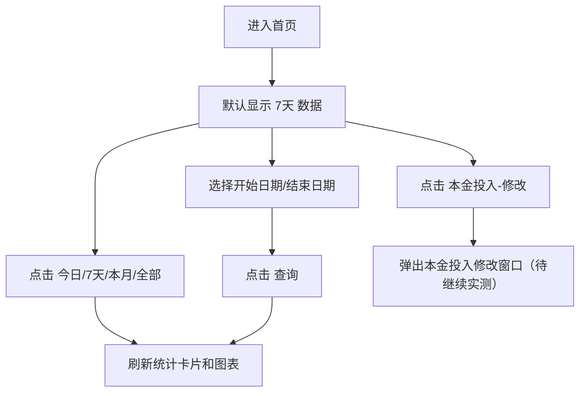

# 首页

> 来源：旧后台 `运营管理平台 / 首页` 实测梳理。本文为 V0.2 页面级 PRD 草稿，后续按 Hudson 确认继续调整。

## 页面定位

首页用于运营人员快速查看平台销售额、采购价、本金投入、待收款、已收款与逾期分布。

页面采用后台三段式布局：

- 左侧：模块菜单。
- 顶部：折叠菜单按钮、登录账号、退出登录。
- 内容区：面包屑、页面标题、统计卡片、筛选条件和图表。

## 页面入口

- 菜单路径：`首页`
- 路由：`/Home`
- 页面标题：`首页`

## UI 结构

```text
首页
├─ 销售额及成本
│  ├─ 快捷时间：今日 / 7天 / 本月 / 全部
│  ├─ 日期区间：开始日期 ~ 结束日期
│  ├─ 查询
│  ├─ 总销售金额(元)
│  ├─ 采购价(元)
│  └─ 本金投入(元) + 修改
├─ 待收款统计
│  └─ 总待收款金额(元)
├─ 销售额及成本图表
│  ├─ 总销售金额
│  ├─ 总收押金
│  ├─ 待退还押金
│  ├─ 已收款金额
│  ├─ 总收意外保障费
│  └─ 环形图
└─ 已收款统计
   ├─ 逾期T+10金额
   ├─ 逾期T+20金额
   └─ 逾期T+30金额
```

## 字段说明

| 区域 | 字段 | 类型 | 说明 |
|---|---|---|---|
| 销售额及成本 | 今日/7天/本月/全部 | 单选按钮组 | 快捷筛选统计周期，当前旧系统默认选中 `7天` |
| 销售额及成本 | 开始日期/结束日期 | 日期区间 | 选择自定义统计时间 |
| 销售额及成本 | 总销售金额(元) | 金额展示 | 当前筛选周期内订单总销售金额 |
| 销售额及成本 | 采购价(元) | 金额展示 | 当前筛选周期内商品采购成本 |
| 销售额及成本 | 本金投入(元) | 金额展示 | 平台人工维护或系统汇总的本金投入 |
| 待收款统计 | 总待收款金额(元) | 金额展示 | 当前应收未收总额 |
| 已收款统计 | 逾期T+10/T+20/T+30金额 | 金额展示 | 按逾期时间分层统计 |

## 按钮与交互



| 按钮 | 点击结果 | 成功状态 | 失败/异常建议 |
|---|---|---|---|
| 查询 | 按时间条件刷新统计数据 | 卡片和图表更新 | 接口失败提示 `查询失败，请稍后重试` |
| 修改 | 修改本金投入 | 弹出编辑弹窗 | 无权限时提示 `无权限修改本金投入` |

## 新系统补充建议

- 首页金额统计必须有明确口径说明，鼠标悬停 `?` 时展示统计范围。
- 日期区间不能超过系统允许范围，超限提示 `查询时间跨度过大`。
- 所有金额统一保留 2 位小数。
- 查询中按钮进入 loading，避免重复点击。
- 图表为空时显示空状态，不应显示残留旧数据。

## 待确认问题

1. `本金投入` 是人工维护字段，还是根据采购/打款自动计算？
2. `总销售金额` 是否包含已关闭订单？
3. `待收款金额` 是否包含逾期账单、未到期账单、押金、买断尾款？
