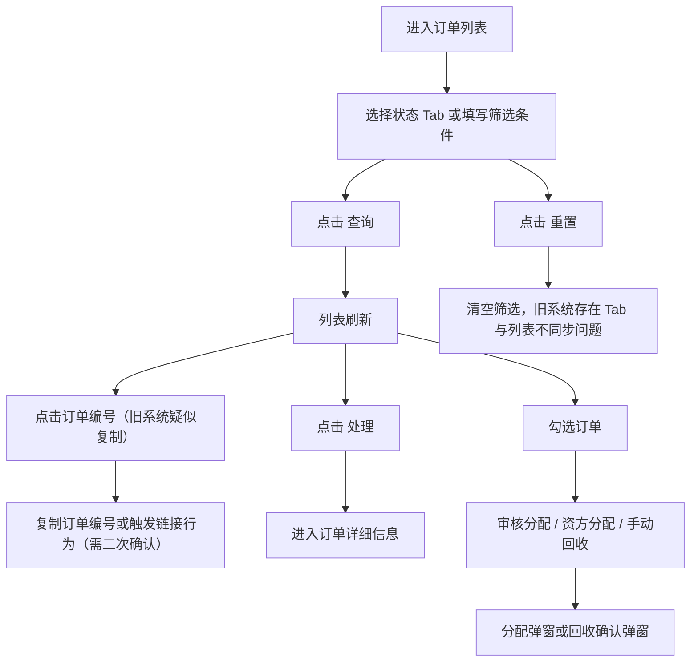
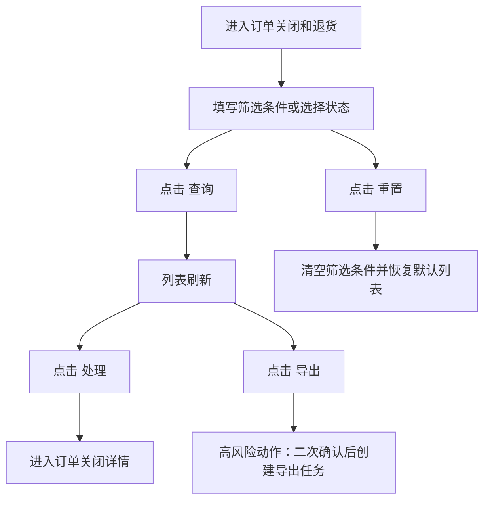
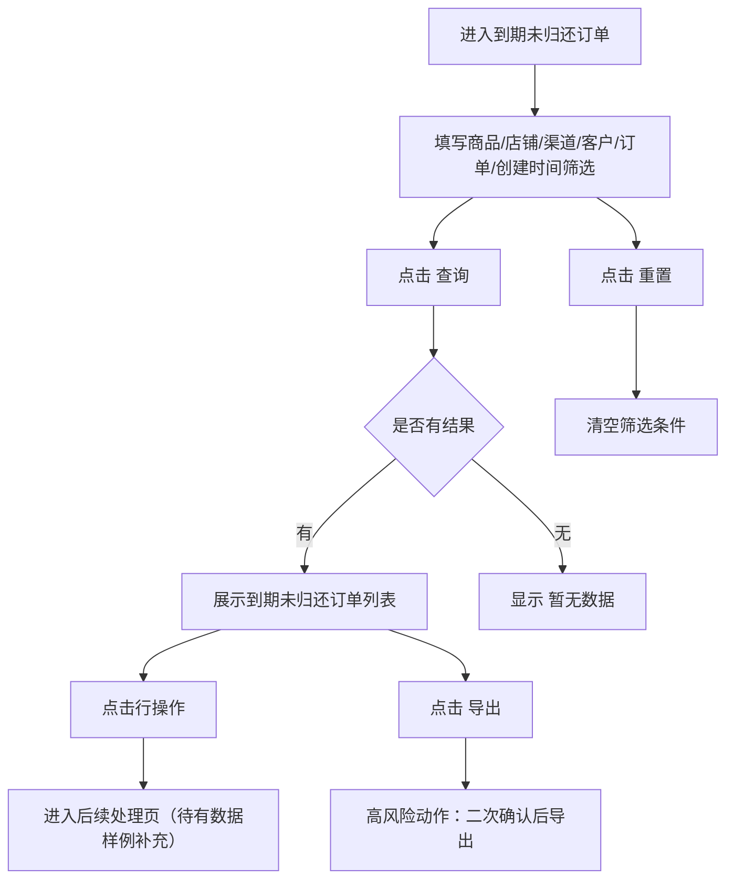
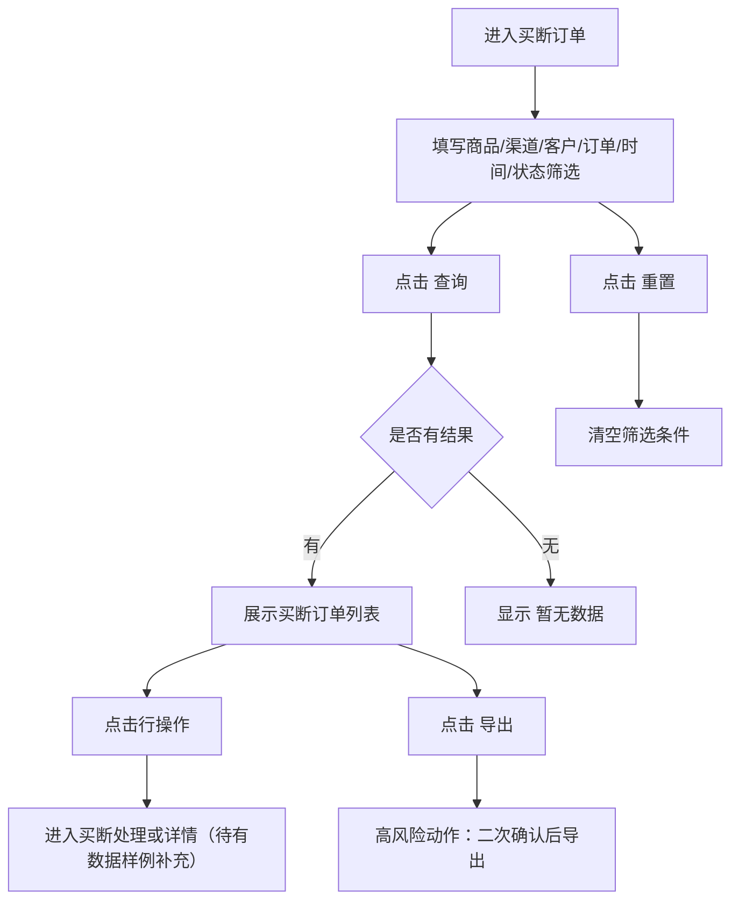
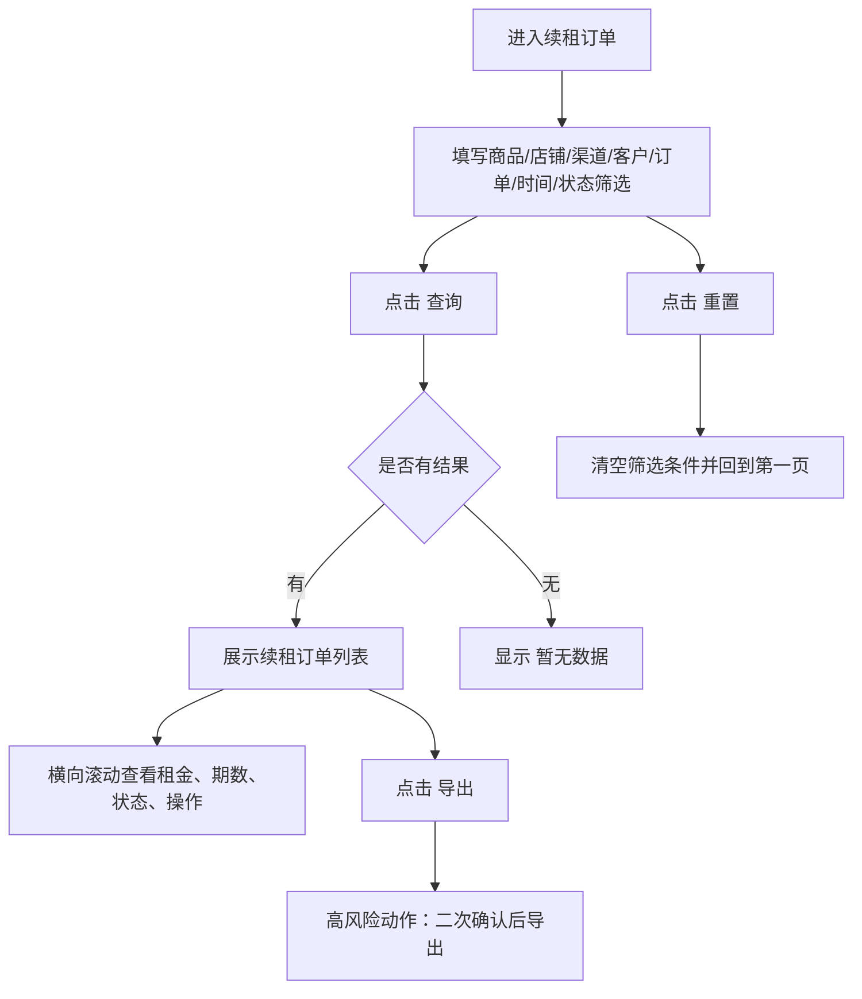
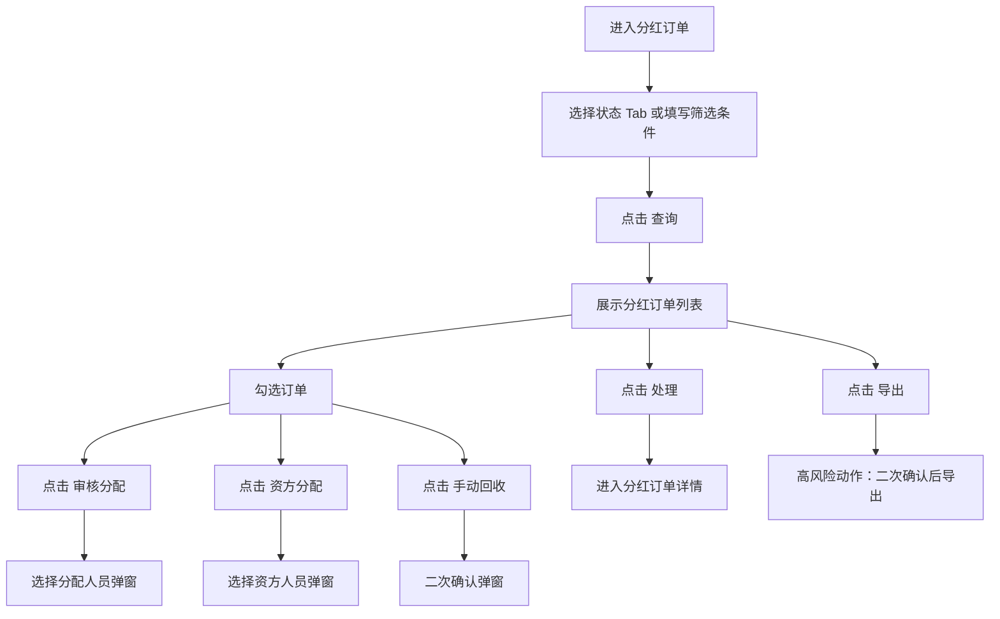
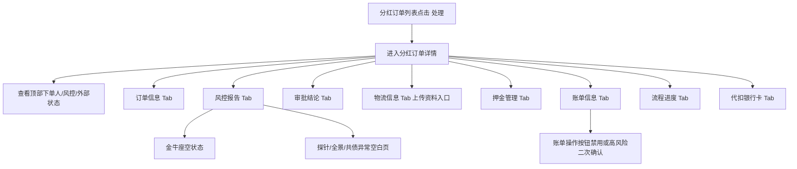
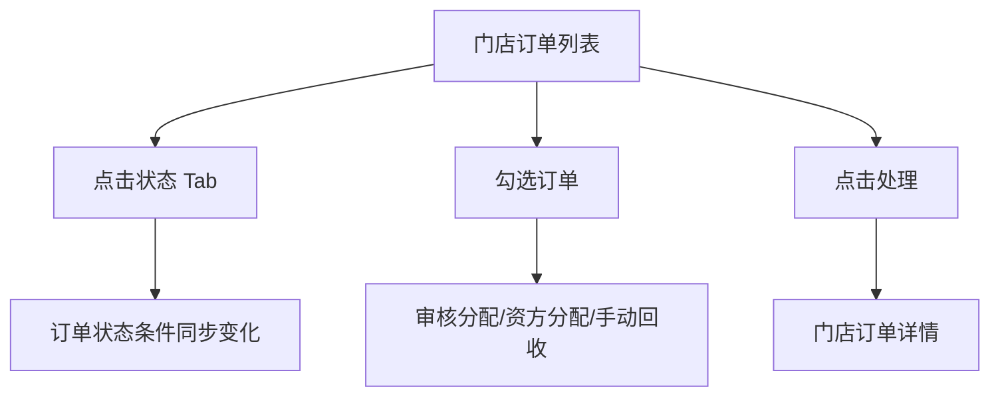
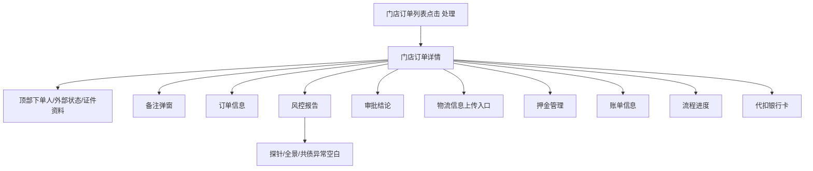
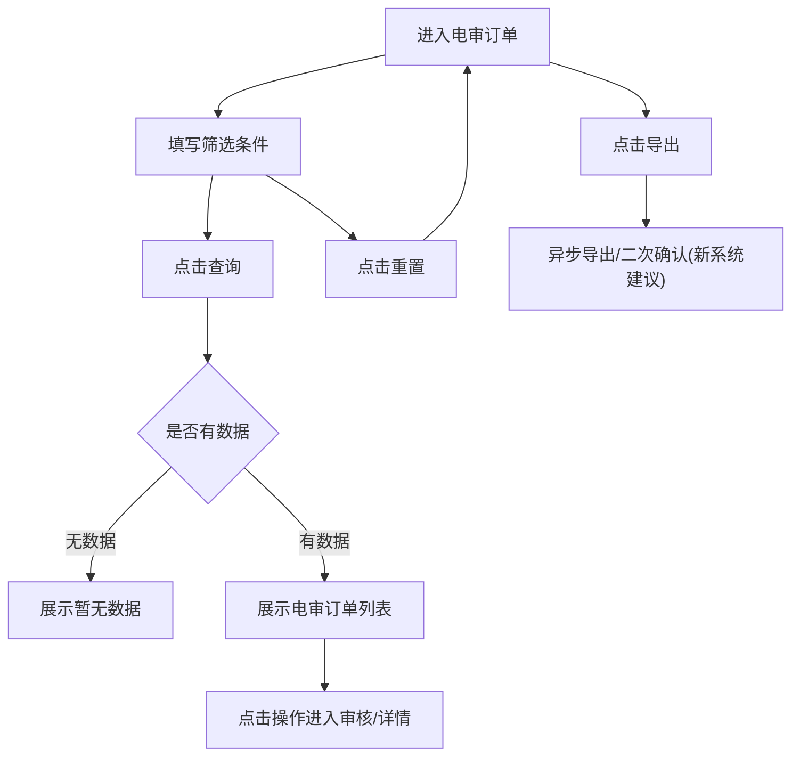

# 订单管理

> 来源：旧后台 `运营管理平台 / 订单管理` 实测梳理。本文记录菜单结构和订单列表/详情实测结果。所有按钮、Tab、下拉、分页、横向/纵向滚动必须逐项记录；高风险动作只记录入口，不点击最终确认。

## 菜单结构

```text
订单管理
├─ 订单列表
├─ 订单关闭和退货
├─ 到期未归还订单
├─ 买断订单
├─ 续租订单
├─ 分红订单
├─ 门店订单
└─ 电审订单
```

## 页面：订单列表

- 菜单路径：`订单管理 / 订单列表`
- 路由：`/Order/HomePage`
- 页面标题：`订单列表`

### 查询区字段

| 字段 | 控件 | 旧系统占位/选项 | 新系统建议 |
|---|---|---|---|
| 商品名称 | 下拉选择 | `请选择` | 支持商品名称/商品编号搜索 |
| 店铺名称 | 下拉选择 | `请选择` | 支持店铺简称模糊搜索 |
| 渠道来源 | 下拉选择 | `渠道来源` | 支持渠道枚举 |
| 下单人姓名 | 输入框 | `请输入下单人姓名` | 支持精确/模糊查询 |
| 下单人手机号 | 输入框 | `请输入下单人手机号` | 手机号格式校验，可支持后四位 |
| 收货人手机号 | 输入框 | `请输入收货人手机号` | 手机号格式校验，可支持后四位 |
| 下单人身份证号 | 输入框 | `请输入下单人身份证号` | 身份证格式校验，敏感字段需权限 |
| 订单编号 | 输入框 | `请输入订单编号` | 精确查询 |
| 创建时间 | 日期区间 | `开始日期 ~ 结束日期` | 限制跨度，默认近 30 天 |
| 完结时间 | 日期区间 | `开始日期 ~ 结束日期` | 仅对完结/关闭订单有效 |
| 订单状态 | 下拉选择 | 见下方枚举 | 与状态 Tab 联动 |
| 是否认领 | 下拉选择 | `是否认领` | 建议枚举：全部/已认领/未认领 |
| 近期还款 | 下拉选择 | `请选择近期还款天数` | 建议枚举：3/7/15/30 天 |
| 资方信息 | 下拉选择 | `请选择资方` | 支持资方名称搜索 |
| 认领人 | 下拉选择 | `请选择` | 支持员工/管理员搜索 |

### 订单状态枚举

旧系统下拉实测选项：

- 待支付
- 待审批
- 待发货
- 待确认收货
- 租用中
- 待结算
- 结算待支付
- 订单完成
- 交易关闭

### 状态 Tab

| Tab | 旧系统示例数量 |
|---|---:|
| 全部 | 42 |
| 待支付 | 0 |
| 待审批 | 0 |
| 待发货 | 1 |
| 待确认收货 | 0 |
| 租用中 | 1 |
| 待结算 | 0 |
| 结算待支付 | 0 |
| 订单完成 | 1 |
| 交易关闭 | 39 |

#### 状态 Tab 点击反馈

| Tab | 点击结果 | 动态字段/特殊表现 |
|---|---|---|
| 全部 | 展示全部订单，共 42 条 | 查询区为基础字段 |
| 待支付 | 空表，显示 `暂无数据` | 无新增字段 |
| 待审批 | 空表，显示 `暂无数据` | 查询区新增 `风控结论` |
| 待发货 | 展示 1 条待发货订单 | 行操作为 `处理` |
| 待确认收货 | 空表，显示 `暂无数据` | 无新增字段 |
| 租用中 | 展示 1 条租用中订单 | 含起租时间、审核人 |
| 待结算 | 空表，显示 `暂无数据` | 无新增字段 |
| 结算待支付 | 空表，显示 `暂无数据` | 无新增字段 |
| 订单完成 | 展示 1 条订单完成订单 | 含起租时间、完结时间、审核人 |
| 交易关闭 | 展示 39 条交易关闭订单 | 查询区新增 `关单类型`，订单状态展示关闭原因 |

`风控结论` 下拉实测选项：

- 系统通过
- 建议审核

`关单类型` 下拉实测选项：

- 未支付用户主动申请
- 支付失败
- 超时支付
- 已支付用户主动申请
- 风控拒绝
- 商家关闭(客户要求)
- 商家风控关闭订单
- 商家超时发货
- 平台关闭订单
- 平台风控关闭订单

> 注意：`关单类型` 下拉面板自身有滚动条，底部选项需要下拉后才能看到。

### 操作按钮

| 按钮 | 作用 | 安全/权限规则建议 |
|---|---|---|
| 查询 | 按筛选条件刷新列表 | 查询中 loading，失败提示 |
| 重置 | 清空筛选条件并恢复默认列表 | 不改变 Tab 状态，或明确同时重置 Tab |
| 审核分配 | 对勾选订单批量分配审核人 | 未勾选提示 `请选择订单` |
| 资方分配 | 对勾选订单批量分配资方 | 仅允许可分配状态 |
| 手动回收 | 对勾选订单做回收处理 | 高风险操作，需确认弹窗 |
| 导出 | 导出当前筛选结果 | 大数据量需异步导出 |
| 处理 | 进入订单详情页 | 跳转详情，不直接改状态 |

#### 操作按钮点击反馈

| 操作 | 前置状态 | 点击反馈 |
|---|---|---|
| 查询 | 空筛选、当前 Tab 为交易关闭 | 列表刷新，无明显弹窗；仍按当前筛选/Tab 展示 |
| 重置 | 当前 Tab 为交易关闭，存在动态字段 `关单类型` | 清空筛选字段，移除 `关单类型`；但 Tab 仍高亮 `交易关闭(39)`，表格却回到全部 42 条，出现状态与数据不一致 |
| 审核分配 | 未勾选订单 | Toast：`错误提示 请选择要分配的订单！` |
| 资方分配 | 未勾选订单 | Toast：`错误提示 请选择要分配的订单！` |
| 手动回收 | 未勾选订单 | Toast：`错误提示 请选择要回收的订单！` |
| 审核分配 | 勾选待发货订单 | 打开 `选择分配人员` 弹窗 |
| 资方分配 | 勾选待发货订单 | 打开 `选择资方人员` 弹窗 |
| 手动回收 | 勾选待发货订单 | 打开 `批量手动回收订单` 确认弹窗 |
| 导出 | 任意列表 | 未点击，可能下载敏感订单数据；新系统应做权限、二次确认和导出任务记录 |
| 处理 | 点击任一行右侧操作 | 跳转订单详情页 `/Order/HomePage/Details?id={订单编号}` |

### 批量操作弹窗

#### 审核分配

触发：勾选订单后点击 `审核分配`。

```text
弹窗标题：选择分配人员
字段：认领人，下拉框，placeholder：请选择
按钮：取消 / 确定
```

实测：点击 `认领人` 下拉后显示 `暂无数据`。未点击 `确定`。

#### 资方分配

触发：勾选订单后点击 `资方分配`。

```text
弹窗标题：选择资方人员
字段：认领资方，下拉框，placeholder：请选择
按钮：取消 / 确定
```

实测：点击 `认领资方` 下拉后显示 `暂无数据`。未点击 `确定`。

#### 手动回收

触发：勾选订单后点击 `手动回收`。

```text
弹窗标题：批量手动回收订单
文案：确认要批量手动回收的订单？
按钮：取消 / 确定
```

实测：仅打开并取消，未点击 `确定`。新系统需明确回收含义：回收到待分配池、解除认领人、还是回滚审核/资方分配。

### 列表字段

| 字段 | 说明 |
|---|---|
| 复选框 | 支持批量操作 |
| 序号 | 当前列表序号 |
| 下单时间 | 订单创建时间 |
| 订单编号 | 点击旧系统会复制订单号；右侧 `处理` 进入详情 |
| 下单人姓名 | 姓名 + 年龄展示 |
| 下单人手机号 | 脱敏展示 |
| 订单状态 | 状态 + 关闭原因，如 `交易关闭（商家风控关闭订单）` |
| 是否芝麻免押 | 如：风控免押、业务单代扣、芝麻免押 |
| 租赁方式 | 如：随租随还、租完归还 |
| 商品名称 | 商品标题 |
| 已支付期数/总期数 | 如 `0/12` |
| 总租金 | 订单总租金 |
| 已付租金 | 已支付租金 |
| 起租时间 | 租赁起始时间 |
| 完结时间 | 订单完结/关闭时间 |
| 审核人 | 审核处理人 |
| 认领人 | 催收/跟进认领人 |
| 下单平台 | 微信/支付宝 |
| 渠道来源 | 渠道名称 |
| 操作 | `处理` |

### 滚动、分页与隐藏内容

| 项目 | 实测结果 | 新系统要求 |
|---|---|---|
| 页面纵向滚动 | 订单列表可向下滚动到底，当前数据 42 条全部在同一页内展示 | 长列表建议固定表头、保留分页或虚拟滚动 |
| 左侧菜单滚动 | 页面下滑后左侧可见更多模块，如租后、营销、佣金、财务、渠道、配置、信审、数据、权限 | 菜单需支持独立滚动，当前激活菜单保持可见 |
| 表格横向滚动 | 表格存在横向滚动条，右侧隐藏列包括起租时间、完结时间、审核人、认领人、下单平台、渠道来源；`操作` 列固定在右侧 | 新系统表格必须固定关键列：订单编号、订单状态、操作 |
| 分页 | 底部显示 `共1页 共42条`、当前第 `1` 页；点击上一页/下一页无变化 | 禁用态应明显，避免用户误以为点击失败 |
| Tab 左右箭头 | Tab 容器有左右箭头图标，当前状态 Tab 全部可见 | 当状态超过可视区域时必须支持左右滚动 |

### 已发现交互问题

1. `重置` 后 Tab 仍高亮 `交易关闭(39)`，但表格数据回到全部 42 条，Tab 状态与列表数据不一致。新系统建议重置时同步切回 `全部`，或保持当前 Tab 并只清空非状态条件。
2. `订单编号` 在旧系统中表现为可点击链接，历史观察像复制入口；右侧 `处理` 才是稳定详情入口。新系统建议订单编号只负责进入详情，复制用独立图标。
3. `导出` 缺少可见二次确认入口。新系统建议导出前展示导出范围、条数、敏感字段脱敏说明，并记录导出日志。

### 页面流程



## 页面：订单详细信息

- 来源：订单列表点击 `处理`
- 路由：`/Order/HomePage/Details?id={订单编号}`

### 顶部信息区：下单人信息

| 字段 | 说明 |
|---|---|
| 姓名 |
| 手机号 |
| 身份证号 |
| 年龄 |
| 性别 |
| 下单时间 |
| 在途订单数 |
| 完结订单数 |
| 订单状态 |
| 人脸认证 |
| 渠道来源 |
| 所在位置 |
| 蚁盾分 | 可点击 `去查询` |
| 蚂蚁链 | 未上链/已上链 |
| 蚂蚁保险 | 未投保/已投保 |
| 周期扣款 | 未签约/已签约 |
| 身份证照片 | 正面/反面/人脸照片 |
| 地图位置 | 地图组件展示 |

### 详情 Tab

```text
订单信息
风控报告
审批结论
物流信息
押金管理
账单信息
流程进度
代扣银行卡
```

### 订单信息 Tab

| 区域 | 字段/内容 |
|---|---|
| 基础 | 订单号、用户租赁协议 |
| 收货人信息 | 收货人姓名、手机号、地址、用户备注、到期购买 |
| 碎屏险 | 碎屏险、已支付碎屏险、未支付碎屏险 |
| 合同区块链存证 | 合同编号、电子数据存证证明下载、签署技术报告下载 |
| 商家信息 | 商家名称、商家电话 |
| 商品信息 | 商品图片、商品名称、商品编号、规格颜色、数量、买断规则 |
| 租用信息 | 租用天数、起租时间、归还时间 |
| 增值服务 | 增值服务ID、名称、价格 |
| 商家备注 | 备注人姓名、备注时间、备注内容 |
| 平台备注 | 备注人姓名、备注时间、备注内容 |

### 风控报告 Tab

旧系统二级 Tab：

- 金牛座
- 探针
- 全景
- 共债

当前实测样例未看到具体报告内容，需继续补充各二级 Tab 字段。

### 审批结论 Tab

旧系统展示审批结果摘要：

| 字段 | 说明 |
|---|---|
| 审批时间 | 当前订单最近一次审批时间 |
| 审批人 | 审批操作人 |
| 审批结果 | 如审批通过、审批拒绝 |
| 小记 | 审批备注/小记内容 |

### 物流信息 Tab

旧系统展示两个上传资料区：

| 区域 | 控件 | 说明 |
|---|---|---|
| 线下签收证明资料 | 上传图片 | 用于上传线下签收证明 |
| 邮寄单据 | 上传图片 | 用于上传邮寄凭证 |

上传属于写入动作，页面审计只记录入口，不做真实上传。新系统应限制文件格式、大小、数量，并记录上传人、上传时间、来源订单。

### 押金管理 Tab

| 区域 | 字段/按钮 |
|---|---|
| 芝麻额度冻结 | 冻结额度、信用减免、实际冻结 |
| 押金支付 | 押金总额、已支付押金、待支付押金、操作 |
| 修改记录 | 押金总额、修改时间、修改人 |

旧系统空记录时显示 `暂无数据`。新系统建议补充押金状态、扣减原因、退还状态和强制退款权限。

### 账单信息 Tab

| 区域 | 字段/按钮 |
|---|---|
| 账单信息 | 总租金、运费、平台优惠、店铺优惠 |
| 分期信息 | 当前期数、租金、状态、支付时间、账单到期时间、操作 |
| 每期操作 | 发起代扣、代客支付、押金抵扣 |
| 交易快照 | 销售价、发货成本价 |

实测样例中订单为关闭状态，每期操作按钮均禁用。新系统需按账单状态控制按钮可用性：

- 未到期：通常不允许发起代扣，除非支持提前还款。
- 待支付/逾期：允许发起代扣、代客支付。
- 已支付/已取消：按钮禁用。
- 押金抵扣：仅在可抵扣场景、押金余额足够、权限满足时可用。

### 流程进度 Tab

旧系统为纵向时间轴，节点包括：

| 节点 | 说明 |
|---|---|
| 买家下单 | 订单创建 |
| 买家支付 | 首付/支付节点 |
| 商家审核 | 商家完成审核 |
| 完成收货前视频核验 | 视频核验节点 |
| 商家风控关单 | 商家风控关闭订单 |
| 订单完结 | 订单进入最终状态 |

新系统建议时间轴统一展示：节点名称、操作人、操作时间、备注、来源系统，并支持复制节点信息。

### 代扣银行卡 Tab

| 控件/字段 | 说明 |
|---|---|
| 查询 | 刷新当前订单关联的代扣银行卡列表 |
| 开户行 | 银行名称 |
| 银行卡 | 银行卡号，默认脱敏 |
| 银行类型 | 借记卡/信用卡等 |
| 创建时间 | 绑定时间 |

旧系统当前样例为空数据。新系统需增加无卡提示、银行卡脱敏、查看明文权限控制，以及代扣签约状态。

### 备注弹窗

触发：点击详情页 `备注` 按钮。

```text
弹窗标题：备注
字段：备注内容（必填，文本域，placeholder：请输入）
按钮：取消 / 确定
```

建议规则：

- 备注内容必填，空提交提示 `请输入备注内容`。
- 保存成功后刷新 `平台备注` 或 `商家备注` 列表。
- 备注属于审计信息，保存后不允许物理删除。

## 页面：订单关闭和退货

- 菜单路径：`订单管理 / 订单关闭和退货`
- 路由：`/Order/Close`
- 页面标题：`订单关闭和退货`
- 页面定位：集中处理待关闭、待退款、退货相关订单，承接 V0.1 中 `退款 / 退单流程` 的运营处理入口。

### 查询区字段

| 字段 | 控件 | 旧系统占位/选项 | 新系统建议 |
|---|---|---|---|
| 商品名称 | 输入框 | `请输入商品名称` | 支持商品名称/商品编号模糊查询 |
| 下单人姓名 | 输入框 | `请输入下单人姓名` | 支持精确/模糊查询 |
| 下单人手机号 | 输入框 | `请输入下单人手机号` | 手机号格式校验，可支持后四位 |
| 订单编号 | 输入框 | `请输入订单编号` | 精确查询 |
| 店铺名称 | 输入框 | `请输入店铺名称` | 支持店铺名称/简称搜索 |
| 渠道来源 | 下拉选择 | 实测选项：`某渠道/某店铺` | 渠道枚举应来自渠道管理 |
| 提交时间 | 日期区间 | `开始日期 ~ 结束日期` | 支持快捷最近 7/30 天，限制最大跨度 |
| 订单状态 | 下拉选择 | `待发货`、`交易关闭` | 与退单/关闭状态枚举统一 |

`提交时间` 日期区间点击后显示双月日历，包含开始日期、结束日期、上月/下月切换控件。

### 操作按钮点击反馈

| 操作 | 点击反馈 | 新系统要求 |
|---|---|---|
| 查询 | 空筛选点击后列表刷新，无弹窗 | 展示 loading；失败时明确提示 |
| 重置 | 空筛选点击后字段保持空值，无明显变化 | 有筛选值时必须清空并恢复默认列表 |
| 导出 | 未点击，可能导出敏感订单/退款数据 | 必须二次确认，展示导出范围、条数、脱敏规则，并记录导出日志 |
| 处理 | 点击行右侧 `处理` 后打开订单关闭详情页 | 进入详情，不直接改变订单状态 |

### 列表字段

| 字段 | 说明 |
|---|---|
| 订单编号 | 订单唯一编号 |
| 店铺名称 | 下单所属店铺 |
| 渠道来源 | 订单来源渠道 |
| 商品名称 | 商品标题 |
| 已支付期数/总期数 | 如 `0/12` |
| 已付押金 | 当前已支付押金 |
| 已付租金 | 当前已支付租金 |
| 应退金额 | 系统计算的应退金额 |
| 退款状态 | 如 `未退款` |
| 订单状态 | 如 `待发货`、`交易关闭` |
| 操作 | `处理` |

### 滚动、分页与隐藏内容

| 项目 | 实测结果 | 新系统要求 |
|---|---|---|
| 页面纵向滚动 | 当前样例 1 条数据，页面可向下滚到底部 | 长列表仍需固定表头和分页 |
| 表格横向滚动 | 当前列宽基本可见，仍需按宽屏/窄屏复测 | 金额列、退款状态、操作列应固定或保持可见 |
| 分页 | 底部显示 `共1页 共1条`，上一页/下一页点击无变化 | 禁用态应明显 |
| 左侧菜单滚动 | 下滑后左侧菜单露出更多模块 | 菜单应支持独立滚动，当前菜单高亮保持可见 |

### 页面流程



## 页面：订单关闭详情

- 来源：`订单关闭和退货` 列表点击 `处理`
- 路由：`/Order/Close/Details?id={订单编号}`
- 页面标题：`订单详细信息`

### 顶部信息区

顶部结构与普通订单详情一致，展示下单人身份、认证、渠道、位置、蚁盾分、蚂蚁链、蚂蚁保险、周期扣款、身份证照片、地图位置等信息。

敏感字段包括手机号、身份证号、身份证照片、地图位置。新系统默认脱敏展示，只有授权角色可查看明文，并记录查看日志。

### 顶部操作按钮与弹窗

| 按钮 | 点击反馈 | 弹窗/字段 | 风险边界 |
|---|---|---|---|
| 关闭订单 | 打开 `关闭订单` 弹窗 | `小记` 输入框，placeholder：`请输入关单原因`；按钮：取消/确定 | `确定` 会改变订单状态，未点击 |
| 修改收货信息 | 打开 `修改收货信息` 弹窗 | 必填：所在城市、收货人姓名、收货人手机号、详细地址；按钮：取消/确定 | `确定` 会修改收货信息，未点击 |
| 修改押金 | 打开 `修改押金` 弹窗 | 显示当前押金总额；必填：修改金额(元)；按钮：取消/确定 | `确定` 会改资金字段，未点击 |
| 备注 | 打开 `备注` 弹窗 | 必填：备注内容；按钮：取消/确定 | `确定` 会写入备注，未点击 |
| 转单 | 打开 `转单` 弹窗 | 必填：转单商家、备注；商家下拉实测有 `某渠道/某店铺`；按钮：取消/确定 | `确定` 会改变订单归属，未点击 |

实测问题：`修改收货信息` 弹窗内点击 `所在城市` 级联选择器后，旧系统清空当前城市值，并在城市字段下方出现 `请输入备注` 的错误提示，提示文案与字段不匹配。新系统应改为 `请选择所在城市`，且打开选择器不应清空原值。

### 订单信息 Tab

订单关闭详情的 `订单信息` Tab 与普通详情结构一致，应展示订单基础信息、收货信息、碎屏险、合同区块链存证、商家信息、商品信息、租用信息、增值服务、商家备注、平台备注。

### 风控报告 Tab

旧系统二级 Tab：`金牛座`、`探针`、`全景`、`共债`。

实测问题：在订单关闭详情中点击 `风控报告 -> 探针` 后，旧系统页面出现空白，需要刷新浏览器才能恢复。新系统应避免单个风控子报告异常导致整个详情页白屏，建议每个子报告独立 loading/error 状态，并保留返回其他 Tab 的能力。

### 审批结论 Tab

| 字段 | 说明 |
|---|---|
| 审批时间 | 审批发生时间 |
| 审批人 | 审批操作人 |
| 审批结果 | 审批结论 |
| 小记 | 审批备注 |

当前样例字段存在但值为空。新系统应区分 `暂无审批结论` 与字段空值。

### 押金管理 Tab

| 区域 | 字段/按钮 |
|---|---|
| 芝麻额度冻结 | 冻结额度、信用减免、实际冻结 |
| 押金支付 | 押金总额、已支付押金、待支付押金、操作 |
| 押金支付操作 | `确认支付` |
| 修改记录 | 押金总额、修改时间、修改人 |

实测样例中 `确认支付` 按钮可见。该按钮属于资金状态写入动作，本次只记录入口，未点击。新系统应在确认前展示支付金额、订单号、操作后果，并写入操作审计。

### 账单信息 Tab

| 区域 | 字段/按钮 |
|---|---|
| 账单信息 | 总租金、运费、平台优惠、店铺优惠 |
| 分期信息 | 当前期数、租金、状态、支付时间、账单到期时间、操作 |
| 每期操作 | 发起代扣、代客支付、押金抵扣 |
| 交易快照 | 销售价、发货成本价 |

实测当前订单共 12 期，分期表纵向可滚到底，底部有 `交易快照(金额单位：元)`。样例中每期 `发起代扣`、`代客支付`、`押金抵扣` 均为禁用态。新系统需要按账单状态、订单状态、退款状态、用户签约状态共同判断按钮是否可用。

### 流程进度 Tab

旧系统以纵向时间轴展示订单节点。当前样例可见节点包括：

- 买家下单
- 订单完结
- 平台关单

同一订单存在多次 `平台关单`、`订单完结` 节点。新系统应展示节点来源、操作人、操作时间、备注，并对重复节点解释原因，例如重复点击、重复回调、状态修正或重新关单。

### 代扣银行卡 Tab

| 控件/字段 | 说明 |
|---|---|
| 查询 | 刷新当前订单关联银行卡列表 |
| 开户行 | 银行名称 |
| 银行卡 | 银行卡号，默认脱敏 |
| 银行类型 | 借记卡/信用卡等 |
| 创建时间 | 绑定时间 |

实测点击 `查询` 后仍显示 `暂无数据`。新系统应补充无卡说明，如 `用户未签约代扣银行卡`，并把代扣签约状态与顶部 `周期扣款` 字段联动。

## 页面：到期未归还订单

- 菜单路径：`订单管理 / 到期未归还订单`
- 路由：`/Order/OverdueNoReturn`
- 页面标题：`到期未归还订单`
- 页面定位：筛查租期到期但尚未归还的订单，用于租后跟进、催还、买断/续租/关单等后续动作衔接。

### 查询区字段

| 字段 | 控件 | 旧系统占位/选项 | 新系统建议 |
|---|---|---|---|
| 商品名称 | 输入框 | `请输入商品名称` | 支持商品名称/编号搜索 |
| 店铺名称 | 输入框 | `请输入店铺名称` | 支持店铺名称/简称搜索 |
| 渠道来源 | 下拉选择 | `全部`、`某渠道/某店铺` | 默认全部；渠道来自渠道管理 |
| 下单人姓名 | 输入框 | `请输入下单人姓名` | 支持模糊查询 |
| 下单人手机号 | 输入框 | `请输入下单人手机号` | 支持后四位查询，结果脱敏 |
| 订单编号 | 输入框 | `请输入订单编号` | 精确查询 |
| 创建时间 | 日期区间 | `开始日期 ~ 结束日期` | 日期范围建议限制最大跨度 |

`创建时间` 日期区间点击后显示双月日历，左侧为当前月，右侧为下月，包含上年/上月/下月/下年切换控件。

### 操作按钮点击反馈

| 操作 | 点击反馈 | 新系统要求 |
|---|---|---|
| 查询 | 空筛选点击后仍显示空表 `暂无数据` | 查询中展示 loading，空结果展示清晰空状态 |
| 重置 | 空筛选点击后字段保持空值，空表不变 | 有筛选时清空所有字段并回到默认列表 |
| 导出 | 未点击，可能导出订单和用户敏感信息 | 二次确认，限制权限、条数、字段脱敏和导出日志 |

### 列表字段

| 字段 | 说明 |
|---|---|
| 订单编号 | 订单唯一编号 |
| 店铺名称 | 所属店铺 |
| 渠道来源 | 来源渠道 |
| 商品名称 | 商品标题 |
| 已支付期数/总期数 | 当前支付进度 |
| 总租金 | 订单总租金 |
| 已付租金 | 已支付租金 |
| 下单人姓名 | 客户姓名 |
| 下单人手机号 | 客户手机号，默认脱敏 |
| 起租时间 | 租赁开始时间 |
| 归还时间 | 应归还时间 |
| 下单时间 | 订单创建时间 |
| 操作 | 空表时仅见表头；有数据时需继续实测 |

### 滚动、分页与隐藏内容

| 项目 | 实测结果 | 新系统要求 |
|---|---|---|
| 页面纵向滚动 | 空表页面可下滑到底部，无额外分页区可见 | 有数据时需保留表头、分页和当前筛选条件 |
| 表格横向滚动 | 当前宽屏可见主要列；表格有固定 `操作` 表头结构 | 窄屏或列多时必须支持横向滚动，固定订单编号和操作列 |
| 左侧菜单滚动 | 下滑后左侧菜单继续显示订单管理及后续模块 | 菜单独立滚动，当前菜单高亮保持可见 |
| 分页 | 当前空表未显示分页 | 有数据时需要展示总条数、页码和每页条数 |

### 页面流程



## 页面：买断订单

- 菜单路径：`订单管理 / 买断订单`
- 路由：`/Order/BuyOut`
- 页面标题：`买断订单`
- 页面定位：管理客户对租赁订单发起的买断请求，关联原租赁订单、买断状态和后续支付/完成流程。

### 查询区字段

| 字段 | 控件 | 旧系统占位/选项 | 新系统建议 |
|---|---|---|---|
| 商品名称 | 输入框 | `请输入商品名称` | 支持商品名称/编号搜索 |
| 渠道来源 | 下拉选择 | `某渠道/某店铺` | 建议增加 `全部`，并与渠道管理同步 |
| 下单人姓名 | 输入框 | `请输入下单人姓名` | 支持模糊查询 |
| 下单人手机号 | 输入框 | `请输入下单人手机号` | 支持后四位查询，结果脱敏 |
| 订单编号 | 输入框 | `请输入订单编号` | 买断订单号精确查询 |
| 创建时间 | 日期区间 | `开始日期 ~ 结束日期` | 指买断下单时间范围 |
| 订单状态 | 下拉选择 | `取消`、`完成`、`待支付` | 与买断状态机统一 |

### 操作按钮点击反馈

| 操作 | 点击反馈 | 新系统要求 |
|---|---|---|
| 查询 | 空筛选点击后仍显示 `暂无数据` | 查询中 loading，空结果明确 |
| 重置 | 空筛选点击后字段保持空值，列表不变 | 有筛选时清空全部字段 |
| 导出 | 未点击，可能导出用户和订单敏感数据 | 二次确认、权限控制、脱敏、导出日志 |

### 列表字段

| 字段 | 说明 |
|---|---|
| 订单编号 | 买断订单编号 |
| 渠道来源 | 来源渠道 |
| 商品名称 | 买断商品 |
| 原订单号 | 关联的原租赁订单编号 |
| 下单人姓名 | 客户姓名 |
| 手机号 | 客户手机号，默认脱敏 |
| 买断下单时间 | 买断申请/下单时间 |
| 订单状态 | 取消、完成、待支付 |
| 操作 | 空表时仅见表头；有数据时需继续实测 |

### 滚动、分页与隐藏内容

| 项目 | 实测结果 | 新系统要求 |
|---|---|---|
| 页面纵向滚动 | 空表页面可下滑到底部，无分页区可见 | 有数据时需展示分页和总条数 |
| 表格横向滚动 | 当前列宽可见，未发现隐藏列 | 窄屏时固定订单编号、订单状态、操作 |
| 左侧菜单滚动 | 下滑后左侧菜单继续显示后续模块 | 当前菜单高亮保持可见 |

### 页面流程



## 页面：续租订单

- 菜单路径：`订单管理 / 续租订单`
- 路由：`/Order/RentRenewal`
- 页面标题：`续租订单`
- 页面定位：管理租赁订单续租后的订单记录，关联原订单、续租期数、租金和续租状态。

### 查询区字段

| 字段 | 控件 | 旧系统占位/选项 | 新系统建议 |
|---|---|---|---|
| 商品名称 | 输入框 | `请输入商品名称` | 支持商品名称/编号搜索 |
| 店铺名称 | 输入框 | `请输入店铺名称` | 支持店铺名称/店铺编号 |
| 渠道来源 | 下拉选择 | `某渠道/某店铺` | 与渠道管理同步，支持全部 |
| 下单人姓名 | 输入框 | `请输入下单人姓名` | 支持模糊查询 |
| 下单人手机号 | 输入框 | `请输入下单人手机号` | 支持后四位查询，结果脱敏 |
| 订单编号 | 输入框 | `请输入订单编号` | 续租订单号精确查询 |
| 创建时间 | 日期区间 | `开始日期 ~ 结束日期` | 指续租订单创建时间 |
| 订单状态 | 下拉选择 | `待支付`、`待发货`、`待确认收货`、`租用中`、`待结算`、`结算待支付`、`订单完成`、`交易关闭` | 与租赁订单状态统一 |

### 操作按钮点击反馈

| 操作 | 点击反馈 | 新系统要求 |
|---|---|---|
| 查询 | 空筛选点击后仍显示 `暂无数据` | 查询中 loading，空结果明确 |
| 重置 | 字段恢复初始占位，列表不变 | 清空所有筛选并重置页码 |
| 导出 | 未点击，属于订单敏感数据导出 | 二次确认、权限控制、脱敏、导出日志 |

### 列表字段

| 字段 | 说明 |
|---|---|
| 订单编号 | 续租订单编号 |
| 店铺名称 | 产生续租订单的店铺 |
| 渠道来源 | 订单来源渠道 |
| 商品名称 | 续租商品 |
| 原订单号 | 原租赁订单编号 |
| 已支付期数/总期数 | 当前续租账单支付进度 |
| 总租金 | 续租总租金 |
| 已付租金 | 已支付续租租金 |
| 下单人姓名 | 客户姓名 |
| 手机号 | 客户手机号，默认脱敏 |
| 起租时间 | 续租起租时间 |
| 归还时间 | 续租归还时间 |
| 下单时间 | 续租下单时间 |
| 订单状态 | 续租订单状态 |
| 操作 | 空表时仅见表头；有数据样例后补充 |

### 滚动、分页与隐藏内容

| 项目 | 实测结果 | 新系统要求 |
|---|---|---|
| 表格横向滚动 | 页面底部存在横向滚动条，当前宽度下主要字段可见 | 固定订单编号、状态、操作列 |
| 页面纵向滚动 | 空表状态可向下滑到底部 | 有数据时显示分页和总条数 |
| 订单状态下拉 | 下拉内有滚动区域 | 选项过多时保持可搜索 |

### 页面流程



## 页面：分红订单

- 菜单路径：`订单管理 / 分红订单`
- 路由：`/Order/DividendOrder`
- 页面标题：`分红订单`
- 页面定位：管理需要按资金方、认领人、审核人进行分配和跟进的分红订单。

### 查询区字段

| 字段 | 控件 | 旧系统占位/选项 | 新系统建议 |
|---|---|---|---|
| 商品名称 | 下拉选择 | `请选择`，当前无数据 | 与商品中心同步，支持搜索 |
| 店铺名称 | 下拉选择 | `某渠道/某店铺` | 与店铺管理同步 |
| 渠道来源 | 下拉选择 | `松鼠租机` | 与渠道管理同步 |
| 下单人姓名 | 输入框 | `请输入下单人姓名` | 支持模糊查询 |
| 下单人手机号 | 输入框 | `请输入下单人手机号` | 支持后四位查询 |
| 收货人手机号 | 输入框 | `请输入收货人手机号` | 与下单人手机号区分 |
| 下单人身份证号 | 输入框 | `请输入下单人身份证号` | 高敏字段，查询和显示需权限控制 |
| 订单编号 | 输入框 | `请输入订单编号` | 精确查询 |
| 创建时间 | 日期区间 | `开始日期 ~ 结束日期` | 下单时间范围 |
| 完结时间 | 日期区间 | `开始日期 ~ 结束日期` | 订单完结/关闭时间范围 |
| 订单状态 | 下拉选择 | `待支付`、`待审批`、`待发货`、`待确认收货`、`租用中`、`待结算`、`结算待支付`、`订单完成`、`交易关闭` | 状态机统一 |
| 是否认领 | 下拉选择 | `是`、`否` | 用于审核任务/资方任务分配 |
| 近期还款 | 下拉选择 | `1天` 到 `7天` | 用于催收和账单跟进 |
| 资方信息 | 下拉选择 | 当前 `暂无数据` | 与资方管理同步 |
| 认领人 | 下拉选择 | 当前 `暂无数据` | 与权限用户同步 |

### 状态 Tab 实测

| 状态 Tab | Tab 数字 | 实际列表结果 | 结论 |
|---|---:|---|---|
| 全部 | 0 | 实际显示多条订单 | 统计数字与列表不一致 |
| 待支付 | 0 | 空列表 | 正常 |
| 待审核 | 0 | 空列表，筛选区新增 `风控结论` | 动态字段正常 |
| 待发货 | 0 | 实际显示 1 条订单 | 统计数字与列表不一致 |
| 待确认收货 | 0 | 空列表 | 正常 |
| 租用中 | 0 | 实际显示 1 条订单 | 统计数字与列表不一致 |
| 待结算 | 0 | 空列表 | 正常 |
| 结算待支付 | 0 | 空列表 | 正常 |
| 订单完成 | 0 | 空列表 | 正常 |
| 交易关闭 | 0 | 实际显示多条订单，筛选区新增 `关单类型` | 统计数字与列表不一致 |

> 明确缺陷：旧系统分红订单状态 Tab 的数字全部为 `0`，但部分状态下实际列表有数据。新系统需要让状态统计和列表查询使用同一套条件口径。

### 操作按钮点击反馈

| 操作 | 前置条件 | 点击反馈 | 新系统要求 |
|---|---|---|---|
| 查询 | 空筛选 | 列表保持不变 | loading + 条件回显 |
| 重置 | 任意筛选 | 字段恢复初始占位 | 清空筛选、状态 Tab 是否重置需明确 |
| 审核分配 | 未勾选订单 | 弹出错误提示：请选择要分配的订单 | 禁用按钮或明确提示 |
| 资方分配 | 未勾选订单 | 弹出错误提示：请选择要分配的订单 | 禁用按钮或明确提示 |
| 手动回收 | 未勾选订单 | 弹出错误提示：请选择要回收的订单 | 禁用按钮或明确提示 |
| 审核分配 | 已勾选订单 | 打开 `选择分配人员` 弹窗，字段 `认领人`，当前下拉无数据 | 确认前校验必填，记录操作审计 |
| 资方分配 | 已勾选订单 | 打开 `选择资方人员` 弹窗，字段 `认领资方`，当前下拉无数据 | 确认前校验必填，记录操作审计 |
| 手动回收 | 已勾选订单 | 打开 `批量手动回收订单` 确认弹窗 | 高风险写入，需二次确认 |
| 导出 | 任意条件 | 未点击 | 高风险导出，二次确认、脱敏、导出日志 |

### 列表字段

| 字段 | 说明 |
|---|---|
| 复选框 | 批量分配/回收选择 |
| 序号 | 当前页序号 |
| 下单时间 | 订单创建时间 |
| 订单编号 | 分红订单编号 |
| 下单人姓名 | 客户姓名，默认脱敏 |
| 下单人手机号 | 客户手机号，默认脱敏 |
| 订单状态 | 当前订单状态 |
| 是否芝麻免押 | 芝麻免押标记 |
| 租赁方式 | 租赁类型 |
| 商品名称 | 商品名称 |
| 已支付期数/总期数 | 账单期数进度 |
| 总租金 | 订单总租金 |
| 已付租金 | 已支付金额 |
| 起租时间 | 起租时间 |
| 完结时间 | 完结/关闭时间 |
| 审核人 | 审核任务处理人 |
| 认领人 | 当前认领人 |
| 下单平台 | 来源平台 |
| 渠道来源 | 渠道 |
| 操作 | `处理`，进入分红订单详情 |

### 页面流程



## 页面：分红订单详情

- 来源：`分红订单 / 操作 / 处理`
- 路由：`/Order/DividendOrder/Details?id={订单号}`
- 页面标题：`订单详细信息`
- 页面定位：分红订单的一站式详情页，包含下单人信息、订单信息、风控报告、审批、物流、押金、账单、流程和代扣银行卡。

### 顶部下单人信息

| 区域 | 字段 | 说明 |
|---|---|---|
| 身份信息 | 姓名、手机号、身份证号、年龄、性别 | 旧系统明文展示；新系统需按角色脱敏 |
| 订单摘要 | 下单时间、在途订单数、完结订单数、订单状态、渠道来源 | 用于快速判断订单阶段 |
| 风控/外部状态 | 人脸认证、蚁盾分、蚂蚁链、蚂蚁保险、周期扣款 | `蚁盾分-去查询` 未点击，属于可能产生第三方调用的入口 |
| 图片资料 | 身份证照片、人脸照片、地图位置 | 高敏材料，需权限、访问日志和水印 |

### 顶部操作

| 操作 | 点击反馈 | 新系统要求 |
|---|---|---|
| 备注 | 打开 `备注` 弹窗，字段 `备注内容`，按钮 `取消/确定`；已取消 | 备注必填，提交后进入平台备注记录 |
| 蚁盾分：去查询 | 未点击 | 可能产生第三方查询/费用，需二次确认和调用记录 |

### 订单信息 Tab

| 区块 | 字段/表格 | 实测结果 |
|---|---|---|
| 收货人信息 | 收货人姓名、手机号、地址、用户备注、到期购买 | 明文展示，需脱敏 |
| 碎屏险 | 碎屏险、已支付碎屏险、未支付碎屏险 | 展示数值 |
| 合同区块链存证 | 合同编号、电子数据存证证明下载、签署技术报告下载 | 空表；`区块链存证更新` 未点击，属于写入/外部调用入口 |
| 商家信息 | 商家名称、商家电话 | 明文展示 |
| 商品信息 | 商品图片、商品名称、商品编号、规格颜色、数量、买断规则 | 商品编号为可点击链接 |
| 租用信息 | 租用天数、起租时间、归还时间 | 起租/归还可能为空 |
| 增值服务 | 增值服务ID、名称、价格 | 当前名称为空，价格有值 |
| 商家备注 | 备注人、备注时间、备注内容 | 当前暂无数据 |
| 平台备注 | 备注人、备注时间、备注内容 | 有关单备注；需要分页 |

### 风控报告 Tab

| 子 Tab | 点击结果 | 新系统要求 |
|---|---|---|
| 金牛座 | 可选中，但当前无内容展示 | 空状态明确说明 |
| 探针 | 点击后页面变为空白，只能刷新恢复 | 需要修复前端渲染/路由异常 |
| 全景 | 点击后页面变为空白，只能刷新恢复 | 需要修复前端渲染/路由异常 |
| 共债 | 点击后页面变为空白，只能刷新恢复 | 需要修复前端渲染/路由异常 |

### 审批结论 Tab

| 字段 | 实测结果 |
|---|---|
| 审批时间 | 当前为空 |
| 审批人 | 当前为空 |
| 审批结果 | 当前为空 |
| 小记 | 当前为空 |

### 物流信息 Tab

| 区块 | 控件 | 点击反馈 |
|---|---|---|
| 线下签收证明资料 | 上传图片 | 打开系统文件选择器；已取消 |
| 邮寄单据 | 上传图片 | 打开系统文件选择器；已取消 |

### 押金管理 Tab

| 区块 | 字段 | 实测结果 |
|---|---|---|
| 芝麻额度冻结 | 冻结额度、信用减免、实际冻结 | 当前均为 0 |
| 押金支付 | 押金总额、已支付押金、待支付押金、操作 | 当前暂无数据 |
| 修改记录 | 押金总额、修改时间、修改人 | 当前暂无数据 |

### 账单信息 Tab

| 区块 | 字段/操作 | 实测结果 |
|---|---|---|
| 账单信息 | 总租金、运费、平台优惠、店铺优惠 | 平台优惠图标提示 `天降福利：0元`；店铺优惠图标提示 `未使用优惠券` |
| 分期信息 | 当前期数、租金、状态、支付时间、账单到期时间、操作 | 共 6 期；状态均为 `已取消` |
| 账单操作 | 发起代扣、代客支付、押金抵扣 | 当前均禁用；新系统启用时必须二次确认和审计 |
| 交易快照 | 销售价、发货成本价、天降福利 | 用于订单生成时价格留痕 |

### 流程进度 Tab

| 节点 | 说明 |
|---|---|
| 买家下单 | 记录下单人和下单时间 |
| 平台关单 | 记录操作人和关单时间 |
| 订单完结 | 记录订单最终状态时间 |

### 代扣银行卡 Tab

| 操作/字段 | 实测结果 | 新系统要求 |
|---|---|---|
| 查询 | 点击后列表保持 `暂无数据` | loading + 空状态 |
| 列表字段 | 开户行、银行卡、银行类型、创建时间 | 银行卡号默认脱敏 |

### 详情页流程



## 页面：门店订单

### 页面定位

门店订单用于运营查看门店渠道订单，并支持认领分配、资方分配、手动回收、按订单状态分组筛选。页面结构与分红订单高度一致，但门店订单强调门店渠道、低费率/门店业务订单的分配和跟进。

### 入口

| 入口 | 路由 | 面包屑 |
|---|---|---|
| 左侧菜单 `订单管理` → `门店订单` | `/Order/LowRateOrder` | 首页 / 订单管理 / 门店订单 |

### 查询区字段

| 字段 | 控件 | 占位/选项 | 交互说明 |
|---|---|---|---|
| 商品名称 | 下拉框 | `请选择`；实测下拉为 `暂无数据` | 可按商品过滤 |
| 店铺名称 | 下拉框 | `某渠道/某店铺` | 门店/店铺过滤 |
| 渠道来源 | 下拉框 | `松鼠租机` | 渠道过滤 |
| 下单人姓名 | 输入框 | `请输入下单人姓名` | 支持姓名模糊/精确查询，需后端确认 |
| 下单人手机号 | 输入框 | `请输入下单人手机号` | 手机号查询 |
| 收货人手机号 | 输入框 | `请输入收货人手机号` | 收货手机号查询 |
| 下单人身份证号 | 输入框 | `请输入下单人身份证号` | 敏感字段，建议新系统按权限控制 |
| 订单编号 | 输入框 | `请输入订单编号` | 精确查询 |
| 创建时间 | 日期范围 | 开始日期 ~ 结束日期 | 按下单创建时间过滤 |
| 完结时间 | 日期范围 | 开始日期 ~ 结束日期 | 按完结时间过滤 |
| 订单状态 | 下拉框 | 待支付、待审批、待发货、待确认收货、租用中、待结算、结算待支付、订单完成、交易关闭 | 点击状态 Tab 会同步写入此字段 |
| 是否认领 | 下拉框 | 是、否 | 任务分配过滤 |
| 近期还款 | 下拉框 | 1天、2天、3天、4天、5天、6天、7天 | 查近期应还/还款跟进订单 |
| 风控结论 | 下拉框 | 系统通过、建议审核 | 仅切换到 `待审核` Tab 后出现 |
| 关单类型 | 下拉框 | 未支付用户主动申请、支付失败、超时支付、已支付用户主动申请、风控拒绝、商家关闭(客户要求)、商家风控关闭订单、商家超时发货、平台关闭订单、平台风控关闭订单 | 仅切换到 `交易关闭` Tab 后出现 |
| 资方信息 | 下拉框 | `暂无数据` | 资方维度过滤 |
| 认领人 | 下拉框 | `暂无数据` | 审核/运营认领人过滤 |

### 操作按钮实测

| 按钮 | 无勾选订单 | 勾选订单后 | 新系统要求 |
|---|---|---|---|
| 查询 | 按当前条件刷新列表 | 同左 | loading、错误提示、空状态 |
| 重置 | 清空查询条件并回到全部 | 同左 | 必须同步清空状态 Tab 和动态字段 |
| 审核分配 | toast：`请选择要分配的订单！` | 弹窗 `选择分配人员`，字段 `认领人`，下拉当前 `暂无数据`；已取消 | 不允许空人员提交；记录操作日志 |
| 资方分配 | toast：`请选择要分配的订单！` | 弹窗 `选择资方人员`，字段 `认领资方`，下拉当前 `暂无数据`；已取消 | 资方分配需校验订单状态 |
| 手动回收 | toast：`请选择要回收的订单！` | 确认弹窗 `批量手动回收订单`，文案 `确认要批量手动回收的订单？`；已取消 | 高风险操作，必须二次确认和审计 |
| 导出 | 未点击 | 未点击 | 导出应走异步任务，控制字段、条数、权限 |

### 状态 Tab 实测

| Tab | 实测结果 | 备注 |
|---|---|---|
| 全部(0) | 实际 4 条 | 计数显示为 0，但列表有数据 |
| 待支付(0) | 暂无数据 | 点击后订单状态写入 `待支付` |
| 待审核(0) | 暂无数据；出现 `风控结论` 筛选 | 动态筛选字段 |
| 待发货(0) | 实际 1 条 | 计数显示异常 |
| 待确认收货(0) | 暂无数据 |  |
| 租用中(0) | 实际 1 条 | 计数显示异常 |
| 待结算(0) | 暂无数据 |  |
| 结算待支付(0) | 暂无数据 |  |
| 订单完成(0) | 暂无数据 |  |
| 交易关闭(0) | 实际 2 条；出现 `关单类型` 筛选 | 计数显示异常 |

### 列表字段和横向滚动

| 区域 | 字段/行为 |
|---|---|
| 固定/左侧字段 | 复选框、序号、下单时间、订单编号、下单人姓名、下单人手机号、订单状态、是否芝麻免押、租赁方式、商品名称、已支付期数/总期数、总租金 |
| 横向滚动后字段 | 已付租金、起租时间、完结时间、审核人、认领人 |
| 固定右侧操作 | `处理` 固定在右侧，横向滚动时仍可点击 |
| 分页 | 当前 1 页；上一页/下一页为不可用或无变化 |

### 列表跳转



### 已发现问题

1. 所有状态 Tab 数量均显示 `(0)`，但 `全部`、`待发货`、`租用中`、`交易关闭` 实际有数据。
2. `重置`、状态 Tab、动态筛选字段之间存在状态残留风险，需要新系统统一状态管理。
3. `导出` 是高风险数据外发入口，旧系统未见显式二次确认入口。

## 页面：门店订单详情

### 页面定位

门店订单详情用于查看订单全量资料、风控结果、审批结果、物流资料、押金、账单、流程进度和代扣银行卡。实测详情页与分红订单详情结构一致，但订单来源为门店订单。

### 入口

| 入口 | 路由 | 说明 |
|---|---|---|
| 门店订单列表点击 `处理` | `/Order/LowRateOrder/Details?id={orderNo}` | 进入订单详细信息页 |

### 顶部下单人信息

| 区块 | 字段 | 说明 |
|---|---|---|
| 基础身份 | 姓名、手机号、身份证号、年龄、性别 | 旧系统明文展示；新系统应按角色脱敏 |
| 订单概况 | 下单时间、在途订单数、完结订单数、订单状态、渠道来源 | 当前样例为交易关闭订单 |
| 外部状态 | 人脸认证、蚁盾分、蚂蚁链、蚂蚁保险、周期扣款 | `蚁盾分` 有 `去查询` 链接；未点击，疑似外部查询/可能计费 |
| 图片/位置 | 身份证照片、地图位置、所在位置 | 身份证照片明文可见；地图位置为空 |

### 顶部操作

| 控件 | 点击反馈 | 处理结果 |
|---|---|---|
| 备注 | 弹窗标题 `备注`；必填 `备注内容` 文本域；按钮 `取消`、`确定` | 已点取消，未写入 |
| 蚁盾分 `去查询` | 未点击 | 外部查询/费用风险，建议二次确认 |
| 区块链存证更新 | 未点击 | 写入/外部接口风险，建议二次确认 |
| 身份证照片 | 仅观察，未放大 | 新系统应支持预览但按权限打码 |

### 订单信息 Tab

| 区块 | 字段/内容 |
|---|---|
| 收货人信息 | 收货人姓名、收货人手机号、收货人地址、用户备注、到期购买 |
| 碎屏险 | 碎屏险、已支付碎屏险、未支付碎屏险 |
| 合同区块链存证 | 合同编号、电子数据存证证明下载、签署技术报告下载；当前暂无数据 |
| 商家信息 | 商家名称、商家电话 |
| 商品信息 | 商品图片、商品名称、商品编号、规格颜色、数量、买断规则 |
| 租用信息 | 租用天数、起租时间、归还时间 |
| 增值服务 | 增值服务ID、增值服务名称、增值服务价格 |
| 商家备注 | 备注人姓名、备注时间、备注内容；当前暂无数据 |
| 平台备注 | 备注人姓名、备注时间、备注内容；当前有平台关单备注 |

### 风控报告 Tab

| 二级 Tab | 实测结果 | 风险 |
|---|---|---|
| 金牛座 | 当前无可见内容 | 空状态需要明确 |
| 探针 | 点击后整页变为空白，只能刷新恢复 | 前端渲染/路由异常 |
| 全景 | 与分红订单详情一致，点击会空白 | 前端渲染/路由异常 |
| 共债 | 与分红订单详情一致，点击会空白 | 前端渲染/路由异常 |

### 审批结论 Tab

| 字段 | 实测结果 |
|---|---|
| 审批时间 | 当前为空 |
| 审批人 | 当前为空 |
| 审批结果 | 当前为空 |
| 小记 | 当前为空 |

### 物流信息 Tab

| 区块 | 控件 | 点击反馈 |
|---|---|---|
| 线下签收证明资料 | 上传图片 | 打开 macOS 文件选择器；已取消 |
| 邮寄单据 | 上传图片 | 打开 macOS 文件选择器；已取消 |

### 押金管理 Tab

| 区块 | 字段 | 实测结果 |
|---|---|---|
| 芝麻额度冻结 | 冻结额度、信用减免、实际冻结 | 当前均为 0 |
| 押金支付 | 押金总额、已支付押金、待支付押金、操作 | 当前暂无数据 |
| 修改记录 | 押金总额、修改时间、修改人 | 当前暂无数据 |

### 账单信息 Tab

| 区块 | 字段/操作 | 实测结果 |
|---|---|---|
| 账单信息 | 总租金、运费、平台优惠、店铺优惠 | 当前总租金 9440，运费 0，平台优惠 0，店铺优惠 0 |
| 分期信息 | 当前期数、租金、状态、支付时间、账单到期时间、操作 | 共 6 期；第 1 期 3200，其余 1248；状态均为 `已取消` |
| 账单操作 | 发起代扣、代客支付、押金抵扣 | 当前均为禁用态，未触发 |
| 交易快照 | 销售价、发货成本价等 | 用于订单生成价格留痕 |

### 流程进度 Tab

| 节点 | 说明 |
|---|---|
| 买家下单 | 记录下单人和下单时间 |
| 平台关单 | 记录平台管理员和关单时间 |
| 订单完结 | 记录最终状态时间 |

### 代扣银行卡 Tab

| 操作/字段 | 实测结果 |
|---|---|
| 查询 | 点击后仍为 `暂无数据` |
| 列表字段 | 开户行、银行卡、银行类型、创建时间 |

### 详情页流程



## 页面：电审订单

### 页面定位

电审订单用于集中查看需要电话审核或已电话审核的订单，支持按商品、店铺、渠道、下单人、订单状态、风控结论、用户评级、审核人过滤。当前实测列表为空，因此本轮只完成列表页交互记录，暂未验证详情页或审核动作。

### 入口

| 入口 | 路由 | 面包屑 |
|---|---|---|
| 左侧菜单 `订单管理` → `电审订单` | `/Order/Online` | 首页 / 订单管理 / 电审订单 |

### 查询区字段

| 字段 | 控件 | 占位/选项 | 交互说明 |
|---|---|---|---|
| 商品名称 | 输入框 | `请输入商品名称` | 按商品名称过滤 |
| 店铺名称 | 输入框 | `请输入店铺名称` | 按店铺名称过滤 |
| 渠道来源 | 下拉框 | `某渠道/某店铺` | 渠道过滤；旧系统字段名为渠道来源但选项表现像店铺/渠道混合 |
| 下单人姓名 | 输入框 | `请输入下单人姓名` | 按下单人过滤 |
| 下单人手机号 | 输入框 | `请输入下单人手机号` | 按手机号过滤 |
| 订单编号 | 输入框 | `请输入订单编号` | 精确查询 |
| 创建时间 | 日期范围 | 开始日期 ~ 结束日期 | 按创建时间过滤 |
| 订单状态 | 下拉框 | 待平台审核、已审核 | 电审流程状态 |
| 风控结论 | 下拉框 | 系统通过、建议审核 | 风控建议过滤 |
| 用户评级 | 下拉框 | 仅A、仅B、仅C、仅D、仅E、仅CD、仅CE、仅DE、仅CDE、其他 | 按用户风险/信用评级组合过滤 |
| 审核人 | 下拉框 | `暂无数据` | 按审核人过滤 |

### 操作按钮实测

| 按钮 | 点击反馈 | 新系统要求 |
|---|---|---|
| 查询 | 刷新列表，当前仍为 `暂无数据` | 保留 loading、错误态、空状态 |
| 重置 | 清空筛选条件，列表保持 `暂无数据` | 重置后所有下拉恢复占位 |
| 导出 | 未点击 | 数据外发入口，建议二次确认 + 异步导出任务 + 导出审计 |

### 列表字段

| 字段 | 说明 |
|---|---|
| 订单编号 | 订单唯一编号；有数据时应支持进入详情或复制 |
| 店铺名称 | 下单店铺 |
| 渠道来源 | 来源渠道 |
| 商品名称 | 商品名称 |
| 已支付期数/总期数 | 租期支付进度 |
| 总租金/已付租金 | 订单金额概览 |
| 下单人姓名/手机号 | 合并展示身份信息，建议默认脱敏 |
| 下单时间 | 订单创建时间 |
| 电审状态 | 待平台审核/已审核 |
| 审核时间 | 电话审核完成时间 |
| 审核结论 | 审核结果 |
| 审核人 | 执行审核的运营人员 |
| 操作 | 当前无数据未出现可点操作；需后续补测 |

### 页面流程



### 待补测

1. 有电审订单数据时，`操作`列具体按钮是什么：详情、审核、分配还是查看。
2. 电审审核页是否包含电话记录、审核结论、小记、凭证上传。
3. `用户评级`选项的业务含义：A/B/C/D/E 是否来自风控模型，组合评级如何生成。
4. `导出`字段范围是否包含手机号、身份证等敏感信息。

## 待确认问题

1. 订单编号点击复制是否需要保留？新系统是否改成点击进入详情，另放复制图标？
2. `审核分配`、`资方分配`、`手动回收` 分别允许哪些订单状态操作？
3. `手动回收` 是改认领人、回收审核任务，还是回收订单到待分配池？
4. 风控报告四个二级 Tab 是否是外部接口结果，是否需要重新查询按钮？
5. 身份证照片、手机号、身份证号在新系统中哪些角色可见明文？
6. 账单里的 `发起代扣`、`代客支付`、`押金抵扣` 是否允许运营端直接触发，是否需要二次确认和操作审计？
7. `蚁盾分-去查询` 是否会产生第三方费用？如果会，应二次确认并记录调用流水。
8. `重置` 是否应同步清除状态 Tab？这是旧系统已发现的明确交互缺陷。
9. 导出是否需要走异步任务中心，并限制导出字段、条数、频率？
