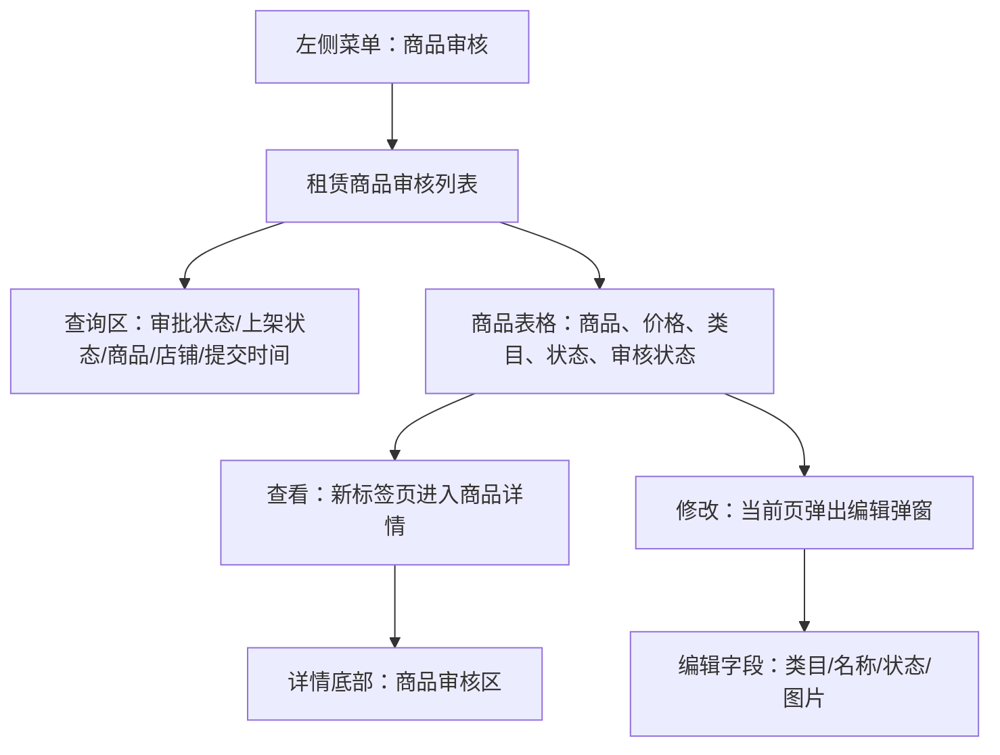
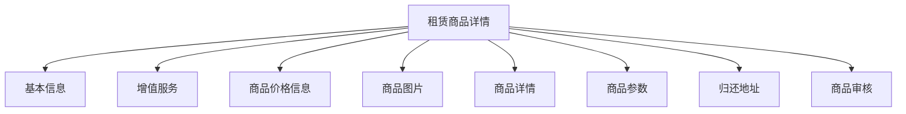

# 商品审核

> 来源：旧后台 `运营管理平台 / 商品审核 / 租赁商品审核` 实测梳理。本文记录商品审核列表、查看详情、编辑弹窗、上传入口、审核入口和已发现的交互问题。涉及保存、提交、删除、上传等写操作只记录入口，不点击最终确认。

## 菜单结构

```text
商品审核
└─ 租赁商品审核
```

## 页面：租赁商品审核

- 菜单路径：`商品审核 / 租赁商品审核`
- 路由：`/goods/index`
- 页面标题：`租赁商品审核`

### 页面结构



### 查询区字段

| 字段 | 控件 | 旧系统占位/选项 | 点击反馈 | 新系统建议 |
|---|---|---|---|---|
| 审批状态 | 下拉选择 | 全部、正在审核、审核不通过、审核通过 | 可展开选项 | 与审核状态 Tab 或列表条件保持一致 |
| 上架状态 | 下拉选择 | 全部、已上架、已下架、回收站 | 可展开选项 | 明确区分审核状态和上架状态 |
| 商品名称 | 输入框 | `商品名称` | 输入后配合查询 | 支持模糊搜索 |
| 商品编号 | 输入框 | `商品编号` | 输入后配合查询 | 支持精确搜索 |
| 店铺编号 | 输入框 | `店铺编号` | 输入后配合查询 | 支持精确搜索 |
| 商家名称 | 输入框 | `商家名称` | 输入后配合查询 | 支持店铺简称/企业名模糊搜索 |
| 提交时间 | 日期区间 | 开始时间 ~ 结束时间 | 打开日期选择器 | 默认限制查询跨度，避免全量慢查 |

### 查询按钮

| 按钮 | 实测反馈 | 新系统规则 |
|---|---|---|
| 查询 | Toast：`获取信息成功`，列表刷新 | 查询中显示 loading，失败保留当前条件并提示原因 |
| 重置 | 清空审批状态、上架状态等筛选条件 | 重置后恢复默认第一页 |

## 表格区

### 表格字段

| 字段 | 说明 | 新系统建议 |
|---|---|---|
| 店铺编号 | 商品所属店铺编号 | 可复制，默认脱敏非必要编号后几位 |
| 店铺名称 | 商品所属店铺 | 支持跳转店铺详情 |
| 商品编号 | 商品唯一编号 | 可复制 |
| 租赁价格 | 商品展示租金 | 金额统一两位小数 |
| 商品名称 | 商品标题 | 超长省略，悬停显示完整 |
| 商品类目 | 商品分类 | 与类目树保持一致 |
| 上架状态 | 已上架/已下架/回收站 | 用状态标签显示 |
| 提交时间 | 商品提交审核时间 | 标准时间格式 |
| 审核状态 | 正在审核/审核通过/审核不通过 | 用状态标签显示 |
| 操作 | `查看`、`修改` | 根据权限和状态控制可见性 |

### 分页

- 实测总量：`共18页 共177条`。
- 页码区包含 `1、2、3、4、5、向后5页、18、下一页`。
- 点击第 2 页后列表刷新，Toast：`获取信息成功`。

### 横向/纵向滚动

| 区域 | 实测结果 | 新系统要求 |
|---|---|---|
| 页面纵向滚动 | 可滚动到分页和底部 | 查询区吸顶可选，分页固定在表格底部 |
| 表格横向滚动 | 当前字段可完整显示，操作列在右侧 | 如后续字段增多，操作列固定右侧 |

## 操作：查看

- 点击位置：表格行操作列 `查看`。
- 打开方式：新 Chrome 标签页。
- 详情路由：`/goods/index/goodsDetail/id={商品ID}/actionId={审核ID}`
- 页面标题：`详情`
- 页面主标题：`租赁商品详情`

### 商品详情结构



### 基本信息字段

| 字段 | 说明 |
|---|---|
| 店铺编号 | 商品所属店铺编号 |
| 店铺名称 | 商品所属店铺名称 |
| 商品类目 | 类目路径，例如电动车类目 |
| 商品编号 | 商品唯一编号 |
| 商品名称 | 商品标题 |
| 新旧 | 新品/二手等 |
| 租赁标签 | 租赁商品标签 |
| 审核状态 | 当前审核状态 |
| 上架状态 | 当前上下架状态 |
| 发货地 | 发货地区 |
| 发货快递 | 发货快递配置 |
| 创建时间 | 商品创建时间 |
| 买断规则 | 商品买断规则 |
| 归还规则 | 商品归还规则 |
| 归还快递 | 归还物流配置 |

### 增值服务

| 字段 | 说明 |
|---|---|
| 名称 | 增值服务名称 |
| 内容 | 服务内容 |
| 价格(元) | 服务价格 |
| 说明 | 服务说明 |

> 旧系统存在公证服务类增值服务。新系统需要把增值服务做成配置项，并与订单账单、合同、公证费计算规则保持一致。

### 商品价格信息

| 字段 | 说明 |
|---|---|
| 规格/颜色 | SKU 规格 |
| 官方售价 | 商品官方价 |
| 租赁价格 | 对应租期价格 |
| 库存数量 | SKU 库存 |
| 买断规则 | 该 SKU 买断规则 |
| 销售价 | 商品销售价 |

> 旧系统同一商品下存在多规格、多租期价格。新系统应把 SKU、租期、租金、买断价拆成结构化价格表，避免只存富文本。

### 商品图片、详情、参数

| 区域 | 实测结果 | 新系统要求 |
|---|---|---|
| 商品图片 | 页面有图片区域，但实测图片显示不稳定，存在空白/占位情况 | 图片必须有加载失败占位、点击预览、原图地址校验 |
| 商品详情 | 展示商品描述文本 | 支持富文本，但应过滤脚本和危险标签 |
| 商品参数 | 区域存在，实测为空 | 参数应结构化保存，例如品牌、型号、续航、颜色 |

### 归还地址

| 字段 | 说明 | 安全要求 |
|---|---|---|
| 姓名 | 归还联系人 | 默认脱敏，需权限查看 |
| 手机 | 归还联系电话 | 默认脱敏，需权限查看 |
| 省/市/区 | 归还地区 | 可展示 |
| 街道 | 详细地址 | 默认脱敏，需权限查看 |

### 商品审核区

| 控件 | 旧系统表现 | 新系统规则 |
|---|---|---|
| 审批 | 单选：审核通过、审核拒绝 | 必选；拒绝时备注必填 |
| 备注 | 多行文本 | 拒绝原因需结构化原因 + 补充说明 |
| 提交 | 最终审核提交 | 高风险写操作，需二次确认和审计日志 |

#### 商品审核点击记录

| 点击位置 | 实测反馈 | 是否确认 |
|---|---|---|
| 审核拒绝 | 单选切换到拒绝 | 未提交 |
| 审核通过 | 单选切回通过，用于恢复状态 | 未提交 |
| 提交 | 未点击 | 审核写操作，需人工确认 |

## 操作：修改

- 点击位置：表格行操作列 `修改`。
- 打开方式：当前页居中弹窗。
- 弹窗标题：`修改`
- 打开反馈：Toast：`获取商品编辑信息成功`。

### 修改弹窗字段

| 字段 | 控件 | 旧系统表现 | 新系统建议 |
|---|---|---|---|
| 商品类目 | 级联选择 | 必填，初始显示类目路径 | 点击后不应清空已有值，除非用户主动清除 |
| 商品名称 | 输入框 | 必填，预填商品名称 | 修改后需记录变更日志 |
| 商品状态 | 下拉选择 | 必填，初始显示上架状态 | 上下架需要权限和原因 |
| 图片上传 | 图片列表 + 上传按钮 | 存在图片卡片和 `Upload` 入口 | 支持预览、删除确认、上传进度、失败重试 |
| 提交 | 按钮 | 最终保存 | 写操作，需校验通过后保存 |

### 修改弹窗点击记录

| 点击位置 | 实测反馈 | 处理方式 |
|---|---|---|
| 商品类目选择框 | 已有值被清空为 `请选择类目`，并出现 `商品类目不能为空` | 未保存；记录为疑似交互缺陷 |
| 商品状态选择框 | 已有值被清空，并出现 `商品状态不能为空` | 未保存；记录为疑似交互缺陷 |
| 图片上传 `Upload` | 打开 macOS 文件选择器 | 已取消，未上传 |
| 图片预览图标 | 图片卡片高亮，但未看到独立预览层 | 需补测是否预览组件失效 |
| 图片删除图标 | 未点击 | 删除属于写操作，需二次确认 |
| 提交 | 未点击 | 保存写操作，需人工确认 |
| 关闭 `X` | 弹窗关闭，列表保留 | 已恢复现场 |

## 已发现问题

| 优先级 | 问题 | 影响 | 建议 |
|---|---|---|---|
| P1 | 修改弹窗中点击商品类目/商品状态后，已有值可能被清空并触发表单校验 | 编辑商品时容易误清空关键字段 | 区分展开、选择、清除三个动作；只有点击清除图标才清空 |
| P2 | 商品详情图片区域存在空白/占位情况 | 审核人员无法确认商品图片 | 图片加载失败需显示明确错误，并支持重新加载/查看原图 |
| P2 | 图片预览入口点击后未看到明确预览弹层 | 图片审核效率低 | 预览应打开大图弹层，支持左右切换 |
| P2 | 归还地址展示了姓名、手机号、详细地址等敏感字段 | 数据泄露风险 | 默认脱敏，敏感查看需权限、原因和审计 |

## 新系统页面级要求

### 商品审核列表

1. 默认进入显示最近提交商品，分页加载。
2. 查询条件保留在 URL 或页面状态中，返回列表时不丢失。
3. 审核状态、上架状态必须分开，不允许混用。
4. 操作列至少包含 `查看`；`修改` 需要商品管理权限。
5. 批量审核如后续要做，必须限制状态并做二次确认。

### 商品详情审核

1. 详情页应完整展示基本信息、SKU 价格、商品图片、详情、参数、归还地址。
2. 审核拒绝时必须填写拒绝原因。
3. 审核通过/拒绝提交后生成审核日志：审核人、审核时间、审核结果、备注、旧状态、新状态。
4. 审核提交前弹出确认框，确认文案必须包含商品名称和审核结果。
5. 已审核商品再次审核必须有特殊权限。

### 商品编辑

1. 编辑弹窗只允许修改基础展示字段，不应混入审核决定。
2. 类目、状态、图片删除等关键字段变更需要单独记录日志。
3. 图片上传必须先预览再保存；未保存关闭弹窗时提示是否放弃。
4. 保存失败时保留用户已填内容，不应直接关闭弹窗。

## 待补测

| 项目 | 原因 |
|---|---|
| 商品审核 `提交` 成功/失败反馈 | 写操作，未点击最终提交 |
| 图片删除确认流程 | 删除图片属于写操作 |
| 真实图片预览弹层 | 旧系统点击后未看到明确弹层，需换有正常图片的商品补测 |
| 编辑保存成功后的列表刷新规则 | 写操作，未点击提交 |
| 不同审核状态商品的可操作按钮差异 | 当前只实测了部分列表样本 |
