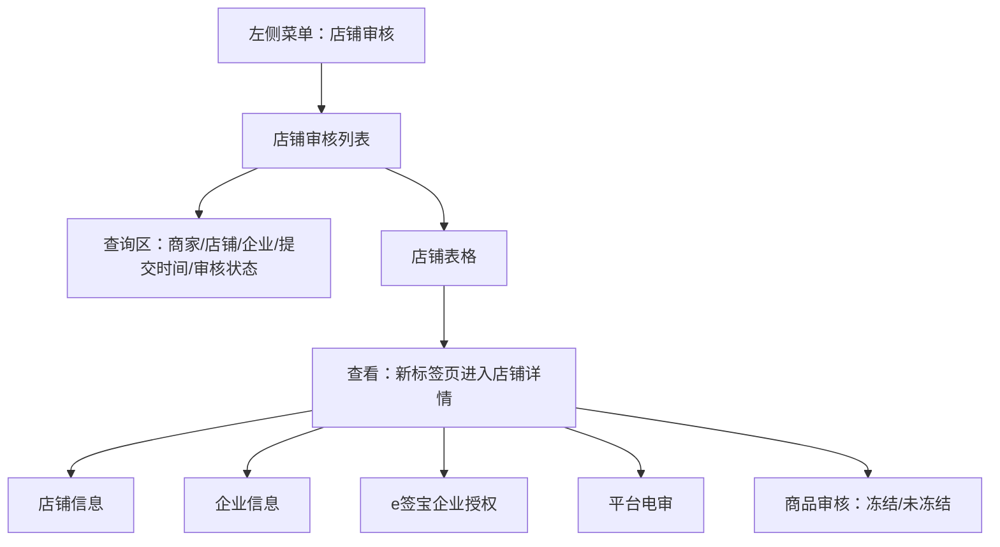
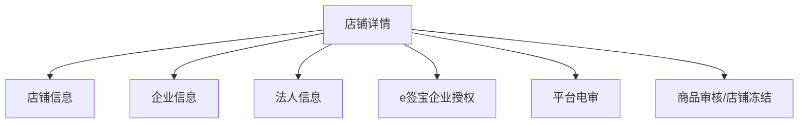

# 店铺审核

> 来源：旧后台 `运营管理平台 / 店铺审核 / 店铺审核列表` 实测梳理。本文记录店铺审核列表、店铺详情、企业资质、e签宝企业授权、平台电审和店铺冻结入口。涉及合同下载、授权同步、冻结提交、导出等高风险或敏感动作只记录入口，不触发最终动作。

## 菜单结构

```text
店铺审核
└─ 店铺审核列表
```

## 页面：店铺审核列表

- 菜单路径：`店铺审核 / 店铺审核列表`
- 路由：`/StoreAudit/list`
- 页面标题：`店铺审核列表`

### 页面结构



### 查询区字段

| 字段 | 控件 | 旧系统占位/选项 | 点击反馈 | 新系统建议 |
|---|---|---|---|---|
| 商家名称 | 输入框 | `请输入商家名称` | 输入后配合查询 | 支持店铺名/企业名模糊查询 |
| 是否需要平台电审 | 下拉选择 | 全部、是、否 | 可展开选项 | 与平台电审配置保持一致 |
| 店铺编号 | 输入框 | `请输入店铺编号` | 输入后配合查询 | 精确查询，可复制 |
| 企业资质名称 | 输入框 | `请输入企业资质名称` | 输入后配合查询 | 支持企业名称模糊查询 |
| 提交时间 | 日期区间 | 开始日期 ~ 结束日期 | 打开双月日期面板，含上/下月、上/下一年 | 限制查询跨度，默认近 30 天 |
| 审核状态 | 下拉选择 | 全部、待审核、审核通过、审核拒绝 | 可展开选项 | 与详情页状态枚举统一 |

### 操作按钮

| 按钮 | 实测反馈 | 风险边界/新系统规则 |
|---|---|---|
| 查询 | 列表刷新，当前样本仍为 1 条 | 查询中显示 loading，失败提示原因 |
| 重置 | 清空筛选条件，列表保持默认 | 重置后回到第一页 |
| 导出 | 未点击 | 涉及店铺、企业、法人、联系方式等敏感数据，必须异步导出并记录审计 |

## 表格区

### 表格字段

| 字段 | 说明 | 安全要求 |
|---|---|---|
| 店铺编号 | 店铺唯一编号 | 可复制；非必要场景可缩略展示 |
| 店铺名称 | 店铺展示名 | 支持跳转店铺详情 |
| 企业资质名称 | 入驻企业名称 | 按权限展示 |
| 提交时间 | 店铺审核提交时间 | 标准时间格式 |
| 是否需要平台电审 | 是/否 | 用状态点或标签展示 |
| 审核状态 | 待审核/审核通过/审核拒绝 | 用状态标签展示 |
| 店铺冻结状态 | 未冻结/冻结 | 关键经营状态，需醒目展示 |
| 操作 | 查看 | 进入详情页，不直接修改状态 |

### 分页与滚动

- 当前样本：`共1页 共1条`。
- 上一页、下一页按钮为禁用或不可继续状态。
- 当前字段宽度下无需横向滚动，后续新增字段时操作列应固定右侧。

## 操作：查看

- 点击位置：表格行操作列 `查看`。
- 打开方式：新 Chrome 标签页。
- 详情路由：`/StoreAudit/list/details?id={店铺ID}&ids={审核ID}`
- 页面标题：`详情`
- 页面主标题：`店铺详情`

## 页面：店铺详情

### 页面分区



### 店铺信息

| 字段 | 说明 | 安全要求 |
|---|---|---|
| 店铺编号 | 店铺唯一编号 | 可复制 |
| 店铺名称 | 店铺展示名 | 正常展示 |
| 店铺联系人姓名 | 店铺联系人 | 默认脱敏，需权限查看 |
| 店铺客服电话 | 客服电话 | 可按业务需要展示，后台仍建议脱敏 |
| 店铺联系人电话 | 联系人电话 | 默认脱敏，需权限查看 |
| 店铺联系邮箱 | 联系邮箱 | 默认部分脱敏 |
| 店铺创建时间 | 创建时间 | 旧系统存在时间戳格式，需转标准时间 |
| 店铺审核状态 | 审核成功等 | 与列表审核状态统一 |
| 店铺审核时间 | 审核时间 | 标准时间格式 |
| 店铺合同 | `点击下载` | 合同下载需权限、下载水印和审计日志 |
| 支付宝账号 | 收款账号 | 敏感字段，默认脱敏 |
| 支付宝姓名 | 收款主体 | 按权限展示 |
| 店铺 logo | 图片 | 支持预览和加载失败占位 |
| 店铺描述 | 文本 | 可为空 |

### 企业信息

| 字段 | 说明 | 安全要求 |
|---|---|---|
| 企业名称 | 入驻企业名称 | 可展示 |
| 企业注册资金 | 注册资金 | 统一金额/数字格式 |
| 营业执照号 | 统一社会信用代码/执照号 | 默认部分脱敏 |
| 营业执照地址 | 执照地址 | 默认脱敏 |
| 营业执照经营范围 | 长文本 | 需要折叠/展开，避免撑高页面 |
| 营业执照照片 | 图片 | 需水印、预览权限和审计 |
| 门店入驻合同 | `点击查看` | 合同查看/下载需权限、审计 |
| 生效时间 | 合同或入驻生效时间 | 标准时间格式 |
| 结束时间 | 合同或入驻结束时间 | 旧系统存在 `9999-06-30`，新系统需定义长期有效语义 |

### 法人信息

| 字段 | 说明 | 安全要求 |
|---|---|---|
| 法人姓名 | 企业法人 | 默认脱敏，需权限查看 |
| 法人身份证号 | 法人证件号 | 必须默认脱敏，查看需权限、原因和审计 |
| 法人身份证信息 | 身份证正反面图片 | 高敏字段，默认不直接展示原图 |

## e签宝企业授权

| 控件/字段 | 旧系统表现 | 新系统要求 |
|---|---|---|
| 同步授权结果 | 按钮，未点击 | 外部接口同步动作，需 loading、失败原因、操作日志 |
| 企业名称 | 展示企业名称 | 与店铺企业信息一致性校验 |
| 营业执照号 | 展示证照号 | 默认部分脱敏 |
| e签宝账号 | 展示授权账号 | 默认脱敏 |
| 授权状态 | 授权成功 | 与 e签宝回调状态统一 |
| 授权说明 | 可为空或 `-` | 失败时展示可处理原因 |
| 最近同步时间 | 展示最后同步时间 | 标准时间格式 |
| 授权书 | `下载授权书` | 下载链接不能暴露永久或长时效签名 URL |

## 平台电审

| 字段 | 说明 |
|---|---|
| 是否需要平台电审 | 是否需要平台介入电话审核 |
| 店铺冻结状态 | 当前店铺经营状态 |

## 商品审核/店铺冻结入口

> 旧系统分区名称为 `商品审核`，但实际控件是 `是否冻结店铺`。新系统建议改名为 `店铺状态处理` 或 `店铺冻结管理`，避免语义混淆。

| 控件 | 旧系统表现 | 实测动作 | 新系统规则 |
|---|---|---|---|
| 是否冻结店铺 | 单选：未冻结、冻结 | 切换到冻结后已切回未冻结，没有提交 | 冻结必须填写原因，并二次确认 |
| 提交 | 蓝色按钮 | 未点击 | 写操作，必须审计：操作人、原因、旧状态、新状态、时间 |

## 高风险入口记录

| 入口 | 未点击原因 | 新系统要求 |
|---|---|---|
| 店铺合同 `点击下载` | 合同含敏感商业信息 | 下载前权限校验，下载后审计 |
| 门店入驻合同 `点击查看` | 合同含敏感商业信息 | 预览水印，禁止无权限下载 |
| e签宝 `同步授权结果` | 外部接口同步，可能改变授权状态 | 二次确认或至少明确 loading/结果提示 |
| e签宝授权书 `下载授权书` | 授权书含签章/企业敏感信息 | 短时效链接，禁止直接暴露 OSS 签名 |
| 冻结 `提交` | 会改变店铺经营状态 | 必填原因、二次确认、审计、通知商家 |
| 列表 `导出` | 会导出店铺/法人/联系方式等敏感数据 | 异步导出、权限、审计、水印 |

## 已发现问题

| 优先级 | 问题 | 影响 | 建议 |
|---|---|---|---|
| P0 | 店铺详情直接展示联系人电话、邮箱、法人身份证号、证件图片等高敏信息 | 后台账号一旦泄露会造成严重隐私泄露 | 默认脱敏，敏感查看需权限、原因和审计 |
| P1 | 授权书链接暴露 OSS 签名 URL，且链接参数包含过期时间、AccessKeyId、Signature | 链接可能被复制外传 | 后端生成短时效下载地址，前端不展示完整原始链接 |
| P1 | `商品审核` 分区实际处理店铺冻结 | 审核语义混乱，容易误操作 | 改名为 `店铺冻结管理`，与商品审核模块分离 |
| P2 | 店铺创建时间显示为毫秒时间戳 | 运营人员难以理解 | 统一格式化为 `YYYY-MM-DD HH:mm:ss` |
| P2 | 营业执照经营范围长文本直接铺开 | 页面可读性差 | 默认折叠，支持展开全文 |
| P2 | 长期合同结束时间使用 `9999-06-30` | 业务语义不清 | 显示为 `长期有效`，底层仍可存结束日期 |

## 新系统页面级要求

1. 店铺审核列表必须支持按商家名称、店铺编号、企业资质名称、提交时间、审核状态、平台电审筛选。
2. 店铺详情必须按店铺信息、企业信息、法人信息、合同信息、e签宝授权、平台电审、状态处理分区展示。
3. 所有个人敏感信息和证件图片默认脱敏或折叠，查看原文必须记录审计。
4. 合同、授权书、营业执照、身份证图片等文件必须走受控预览/下载接口，不直接暴露对象存储原始地址。
5. 店铺冻结必须要求原因、二次确认、状态变更日志，并通知相关运营角色。
6. e签宝同步必须展示同步中、同步成功、同步失败、最近同步时间和失败原因。
7. 导出必须异步化，导出文件加水印，并记录导出条件、操作人、时间、文件有效期。

## 待补测

| 项目 | 原因 |
|---|---|
| 店铺冻结提交成功/失败反馈 | 写操作，未点击最终提交 |
| e签宝同步授权结果 | 外部接口同步，未点击 |
| 合同下载/预览 | 涉及敏感文件，未点击 |
| 授权书下载 | 涉及企业授权文件，未点击 |
| 图片点击预览效果 | 涉及证件照片高敏信息，未展开预览 |
| 待审核/审核拒绝状态下详情按钮差异 | 当前列表只有审核通过样本 |
