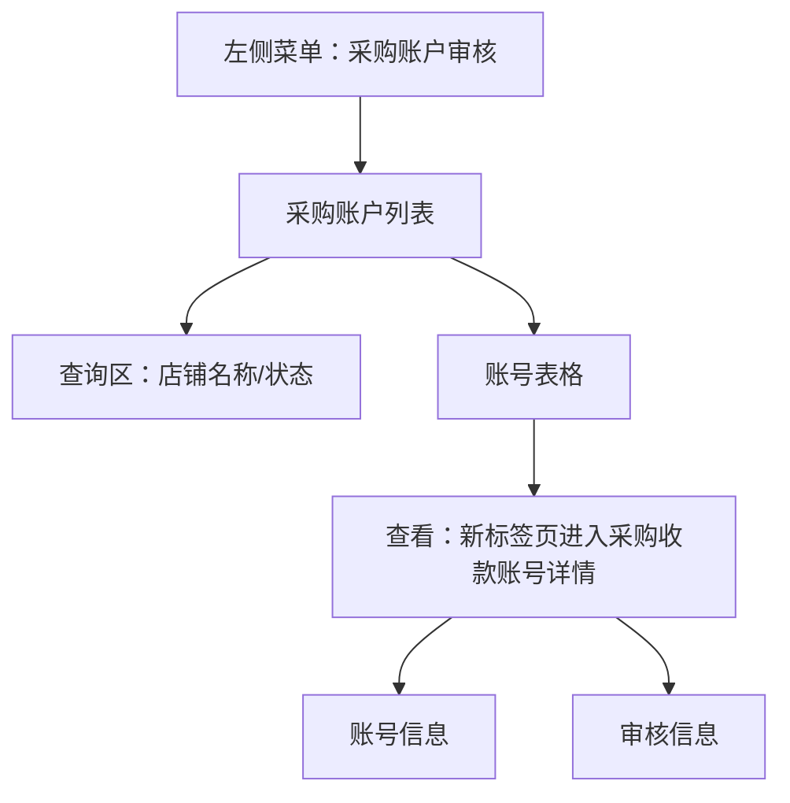

# 采购账户审核

> 来源：旧后台 `运营管理平台 / 采购账户审核 / 采购账户` 实测梳理。本文记录采购收款账号列表和详情。模块涉及支付宝账号、法人手机号、法人身份证号等敏感信息，文档不保留真实样例值，目标系统必须默认脱敏。

## 菜单结构

```text
采购账户审核
└─ 采购账户
```

## 页面：采购账户

- 菜单路径：`采购账户审核 / 采购账户`
- 路由：`/ProcurementAccount/list`
- 页面标题：`采购账户`

### 页面结构



### 查询区字段

| 字段 | 控件 | 旧系统占位/选项 | 点击反馈 | 新系统建议 |
|---|---|---|---|---|
| 店铺名称 | 输入框 | `请输入店铺名称` | 输入后配合查询 | 支持店铺名称模糊查询 |
| 状态 | 下拉选择 | 待审核、审核通过、审核拒绝 | 可展开选项 | 建议增加 `全部`，避免默认无法表达全量查询 |

### 操作按钮

| 按钮 | 实测反馈 | 新系统规则 |
|---|---|---|
| 查询 | 列表刷新，当前样本仍为 2 条 | 查询中显示 loading，失败提示原因 |
| 重置 | 清空筛选条件，列表保持默认 | 重置后恢复第一页和默认状态 |

## 表格区

### 表格字段

| 字段 | 说明 | 安全要求 |
|---|---|---|
| 店铺名称 | 申请收款账号的店铺 | 可展示 |
| 签约支付宝账户 | 采购收款支付宝账号 | 默认脱敏，仅授权角色可看完整 |
| 法人 | 法人姓名 | 默认脱敏 |
| 法人手机号 | 法人手机号 | 默认脱敏 |
| 状态 | 待审核/审核通过/审核拒绝 | 用状态标签展示 |
| 提交时间 | 账号提交审核时间 | 标准时间格式 |
| 操作 | 查看 | 进入详情页 |

### 分页与滚动

- 当前样本：`共1页 共2条`。
- 上一页、下一页不可继续。
- 当前字段较少，无横向滚动需求；后续增加银行卡/支付渠道字段时操作列应固定右侧。

## 操作：查看

- 点击位置：表格行操作列 `查看`。
- 打开方式：新 Chrome 标签页。
- 详情路由：`/ProcurementAccount/list/details?id={账号ID}`
- 页面标题：`详情`
- 页面主标题：`采购收款账号详情`

## 页面：采购收款账号详情

### 账号信息

| 字段 | 说明 | 安全要求 |
|---|---|---|
| 店铺编号 | 店铺唯一编号 | 可复制，非必要场景缩略 |
| 店铺名称 | 店铺名称 | 可展示 |
| 签约支付宝账户 | 收款支付宝账号 | 默认脱敏，查看完整需权限 |
| 法人 | 法人姓名 | 默认脱敏 |
| 法人身份证号 | 法人证件号 | 必须默认脱敏，查看需权限、原因、审计 |
| 法人手机号 | 法人手机号 | 默认脱敏 |
| 电子邮箱 | 联系邮箱 | 默认部分脱敏 |
| 提交人 | 提交账号 | 默认脱敏 |
| 提交时间 | 提交时间 | 标准时间格式 |
| 当前状态 | 当前审核状态 | 用状态标签展示 |

### 审核信息

| 字段 | 说明 | 安全要求 |
|---|---|---|
| 审核人 | 审核账号 | 默认脱敏或展示姓名/角色 |
| 审核时间 | 审核时间 | 标准时间格式 |
| 审核意见 | 审核备注 | 需要保留完整审计记录 |

## 已发现问题

| 优先级 | 问题 | 影响 | 建议 |
|---|---|---|---|
| P0 | 列表和详情直接展示支付宝账号、法人手机号、法人身份证号 | 支付和身份信息泄露风险高 | 默认脱敏，完整查看需权限、原因和审计 |
| P1 | 状态下拉没有 `全部` 选项 | 筛选语义不完整 | 增加全部，并明确默认查询范围 |
| P1 | 字段名 `法人身份��` 出现乱码 | 影响专业度和可读性 | 修正编码和字段名，统一为 `法人身份证号` |
| P2 | 详情页只有展示，没有审核操作入口或状态流转说明 | 审核流程不可追踪 | 详情页应区分待审核和已审核状态的可操作项 |

## 新系统页面级要求

1. 采购账户审核必须与店铺、企业资质、支付账户绑定，避免孤立账号审核。
2. 审核状态至少包含：待审核、审核通过、审核拒绝。
3. 待审核详情页应提供审核通过/拒绝入口；拒绝必须填写原因；通过需要二次确认。
4. 已审核详情页只展示审核结果和审计信息，默认不可重复审核。
5. 支付宝账号、手机号、身份证号、邮箱等敏感字段默认脱敏，完整查看必须记录审计。
6. 如后续支持银行卡/对公账户，需增加账户类型、开户行、账号校验、实名一致性校验。

## 待补测

| 项目 | 原因 |
|---|---|
| 待审核状态详情页 | 当前样本均为审核通过 |
| 审核通过/拒绝提交反馈 | 当前无待审核样本，未触发写操作 |
| 支付宝账号实名校验流程 | 旧系统只展示账号信息，未看到校验结果 |
| 第二条列表样本详情 | 操作类型相同，当前先记录首条详情 |
