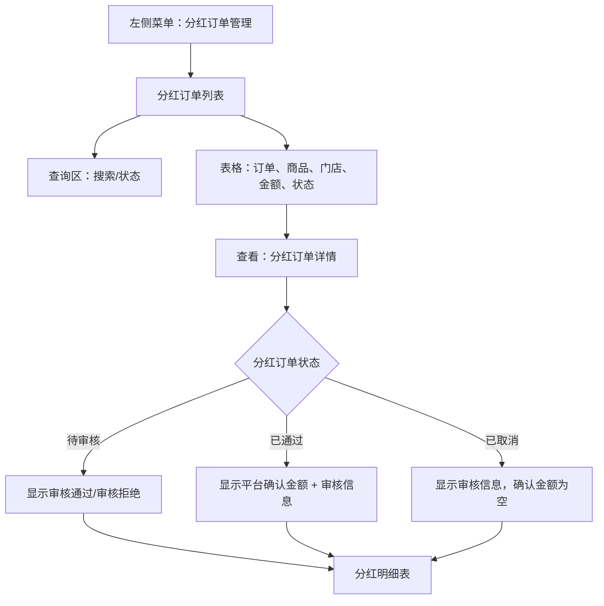
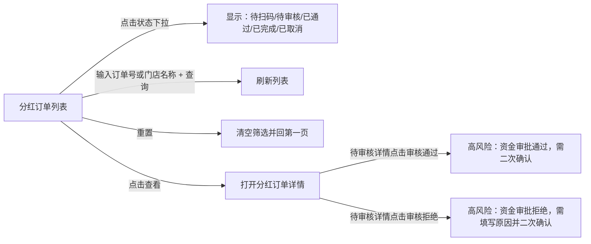

# 分红订单管理

> 来源：旧后台 `运营管理平台 / 分红订单管理 / 分红订单` 实测梳理。模块涉及出资本金、平台打款、预期分红、审核通过/拒绝等资金动作，文档只记录操作入口和页面反馈，不保留完整订单号、手机号等敏感样例。

## 菜单结构

```text
分红订单管理
└─ 分红订单
```

## 页面：分红订单

- 菜单路径：`分红订单管理 / 分红订单`
- 路由：`/DividendOrder/list`
- 页面标题：`分红订单`

### 页面结构



### 查询区字段

| 字段 | 控件 | 旧系统占位/选项 | 点击反馈 | 新系统建议 |
|---|---|---|---|---|
| 搜索 | 输入框 | `订单号/门店名称` | 输入后配合查询 | 支持订单号精确查询、门店名称模糊查询 |
| 状态 | 下拉选择 | 待扫码、待审核、已通过、已完成、已取消 | 展开后显示 5 个选项；未看到 `全部` | 增加 `全部`，默认展示全量 |

### 操作按钮

| 按钮 | 实测反馈 | 新系统规则 |
|---|---|---|
| 查询 | 列表刷新 | 查询中显示 loading，失败提示原因 |
| 重置 | 清空搜索和状态，回到默认列表第一页 | 重置必须恢复页码、筛选、排序 |
| 查看 | 新标签页打开详情 | 只读查看，资金动作必须在详情页二次确认 |

## 表格区

### 表格字段

| 字段 | 说明 |
|---|---|
| 订单号 | 分红关联订单号；部分待审核/取消样本显示 `-` |
| 商品名称 | 分红商品 |
| 门店 | 申请分红的门店 |
| 售价 | 商品售价 |
| 本金 | 申请出资本金 |
| 打款 | 申请平台打款金额 |
| 预期分红 | 申请预期分红总额，旧系统用绿色金额强调 |
| 出资比 | 申请出资比例 |
| 状态 | 待审核、已通过、已取消等 |
| 申请人 | 申请账号，旧系统直接展示手机号 |
| 创建时间 | 申请创建时间 |
| 操作 | 查看 |

### 分页与滚动

- 当前样本：`共2页 共11条`。
- 第 1 页展示 10 条，第 2 页展示 1 条。
- 表格存在横向滚动条，操作列固定在右侧；需要检查横向滚动后列头与行内容对齐。
- 分页点击 `2` 后列表切换到第 2 页；`上一页/下一页`跟随当前页状态变化。

## 页面：分红订单详情

- 入口：列表行 `查看`
- 路由：`/DividendOrder/list/details?id={分红订单ID}`
- 页面标题：`详情`
- 详情标题：`分红订单详情`

### 基础信息字段

| 字段 | 说明 |
|---|---|
| 订单编号 | 关联订单号，部分状态为空 |
| 状态 | 待审核/已通过/已取消 |
| 商品名称 | 商品名称 |
| 门店名称 | 门店名称 |
| 申请人 | 申请账号，旧系统直接展示手机号 |
| 创建时间 | 申请时间 |
| 手机售价 | 商品售价 |
| 申请出资比例 | 门店申请平台参与出资比例 |
| 申请首付比例 | 订单首付比例 |
| 申请出资本金 | 申请由平台/资方承担的本金 |
| 申请平台打款金额 | 申请打给门店或业务方的金额 |
| 申请预期分红总额 | 申请测算分红总额 |
| 已分红期数 | 已完成分红期数 |
| 平台确认出资比例 | 审核通过后落确认值 |
| 平台确认首付比例 | 审核通过后落确认值 |
| 平台确认出资本金 | 审核通过后落确认值 |
| 平台确认打款金额 | 审核通过后落确认值 |
| 平台确认分红总额 | 审核通过后落确认值 |

### 状态差异

| 状态 | 页面表现 | 操作入口 | 新系统规则 |
|---|---|---|---|
| 待审核 | 平台确认字段均为 `-`；展示申请金额和比例 | `审核通过`、`审核拒绝` | 高风险资金审批入口；必须二次确认，不允许误触 |
| 已通过 | 平台确认字段有值；显示审核信息 | 无审核按钮 | 只读；展示审核人、审核时间、审核备注 |
| 已取消 | 平台确认字段为 `-`；显示审核信息 | 无审核按钮 | 只读；应补充取消原因或拒绝原因 |

### 审核信息

| 字段 | 旧系统表现 | 新系统建议 |
|---|---|---|
| 审核人 | 已通过/已取消详情显示 | 展示角色/账号，敏感账号脱敏 |
| 审核时间 | 已通过/已取消详情显示 | 标准时间格式 |
| 审核备注 | 已通过可能有备注，已取消样本为 `-` | 审核拒绝/取消必须有原因；通过备注可选 |

### 分红明细表

| 字段 | 说明 |
|---|---|
| 期数 | 第 N 期 |
| 回款总额 | 当期应回款金额 |
| 非分红金额 | 不参与分红部分 |
| 分红金额 | 当期可分红金额 |
| 状态 | 当前样本均为待分红 |
| 结算时间 | 未结算显示 `-` |

### 已实测期数

- 待审核样本：6 期分红明细。
- 已通过样本：9 期分红明细。
- 已取消样本：12 期分红明细。
- 分红明细无单行操作按钮；状态全部为 `待分红`，结算时间为 `-`。

## 关键交互路径



## 高风险操作边界

| 操作 | 旧系统入口 | 本次处理 | 新系统要求 |
|---|---|---|---|
| 审核通过 | 待审核详情页蓝色按钮 | 未点击 | 二次确认，展示申请金额/确认金额/影响订单，记录审计 |
| 审核拒绝 | 待审核详情页红色按钮 | 未点击 | 必填拒绝原因，二次确认，记录审计 |

## 已发现问题

| 优先级 | 问题 | 影响 | 建议 |
|---|---|---|---|
| P0 | `审核通过/审核拒绝` 直接位于资金详情页，旧系统未看到显式二次确认前置说明 | 误触可能影响出资、打款、分红 | 新系统必须增加确认弹窗、权限校验、审批审计 |
| P1 | 状态筛选缺少 `全部` | 筛选语义不完整 | 增加全部状态 |
| P1 | 已取消详情仍展示分红明细且状态为待分红 | 状态语义混乱 | 取消后分红明细应标记为已取消/不结算或隐藏结算排程 |
| P1 | 申请人直接展示手机号 | 个人信息暴露 | 默认脱敏，完整查看需权限和审计 |
| P2 | 部分待审核/取消记录订单号为 `-` | 追溯困难 | 解释空订单号来源，或补充申请单号/业务单号 |
| P2 | 已取消审核备注可能为空 | 不利于复盘 | 取消/拒绝必须填写原因 |

## 新系统页面级要求

1. 分红订单必须区分申请值和平台确认值，避免审批后数据被覆盖看不出差异。
2. 待审核详情页展示审核通过/拒绝入口；通过前必须确认出资比例、首付比例、出资本金、平台打款、分红总额。
3. 拒绝/取消必须填写原因；通过可填写备注。
4. 所有资金审批动作必须写入审计日志：操作人、时间、前后值、备注、来源 IP。
5. 分红明细应支持已取消/待分红/已分红/结算失败等状态，取消订单不得仍表现为可分红。
6. 列表页搜索、筛选、分页、横向滚动位置不应互相污染；详情返回后应保留列表查询条件和页码。

## 待补测

| 项目 | 原因 |
|---|---|
| 审核通过/拒绝弹窗内容 | 涉及资金审批，未点击高风险按钮 |
| 待扫码、已完成状态详情 | 当前列表样本未覆盖 |
| 已分红/结算成功明细 | 当前样本明细均为待分红 |
