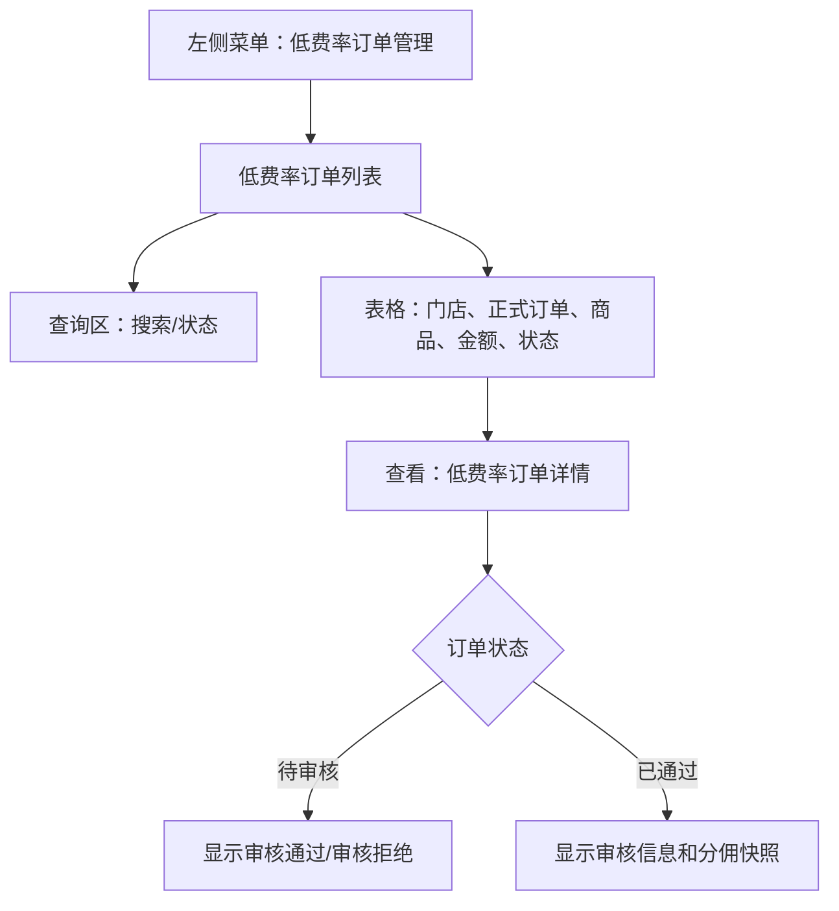
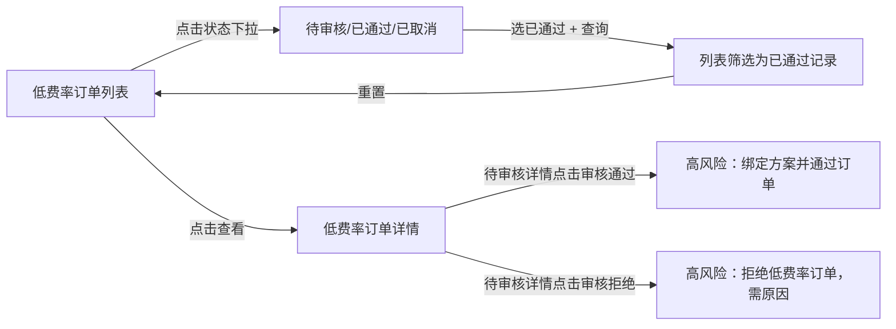

# 低费率订单管理

> 来源：旧后台 `运营管理平台 / 低费率订单管理 / 低费率订单` 实测梳理。模块用于审核低费率订单及其分佣快照，涉及租金、首付、月付、分佣比例等资金规则，审核类按钮只记录入口，不执行确认。

## 菜单结构

```text
低费率订单管理
└─ 低费率订单
```

## 页面：低费率订单

- 菜单路径：`低费率订单管理 / 低费率订单`
- 路由：`/LowRateOrder/list`
- 页面标题：`低费率订单`

### 页面结构



### 查询区字段

| 字段 | 控件 | 旧系统占位/选项 | 点击反馈 | 新系统建议 |
|---|---|---|---|---|
| 搜索 | 输入框 | `订单号/门店名称/商品名称` | 输入后配合查询 | 支持订单号精确、门店/商品模糊查询 |
| 状态 | 下拉选择 | 待审核、已通过、已取消 | 选择后需点击查询才刷新 | 增加 `全部`，默认全量 |

### 操作按钮

| 按钮 | 实测反馈 | 新系统规则 |
|---|---|---|
| 查询 | 选择 `已通过` 后点击，列表由 6 条变为 3 条 | 查询中 loading，失败提示 |
| 重置 | 清空状态，列表恢复 6 条 | 重置恢复第一页、筛选和默认排序 |
| 查看 | 新标签页打开详情页 | 只读查看；审核动作只在详情页展示 |

## 表格区

### 表格字段

| 字段 | 说明 |
|---|---|
| 来源门店 | 低费率订单来源门店 |
| 正式订单号 | 关联正式订单；部分待审核样本为空 |
| 商品名称 | 商品名称 |
| 手机售价 | 设备售价 |
| 总租金 | 低费率方案总租金 |
| 会员费 | 当前样本均为 `-` |
| 状态 | 待审核/已通过 |
| 创建时间 | 创建时间 |
| 操作 | 查看 |

### 分页与滚动

- 当前样本：`共1页 共6条`。
- 选择 `已通过` 后：`共1页 共3条`。
- 表格宽度当前可完整显示；如后续增加佣金、渠道、方案字段，操作列建议固定右侧。

## 页面：低费率订单详情

- 入口：列表行 `查看`
- 路由：`/LowRateOrder/list/details?id={低费率订单ID}`
- 页面标题：`详情`
- 详情标题：`低费率订单详情`

### 基础信息字段

| 字段 | 说明 |
|---|---|
| 正式订单号 | 关联订单号 |
| 状态 | 待审核/已通过 |
| 来源门店 | 订单来源门店 |
| 目标平台店 | 审核后可能绑定到目标店铺；待审核样本为 `-` |
| 商品名称 | 商品名称 |
| 规格 | 颜色/内存等商品规格 |
| 手机售价 | 设备售价 |
| 首付比例 | 首付比例 |
| 总租金 | 租期总租金 |
| 首付款 | 首付款金额 |
| 月付 | 月付金额 |
| 设备金额 | 设备金额 |
| 会员费 | 会员费 |
| 总金额 | 总金额 |
| 代客支付 | 是否代客支付，当前为 `-` |
| 创建时间 | 创建时间 |

### 低费率分佣信息

| 字段 | 待审核表现 | 已通过表现 | 说明 |
|---|---|---|---|
| 绑定方案ID | `-` | 有方案 ID | 审核通过后快照到订单 |
| 自有分佣比例 | `-` | 有比例 | 门店/自有渠道分佣 |
| 一级分佣比例 | `-` | 有比例 | 一级渠道分佣 |
| 二级分佣比例 | `-` | 有比例 | 二级渠道分佣 |
| 说明 | 固定说明 | 固定说明 | `绑定后会快照到订单，后续分佣按订单快照执行。` |

### 状态差异

| 状态 | 页面表现 | 操作入口 | 新系统规则 |
|---|---|---|---|
| 待审核 | 分佣方案为空；底部有审核按钮 | `审核通过`、`审核拒绝` | 资金/分佣审批，高风险，必须二次确认 |
| 已通过 | 分佣方案和比例已快照；显示审核信息 | 无审核按钮 | 只读展示，保留审核记录 |

### 审核信息

| 字段 | 说明 |
|---|---|
| 审核人 | 审核账号或角色 |
| 审核时间 | 审核时间 |
| 审核备注 | 当前样本可能为空 |

## 关键交互路径



## 高风险操作边界

| 操作 | 旧系统入口 | 本次处理 | 新系统要求 |
|---|---|---|---|
| 审核通过 | 待审核详情页蓝色按钮 | 未点击 | 展示即将绑定的方案、分佣比例、金额影响，二次确认 |
| 审核拒绝 | 待审核详情页红色按钮 | 未点击 | 必填拒绝原因，二次确认，记录审计 |

## 已发现问题

| 优先级 | 问题 | 影响 | 建议 |
|---|---|---|---|
| P0 | 待审核详情的审核通过会影响低费率订单和分佣快照 | 误触会改变订单资金和佣金规则 | 必须增加确认弹窗、权限校验、审计日志 |
| P1 | 状态筛选缺少 `全部` | 筛选语义不完整 | 增加全部状态 |
| P1 | 部分待审核记录正式订单号为空 | 追溯链路不完整 | 补充申请单号/临时单号，并解释正式订单号生成时机 |
| P1 | 待审核详情无法看到将要绑定的分佣方案 | 审核人无法判断通过后的佣金影响 | 审核前展示候选方案和计算结果 |
| P2 | 审核备注可为空 | 后续复盘困难 | 拒绝必须填原因，通过建议可填备注 |

## 新系统页面级要求

1. 低费率订单审核必须把订单金额、低费率方案、分佣快照放在同一页面校验。
2. 审核通过前必须展示：目标平台店、绑定方案、三级分佣比例、总租金、首付、月付、会员费。
3. 审核通过后方案和分佣比例按订单快照保存，后续方案变化不得影响历史订单。
4. 拒绝必须填写原因；通过建议填写备注。
5. 所有审核动作写入审计：操作人、时间、前后状态、方案快照、备注。
6. 关联正式订单号为空时，必须展示低费率申请单号，保证列表和详情可追溯。

## 待补测

| 项目 | 原因 |
|---|---|
| 已取消详情 | 当前列表没有已取消样本 |
| 审核通过/拒绝弹窗 | 涉及资金和分佣审批，未点击高风险按钮 |
| 搜索框输入查询 | 当前已覆盖状态查询，未额外输入关键词 |
