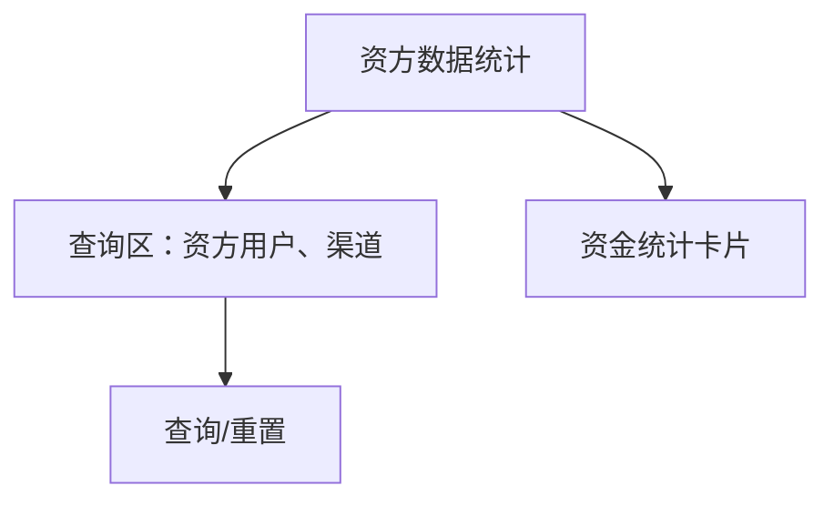
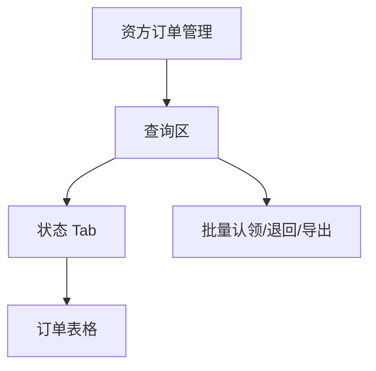
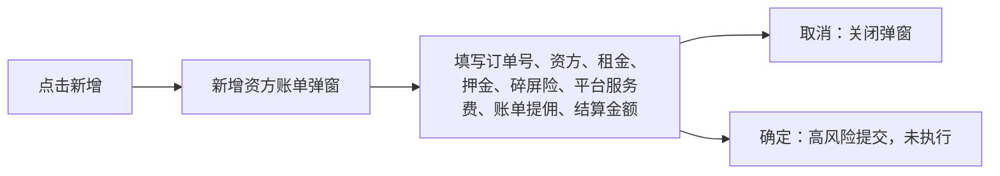
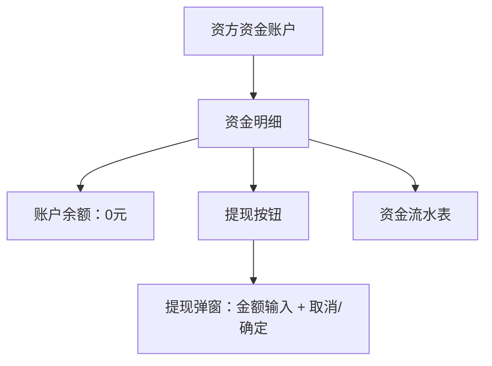
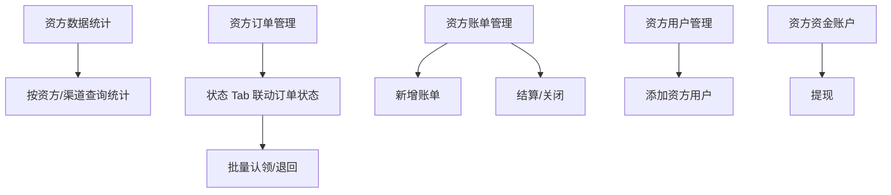

# 资方管理

> 来源：旧后台 `运营管理平台 / 资方管理` 实测梳理。模块覆盖资方统计、资方订单、资方账单、资方用户、打款记录、资方资金账户，涉及租金、押金、结算、打款、提现等资金动作。本次只记录入口、弹窗、空选校验和字段，不执行导出、结算、关闭、提现确认等最终动作。

## 菜单结构

```text
资方管理
├─ 资方数据统计
├─ 资方订单管理
├─ 资方账单管理
├─ 资方用户管理
├─ 打款记录
└─ 资方资金账户
```

## 页面：资方数据统计

- 菜单路径：`资方管理 / 资方数据统计`
- 路由：`/Capital/CapitalStatistics`
- 页面标题：`资方数据统计`

### 页面结构



### 查询区字段

| 字段 | 控件 | 实测选项/反馈 | 新系统建议 |
|---|---|---|---|
| 资方用户 | 下拉选择 | 下拉后显示 `暂无数据` | 支持按资方名称/编号搜索 |
| 渠道 | 下拉选择 | 下拉后显示 `暂无数据` | 支持渠道名称/渠道编号 |
| 查询 | 按钮 | 当前无数据，点击后卡片不变 | 查询中 loading，失败提示 |
| 重置 | 按钮 | 清空筛选，卡片不变 | 重置后回到全量统计 |

### 统计卡片

| 指标 | 当前展示 | 说明 |
|---|---|---|
| 应收账款 | `¥0.00` | 待收资金 |
| 总租金 | `¥0.00` | 资方关联订单总租金 |
| 已付总租金 | `¥0.00` | 已支付租金 |
| 已付押金 | `¥` | 旧系统缺少数值 |
| 平台管理费 | `¥` | 旧系统缺少数值 |
| 账单提佣 | `¥` | 旧系统缺少数值 |
| 未结算费用 | `¥` | 旧系统缺少数值 |
| 结算费用 | `¥` | 旧系统缺少数值 |
| 碎屏险 | `¥` | 旧系统缺少数值 |

## 页面：资方订单管理

- 菜单路径：`资方管理 / 资方订单管理`
- 路由：`/Capital/CapitalOrder`
- 页面标题：`资方订单管理`

### 页面结构



### 查询区字段

| 字段 | 控件 | 实测选项/反馈 | 新系统建议 |
|---|---|---|---|
| 商品名称 | 下拉选择 | 下拉后显示 `暂无数据` | 可输入搜索商品 |
| 下单人姓名 | 输入框 | `请输入下单人姓名` | 敏感字段，列表展示脱敏 |
| 下单人手机号 | 输入框 | `请输入下单人手机号` | 支持脱敏精确查询 |
| 收货人手机号 | 输入框 | `请输入收货人手机号` | 支持脱敏精确查询 |
| 下单人身份证号 | 输入框 | `请输入下单人身份证号` | 高敏字段，仅限授权角色查询 |
| 订单编号 | 输入框 | `请输入订单编号` | 精确查询 |
| 创建时间 | 日期范围 | 打开双月日历面板 | 统一快捷项：今天/近7天/近30天 |
| 订单状态 | 下拉选择 | 待发货、待确认收货、租用中、待结算、结算待支付、订单完成、交易关闭 | 与 Tab 状态联动 |
| 近期还款 | 下拉选择 | 1天、2天、3天、4天、5天、6天、7天 | 用于临期还款筛选 |
| 资方信息 | 下拉选择 | 下拉后显示 `暂无数据` | 支持资方名称/编号搜索 |

### 状态 Tab

| Tab | 计数 | 点击反馈 |
|---|---:|---|
| 全部订单 | 42 | 清空订单状态筛选，表格当前为空 |
| 待发货 | 1 | 订单状态变为 `待发货`，表格当前为空 |
| 待确认收货 | 0 | 订单状态变为 `待确认收货`，表格当前为空 |
| 租用中 | 1 | 订单状态变为 `租用中`，表格当前为空 |
| 待结算 | 0 | 订单状态变为 `待结算`，表格当前为空 |
| 结算待支付 | 0 | 订单状态变为 `结算待支付`，表格当前为空 |
| 订单完成 | 1 | 订单状态变为 `订单完成`，表格当前为空 |
| 交易关闭 | 39 | 订单状态变为 `交易关闭`，表格当前为空 |

### 操作按钮

| 按钮 | 实测反馈 | 新系统规则 |
|---|---|---|
| 查询 | 当前筛选下返回空表 | 查询中 loading，失败提示 |
| 重置 | 清空查询条件；Tab 仍停留在当前状态 | 建议重置同时回到 `全部订单` |
| 批量认领 | 未选择订单时 Toast：`请选择要认领的订单！` | 有选择时必须二次确认，记录认领人和时间 |
| 退回 | 未选择订单时 Toast：`请选择要回收的订单！` | 有选择时必须填写退回原因 |
| 导出 | 未点击 | 高风险导出，需权限、范围提示、导出审计 |

### 表格字段

| 字段 | 说明 |
|---|---|
| 选择框 | 当前空表时禁用 |
| 序号 | 行序号 |
| 订单编号 | 资方关联订单 |
| 资方名称 | 资金方名称 |
| 商品名称 | 商品名称 |
| 已支付期数/总期数 | 租金还款进度 |
| 总租金 | 订单总租金 |
| 已付租金 | 已支付租金 |
| 下单人姓名 | 高敏信息，需脱敏 |
| 下单人手机号 | 高敏信息，需脱敏 |
| 下单时间 | 订单创建时间 |
| 收货人手机号 | 高敏信息，需脱敏 |
| 起租时间 | 租赁开始时间 |
| 订单状态 | 当前订单状态 |
| 是否领取 | 是否被资方/运营认领 |
| 操作 | 固定右侧操作列 |

## 页面：资方账单管理

- 菜单路径：`资方管理 / 资方账单管理`
- 路由：`/Capital/CapitalBill`
- 页面标题：`资方账单管理`
- Tab：`订单结算明细`

### 查询区字段

| 字段 | 控件 | 实测选项/反馈 |
|---|---|---|
| 订单编号 | 输入框 | `请输入订单编号` |
| 资方信息 | 下拉选择 | 下拉后显示 `暂无数据` |
| 账单生成时间 | 日期范围 | 双月日期面板 |
| 结算状态 | 下拉选择 | 待结算、已结算、结算中、已关闭 |

### 操作按钮

| 按钮 | 实测反馈 | 新系统规则 |
|---|---|---|
| 查询 | 当前返回空表 | 查询失败需提示 |
| 新增 | 打开 `新增资方账单` 弹窗 | 手工新增资金账单，高风险，需权限 |
| 重置 | 清空筛选 | 重置到第一页 |
| 结算 | 未选择时 Toast：`请选择要结算的账单！` | 有选择时二次确认，校验状态为待结算 |
| 关闭 | 未选择时 Toast：`请选择要关闭的订单！` | 有选择时必填关闭原因 |
| 导出 | 未点击 | 高风险导出，需审计 |

### 表格字段

| 字段 | 说明 |
|---|---|
| 选择框 | 批量结算/关闭选择 |
| 序号 | 行序号 |
| 订单编号 | 关联订单 |
| 用户名称 | 订单用户 |
| 资方名称 | 资金方 |
| 结算期数/总期数 | 结算进度 |
| 签约价 | 合同价格 |
| 租金 | 租金金额 |
| 押金 | 押金金额 |
| 碎屏换新 | 碎屏险/服务费 |
| 结算金额 | 本次结算金额 |
| 平台服务费（首期） | 首期平台服务费 |
| 账单提佣 | 账单佣金 |
| 结算状态 | 待结算/已结算/结算中/已关闭 |
| 账单生成时间 | 生成时间 |

### 新增资方账单弹窗



| 字段 | 必填 | 控件/占位 |
|---|---|---|
| 订单号 | 是 | `请输入订单号` |
| 资方信息 | 否 | 下拉，当前 `暂无数据` |
| 租金 | 是 | `请输入租金` |
| 押金 | 是 | `请输入押金` |
| 碎屏险 | 是 | `请输入碎屏险` |
| 平台服务费 | 是 | `请输入平台服务费` |
| 账单提佣 | 是 | `请输入账单提佣` |
| 结算金额 | 是 | `请输入结算金额` |

## 页面：资方用户管理

- 菜单路径：`资方管理 / 资方用户管理`
- 路由：`/Capital/CapitalUser`
- 页面标题：`资方用户管理`

### 查询区与表格

| 区域 | 字段/按钮 | 实测反馈 |
|---|---|---|
| 查询 | 资金方企业全称呼 | 输入框，placeholder `请输入` |
| 查询 | 查询 | 当前返回空表 |
| 查询 | 添加 | 打开 `添加资方用户` 弹窗 |
| 表格 | 资方编号、打款类型、资方简称、资金方企业全称呼、资方手机号、法人名字、平台服务费、剩余账单比例、真实姓名、支付宝账户/银行卡号、资方状态、操作 | 当前空表 |

### 添加资方用户弹窗

| 字段 | 必填 | 控件/默认值 | 说明 |
|---|---|---|---|
| 资方名称 | 是 | 下拉 | 当前未返回可选数据 |
| 打款类型 | 是 | 下拉，默认 `支付宝` | 影响后续收款账户字段 |
| 手机号 | 是 | 输入框 | 资方手机号 |
| 公司名称 | 是 | 输入框 |
| 法人名字 | 是 | 输入框 |
| 资方简称 | 是 | 输入框 |
| 平台服务费比例 | 是 | 输入框 | 百分比/比例需要明确单位 |
| 账单提佣 | 是 | 输入框 | 资金分成规则 |
| 开户行 | 是 | 输入框 |
| 真实姓名 | 是 | 输入框 |
| 支付宝账户 | 是 | 输入框 | 打款类型为支付宝时使用 |
| 省份 | 是 | 输入框 |
| 市 | 是 | 输入框 |
| 支行 | 是 | 输入框 |

> 弹窗有独立纵向滚动，底部为 `取消`、`确定`。本次只查看字段并取消，未提交。

## 页面：打款记录

- 菜单路径：`资方管理 / 打款记录`
- 路由：`/Capital/PaymentRecords`
- 页面标题：`打款记录`

### 查询区字段

| 字段 | 控件 | 占位 |
|---|---|---|
| 资方编号 | 输入框 | `请输入资方编号` |
| 订单编号 | 输入框 | `请输入订单编号` |
| 操作人 | 输入框 | `请输入操作人名称` |
| 创建时间 | 日期范围 | 开始日期、结束日期 |
| 查询 | 按钮 | 当前空表 |
| 重置 | 按钮 | 清空筛选 |

### 表格字段

| 字段 | 说明 |
|---|---|
| 资方编号 | 资方用户编号 |
| 订单编号 | 关联订单 |
| 支付宝名称 | 收款名称 |
| 支付宝账号 | 收款账号，高敏信息 |
| 打款金额 | 资金打款金额 |
| 支付状态 | 支付结果 |
| 创建人名称 | 操作人 |
| 备注 | 打款备注 |
| 创建时间 | 创建时间 |

## 页面：资方资金账户

- 菜单路径：`资方管理 / 资方资金账户`
- 路由：`/Capital/CapitalAccount`
- 页面标题：`资方资金账户`

### 页面结构



### 资金明细

| 区域 | 字段/按钮 | 实测反馈 |
|---|---|---|
| 账户余额 | `0 元` | 当前余额为 0 |
| 提现 | 按钮 | 打开提现弹窗，默认金额 `0.1` |
| 表格 | 时间、描述、类型、变动金额、变动前余额、变动后余额 | 当前空表 |

### 提现弹窗

| 字段 | 控件 | 实测反馈 | 新系统规则 |
|---|---|---|---|
| 金额（元） | 数字步进器 | 默认 `0.1`，可加减，减号在最低值时禁用 | 不得超过可提现余额，余额 0 时应禁用提现或提示余额不足 |
| 取消 | 按钮 | 关闭弹窗 | 不改变余额 |
| 确定 | 按钮 | 未点击 | 高风险资金操作，必须二次确认、权限校验、审计 |

## 关键交互路径



## 高风险操作边界

| 操作 | 页面 | 本次处理 | 新系统要求 |
|---|---|---|---|
| 批量认领 | 资方订单管理 | 仅测试空选 Toast | 二次确认，记录认领人、认领时间 |
| 退回 | 资方订单管理 | 仅测试空选 Toast | 必填原因，记录前后状态 |
| 导出 | 资方订单/资方账单 | 未点击 | 权限控制、脱敏、导出审计 |
| 新增资方账单 | 资方账单管理 | 查看表单后取消 | 金额校验、订单校验、权限审批 |
| 结算 | 资方账单管理 | 仅测试空选 Toast | 二次确认，幂等，防重复结算 |
| 关闭账单/订单 | 资方账单管理 | 仅测试空选 Toast | 必填原因，记录审计 |
| 添加资方用户 | 资方用户管理 | 查看表单后取消 | 资方账户、打款信息需审核 |
| 提现 | 资方资金账户 | 查看弹窗后取消 | 余额校验、二次确认、打款流水 |

## 已发现问题

| 优先级 | 问题 | 影响 | 建议 |
|---|---|---|---|
| P0 | 资方账单、提现、结算属于资金动作，但旧系统入口较轻 | 误操作会影响资金结算 | 新系统增加二次确认、权限、审计、幂等控制 |
| P1 | 资方统计部分卡片只显示 `¥` 无数字 | 统计口径不清晰 | 后端返回 0 时统一展示 `¥0.00` |
| P1 | 资方订单 Tab 有计数但表格为空 | 用户难以判断是筛选空、权限空还是接口异常 | 空态区分“无数据/查询失败/无权限/加载中” |
| P1 | 资方订单重置后仍停留在交易关闭 Tab | 重置语义不完整 | 重置应回到全部订单或明确只重置筛选字段 |
| P1 | 添加资方用户字段很多且收款账户信息敏感 | 容易录错，且隐私风险高 | 分步骤录入：基本信息、结算规则、收款账户、确认页 |
| P2 | 资方账单关闭 Toast 文案为 `请选择要关闭的订单！` | 页面语义是账单，文案不一致 | 改为 `请选择要关闭的账单！` |
| P2 | 提现默认金额为 `0.1`，但余额为 0 仍可打开 | 易引发提交失败或误解 | 余额 0 时禁用提现按钮或弹出余额不足提示 |

## 新系统页面级要求

1. 资方模块必须把“资方资料、收款账户、结算规则、资金流水、提现记录”作为同一资金域建模。
2. 所有金额字段必须明确单位、精度、是否含税、是否包含服务费。
3. 资方手机号、法人、真实姓名、支付宝/银行卡账号默认脱敏展示，详情权限单独控制。
4. 资方账单结算必须做幂等，防止重复结算或并发结算。
5. 导出、结算、关闭、提现、添加/编辑收款账户必须写审计日志。
6. 资方订单认领/退回需要状态机，禁止跨状态误操作。
7. 资金统计卡片必须有口径说明：统计范围、更新时间、是否受筛选影响。

## 待补测

| 项目 | 原因 |
|---|---|
| 资方订单有数据行时的查看/认领/退回流程 | 当前环境表格为空 |
| 资方账单有数据行时的结算/关闭确认弹窗 | 当前环境表格为空，且属于资金动作 |
| 资方用户编辑/启停/删除操作 | 当前环境表格为空 |
| 打款记录支付状态枚举 | 当前环境表格为空 |
| 提现确定后的校验文案 | 涉及真实资金动作，未点击 |
