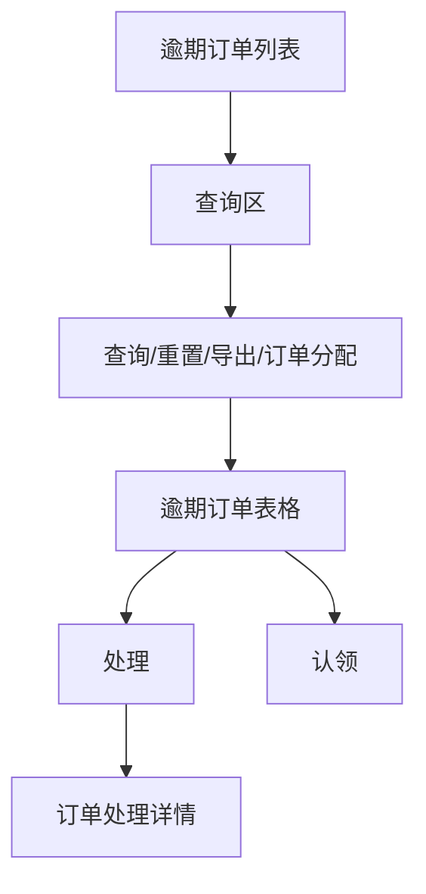
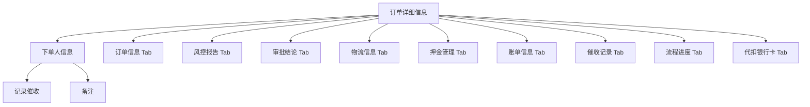
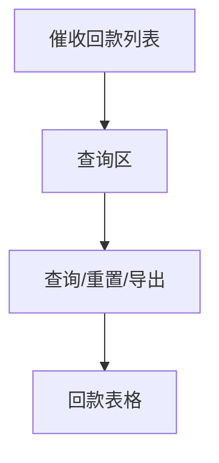
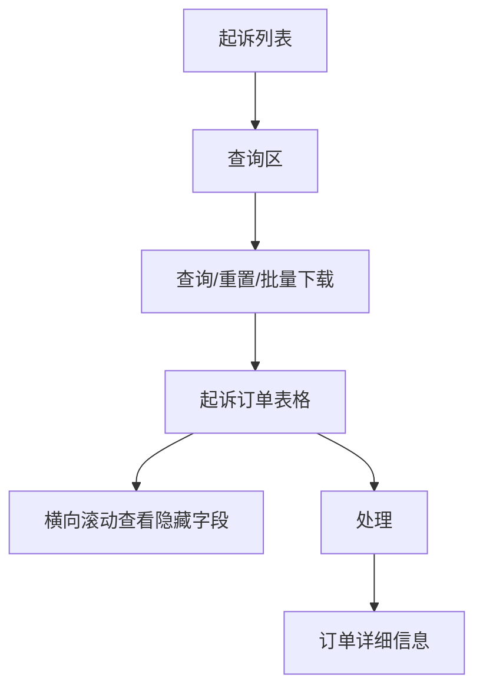
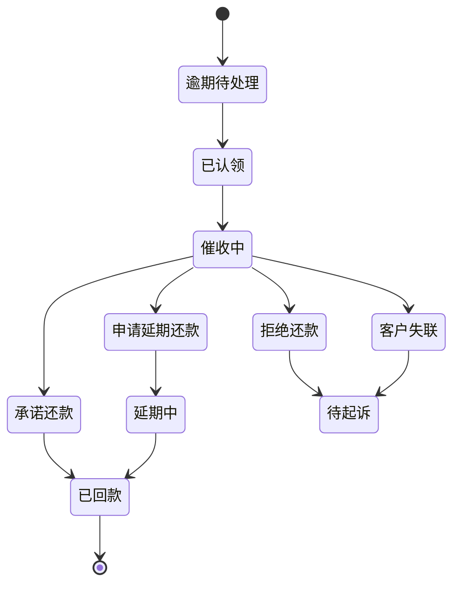
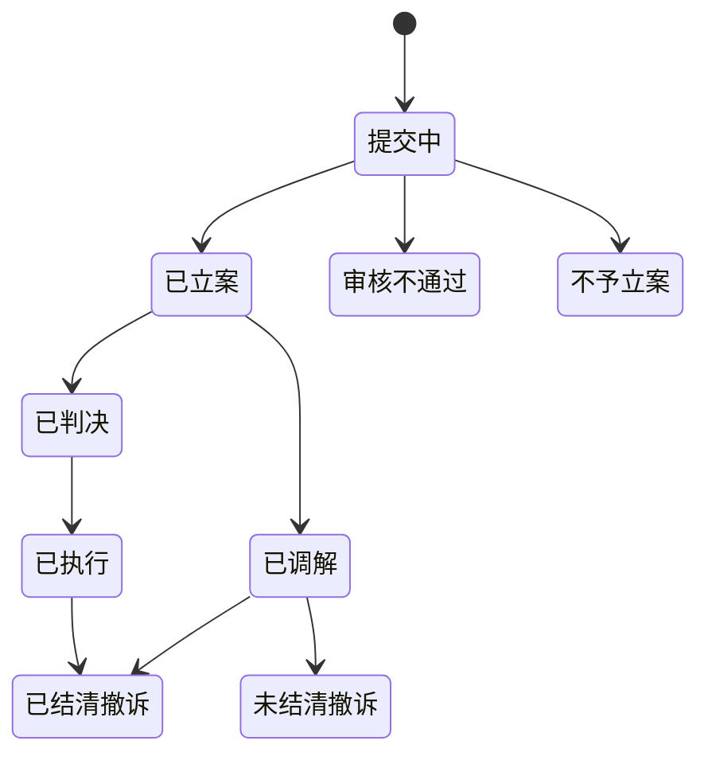

# 租后管理

> 来源：旧后台 `运营管理平台 / 租后管理` 实测梳理。模块覆盖逾期订单、催收回款、起诉订单及订单处理详情，涉及催收记录、备注、风控付费查询、代扣、押金抵扣、代客支付、判决书/资料上传、批量下载等高风险动作。本次只记录入口、弹窗、空选校验、Tab、表格横向隐藏字段和异常反馈，不执行导出、上传、扣款、抵扣、重新付费查询、保存、提交等最终动作。

## 菜单结构

```text
租后管理
├─ 逾期订单列表
├─ 催收回款列表
└─ 起诉列表
```

## 模块定位

租后管理是订单进入逾期、催收、回款、诉讼后的运营工作台。它不是独立订单系统，多个入口最终复用 `订单详细信息` 页面，因此新系统设计时需要明确：

1. `租后管理` 负责队列、筛选、分配、催收、诉讼状态跟踪。
2. `订单详情` 负责订单全量信息、账单、物流、风控、代扣、押金等底层动作。
3. 所有资金动作必须保留二次确认、权限、操作原因、审计日志。
4. 所有个人信息在列表默认脱敏，详情页按权限展示。

## 页面：逾期订单列表

- 菜单路径：`租后管理 / 逾期订单列表`
- 路由：`/Collection/BeOverdue`
- 页面标题：`逾期订单列表`

### 页面结构



### 查询区字段

| 字段 | 控件 | 实测选项/反馈 | 新系统建议 |
|---|---|---|---|
| 商品名称 | 下拉选择 | 下拉后显示 `暂无数据` | 支持商品名称/编号模糊搜索 |
| 店铺名称 | 下拉选择 | 下拉后显示 `暂无数据` | 支持店铺名称/商户编号搜索 |
| 下单人姓名 | 输入框 | `请输入下单人姓名` | 列表脱敏，查询需要权限 |
| 下单人手机号 | 输入框 | `请输入下单人手机号` | 支持完整手机号精确查询，列表脱敏 |
| 订单编号 | 输入框 | `请输入订单编号` | 精确查询 |
| 创建时间 | 日期范围 | 打开双月日历面板，含前后月/年切换 | 增加快捷项：今天、近7天、近30天 |
| 审核人 | 下拉选择 | 下拉后显示 `暂无数据` | 支持按审核人员搜索 |
| 催收人 | 下拉选择 | 下拉后显示 `暂无数据` | 支持按催收人员搜索 |
| 资方信息 | 下拉选择 | 下拉后显示 `暂无数据` | 支持资方名称/编号搜索 |

### 操作按钮

| 按钮 | 实测反馈 | 风险级别 | 新系统规则 |
|---|---|---|---|
| 查询 | 空筛选点击后列表维持当前数据 | 低 | 显示 loading；失败展示可读错误 |
| 重置 | 空筛选点击后无明显变化 | 低 | 清空全部筛选并重新拉取第一页 |
| 导出 | 未点击 | 高 | 需要导出权限、导出范围确认、审计记录 |
| 订单分配 | 未选订单时 Toast：`请选择要分配的订单！` | 中 | 有选择时打开分配弹窗，不允许直接分配 |

### 表格字段

| 字段 | 说明 |
|---|---|
| 选择框 | 支持批量分配 |
| 订单编号 | 蓝色链接，点击进入订单详情 |
| 店铺名称 | 下单店铺 |
| 渠道来源 | 订单渠道 |
| 商品名称 | 租赁商品 |
| 已支付期数/总期数 | 当前还款进度 |
| 总租金 | 订单总租金 |
| 已付租金 | 已支付租金 |
| 闲置时间 | 旧系统字段，需确认业务含义 |
| 下单人姓名 | 列表应脱敏，例如 `王*涛` |
| 下单人手机号 | 列表应脱敏，例如 `175****0329` |
| 起租时间 | 租期开始时间 |
| 归还时间 | 应归还时间 |
| 下单时间 | 订单创建时间 |
| 当前期数 | 当前账单期数 |
| 逾期天数 | 当前逾期天数 |
| 催收内容 | 最近催收小记 |
| 催收员 | 当前催收负责人 |
| 审核人 | 订单审核人员 |
| 操作 | 固定右侧列，包含 `处理`、`认领` |

### 行操作

| 操作 | 点击结果 | 新系统规则 |
|---|---|---|
| 处理 | 打开订单处理详情，路由形如 `/Order/BeOverdue/Details?id=订单ID&settlement=settlement` | 进入详情不改变状态 |
| 认领 | 未点击，属于可能改变归属的动作 | 必须二次确认；记录认领人、认领时间、来源页面 |

### 滚动与分页

- 表格存在横向滚动条；右侧 `操作` 固定列始终可见。
- 当前样例为 3 条数据、1 页；上一页/下一页禁用。
- 新系统需要在表头增加「列配置」或保持横向滚动，避免资金、逾期、催收字段被隐藏后无法发现。

## 页面：订单处理详情

- 入口：`逾期订单列表 / 处理`、`起诉列表 / 处理`
- 逾期入口路由示例：`/Order/BeOverdue/Details?id=订单ID&settlement=settlement`
- 起诉入口路由示例：`/Order/HomePage/Details?id=订单ID&settlement=settlement`
- 页面标题：`订单详细信息`
- 观察点：从租后进入详情后，面包屑归到 `订单管理 / 订单列表 / 订单详细信息`，不是 `租后管理`。新系统应保留返回来源，避免运营人员处理完后迷路。

### 页面结构



### 顶部信息区：下单人信息

| 字段 | 说明 | 新系统规则 |
|---|---|---|
| 姓名 | 真实姓名 | 详情页按权限展示；文档/导出脱敏 |
| 手机号 | 完整手机号 | 高敏字段，查看需审计 |
| 身份证号 | 完整证件号 | 高敏字段，默认遮罩，授权后查看 |
| 年龄 | 根据证件或实名信息计算 | 只读 |
| 性别 | 实名信息 | 只读 |
| 下单时间 | 订单创建时间 | 只读 |
| 在途订单数 | 用户未完结订单数 | 可点击查看用户订单聚合，旧系统未见入口 |
| 完结订单数 | 用户已完结订单数 | 可点击查看历史订单，旧系统未见入口 |
| 订单状态 | 例如 `租用中` | 与订单状态机一致 |
| 人脸认证 | 例如 `已通过` | 只读 |
| 渠道来源 | 渠道/店铺来源 | 只读 |
| 所在位置 | 旧系统可能显示 `暂无定位` | 无定位需明确原因 |
| 蚁盾分 | 链接 `去查询` | 可能触发第三方查询，需二次确认和费用提示 |
| 蚂蚁链 | 例如 `未上链` | 可作为合同存证状态 |
| 蚂蚁保险 | 例如 `未投保` | 只读 |
| 周期扣款 | 例如 `未签约`，旁边有问号图标 | 问号应提供签约说明 |
| 身份证照片 | 正面、反面、人脸照片 | 高敏图片，查看/下载需权限审计 |
| 地图位置 | 位置展示区 | 无定位时展示空态 |

### 顶部按钮

| 按钮 | 点击结果 | 风险级别 | 新系统规则 |
|---|---|---|---|
| 记录催收 | 打开 `记录催收` 弹窗 | 中 | 提交后写入催收记录；必须可追溯 |
| 备注 | 打开 `备注` 弹窗 | 中 | 提交后写入平台备注；区分商家备注/平台备注 |

#### 弹窗：记录催收

```text
点击 记录催收
  -> 弹窗标题：记录催收
  -> 必填字段：结果、小记
  -> 按钮：取消、确定
```

| 字段 | 控件 | 实测选项 |
|---|---|---|
| 结果 | 下拉选择 | 承诺还款、申请延期还款、拒绝还款、电话无人接听、电话拒接、电话关机、电话停机、客户失联 |
| 小记 | 多行文本 | 必填 |

本次只打开并取消，未点击确定。新系统应增加字数上限、敏感词提示、下一次跟进时间、通话来源记录。

#### 弹窗：备注

```text
点击 备注
  -> 弹窗标题：备注
  -> 必填字段：备注内容
  -> 按钮：取消、确定
```

本次只打开并取消，未点击确定。新系统应区分普通备注、重要备注、仅内部可见备注。

### Tab：订单信息

| 区块 | 字段/表格 | 说明 |
|---|---|---|
| 基础订单 | 订单号、用户租赁协议 | `《租赁协议》` 为可点击链接 |
| 收货人信息 | 收货人姓名、收货人手机号、收货人地址、用户备注、到期购买 | 高敏信息需权限 |
| 碎屏险 | 碎屏险、已支付碎屏险、未支付碎屏险 | 与账单/增值服务金额联动 |
| 合同区块链存证 | `区块链存证更新` 按钮；合同编号、电子数据存证证明下载、签署技术报告下载 | 更新可能调用外部服务，未点击 |
| 商家信息 | 商家名称、商家电话 | 只读 |
| 商品信息 | 商品图片、商品名称、商品编号、规格颜色、数量、买断规则 | 商品编号为链接 |
| 租用信息 | 租用天数、起租时间、归还时间 | 与账单期数联动 |
| 增值服务 | 增值服务ID、增值服务名称、增值服务价格 | 旧系统可能存在名称为空的记录 |
| 商家备注 | 备注人姓名、备注时间、备注内容 | 当前样例空 |
| 平台备注 | 备注人姓名、备注时间、备注内容 | 当前样例空 |

### Tab：风控报告

```text
点击 风控报告
  -> 若近期查过，弹出确认框：1天前查询过，展示报告还是重新付费查询？
  -> 按钮：取消、重新查询、展示报告
  -> 本次点击 展示报告，未点击 重新查询
```

| 二级 Tab | 说明 |
|---|---|
| 金牛座 | 风控报告一类 |
| 探针 | 风控报告一类 |
| 全景 | 风控报告一类 |
| 共债 | 共债类报告 |

新系统规则：

1. `重新查询` 必须展示费用、数据源、查询原因，并二次确认。
2. `展示报告` 只读取已缓存报告，不产生费用。
3. 风控报告包含高敏信息，查看、下载、复制都应审计。

### Tab：审批结论

| 字段 | 说明 |
|---|---|
| 审批时间 | 平台或商家审批时间 |
| 审批人 | 审批操作人 |
| 审批结果 | 审批通过/拒绝等 |
| 小记 | 审批备注 |

当前样例为空。新系统应展示空态，不应显示残缺表格。

### Tab：物流信息

| 区块 | 控件 | 实测反馈 | 新系统规则 |
|---|---|---|---|
| 线下签收证明资料 | 上传组件 | 点击后打开系统文件选择器，本次取消 | 上传需文件类型/大小限制、预览、删除确认 |
| 邮寄单据 | 上传组件 | 点击后打开系统文件选择器，本次取消 | 上传需记录上传人、上传时间 |

### Tab：押金管理

| 表格 | 字段 | 说明 |
|---|---|---|
| 芝麻额度冻结 | 冻结相关字段 | 旧系统按表格展示 |
| 押金支付 | 支付记录 | 与订单押金状态联动 |
| 修改记录 | 修改人、时间、内容 | 需要完整审计 |

### Tab：账单信息

账单信息是高风险区域，包含扣款、代客支付、押金抵扣等动作。

| 区块 | 字段/动作 | 说明 |
|---|---|---|
| 汇总 | 总租金、运费、平台优惠、店铺优惠 | 与订单总额联动 |
| 分期账单 | 每期账单金额、应还时间、支付状态等 | 旧系统按表格展示 |
| 买断信息 | 买断相关金额和状态 | 与买断订单联动 |
| 交易快照 | 交易快照信息 | 只读 |

#### 账单动作：发起代扣

```text
点击 发起代扣
  -> 弹窗：请选择扣款方式
  -> 单选项：预授权扣款、商家代扣、银行卡扣款
  -> 按钮：取消、确定
```

本次取消，未点确定。新系统必须在确定前展示扣款金额、账单期数、扣款渠道、失败后处理规则。

#### 账单动作：代客支付

```text
点击 代客支付
  -> 弹窗：代客支付
  -> 按钮：新增、取消、确定
  -> 新增后出现一行：流水号、支付金额、凭证上传照片、移除
```

实测：点击 `新增` 可添加一行，点击 `移除` 可删除；空字段点确定时弹窗未关闭，随后取消。新系统应明确校验提示：流水号必填、支付金额必填且大于 0、凭证必传。

#### 账单动作：押金抵扣

```text
点击 押金抵扣
  -> 确认气泡：确定要押金抵扣吗？
  -> 本次取消
```

新系统必须展示抵扣金额、抵扣账单、抵扣后剩余押金/欠款，并要求权限和原因。

### Tab：催收记录

| 二级表格 | 字段 | 当前状态 |
|---|---|---|
| 商家催收 | 记录人、记录时间、结果、小记 | 当前样例空 |
| 平台催收 | 记录人、记录时间、结果、小记 | 当前样例空 |

新系统建议统一催收记录模型，区分来源：商家、平台、系统、第三方呼叫中心。

### Tab：流程进度

旧系统展示时间线 `订单进度`，可见节点包括：

```text
买家下单 -> 平台转单 -> 商家审核 -> 用户自提
```

新系统应补齐每个节点：动作人、动作时间、来源系统、失败原因。

### Tab：代扣银行卡

| 控件/字段 | 实测反馈 | 新系统规则 |
|---|---|---|
| 查询 | 点击后当前为空表 | 查询失败需展示原因 |
| 开户行 | 表格字段 | 银行信息高敏，列表脱敏 |
| 银行卡 | 表格字段 | 默认只展示后四位 |
| 银行类型 | 表格字段 | 借记卡/信用卡等 |
| 创建时间 | 表格字段 | 只读 |

## 页面：催收回款列表

- 菜单路径：`租后管理 / 催收回款列表`
- 路由：`/Collection/CollectReturn`
- 页面标题：`催收回款列表`

### 页面结构



### 查询区字段

| 字段 | 控件 | 实测选项/反馈 | 新系统建议 |
|---|---|---|---|
| 下单人姓名 | 输入框 | `请输入下单人姓名` | 敏感查询需权限 |
| 下单人手机号 | 输入框 | `请输入下单人手机号` | 支持精确查询 |
| 订单编号 | 输入框 | `请输入订单编号` | 精确查询 |
| 实际还款日期 | 日期范围 | 打开双月日历面板 | 加快捷项 |
| 闲置时间 | 下拉选择 | 可见 `0天` 至 `9天` | 需确认是否还有更多选项 |
| 是否提前还款 | 下拉选择 | `是`、`否` | 布尔筛选 |
| 是否逾期 | 下拉选择 | `是`、`否` | 布尔筛选 |
| 催收人 | 下拉选择 | 下拉后显示 `暂无数据` | 支持人员搜索 |

### 操作按钮与异常

| 按钮 | 实测反馈 | 风险级别 | 新系统规则 |
|---|---|---|---|
| 查询 | 空筛选点击后出现后端异常 Toast | 低 | 不允许把 SQL/Java 堆栈暴露给前端 |
| 重置 | 点击后无明显变化，异常 Toast 仍在 | 低 | 清空筛选并重新查询；清除旧错误 |
| 导出 | 未点击 | 高 | 需要权限、范围确认、审计 |

### 已发现缺陷

旧系统空筛选查询时暴露后端异常：

```text
nested exception is org.apache.ibatis.exceptions.PersistenceException:
Cause: java.lang.IllegalStateException: Missing right paren.
SQL: SELECT ... FROM ct_backstage_user WHERE (id IN ())
```

产品与技术要求：

1. 空 ID 集合时不要拼接 `IN ()`。
2. 前端只展示业务提示，例如 `查询失败，请稍后重试`。
3. 后端日志保留 traceId，便于排查。
4. 查询失败后必须停止 loading，不应让表格一直处于准备中状态。

### 表格字段

| 字段 | 说明 |
|---|---|
| 订单编号 | 关联订单 |
| 逾期天数 | 回款前逾期天数 |
| 下单人姓名 | 脱敏展示 |
| 下单人手机号 | 脱敏展示 |
| 已付租金 | 已支付金额 |
| 催收员 | 催收负责人 |
| 还款客服 | 回款登记人或客服 |
| 审核人 | 审核人员 |
| 止租时间 | 停止计租时间 |
| 应还款时间 | 应还日期 |
| 实际还款时间 | 实际回款日期 |
| 还款方式 | 支付方式 |
| 催收内容 | 最近催收小记 |
| 闲置时间 | 旧系统字段，需确认定义 |
| 操作 | 固定右侧操作列 |

## 页面：起诉列表

- 菜单路径：`租后管理 / 起诉列表`
- 路由：`/Collection/QueryLawsuitOrdersByCondition`
- 页面标题：`起诉列表`

### 页面结构



### 查询区字段

| 字段 | 控件 | 实测选项/反馈 | 新系统建议 |
|---|---|---|---|
| 商品名称 | 下拉选择 | 下拉后显示 `暂无数据` | 支持搜索 |
| 店铺名称 | 下拉选择 | 下拉后显示 `暂无数据` | 支持搜索 |
| 下单人姓名 | 输入框 | `请输入下单人姓名` | 敏感查询需权限 |
| 下单人手机号 | 输入框 | `请输入下单人手机号` | 支持精确查询 |
| 订单编号 | 输入框 | `请输入订单编号` | 精确查询 |
| 创建时间 | 日期范围 | 打开双月日历面板 | 快捷时间范围 |
| 审核人 | 下拉选择 | 下拉后显示 `暂无数据` | 支持人员搜索 |
| 认领人 | 下拉选择 | 下拉后显示 `暂无数据` | 支持人员搜索 |
| 催收人 | 下拉选择 | 下拉后显示 `暂无数据` | 支持人员搜索 |
| 商户信息 | 下拉选择 | 下拉后显示 `暂无数据` | 支持商户搜索 |
| 逾期天数 | 起止数字输入 | `请输入逾期开始天数`、`请输入逾期结束天数` | 结束天数必须大于等于开始天数 |
| 催收结果 | 下拉选择 | 承诺还款、申请延期还款、拒绝还款、电话无人接听、电话拒接、电话关机、电话停机、客户失联 | 与催收记录字典一致 |
| 诉讼状态 | 下拉选择 | 提交中、已立案、已调解、已判决、已执行、已结清撤诉、未结清撤诉、审核不通过、不予立案 | 需要状态机 |
| 是否收到调解金 | 下拉选择 | 未收到、已收到 | 与金额字段联动 |

### 操作按钮

| 按钮 | 实测反馈 | 风险级别 | 新系统规则 |
|---|---|---|---|
| 查询 | 空筛选点击后显示 `您的专属数据正在准备中。`，随后返回 3 条数据 | 低 | loading 期间禁用重复点击 |
| 重置 | 空筛选点击后重新加载同一批数据 | 低 | 清空筛选并回到第一页 |
| 批量下载 | 未选订单时 Toast：`错误提示 请选择要下载的订单！` | 高 | 有选择时需二次确认下载内容和权限 |

### 表格字段

| 字段 | 说明 |
|---|---|
| 选择框 | 支持批量下载 |
| 序号 | 行序号 |
| 订单编号 | 蓝色链接，点击进入详情 |
| 诉讼状态 | 当前样例为空 |
| 律师费 | 当前样例为空 |
| 诉讼费 | 当前样例为空 |
| 案件号 | 当前样例为空 |
| 是否上传判决书 | 当前样例显示 `未上传` |
| 调解/判决金额 | 当前样例显示 `未收到` |
| 下单平台 | 例如 `支付宝`、`H5` |
| 店铺名称 | 下单店铺 |
| 渠道来源 | 渠道 |
| 商品名称 | 租赁商品 |
| 已支付期数/总期数 | 例如 `0/9`、`0/12` |
| 总租金 | 订单总租金 |
| 已付租金 | 已支付租金 |
| 闲置时间 | 旧系统字段，需确认定义 |
| 下单人姓名 | 脱敏展示，例如 `王*涛` |
| 下单人手机号 | 脱敏展示，例如 `175****0329` |
| 起租时间 | 租期开始 |
| 归还时间 | 应归还时间 |
| 下单时间 | 创建时间 |
| 当前期数 | 可排序字段 |
| 逾期天数 | 逾期天数 |
| 催收内容 | 最近催收小记 |
| 催收员 | 催收负责人 |
| 审核人 | 审核人员 |
| 操作 | 固定右侧列，包含 `处理` |

### 横向滚动检查

旧系统默认只露出前半段字段；向右移动横向滚动条后，可以看到：

```text
商品名称 -> 已支付期数/总期数 -> 总租金 -> 已付租金 -> 闲置时间
-> 下单人姓名 -> 下单人手机号 -> 起租时间 -> 归还时间
-> 下单时间 -> 当前期数 -> 操作
```

新系统应避免核心字段被无提示隐藏。推荐：

1. 固定左侧 `订单编号` 和右侧 `操作`。
2. 支持列设置。
3. 金额、逾期、诉讼状态字段默认展示。

### 分页与排序

| 控件 | 实测反馈 | 新系统规则 |
|---|---|---|
| 上一页/下一页 | 当前 1 页 3 条，按钮禁用 | 有多页时可点击 |
| 页大小 | 下拉选项：`10条/页`、`20条/页`、`50条/页`、`100条/页` | 默认 50，切换后回到第 1 页 |
| 当前期数排序 | 表头有上下箭头；点击表头未观察到明显顺序变化，样例三行当前期数均为 1 | 排序字段应明确高亮当前方向 |

### 行操作

| 操作 | 点击结果 | 新系统规则 |
|---|---|---|
| 处理 | 新开订单详情页，路由形如 `/Order/HomePage/Details?id=订单ID&settlement=settlement`；面包屑显示 `订单管理 / 订单列表 / 订单详细信息` | 进入详情不改变状态；保留来源返回 `起诉列表` |

## 关键业务状态机建议

### 逾期催收状态



### 诉讼状态



## 权限与审计

| 动作 | 权限要求 | 审计内容 |
|---|---|---|
| 查看完整手机号/身份证/照片 | 高敏信息查看权限 | 查看人、时间、订单、字段 |
| 记录催收 | 催收权限 | 结果、小记、跟进时间、来源 |
| 备注 | 订单备注权限 | 备注内容、可见范围 |
| 订单分配/认领 | 催收主管或本人认领权限 | 原负责人、新负责人、原因 |
| 导出/批量下载 | 数据导出权限 | 条件、数量、文件名、下载人 |
| 风控重新查询 | 风控查询权限和费用权限 | 数据源、费用、查询原因 |
| 发起代扣 | 资金扣款权限 | 金额、渠道、账单、确认人 |
| 代客支付 | 财务登记权限 | 流水号、金额、凭证 |
| 押金抵扣 | 押金处理权限 | 抵扣金额、账单、原因 |
| 上传证明/判决书 | 文件上传权限 | 文件名、类型、大小、上传人 |

## 待确认问题

1. `闲置时间` 在逾期、回款、起诉三页都出现，需要确认业务定义，是设备闲置天数、账单闲置天数还是租后停滞时间。
2. `订单分配` 与行内 `认领` 的权限边界需要确认：是否允许催收员自助认领，还是必须主管分配。
3. `起诉列表` 的律师费、诉讼费、案件号、判决书上传入口在当前样例为空，需要确认从哪里编辑。
4. `调解/判决金额` 同时展示金额和是否收到调解金，建议拆成 `调解/判决金额`、`收款状态`、`收款时间`。
5. 租后详情复用订单详情，但面包屑跳到订单管理，新系统需要明确返回路径和来源参数。
6. 催收结果字典需要统一用于 `记录催收`、`催收回款列表`、`起诉列表`，避免同义状态分散。
7. 催收回款列表当前存在空 ID 集合 SQL 异常，重构时要作为 P0 后端查询保护项处理。
