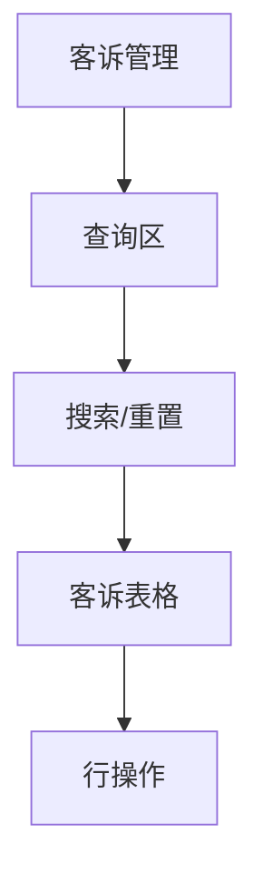
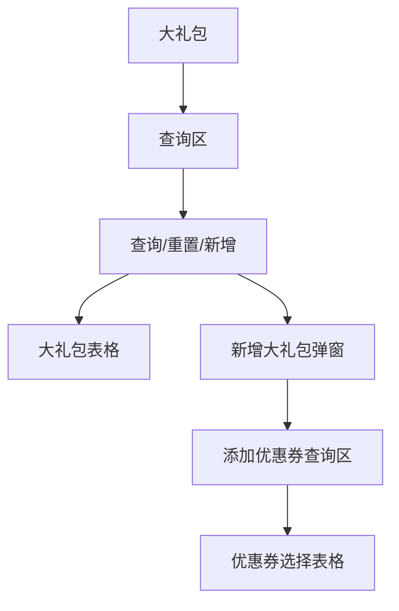
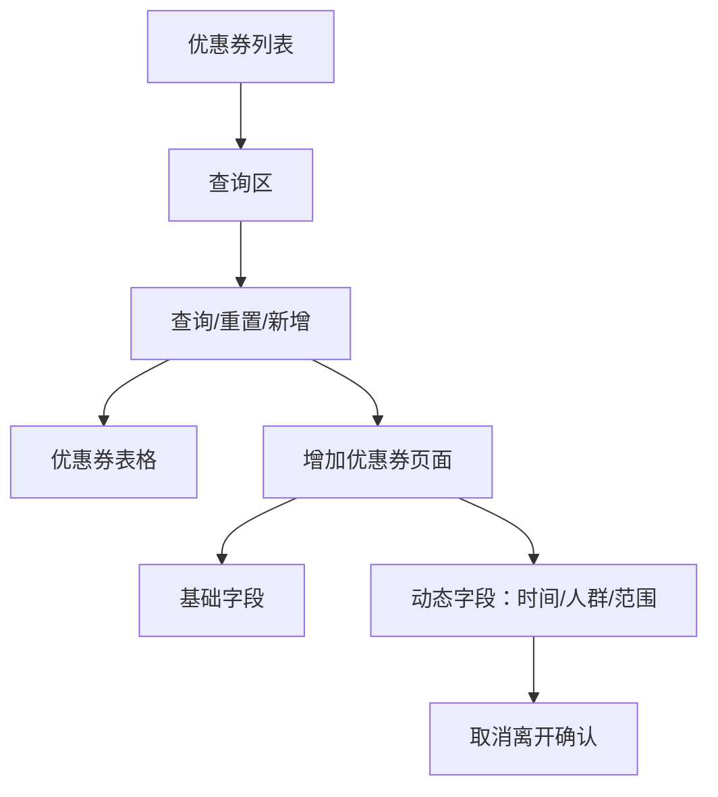

# 营销管理

> 来源：旧后台 `运营管理平台 / 营销管理` 实测梳理。模块覆盖客诉管理、小程序大礼包、小程序优惠券。优惠券/礼包属于营销资产，新增、发放、失效、指定用户上传等动作会影响用户权益和成本，本次只记录入口、查询、下拉、空态、新增表单、动态字段和取消/离开确认，不执行确定保存、不上传文件、不下载模板。

## 菜单结构

```text
营销管理
├─ 客诉管理
├─ 小程序大礼包
└─ 小程序优惠券
```

## 模块定位

营销管理用于处理用户投诉、配置小程序营销礼包和优惠券。新系统需要把它拆成三个业务边界：

1. `客诉管理`：记录用户投诉、涉诉订单/商户、处理状态和处理结果。
2. `大礼包管理`：把多个优惠券组合成礼包，控制新用户专享、状态、发放总量和库存。
3. `优惠券管理`：配置单张优惠券的面额、使用条件、有效期、人群、适用范围和状态。

所有发放类动作必须具备操作人、操作时间、变更前后值、适用人群、适用商品范围和撤销/失效规则。

## 页面：客诉管理

- 菜单路径：`营销管理 / 客诉管理`
- 路由：`/Marketing/Comment`
- 页面标题：`客诉管理`
- 顶部 Tab：`客诉`

### 页面结构



### 查询区字段

| 字段 | 控件 | 实测选项/反馈 | 新系统建议 |
|---|---|---|---|
| 投诉人 | 输入框 | `请输入投诉人` | 支持姓名/昵称模糊查询，列表展示脱敏 |
| 订单号 | 输入框 | `请输入订单号` | 精确查询 |
| 涉诉商户 | 输入框 | `请输入涉诉商户` | 支持商户简称/全称 |
| 涉诉类型 | 下拉选择 | 打开后显示 `暂无数据` | 字典配置：商品、物流、租金、售后、账单、服务态度等 |
| 联系电话 | 输入框 | `请输入联系电话` | 精确查询，列表脱敏 |
| 处理状态 | 下拉选择 | 默认 `未处理`；选项：`未处理`、`已处理` | 建议扩展为未处理、处理中、已处理、无需处理、已关闭 |

### 操作按钮

| 按钮 | 点击结果 | 新系统规则 |
|---|---|---|
| 搜索 | 空筛选且处理状态为 `未处理` 时点击，表格维持空态 | 显示 loading；失败展示错误原因 |
| 重置 | 清空 `处理状态` 为占位状态，表格仍为空态 | 清空全部字段并回到第一页 |

### 表格字段

| 字段 | 说明 |
|---|---|
| 投诉人 | 投诉用户，默认脱敏 |
| 订单号 | 涉诉订单 |
| 涉诉商户 | 涉诉商家 |
| 涉诉类型 | 投诉分类 |
| 手机号码 | 投诉人联系方式，默认脱敏 |
| 投诉时间 | 投诉创建时间 |
| 处理状态 | 当前处理状态 |
| 操作 | 空表时无行内按钮可测 |

### 空状态

- 当前实测表格为空，显示 `暂无数据`。
- 新系统需要补齐空状态文案：`暂无客诉记录`，并区分“无数据”和“筛选无结果”。

## 页面：小程序大礼包

- 菜单路径：`营销管理 / 小程序大礼包`
- 路由：`/Marketing/zuwuzuPackage/Package`
- 页面标题：`大礼包`

### 页面结构



### 查询区字段

| 字段 | 控件 | 实测选项/反馈 |
|---|---|---|
| 用法 | 下拉选择 | 默认 `独立使用`；选项：`独立使用`、`营销活动` |
| 大礼包名称 | 输入框 | `请输入大礼包名称` |
| 大礼包状态 | 下拉选择 | 默认 `有效`；选项：`有效`、`失效` |

### 操作按钮

| 按钮 | 点击结果 | 新系统规则 |
|---|---|---|
| 查询 | 空筛选点击，表格保持 `暂无数据` | 显示 loading；失败提示 |
| 重置 | 清空 `用法`、`大礼包状态` 为占位状态，表格保持空态 | 清空全部字段并回到第一页 |
| 新增 | 打开 `新增大礼包` 弹窗 | 新增前不改变数据 |

### 表格字段

| 字段 | 说明 |
|---|---|
| 大礼包ID | 礼包主键 |
| 大礼包名称 | 礼包名称 |
| 新用户专享 | 是否仅新用户可领 |
| 大礼包状态 | 有效/失效 |
| 优惠券名称 | 礼包内优惠券 |
| 发放总量 | 礼包发放总量 |
| 库存 | 剩余库存 |
| 面额 | 优惠券面额 |
| 使用条件 | 使用门槛 |
| 每人限领 | 单用户限领规则 |
| 时间设置 | 有效期设置 |
| 操作 | 空表时无行内按钮可测 |

### 弹窗：新增大礼包

```text
点击 新增
  -> 弹窗标题：新增大礼包
  -> 填写基础信息
  -> 查询并选择优惠券
  -> 点击 取消：关闭弹窗，不保存
  -> 点击 确定：本次未执行
```

| 字段/控件 | 类型 | 实测反馈 |
|---|---|---|
| 用法 | 必填下拉 | 默认 `独立使用`；选项：`独立使用`、`营销活动` |
| 大礼包名称 | 必填输入框 | `请输入大礼包名称` |
| 数量 | 必填数字输入 | `请输入` |
| 每人限领 | 必填数字输入 | `请输入` |
| 新用户专享 | 必填单选 | 默认 `是`；可选 `否` |
| 大礼包状态 | 必填单选 | 默认 `有效`；可选 `失效` |
| 添加优惠券-优惠券名称 | 输入框 | `请输入优惠券名称` |
| 添加优惠券-查询 | 按钮 | 空条件点击后优惠券表格仍为空，无 Toast |
| 优惠券选择表格 | 表格 | 列：选择框、优惠券ID、名称、发放总量、库存、面额 |
| 取消 | 按钮 | 关闭弹窗，不保存 |
| 确定 | 按钮 | 本次未点击 |

### 新系统规则

1. 礼包必须至少选择 1 张有效优惠券才能保存。
2. 礼包库存不得超过内部优惠券最小可用库存。
3. `新用户专享` 的新用户定义要写清楚：从未下单、从未支付、还是从未领取过。
4. 已被领取的礼包不允许直接删除，只允许失效。

## 页面：小程序优惠券

- 菜单路径：`营销管理 / 小程序优惠券`
- 路由：`/Marketing/zuwuzuPackage/Coupon/list`
- 页面标题：`优惠券列表`

### 页面结构



### 查询区字段

| 字段 | 控件 | 实测选项/反馈 |
|---|---|---|
| 用法 | 下拉选择 | 默认 `独立使用`；选项：`独立使用`、`大礼包`、`营销活动` |
| 优惠券名称 | 输入框 | `请输入优惠券名称` |
| 优惠券状态 | 下拉选择 | 默认 `有效`；选项：`有效`、`失效`、`已经领取完` |

### 操作按钮

| 按钮 | 点击结果 | 新系统规则 |
|---|---|---|
| 查询 | 空筛选点击，表格保持 `暂无数据` | 显示 loading；失败展示错误 |
| 重置 | 旧系统点击后当前默认项未明显变化 | 新系统应清空全部筛选并回到第一页 |
| 新增 | 跳转到 `增加优惠券` 路由页，不是弹窗 | 进入新增页不创建数据 |

### 表格字段

| 字段 | 说明 |
|---|---|
| 优惠券ID | 优惠券主键 |
| 版本 | 优惠券版本 |
| 名称 | 优惠券名称 |
| 发放总量 | 发行数量 |
| 库存 | 剩余库存 |
| 面额 | 优惠金额 |
| 使用条件 | 满减/不限制 |
| 每人限领 | 单用户限领 |
| 时间设置 | 固定时间或领取后有效期 |
| 优惠券状态 | 有效、失效、已领完 |
| 操作 | 空表时无行内按钮可测 |

### 页面：增加优惠券

- 入口：`优惠券列表 / 新增`
- 路由：`/Marketing/zuwuzuPackage/Coupon/list/add`
- 面包屑仍显示 `营销管理 / 小程序优惠券`
- 页面标题：`增加优惠券`

#### 基础字段

| 字段 | 控件 | 实测选项/反馈 | 说明 |
|---|---|---|---|
| 用法 | 必填下拉 | 默认 `独立使用`；选项：`独立使用`、`大礼包`、`营销活动` | 会动态改变后续字段 |
| 优惠券类别 | 必填下拉 | 选项：`租赁`、`买断` | 用于区分租赁券/买断券 |
| 优惠券名称 | 必填输入框 | `请输入优惠券名称` | 建议限制长度和重复名称 |
| 发放总量 | 必填数字输入 | 独立使用时显示，单位 `张` | 用法切为 `大礼包` 后不显示 |
| 面额 | 必填数字输入 | 单位 `元` | 必须大于 0 |
| 使用条件 | 必填单选+数字 | `不限制`、`满 1.00 元`；默认选中满额 | 满额数值必须大于面额 |
| 每人限领 | 必填下拉 | 默认 `无限制` | 用法切为 `大礼包` 后不显示 |
| 时间设置 | 必填单选 | `按固定时间`、`按领取日期` | 动态显示日期范围或领取后有效天数 |
| 优惠券使用人群 | 必填单选 | `所有人`、`指定用户`、`新用户` | 指定用户时出现上传区域 |
| 优惠券适用范围 | 必填单选 | `全场通用`、`指定类目`、`指定商品` | 指定类目/商品时出现选择区 |
| 优惠券状态 | 必填单选 | `有效`、`失效`、`已领完` | 新增时不建议允许直接选 `已领完` |
| 优惠券展示说明 | 多行文本 | `最多显示12个字` | 小程序端展示文案 |
| 是否已分配大礼包 | 只读文本 | 用法为 `大礼包` 时显示 `未分配大礼包` | 表示该券是否已绑定礼包 |

#### 动态字段：用法

| 点击 | 反馈 |
|---|---|
| 点击 `用法` 下拉 | 展开 `独立使用`、`大礼包`、`营销活动` |
| 选择 `大礼包` | 表单去掉 `发放总量`、`每人限领`，新增 `是否已分配大礼包：未分配大礼包` |

#### 动态字段：时间设置

| 点击 | 反馈 |
|---|---|
| 点击 `按固定时间` | 显示日期范围输入框，默认当日到当日；点击日期框打开双月日历，支持上年、上月、年月切换、下月、下年 |
| 点击 `按领取日期` | 显示 `自领取时 [数字] 天内未使用优惠券自动过期` |

#### 动态字段：优惠券使用人群

| 点击 | 反馈 | 新系统规则 |
|---|---|---|
| 所有人 | 不显示额外字段 | 默认面向所有可用用户 |
| 指定用户 | 显示 `上传` 区，含 `下载模板` 和 `上传` 按钮 | 上传前校验模板、手机号/用户ID、重复用户、黑名单 |
| 新用户 | 不显示上传区 | 新用户定义必须在规则中固定 |

`下载模板` 链接指向旧系统静态 Excel：`/static/crmTable.2bddfce4.xlsx`。本次未下载。`上传` 会进入文件上传流程，本次未点击上传文件。

#### 动态字段：优惠券适用范围

| 点击 | 反馈 | 新系统规则 |
|---|---|---|
| 全场通用 | 不显示额外字段 | 默认全品类全商品可用 |
| 指定类目 | 显示 `指定类目` 选择框，占位 `请选择类目` | 必须至少选择 1 个类目 |
| 指定商品 | 显示灰底商品选择区：`商品名称/货号` 搜索框、`请选择商品` 下拉、`新增`、`清空`、文案 `购买以下分类商品可使用优惠券抵扣金额，已选中 0 个分类` | 必须至少新增 1 个商品；清空需确认 |

#### 底部按钮与离开确认

| 按钮 | 点击结果 | 新系统规则 |
|---|---|---|
| 取消 | 因页面已产生未保存改动，弹出确认：`确定离开当前页面吗？未保存的数据将会丢失`，按钮 `取消`、`确定` | 离开确认属于安全确认；确认后返回列表 |
| 确定 | 本次未点击 | 保存前必须校验所有必填项、库存、时间、适用范围 |

本次点击离开确认里的 `确定` 仅用于退出新增页面，没有创建或变更优惠券。

## 权限与审计

| 动作 | 风险 | 审计要求 |
|---|---|---|
| 新增/编辑优惠券 | 高 | 记录全部字段变更、适用人群、适用范围、库存、状态 |
| 失效优惠券 | 高 | 二次确认；记录原因；已领取未使用券的处理规则必须明确 |
| 指定用户上传 | 高 | 记录上传文件名、文件 hash、成功/失败行数、操作人 |
| 大礼包新增/失效 | 高 | 记录绑定优惠券、库存计算、是否新用户专享 |
| 客诉处理 | 中 | 记录处理人、处理时间、处理内容、附件和结论 |

## 待确认问题

1. `客诉管理 / 涉诉类型` 当前无数据，新系统是否需要由字典后台维护？
2. 优惠券 `新用户` 的定义需要业务确认。
3. 优惠券 `已经领取完` 和新增页 `已领完` 文案不一致，新系统建议统一为 `已领完`。
4. 旧系统取消新增优惠券后会短暂跳到 `/Marketing/Coupon/list` 空白路由，再点菜单才能回到正确列表；新系统应修复为稳定返回 `/Marketing/zuwuzuPackage/Coupon/list`。
5. `指定商品` 区域文案写的是“已选中 0 个分类”，但场景是指定商品，疑似旧系统文案错误。
