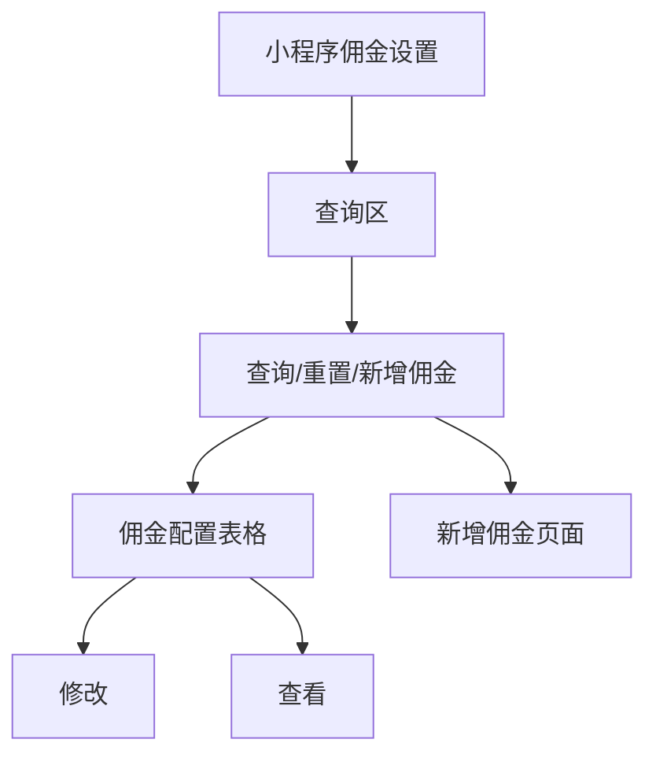
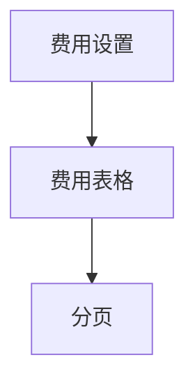

# 佣金管理

> 来源：旧后台 `运营管理平台 / 佣金管理` 实测梳理。模块覆盖小程序佣金设置和费用设置。佣金比例、商家支付宝信息、买断尾款/租金分账会影响资金分配，本次只记录入口、筛选、列表、详情、新增/修改表单、离开确认和费用分页，不执行保存确认。

## 菜单结构

```text
佣金管理
├─ 小程序佣金设置
└─ 费用设置
```

## 模块定位

佣金管理用于配置小程序订单的分佣规则，以及展示第三方服务调用成本。新系统要把它和财务结算、商家资金账户、订单账单区分清楚：

1. `小程序佣金设置` 配置商家和平台之间的分佣比例。
2. `费用设置` 展示风控、短信、合同、OCR 等第三方服务成本。
3. 佣金比例变更必须走审批/版本化，不能直接覆盖历史规则。
4. 已产生订单的佣金规则应按订单创建时的版本锁定。

## 页面：小程序佣金设置

- 菜单路径：`佣金管理 / 小程序佣金设置`
- 路由：`/commission/liteList`
- 页面标题：`小程序佣金设置`

### 页面结构



### 查询区字段

| 字段 | 控件 | 实测选项/反馈 |
|---|---|---|
| 商家名称 | 输入框 | `请输入商家名称` |
| 分佣类型 | 下拉选择 | 选项：`买断`、`月租金分账` |
| 分佣状态 | 下拉选择 | 选项：`审核通过`、`审核拒绝`、`待审核` |

### 操作按钮

| 按钮 | 点击结果 | 新系统规则 |
|---|---|---|
| 查询 | 空条件点击后 Toast：`获取信息成功`，列表保持 1 条 | 显示 loading；失败展示错误原因 |
| 重置 | 清空筛选后 Toast：`获取信息成功`，列表保持 1 条 | 清空筛选并回到第一页 |
| 新增佣金 | 跳转到 `新增佣金` 页面 | 不直接创建数据 |

### 表格字段

| 字段 | 说明 |
|---|---|
| 店铺编号 | 店铺唯一编号，文档中应脱敏 |
| 店铺名称 | 商家店铺名称 |
| 企业资质名称 | 企业认证主体 |
| 分佣类型 | 例如 `买断,月租金分账` |
| 分佣状态 | 例如 `审核通过` |
| 创建时间 | 配置创建时间 |
| 操作 | `修改`、`查看` |

### 分页

- 当前数据：`共有1条`。
- 上一页/下一页禁用。
- 每页条数下拉：`5 条/页`、`10 条/页`、`20 条/页`。

## 页面：佣金详情

- 入口：`小程序佣金设置 / 查看`
- 路由：`/commission/liteList/commissionDetail/{id}`
- 页面标题：`佣金详情`

### 页面字段

| 字段 | 说明 |
|---|---|
| 企业资质名称 | 商户企业主体 |
| 店铺名称 | 店铺名称 |
| 分拥状态 | 旧系统字段文案为 `分拥状态`，建议新系统统一为 `分佣状态` |
| 创建时间 | 佣金配置创建时间 |
| 店铺ID | 店铺唯一编号 |
| 平台支付宝账号 | 平台收款主体/账号，属于敏感财务信息 |
| 分拥类型 | 分别展示 `买断`、`月租金分账` |
| 结算周期 | 当前为 `按7个自然日` |
| 分拥比例 | 买断示例：商家 100%、平台 0%；月租金示例：商家 98%、平台 2% |
| 审核时间 | 审核通过时间 |
| 审核人 | 当前样例为空 |
| 审核意见 | 当前样例为空 |

详情页无可点击按钮，仅展示信息。

## 页面：修改佣金

- 入口：`小程序佣金设置 / 修改`
- 路由：`/commission/liteList/edit/{id}`
- 页面标题：`修改佣金`

### 表单字段

| 字段 | 控件 | 实测反馈 |
|---|---|---|
| 店铺名称 | 必填下拉 | 当前已选店铺；下拉仅 1 个店铺选项 |
| 企业资质名称 | 禁用输入框 | 根据店铺自动带出 |
| 店铺编号 | 禁用输入框 | 根据店铺自动带出 |
| 分佣类型-租金 | 复选框 + 下拉 | 勾选后显示 `分佣比例`，下拉当前只有 `租金` |
| 租金-商家占比 | 数字输入 | 当前示例 98 |
| 租金-平台占比 | 数字输入 | 当前示例 2 |
| 买断尾款 | 复选框 | 勾选后显示分佣比例 |
| 买断尾款-商家占比 | 数字输入 | 当前示例 100 |
| 买断尾款-平台占比 | 数字输入 | 当前示例 0，减号禁用 |
| 商家支付宝信息-姓名 | 输入框 | 当前有值，文档不保留完整真实信息 |
| 商家支付宝信息-支付宝账号 | 输入框 | 当前有值，文档不保留完整账号 |
| 取消 | 按钮 | 返回列表，当前未弹二次确认 |
| 确定 | 按钮 | 本次未点击 |

### 新系统规则

1. 商家占比 + 平台占比必须等于 100。
2. 比例只允许 0 到 100，最多两位小数。
3. 修改比例必须填写原因，并生成新版本。
4. 支付宝主体/账号变更必须校验实名主体和商户主体一致性。
5. 修改后应进入 `待审核`，不能直接生效。

## 页面：新增佣金

- 入口：`小程序佣金设置 / 新增佣金`
- 路由：`/commission/liteList/liteAdd`
- 页面标题：`新增佣金`

### 表单字段

| 字段 | 控件 | 实测反馈 |
|---|---|---|
| 店铺名称 | 必填下拉 | 占位 `请选择店铺名称`；下拉有店铺选项 |
| 企业资质名称 | 禁用输入框 | 选择店铺后自动带出 |
| 店铺编号 | 禁用输入框 | 选择店铺后自动带出 |
| 分佣类型-租金 | 复选框 + 下拉 | 勾选后出现租金分佣比例，商家占比/平台占比默认 0 |
| 买断尾款 | 复选框 | 勾选后出现买断尾款分佣比例，商家占比/平台占比默认 0 |
| 商家支付宝信息-姓名 | 输入框 | `请输入姓名` |
| 商家支付宝信息-支付宝账号 | 输入框 | `请输入支付宝账号` |
| 取消 | 按钮 | 表单有未保存选择时弹出确认：`确定离开当前页面吗？未保存的数据将会丢失` |
| 确定 | 按钮 | 本次未点击 |

本次点击取消后，在离开确认里点击 `确定` 返回列表，没有创建数据。

## 页面：费用设置

- 菜单路径：`佣金管理 / 费用设置`
- 路由：`/commission/cost`
- 页面标题：`费用设置`

### 页面结构



### 表格字段

| 字段 | 说明 |
|---|---|
| 服务 | 第三方服务名称 |
| 费用（元） | 单次调用成本 |

### 当前费用项

| 服务 | 费用（元） |
|---|---:|
| 新颜全景风控报告 | 1 |
| 新颜探针风控报告 | 1 |
| 二要素 | 0.3 |
| 人脸费用 | 0.8 |
| 交互式分控 | 0.2 |
| 天狼星报告星耀版多形式 | 2.8 |
| 电子合同 | 1.5 |
| 新颜共债风控报告 | 1 |
| 猎户座 | 5.9 |
| 身份证OCR | 0.06 |
| 快递查询 | 0.1 |
| 短信 | 0.1 |
| 查询征信报告 | 20 |
| 租先知报告 | 5.9 |
| 金牛座报告 | 5.9 |

### 分页

- 共 2 页、15 条。
- 点击页码 `2` 后展示第 2 页 5 条。
- 无新增、修改、删除入口。

## 权限与审计

| 动作 | 风险 | 审计要求 |
|---|---|---|
| 新增佣金 | 高 | 记录店铺、分佣类型、比例、支付宝信息、提交人 |
| 修改佣金 | 高 | 记录变更前后比例、变更原因、审核流 |
| 审核佣金 | 高 | 审核人、审核时间、审核意见不可为空 |
| 查看支付宝账号 | 高 | 财务敏感字段查看需权限和日志 |
| 查看费用设置 | 低 | 可只读，但成本数据属于内部经营数据 |

## 待确认问题

1. 旧系统字段 `分拥状态`、`分拥类型` 文案疑似错别字，新系统建议统一为 `分佣`。
2. 佣金配置是否需要审核流，旧系统已有 `待审核/审核通过/审核拒绝` 状态，但修改页未显示提交审核说明。
3. 费用设置是否只是只读配置，还是后台可维护但当前账号无权限。
4. 费用设置中的第三方服务是否要和实际调用扣费联动到中控台/资方/商家账单。
