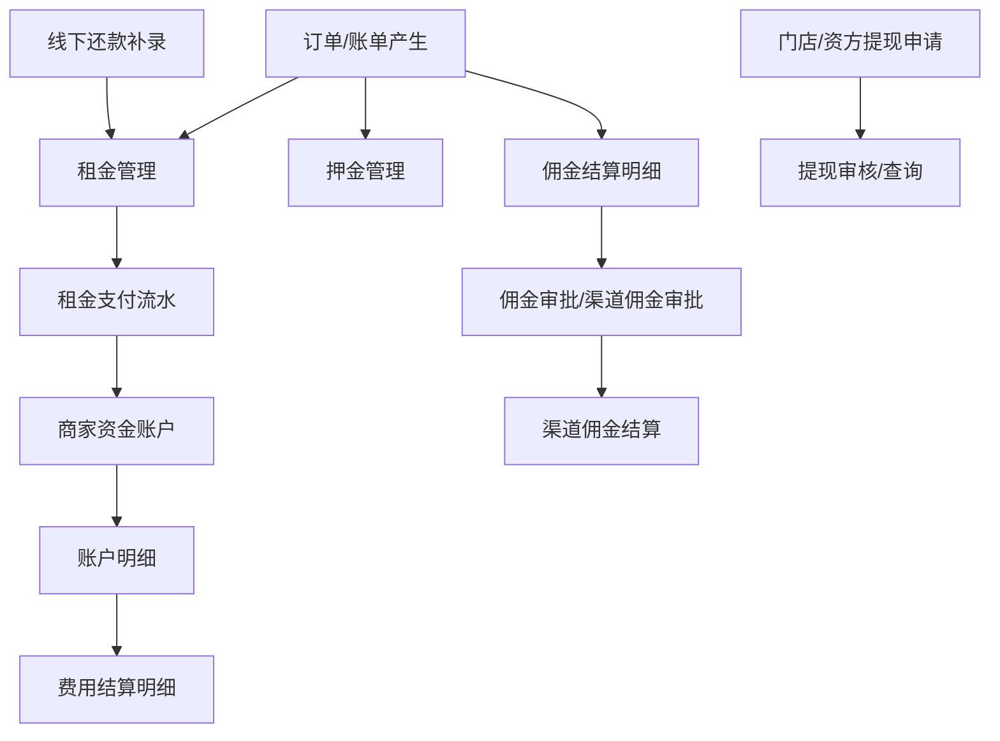

# 财务管理

> 记录范围：租金管理、线下还款、提现列表、门店提现列表、押金管理、商家资金账户、资方提现列表、佣金审批、佣金结算明细、费用结算明细、渠道佣金审批、渠道佣金结算。所有订单号、手机号、店铺编号、企业名、地址均已脱敏。

## 模块入口

左侧菜单：`财务管理`。

子菜单：

- `租金管理` -> `/finance/centManagement`
- `线下还款` -> `/finance/offlineRepayment`
- `提现列表` -> `/finance/withdraw`
- `门店提现列表` -> `/finance/walletWithdraw`
- `押金管理` -> `/finance/depositManagement`
- `商家资金账户` -> `/finance/capitalAccount`
- `资方提现列表` -> `/finance/merchantRecordWithdraw`
- `佣金审批` -> `/finance/audit`
- `佣金结算明细` -> `/finance/overview`
- `费用结算明细` -> `/finance/feeDetail`
- `渠道佣金审批` -> `/finance/channelAudit`
- `渠道佣金结算` -> `/finance/channelSettlement`

## 业务总览

财务管理覆盖租金入账、线下补录还款、押金、提现、资金账户流水、佣金审批与结算、接口费用结算。

## 租金管理

入口：`财务管理 / 租金管理`，路由 `/finance/centManagement`。

查询区：

| 字段 | 类型 | 说明 |
|---|---|---|
| 订单号 | 输入框 | placeholder：`请输入订单号` |
| 流水号 | 输入框 | placeholder：`请输入流水号` |
| 期数 | 下拉框 | 选项：`1期` 至 `12期` |
| 账单时间 | 日期范围 | `开始日期 ~ 结束日期` |
| 实付时间 | 日期范围 | `开始日期 ~ 结束日期` |

按钮反馈：

| 点击位置 | 结果 |
|---|---|
| `查 询` | 出现加载态，刷新表格；空条件时保留当前结果 |
| `重 置` | 清空查询条件并刷新 |
| `导 出` | 高风险导出入口，未点击；应加二次确认和权限校验 |
| `对账` | 打开系统文件选择器，用于导入对账文件；已取消，未上传 |

表格列：`支付流水`、`关联订单号`、`总租金`、`租期`、`期数`、`付租日`、`当期租金`、`账单总额`、`商品名称`、`实付金额`、`实付时间`、`支付方式`、`支付状态`。

支付方式样例：`VALET_PAYMENT`、`ZFB`；支付状态样例：`已支付`。

## 线下还款

入口：`财务管理 / 线下还款`，路由 `/finance/offlineRepayment`。

查询区：

| 字段 | 类型 | 说明 |
|---|---|---|
| 订单号 | 输入框 | placeholder：`请输入订单号` |
| 流水号 | 输入框 | placeholder：`请输入流水号` |
| 审核状态 | 下拉框 | `未审核`、`审核通过`、`审核拒绝` |
| 创建人 | 输入框 | placeholder：`请输入创建人` |
| 创建时间 | 日期范围 | `开始日期 ~ 结束日期` |

按钮反馈：

| 点击位置 | 结果 |
|---|---|
| `查 询` | 按条件刷新列表 |
| `重 置` | 清空查询条件并刷新 |
| `新 增` | 打开 `新增` 弹窗 |
| `导 出` | 高风险导出入口，未点击 |
| 表格行 `审核` | 打开行内确认层 `是否审核?`，按钮为 `拒 绝`、`通 过`；未点最终按钮 |

表格列：`账单金额`、`订单号`、`流水号`、`凭证`、`总期数`、`当前期数`、`审核人`、`审核时间`、`创建人`、`创建时间`、`支付类型`、`审核状态`、`操作`。

`新增` 弹窗字段：

| 字段 | 类型 | 说明 |
|---|---|---|
| 流水号 | 必填输入框 | placeholder：`请输入流水号` |
| 订单号 | 必填输入框 | placeholder：`请输入订单号` |
| 总期数 | 必填输入框 | placeholder：`请输入总期数` |
| 当前期数 | 必填输入框 | placeholder：`请输入当前期数` |
| 金额 | 必填输入框 | placeholder：`请输入金额` |
| 支付方式 | 必填下拉框 | `支付宝`、`代客支付`、`系统完结结算` |
| 上传凭证 | 上传控件 | 未上传文件 |

弹窗按钮：`取 消` 关闭弹窗；`确 定` 为保存入口，未点击。

## 提现列表

入口：`财务管理 / 提现列表`，路由 `/finance/withdraw`。

当前页面无查询区，表格空状态 `暂无数据`。

表格列：`ID`、`商户名称`、`申请提现金额`、`手续费`、`到账金额`、`提现状态`、`提现时间`、`操作`。

## 门店提现列表

入口：`财务管理 / 门店提现列表`，路由 `/finance/walletWithdraw`。

查询区：

| 字段 | 类型 | 说明 |
|---|---|---|
| 商户名称/单号 | 输入框 | placeholder：`请输入` |
| 提现状态 | 下拉框 | `未打款`、`已打款`、`已驳回` |
| 提现申请时间 | 日期范围 | 默认近 7 天 |

按钮：`查 询`。当前表格为空，显示 `暂无数据`。

表格列：`商户名称`、`提现单号`、`申请提现金额(元)`、`提现状态`、`提现时间`、`拒绝原因`、`操作`。

## 押金管理

入口：`财务管理 / 押金管理`，路由 `/finance/depositManagement`。

查询区：

| 字段 | 类型 | 说明 |
|---|---|---|
| 订单号 | 输入框 | placeholder：`请输入订单号` |
| 流水号 | 输入框 | placeholder：`请输入流水号` |
| 支付状态 | 下拉框 | `待支付`、`已支付`、`已提现` |
| 创建时间 | 日期范围 | `开始日期 ~ 结束日期` |

按钮反馈：

| 点击位置 | 结果 |
|---|---|
| `查 询` | 按条件刷新列表 |
| `重 置` | 清空条件并刷新 |
| `导 出` | 高风险导出入口，未点击 |

表格列：`订单号`、`用户名称`、`交易号`、`总押金`、`分控给出的押金`、`押金金额`、`商户订单号`、`支付时间`、`退款时间`、`退款人`、`产品名称`、`创建时间`、`支付状态`。

## 商家资金账户

入口：`财务管理 / 商家资金账户`，路由 `/finance/capitalAccount`。

查询区：`店铺名称` 输入框，placeholder：`请输入店铺名称`。

按钮反馈：

| 点击位置 | 结果 |
|---|---|
| `查 询` | 按店铺名称刷新 |
| `重 置` | 清空店铺名称并刷新 |
| 行 `查看明细` | 跳转 `/finance/capitalAccountDetail/{店铺编号}` |

列表列：`店铺编号`、`店铺名称`、`资金余额（元）`、`操作`。

资金账户明细页：

- 路由：`/finance/capitalAccountDetail/{店铺编号}`
- 表格列：`时间`、`类型`、`变更金额`、`变更人`、`余额`、`操作`
- 类型样例：`新颜共债风控报告`、`新颜全景风控报告`、`新颜探针报告费用`、`风控报告费用结算`、`电子合同费用结算`
- 行 `明细`：跳转 `/finance/feeDetail?id={流水ID}`，进入费用结算明细页

## 资方提现列表

入口：`财务管理 / 资方提现列表`，路由 `/finance/merchantRecordWithdraw`。

查询区：

| 字段 | 类型 | 说明 |
|---|---|---|
| 资方简称 | 输入框 | placeholder：`请输入` |
| 资方手机号 | 输入框 | placeholder：`请输入` |
| 状态 | 下拉框 | `待审核`、`审核通过`、`审核失败` |
| 提现时间 | 日期范围 | 默认近 7 天 |

按钮：`查 询`。当前表格为空，显示 `暂无数据`。

表格列：`资方id`、`状态`、`资方简称`、`资方手机号`、`提现金额`、`审核失败原因`、`提现时间`、`操作`。

## 佣金审批

入口：`财务管理 / 佣金审批`，路由 `/finance/audit`。

页面 Tab：`支付宝小程序`。

查询区：

| 字段 | 类型 | 说明 |
|---|---|---|
| 商家名称 | 输入框 | placeholder：`请输入商家名称` |
| 分佣类型 | 下拉框 | `买断`、`月租金分账` |
| 分佣状态 | 下拉框 | `审核通过`、`审核拒绝`、`待审核` |

按钮反馈：

| 点击位置 | 结果 |
|---|---|
| `查 询` | 刷新列表 |
| `重 置` | 清空筛选条件并刷新 |
| 行 `查看` | 跳转 `/finance/audit/{id}?approve=1`，显示 `佣金详情` |

列表列：`店铺编号`、`店铺名称`、`企业资质名称`、`分佣类型`、`分佣状态`、`申请人`、`创建时间`、`操作`。

佣金详情字段：`企业资质名称`、`店铺名称`、`分拥状态`、`创建时间`、`店铺ID`、`平台支付宝账号`、两组 `分拥类型`、`结算周期`、`分拥比例`。当前样例已审核通过，未出现审批按钮。

## 佣金结算明细

入口：`财务管理 / 佣金结算明细`，路由 `/finance/overview`。

页面 Tab：

- `常规订单`
- `买断订单`

公共查询区：

| 字段 | 类型 | 说明 |
|---|---|---|
| 订单编号 | 输入框 | placeholder：`请输入订单编号` |
| 账单生成时间 | 日期范围 | `开始日期 ~ 结束日期` |

按钮反馈：

| 点击位置 | 结果 |
|---|---|
| `查 询` | 刷新列表 |
| `重 置` | 清空条件并刷新 |
| 订单编号链接 | 复制订单编号，顶部 Toast：`复制内容：{订单编号}`；不跳转 |
| `买断订单` Tab | 切换买断结算列；当前为空 |

`常规订单`表格列：`订单编号`、`结算期数/总期数`、`租金`、`结算金额`、`佣金`、`账单生成时间`。

`买断订单`表格列：`买断订单号`、`原订单号`、`已付租金`、`买断尾款`、`结算金额`、`佣金`、`账单生成时间`。

## 费用结算明细

入口：`财务管理 / 费用结算明细`，路由 `/finance/feeDetail`；也可由商家资金账户流水 `明细` 跳转并携带 `id` 参数。

页面 Tab：

- `芝麻租押分离接口费用`
- `风控报告`
- `电子合同`

查询区：

| 字段 | 类型 | 说明 |
|---|---|---|
| 结算状态 | 下拉框 | `已结算`、`未结算`，默认 `已结算` |
| 账单生成时间 | 日期范围 | `开始日期 ~ 结束日期` |

按钮反馈：

| 点击位置 | 结果 |
|---|---|
| `查 询` | 按 Tab 与筛选条件刷新 |
| `重 置` | 清空日期并恢复默认状态 |
| `导 出` | 高风险导出入口，未点击 |
| `风控报告` Tab | 表格显示风控费用，样例费用为 `2.8` |
| `电子合同` Tab | 表格显示电子合同费用，样例费用为 `1.5` |

表格列：`订单编号`、`费用（元）`、`结算状态`、`账单生成时间`。

## 渠道佣金审批

入口：`财务管理 / 渠道佣金审批`，路由 `/finance/channelAudit`。

查询区：

| 字段 | 类型 | 说明 |
|---|---|---|
| 渠道名称 | 输入框 | placeholder：`请输入` |
| 申请人 | 输入框 | placeholder：`请输入` |
| 分佣状态 | 下拉框 | 当前下拉为空，显示 `暂无数据` |

按钮：`查 询`。当前表格为空，显示 `暂无数据`。

表格列：`渠道编号`、`渠道名称`、`分佣状态`、`申请人`、`创建时间`、`操作`。

## 渠道佣金结算

入口：`财务管理 / 渠道佣金结算`，路由 `/finance/channelSettlement`。

查询区：

| 字段 | 类型 | 说明 |
|---|---|---|
| 渠道名称 | 输入框 | placeholder：`请输入` |
| 结算状态 | 下拉框 | `待支付`、`已支付`、`支付中`、`待审核`、`待结算`、`已结算` |

按钮：`查 询`。当前表格为空，显示 `暂无数据`。

表格列：`渠道名称`、`结算金额`、`佣金`、`结算状态`、`操作`。

## 风险与权限

- `导 出`、`对账`、`上传凭证`、`线下还款新增确认`、`审核通过/拒绝`、提现相关操作必须做权限控制、操作日志和二次确认。
- 金额、流水、订单、账户、提现列表默认涉及敏感财务数据，接口返回与前端导出都要按权限做字段脱敏。
- 线下还款新增需要后端校验：订单存在、期数合法、金额合法、流水号唯一、凭证必传规则。
- 佣金/渠道佣金状态应该沉淀为统一状态机，避免 `分拥/分佣` 文案不一致。

## 待确认问题

1. 线下还款 `未审核` 与列表展示 `待审核` 是否为同一状态。
2. `佣金审批` 详情文案中 `分拥` 是否统一改为 `分佣`。
3. `费用结算明细` 的 `芝麻租押分离接口费用` 当前空列表但分页显示 `共有1条`，需要确认是接口分页 bug 还是筛选状态问题。
4. `渠道佣金审批` 的 `分佣状态` 下拉显示 `暂无数据`，是否缺少字典接口。
5. 导出类按钮是否需要统一增加审批/水印/导出任务中心。
