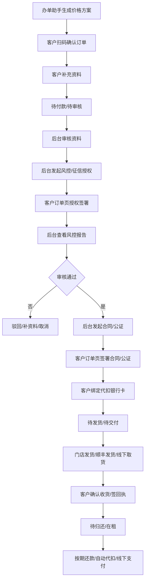

# 合悦租物下单视频与无界租操作文档分析

日期：2026-05-24

## 1. 来源

| 来源 | 内容 |
|---|---|
| 合悦租物平台下单视频 | 门店通过办单助手生成二维码，客户扫码下单、支付、审核、扫脸、签署合同 |
| 无界租操作文档 | 微信/支付宝/H5/APP 下单流程，以及后台客服审核、授权、合同、发货、还款操作 |

无界租文档链接：

`https://ask.xinyongzu.cn/#/doc/ftod3VCuot4lOneq1YrqAt`

---

## 2. 合悦租物视频提取出的流程

视频展示的是门店手机端办单助手到客户小程序下单的完整前台路径。

### 2.1 门店侧路径

1. 门店人员进入支付宝。
2. 搜索并进入合悦租物小程序。
3. 进入首页后点击底部 `我的`。
4. 进入 `我的店`。
5. 点击 `办单计算器`。
6. 进入租赁计算器，选择商品和参数：
   - 品牌
   - 机型
   - 租赁方案
   - 成色：全新 / 二手
   - 内存
   - 颜色
   - 租赁计算方案
   - 首付租金最低比例
   - 设备款
   - 首付租金
   - 租期
7. 点击开始计算。
8. 系统生成账单明细和办单二维码。
9. 门店把二维码给客户扫码。

可借鉴点：

- 办单助手不是简单商品详情页，而是门店开单工具。
- 计算器生成的是一份锁定价格方案，客户扫码后订单读取该方案。
- 价格方案里必须包含期数、日期、每期金额、期末价格、总额、二维码。
- 门店侧需要能快速调整首付、设备款、租期等关键价格字段。

### 2.2 客户侧路径

1. 客户用自己手机支付宝扫码。
2. 进入确认订单页。
3. 客户填写居住地址、邮箱等订单资料。
4. 客户选择或确认押金/租金/留购等费用。
5. 客户点击 `去免押` 或支付按钮，进入办单。
6. 订单提交后进入订单列表，状态进入待审核。
7. 审核过程中客户在小程序订单页继续操作：
   - 人脸识别
   - 授权签署
   - 合同签署
   - 公证或相关协议签署
8. 签署完成后，小程序显示签署成功，可查看/下载文件。

可借鉴点：

- 客户不是一次性填完所有内容，很多动作由后台发起后回到小程序订单页完成。
- 后台发起授权、合同、公证后，客户侧订单页需要出现对应待办按钮。
- 客户每完成一步，后台订单状态和回调状态必须同步更新。
- 订单列表里要展示下一步待办，例如待审核、待签署、待支付、待发货。

---

## 3. 无界租操作文档提取出的流程

无界租文档的核心路径：

1. 客户从微信小程序、H5 或 APP 进入，选择商品下单。
2. 付款可走线上直接付款，也可线下转账给商家；线下付款时后台需要操作 `线下支付`。
3. 商家可在 `未付款` 状态先审核资质，也可在客户付款后到 `待审核` 状态审核。
4. 客服点击 `审核资料` 查看客户证件、联系人手机号等资料。
5. 如果要查风控报告，后台先点击 `发起征信/风控授权签署`。
6. 客户在订单列表的待付款或待审核订单中点击 `授权签署`，完成授权书签署。
7. 授权完成后，后台点击 `风控信息` 查看风控报告，再决定是否符合发货标准。
8. 客户资质无问题：
   - 未付款订单：引导客户支付。
   - 已付款订单：后台点击 `审核通过`。
9. 审核通过后订单进入待发货，客户在订单页点击 `合同签署`。
10. 合同签署成功后，后台合同状态更新为已签署。
11. 客户绑定银行卡，用于后续期数代扣。
12. 银行卡绑定成功后，商家安排发货：
    - 普通快递：后台 `确认发货`，填写物流单号。
    - 顺丰发货：后台 `顺丰发货`，物流信息自动同步。
    - 到店取货/同城急送：后台 `线下取货`。
13. 如物流单号错误，客户确认收货前可取消后重新发货。
14. 客户确认收货，可签署回执单。
15. 确认收货后订单进入待归还，客户按期还款。
16. 还款支持线上主动支付、账单到期自动代扣、线下转账后后台线下支付。

---

## 4. 对新系统的补充建议

### 4.1 订单状态不能只到审核通过

新系统订单主链路建议补为：

### 4.2 后台发起，客户小程序完成

这些动作需要设计成“后台发起，客户小程序订单页完成”：

| 后台动作 | 客户侧动作 | 回调结果 |
|---|---|---|
| 发起征信/风控授权签署 | 点击授权签署 | 授权完成/失败 |
| 发起合同签署 | 点击合同签署 | 合同已签署/签署失败 |
| 发起补充合同 | 点击补充合同 | 补充合同已签署/失败 |
| 发起公证 | 点击公证办理/确认 | 公证完成/失败 |
| 要求绑定银行卡 | 绑定代扣银行卡 | 绑定成功/失败 |
| 要求补资料 | 补充资料提交 | 资料已补充/待复审 |

### 4.3 订单详情需要新增状态块

订单详情建议新增以下状态：

| 状态块 | 内容 |
|---|---|
| 客户资料 | 身份资料、联系人、地址、邮箱、补资料状态 |
| 风控授权 | 是否发起、客户是否签署、报告是否生成、报告有效期 |
| 人脸识别 | 是否需要、是否通过、失败原因 |
| 合同签署 | 主合同、补充合同、签署服务商、合同编号、签署状态 |
| 公证服务 | 是否启用、公证状态、客户操作入口、回调日志 |
| 代扣银行卡 | 是否需要绑定、绑定状态、用于后续期数代扣 |
| 支付记录 | 首付、押金、线下支付凭证、自动代扣 |
| 发货交付 | 发货主体、发货方式、物流单号、线下取货、回执单 |

### 4.4 订单列表需要展示下一步待办

列表内除订单状态外，还要显示当前最关键待办：

- 待客户付款
- 待审核资料
- 待发起授权
- 待客户授权签署
- 待查看风控报告
- 待审核通过
- 待发起合同
- 待客户签合同
- 待绑定银行卡
- 待发货
- 待客户确认收货
- 待还款

### 4.5 线下支付必须进入财务和日志

线下支付不能只是改订单状态，必须形成：

1. 线下支付申请或操作记录。
2. 收款金额。
3. 收款凭证。
4. 操作人。
5. 财务确认状态。
6. 关联账单。
7. 操作日志。

### 4.6 公证能力要作为可配置链路

公证不是每个订单都必须使用，应接入链路配置中心：

| 配置项 | 说明 |
|---|---|
| 是否启用公证 | 按订单类型/商户/商品配置 |
| 公证触发节点 | 审核通过后、合同签署前、合同签署后 |
| 客户操作入口 | 小程序订单详情展示 |
| 公证状态 | 未发起、已发起、办理中、完成、失败 |
| 公证费用 | 平台承担、商户承担、客户承担、计入套餐 |

---

## 5. 应补到正式 PRD 的位置

1. `03_商品办单助手订单核心链路.md`：补客户扫码、授权、合同、公证、银行卡、发货和还款链路。
2. `modules/运营端/订单管理/01_订单列表.md`：补下一步待办字段。
3. 后续新增 `订单详情` 页面级 PRD 时，把风控授权、人脸、合同、公证、银行卡、发货凭证作为标准页签。
4. `链路配置中心` 后续细化时，增加公证服务配置和线下支付配置。
