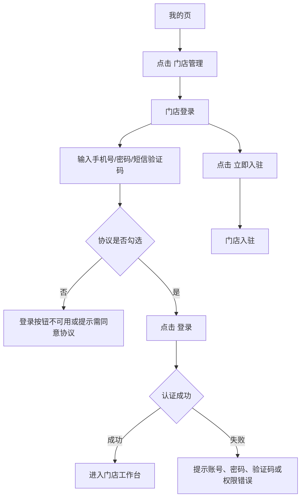
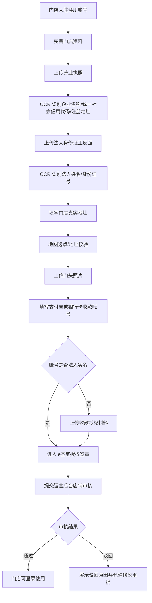

# 门店移动端：登录与入驻

## 入口与路由

| 页面 | 入口 | 路由 |
|---|---|---|
| 我的页 | 小程序/H5 底部 Tab `我的` | `/pages/my/my` |
| 门店登录 | 我的页 `门店管理` | `/pages/shopManage/login` |
| 门店入驻 | 门店登录页 `立即入驻` | `/pages/shopManage/settle` |

## 我的页入口

```text
我的
├─ 用户区：头像 / 点击登录 / 实名认证
├─ 我的订单：待付款 / 待审核 / 待发货 / 待收货 / 租用中 / 已逾期
├─ 门店管理：查看门店数据、管理订单
├─ 我的服务：押金 / 收藏夹 / 收货地址 / 优惠券 / 认证管理 / 银行卡
└─ 底部 Tab：首页 / 分类 / 客服 / 我的
```

点击 `门店管理` 后进入 `门店登录`。该入口面向商家/门店主体，不是普通租赁用户订单入口。

## 门店登录

```text
门店登录
├─ 顶部：返回 / 标题
├─ 品牌区：logo / 门店登录 / 商家工作台说明
├─ 手机号：+86 / 手机号
├─ 登录密码：密码输入 / 显示
├─ 短信验证码：验证码输入 / 获取验证码
├─ 登录
├─ 协议勾选：服务协议 / 隐私政策
└─ 还没有门店？立即入驻
```

### 点击流程



### 登录保持规则

| 场景 | 规则 |
|---|---|
| 同一手机/设备正常登录 | 默认 30 天内免重新输入密码，期间用 refresh token 续期 |
| 账号退出登录 | 清除本机 refresh token，回到登录页 |
| 修改密码 | 当前账号所有设备 token 失效 |
| 店铺停用/审核不通过 | token 失效，提示店铺状态异常 |
| 员工权限变更 | 下次请求即时按新权限鉴权，必要时强制重新登录 |

## 门店入驻

```text
门店入驻
├─ 手机号
├─ 登录密码 / 显示
├─ 确认密码 / 显示
├─ 邀请码（选填）
├─ 短信验证码 / 获取验证码
├─ 注册
├─ 已有账号？立即登录
└─ 协议勾选：服务协议 / 隐私政策 / 入驻合同
```

旧系统实测注册链路存在 `无权限` 提示，后续资料补全页面未能继续实测。新系统目标链路按业务规则补齐如下。

## 目标入驻资料流程



## 入驻资料字段

| 分组 | 字段/材料 | 要求 |
|---|---|---|
| 账号信息 | 手机号、登录密码、短信验证码、邀请码 | 手机号唯一；邀请码可选但要记录推荐关系 |
| 营业执照 | 营业执照图片、企业名称、统一社会信用代码、注册地址 | OCR 自动回填，允许人工修正并保留识别原文 |
| 法人信息 | 身份证正反面、法人姓名、身份证号、法人手机号 | OCR 识别；敏感字段脱敏展示 |
| 门店信息 | 门店名称、真实地址、地图坐标、门头照片、客服电话 | 地址需地图选点，门头照片必须可预览 |
| 收款信息 | 支付宝账号或银行卡号、开户名、授权材料 | 默认要求法人实名；非本人账号必须有授权 |
| 合同授权 | 入驻合同、e签宝企业授权、平台用印授权 | 展示授权状态、失败原因、回调时间 |

## 异常与失败

| 场景 | 反馈 |
|---|---|
| 手机号已注册 | 提示已有账号，引导立即登录或找回密码 |
| 验证码错误/过期 | 提示验证码错误或已过期，可重新获取 |
| 密码两次不一致 | 注册按钮不可提交或字段下方提示 |
| OCR 失败 | 保留图片，允许手动填写，标记需人工审核 |
| e签宝授权失败 | 展示失败原因，允许重新发起授权 |
| 运营审核驳回 | 展示驳回原因、驳回字段和重新提交入口 |

