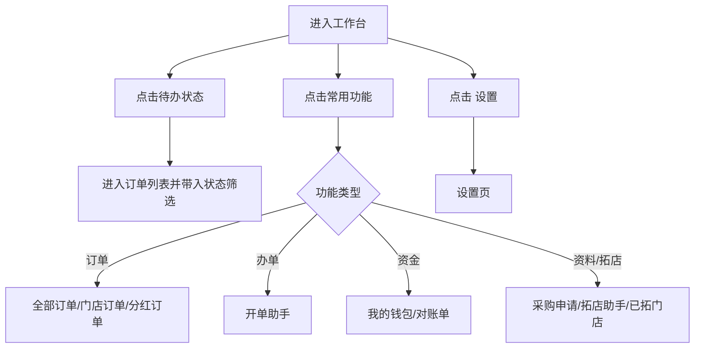
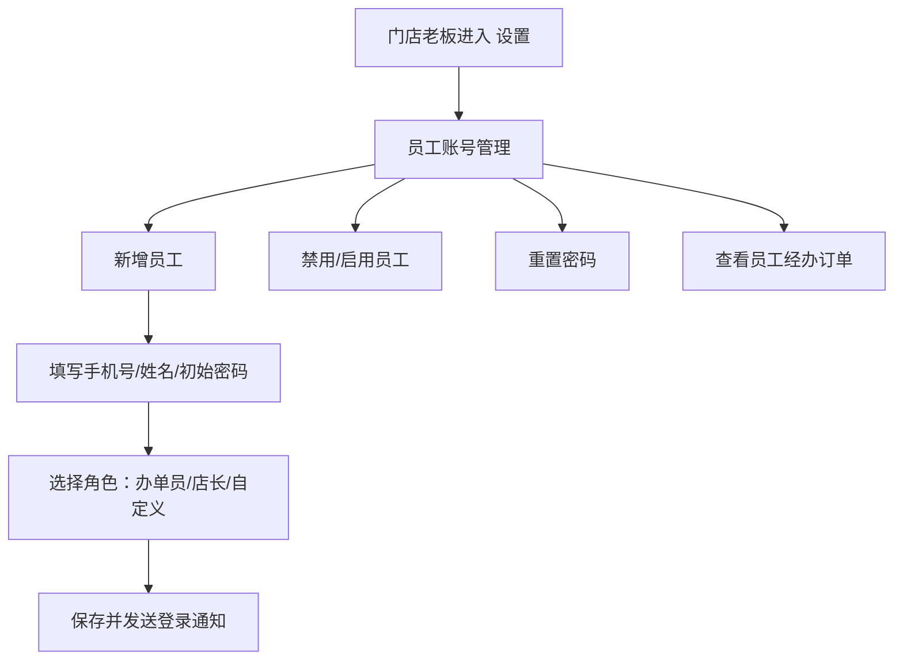

# 门店移动端：工作台与设置

## 工作台

- 路由：`/pages/shopManage/index`
- 页面定位：门店老板或员工进入后的移动端首页，用于处理待办、快速开单、查看经营概览。

```text
工作台
├─ 顶部：返回 / 工作台 / 设置
├─ 门店信息：门店名称 / 当前日期
├─ 今日指标：今日订单 / 今日收入 / 应收账款
├─ 待办事项
│  ├─ 全部订单
│  ├─ 待审核
│  ├─ 待发货
│  ├─ 待收货
│  ├─ 租赁中
│  └─ 待归还
├─ 常用功能
│  ├─ 全部订单
│  ├─ 门店订单
│  ├─ 分红订单
│  ├─ 开单助手
│  ├─ 我的钱包
│  ├─ 对账单
│  ├─ 采购申请
│  ├─ 拓店助手
│  └─ 已拓门店
└─ 经营概览
   ├─ 门店订单统计：租用中订单 / 逾期订单 / 已收佣金 / 未收佣金
   └─ 分红订单统计：租用中订单 / 逾期订单 / 已收分成金额 / 未收分成金额
```

## 工作台点击流程



## 设置页

- 路由：`/pages/shopManage/setting`

```text
设置
├─ 店铺信息修改
├─ 密码修改
└─ 退出登录
```

| 控件 | 点击结果 | 风险边界 |
|---|---|---|
| 店铺信息修改 | 进入店铺资料编辑页 | 保存提交会影响审核资料，本次未保存 |
| 密码修改 | 进入密码修改页 | 获取验证码、确认修改均未执行 |
| 退出登录 | 退出当前账号 | 本次未点击 |

## 店铺信息修改

- 路由：`/pages/shopManage/shopInfoEdit`

```text
店铺信息修改
├─ 店铺信息
│  ├─ 店铺名称
│  ├─ 联系人姓名
│  ├─ 联系人电话
│  ├─ 联系邮箱
│  ├─ 客服电话
│  ├─ 店铺地址
│  ├─ 支付宝账号
│  └─ 支付宝姓名
├─ 企业信息
│  ├─ 企业名称
│  ├─ 注册资金
│  ├─ 营业执照号
│  ├─ 企业地址
│  ├─ 经营范围
│  ├─ 法人姓名
│  ├─ 法人手机号
│  └─ 法人身份证号
├─ 资质图片
│  ├─ 营业执照图片
│  ├─ 法人身份证正面
│  └─ 法人身份证背面
└─ 保存并提交
```

### 上传控件

实测点击资质图片区域会打开系统文件选择器。新系统需要明确：

1. 已有图片点击时优先预览，预览页提供 `更换`。
2. 空图片点击时打开上传。
3. 文件格式、大小、清晰度校验失败时在当前图片位提示。
4. 资质图片更新必须进入审核流，不应直接覆盖线上生效资料。

## 密码修改

- 路由：`/pages/shopManage/changePassword`

```text
密码修改
├─ 短信验证码 / 获取验证码
├─ 新密码 / 显示
├─ 确认密码 / 显示
├─ 提示：验证码将发送至当前门店登录账号手机号
└─ 确认修改
```

## 员工账号补充需求

旧移动端设置中未看到员工账号入口，但新系统必须补齐。



| 角色 | 可用功能 | 禁止功能 |
|---|---|---|
| 门店老板 | 全部移动端功能，含钱包、资料、拓店、员工管理 | 无 |
| 店长 | 办单、订单、待办、部分经营数据 | 提现、充值、收款账号、员工权限、关键资料提交 |
| 办单员 | 开单助手、扫码办单、待办任务、本人经办订单 | 钱包、对账、商品配置、营销、拓店奖励、完整客户敏感信息 |

## 权限与审计

1. 员工所有订单操作必须记录 `操作人`，不能只记录店铺。
2. 员工查看客户信息默认脱敏，只有处理当前订单所需字段可见。
3. 老板禁用员工后，员工 token 立即失效。
4. 涉及资金、资料提交、付费报告的操作，员工默认无权执行。

