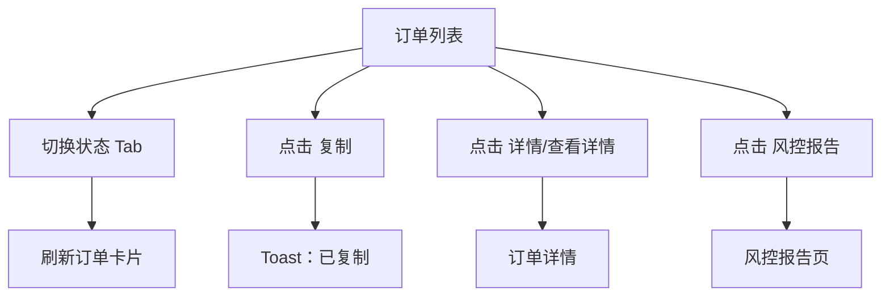
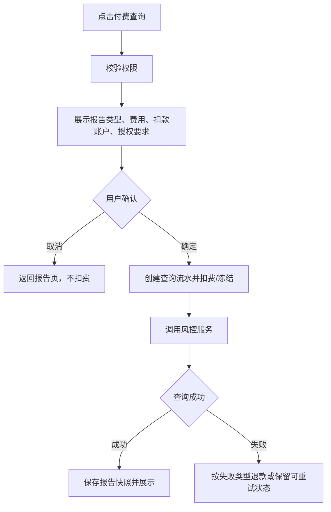

# 门店移动端：订单与风控

## 页面入口

| 页面 | 入口 | 路由 |
|---|---|---|
| 全部订单 | 工作台 `全部订单` / 待办状态 | `/pages/shopManage/orderList` |
| 门店订单 | 工作台 `门店订单` | `/pages/shopManage/storeOrderList` |
| 分红订单 | 工作台 `分红订单` | `/pages/shopManage/dividendList` |
| 订单详情 | 订单卡片 `详情` / `查看详情` | `/pages/shopManage/orderDetail` |
| 风控报告 | 订单卡片 `风控报告` | `/pages/shopManage/riskList` |
| 报告详情 | 风控报告 `查看报告` | `/pages/shopManage/riskDetail` |

## 订单列表结构

```text
订单列表
├─ 搜索框：搜索订单号 / 客户手机 / 姓名
├─ 状态 Tab
│  ├─ 全部
│  ├─ 待审核
│  ├─ 待发货
│  ├─ 待收货
│  ├─ 租赁中
│  ├─ 待归还
│  ├─ 待结算
│  ├─ 已完成
│  └─ 已关闭
└─ 订单卡片
   ├─ 状态
   ├─ 订单号 / 复制
   ├─ 商品图 / 商品名称
   ├─ 订单类型：月付 / 买断 / 门店订单
   ├─ 客户姓名 / 脱敏手机号
   ├─ 商品规格
   ├─ 租期/期数
   ├─ 下单时间
   ├─ 订单金额
   └─ 操作：风控报告 / 详情 / 查看详情
```

## 状态覆盖

| 状态 | 实测结果 |
|---|---|
| 全部 | 展示多种状态订单，可下拉加载 |
| 待审核 | 空状态 |
| 待发货 | 有订单，卡片含 `风控报告` 和 `详情` |
| 待收货 | 空状态 |
| 租赁中 | 有订单，卡片含 `风控报告` 和 `详情` |
| 待归还 | 空状态 |
| 待结算 | 空状态 |
| 已完成 | 有订单，操作为 `查看详情` |
| 已关闭 | 有多条订单，支持加载更多 |

## 订单点击流程



## 订单详情结构

```text
订单详情
├─ 顶部状态：待发货 / 租赁中 / 已关闭等
├─ 状态说明：买家已付款、买家正在租赁中、订单已关闭等
├─ 订单总金额
├─ 商品卡片：图片 / 名称 / 规格 / 类型 / 订单号 / 售价
├─ 摘要指标：租期 / 下单人 / 账单进度
├─ 折叠区
│  ├─ 订单摘要
│  ├─ 门店信息
│  ├─ 下单人信息
│  ├─ 金额明细
│  ├─ 分佣详情（门店订单可见）
│  ├─ 分期账单
│  └─ 订单进度
└─ 底部操作区：实测未出现高风险确认按钮
```

## 订单详情重构要求

| 区域 | 要求 |
|---|---|
| 订单摘要 | 展示下单时间、起租/归还时间、收货信息；手机号和地址按权限脱敏 |
| 门店信息 | 展示门店名称、联系方式、经办人 |
| 下单人信息 | 默认脱敏，员工仅可查看办单必要字段 |
| 金额明细 | 区分商品金额、首付、租金、押金、服务费、优惠、退款 |
| 分期账单 | 每期展示状态、应收、实收、到期日、取消/退款状态 |
| 订单进度 | 节点时间线只读，不允许人工覆盖历史节点 |

## 风控报告

```text
风控报告
├─ 订单说明：订单号脱敏显示
├─ 新颜探针：已查询 / 查看报告
├─ 新颜全景：未查询 / 付费查询
├─ 新颜共债：未查询 / 付费查询
└─ 阅读须知
```

### 风控点击反馈

| 控件 | 点击结果 | 本次动作 |
|---|---|---|
| 查看报告 | 弹出提示：近期已查询，选择展示报告或重新付费查询 | 选择了展示报告 |
| 重新查询 | 会触发重新付费查询 | 未执行 |
| 付费查询 | 弹出确认：是否付费查询？ | 取消 |
| 报告详情 | 展示报告结果和履约信息 | 只读查看 |

## 风控付费规则



## 实测发现的问题

1. 有订单在列表显示 `待发货`，但详情进度中出现关单/完结相关节点，属于旧系统状态同步风险；新系统需要用唯一订单状态机约束列表、详情、账单和进度一致。
2. 风控报告付费查询必须展示费用、扣款账户、授权来源和重复查询策略，避免员工误点扣费。
3. 订单卡片 `复制` 点击即复制订单号，低风险；仍建议 Toast 明确复制内容。

