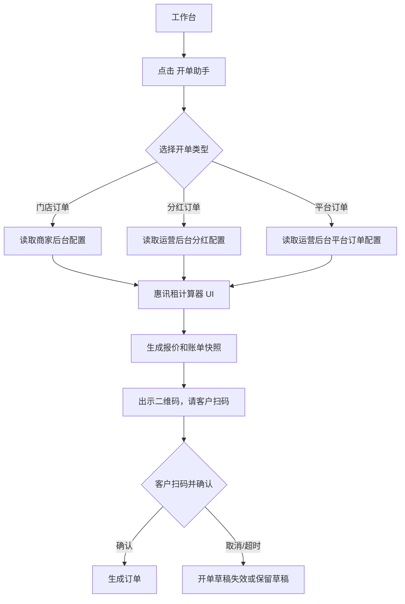

# 门店移动端：开单助手

> 重构决策：旧系统的 `自建低费率开单` 改为 `平台订单`。新系统门店手机端办单助手固定三入口：`门店订单`、`分红订单`、`平台订单`。UI 和计算逻辑以 `joezjyan-bot/calculator/phone-rent` 为基准。

## 入口与路由

| 页面 | 入口 | 路由 |
|---|---|---|
| 开单助手 | 工作台 `开单助手` | `/pages/shopManage/orderAssistant` |
| 门店订单办单 | 开单助手 `门店订单` | 待新系统定义 |
| 分红订单办单 | 开单助手 `分红订单` | `/pages/shopManage/dividendOrder` 可复用或重建 |
| 平台订单办单 | 开单助手 `平台订单` | `/pages/shopManage/lowRateOrder` 旧路由需改名 |

## 开单助手首页

```text
开单助手
├─ 门店订单：商家自有配置，商家自己审核
├─ 分红订单：运营平台配置，门店出设备/部分资金，资方补足
└─ 平台订单：运营平台配置，平台/资方全额出资
```

## 开单选择流程



## 惠讯租计算器输入

```text
产品分类：手机 / 电动车
成色：二手 / 全新
设备型号
存储容量
设备价格
首付比例
租期
设备管理费
赋强公证
```

## 计算公式

```text
首付金额 = 设备价格 * 首付比例
未付金额 = 设备价格 - 首付金额
后续应还总额 = 未付金额 * 费率
后期月付 = 后续应还总额 / (期数 - 1)
押金 = 首付金额 - 首期租金
首期实付 = 押金 + 首期租金 + 设备管理费 + 公证费
留购总价 = 押金 + 全部期数租金总和
```

## 三类办单配置来源

| 办单类型 | 商品/费率来源 | 增值服务来源 | 审核主体 | 特殊字段 |
|---|---|---|---|---|
| 门店订单 | 商家后台 | 商家后台 | 商家自己 | 无资方 |
| 分红订单 | 运营后台 | 运营后台 | 运营平台 | 配资比例 20%-80% |
| 平台订单 | 运营后台 | 运营后台 | 运营平台 | 平台/资方全额出资 |

## 分红订单字段

```text
分红订单办单
├─ 惠讯租计算器基础字段
├─ 配资比例：20% / 30% / 40% / 50% / 60% / 70% / 80%
├─ 门店出资额：设备价 - 资方出资额
├─ 资方出资额：设备价 * 配资比例
├─ 门店收益占比：1 - 配资比例
├─ 资方收益占比：配资比例
└─ 出示二维码，请客户扫码
```

配资比例和分账比例必须随订单快照保存。

## 增值服务

点击 `新增` 后追加一组增值服务表单：

```text
增值服务1
├─ 删除
├─ 服务名称
├─ 服务金额
├─ 服务简介
└─ 服务内容
```

## 二维码出单边界

本次未点击 `出示二维码，请客户扫码`，因为该动作可能生成真实客户下单会话。新系统建议拆成两步：

1. 门店端点击后只生成 `开单草稿/报价单`，展示二维码。
2. 客户扫码后在自己的用户端确认商品、价格、租期、首付、服务费、合同和授权。
3. 客户确认前不创建正式订单、不扣款、不占用额度。
4. 二维码有有效期，过期后不可继续下单。

## 同步到后台的报价快照

```text
商品价格快照
押金
首期实付
后期账单
设备管理费
公证费
增值服务
留购价
配资比例
分账比例
二维码下单记录
```

## 须知文案要求

旧系统须知包含安全锁设备、不可刷机、禁止连接电脑、履行完毕后解除、必须填写与售卖设备一致的序列号等。新系统应把这些内容拆成：

| 类型 | 展示位置 |
|---|---|
| 门店操作须知 | 开单页面底部 |
| 客户确认须知 | 客户扫码确认页 |
| 合同条款 | 合同/订单协议中 |
| 风控校验 | 提交订单前系统校验 |
