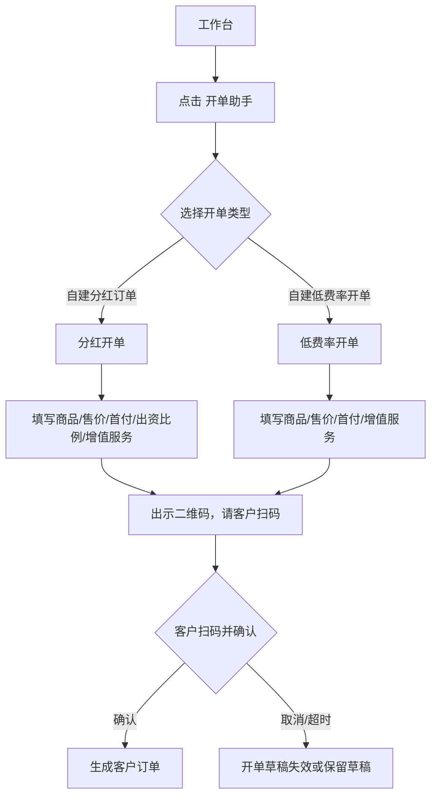

# 门店移动端：开单助手

## 入口与路由

| 页面 | 入口 | 路由 |
|---|---|---|
| 开单助手 | 工作台 `开单助手` | `/pages/shopManage/orderAssistant` |
| 分红开单 | 开单助手 `自建分红订单` | `/pages/shopManage/dividendOrder` |
| 低费率开单 | 开单助手 `自建低费率开单` | `/pages/shopManage/lowRateOrder` |

## 开单助手首页

```text
开单助手
├─ 标题：轻松开单，高效管理
├─ 提示：所有订单类型在结算时统一收取会员技术服务费
├─ 自建分红订单
│  ├─ 标签：平台配资 / 支持主流数码产品 / 结款快
│  └─ 说明：平台出资，按比例分红，收益稳定
└─ 自建低费率开单
   ├─ 标签：门店订单 / 仅支持苹果新机和二手手机业务 / 低息
   └─ 说明：自主定价，低费率，灵活开单
```

## 开单选择流程



## 分红开单

```text
分红开单
├─ 成色：必填，Picker
├─ 分类：必填，Picker
├─ 型号：必填，Picker
├─ 颜色：型号选择后展示规格按钮
├─ 内存：型号选择后展示规格按钮
├─ 套餐信息：期数套餐按钮
├─ 手机售价：必填
├─ 首付比例：必填，Picker
├─ 出资比例：必填，Picker
├─ 增值服务
│  ├─ 新增
│  └─ 服务名称 / 服务金额 / 服务简介 / 服务内容 / 删除
├─ 须知
└─ 出示二维码，请客户扫码
```

### 实测选项

| 字段 | 示例选项 |
|---|---|
| 成色 | 智能手机、二手手机 |
| 分类 | 华为、荣耀、小米、OPPO、三星、全新苹果、iPhone17、vivo |
| 型号 | 选择分类后展示对应型号 |
| 规格 | 选择型号后展示颜色、内存、官方价 |
| 首付比例 | 20%、30%、40%、50%、60% |
| 出资比例 | 20%、30%、40%、50%、60%、70%、80% |
| 套餐 | 4期、6期、9期、12期等 |

## 低费率开单

```text
低费率开单
├─ 成色
├─ 分类
├─ 型号
├─ 颜色 / 内存 / 套餐信息
├─ 手机售价
├─ 首付比例
├─ 增值服务
└─ 出示二维码，请客户扫码
```

和分红开单相比，低费率开单不展示 `出资比例`，更偏门店自营低费率订单。

## 增值服务

点击 `新增` 后追加一组增值服务表单：

```text
增值服务1
├─ 删除
├─ 服务名称
├─ 服务金额
├─ 服务简介
└─ 服务内容
```

## 二维码出单边界

本次未点击 `出示二维码，请客户扫码`，因为该动作可能生成真实客户下单会话。新系统建议拆成两步：

1. 门店端点击后只生成 `开单草稿/报价单`，展示二维码。
2. 客户扫码后在自己的用户端确认商品、价格、租期、首付、服务费、合同和授权。
3. 客户确认前不创建正式订单、不扣款、不占用额度。
4. 二维码有有效期，过期后不可继续下单。

## 须知文案要求

旧系统须知包含安全锁设备、不可刷机、禁止连接电脑、履行完毕后解除、必须填写与售卖设备一致的序列号等。新系统应把这些内容拆成：

| 类型 | 展示位置 |
|---|---|
| 门店操作须知 | 开单页面底部 |
| 客户确认须知 | 客户扫码确认页 |
| 合同条款 | 合同/订单协议中 |
| 风控校验 | 提交订单前系统校验 |

