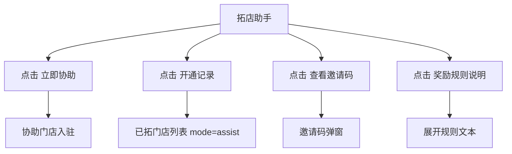

# 门店移动端：采购账号与拓店

## 采购收款账号申请

- 入口：工作台 `采购申请`
- 路由：`/pages/shopManage/procurementAccount`
- 实测状态：申请成功，采购收款账号已生效，可以正常使用。

```text
采购收款账号申请
├─ 状态：申请成功
├─ 说明：采购收款账号已生效，可以正常使用
└─ 采购收款账号信息
   ├─ 签约支付宝账户
   ├─ 法人
   ├─ 法人身份证
   ├─ 法人手机号
   └─ 电子邮箱
```

## 采购账号要求

1. 页面应按状态展示：未申请、资料待补充、审核中、申请成功、申请失败、账号失效。
2. 成功状态只读展示签约信息，敏感字段脱敏。
3. 资料不一致时应提示联系运营或重新提交资料。
4. 员工账号默认无权查看采购收款账号。

## 拓店助手

- 入口：工作台 `拓店助手`
- 路由：`/pages/shopManage/expansionHelper`

```text
拓店助手
├─ 指标：成功拓店 / 待审核 / 累计奖励
├─ 帮门店入驻
│  └─ 立即协助
├─ 开通记录
├─ 邀请码邀请
│  └─ 查看邀请码
├─ 奖励规则说明
└─ 拓店攻略
```

## 拓店点击流程



## 协助门店入驻

- 路由：`/pages/shopManage/assistSettle`

```text
协助门店入驻
├─ 手机号
├─ 登录密码
├─ 确认密码
├─ 短信验证码 / 获取验证码
├─ 注册并继续完善资料
└─ 协议：服务协议 / 隐私政策 / 代入驻合同
```

本次未发送短信、未注册。新系统要求：

1. 协助入驻必须明确代操作授权，不能默认推荐人可以代签全部资料。
2. 新门店手机号注册后，后续企业资料和 e签宝授权仍应由新门店主体确认。
3. 推荐关系在注册成功时锁定，后续奖励以首单和审核状态计算。

## 开通记录 / 已拓门店

| 页面 | 路由 | 搜索 | Tab | 空状态 |
|---|---|---|---|---|
| 开通记录 | `/pages/shopManage/expandedShops?mode=assist` | 搜索门店名称/手机号 | 一级门店 / 二级门店 | 暂无开通记录 |
| 已拓门店 | `/pages/shopManage/expandedShops` | 搜索门店名称 | 一级门店 / 二级门店 | 暂无门店 |

## 邀请码弹窗

```text
您的专属邀请码
├─ 邀请码
├─ 二维码
├─ 复制邀请码
└─ 关闭
```

本次只打开并关闭弹窗，未复制邀请码。文档和日志中不得保留真实邀请码。

## 奖励规则

旧系统展示的规则方向：

1. 成功推荐新店入驻并完成首单后，推荐人获得现金奖励。
2. 奖励在被推荐店铺完成首单后若干工作日内发放至推荐人钱包。
3. 每月累计奖励可多推多得。
4. 被推荐店铺入驻后限定时间内未产生有效订单，则不计入奖励。
5. 平台保留活动规则解释权。

## 拓店重构要求

1. 奖励规则必须参数化：奖励金额、首单定义、有效订单定义、发放周期、失效周期。
2. 推荐链路要防止自推、重复推荐、手机号换绑套利。
3. 奖励入账必须写入钱包流水，并可在对账单查看。
4. 邀请码和二维码要可复制、可分享、可失效重置。

