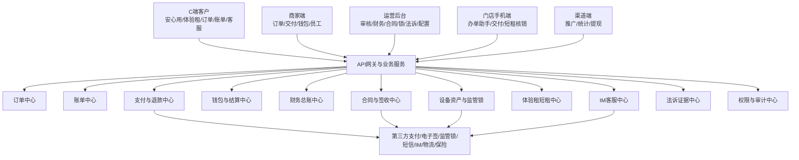
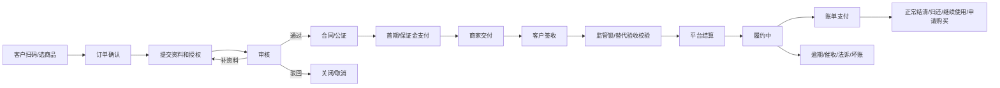
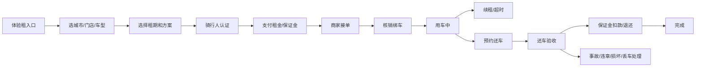

# 满点租赁系统开发执行文档 V0.2.2

> 用途:给产品、技术、测试、财务、风控、法务、运营统一执行。  
> 范围:安心用长租、体验租短租 V1、IM 客服基础能力、运营后台、商家端、门店手机端、渠道端、财务结算、法诉证据链。  
> 规则:本文只记录当前应按什么开发、测试和验收,不记录版本修改过程。

---

## 1. 开发总目标

满点租赁系统是一套面向设备租赁业务的统一系统,覆盖手机、电动车、数码设备等品类。系统需要同时支持:

1. **安心用长租**:客户按期使用设备,到期可归还、继续使用或申请购买。
2. **体验租短租 V1**:客户按小时、天、周、月等短周期租用设备,以门店自营取还车为主。
3. **IM 客服基础能力**:客户、商家、平台客服围绕订单、账单、签收、短租异常等进行统一沟通和证据沉淀。
4. **商家/门店经营**:商家可办单、审核、交付、管理员工、查看钱包和发起提现。
5. **平台运营后台**:平台可审核订单、配置商品、管理商家、处理财务、监管锁、证据包、权限、数据报表。

开发交付目标不是单独做页面,而是做一套数据互通的业务系统。订单、账单、支付、钱包、总账、合同、签收、设备、IM、法诉证据必须能按同一订单贯通。

详见: `PRD/V0.2/00_V0.2.2_开发冻结版总PRD.md`

---

## 2. 当前一期范围

| 模块 | 是否一期开发 | 说明 |
|---|---|---|
| 安心用长租 | 是 | 主营链路,必须完整上线 |
| 体验租短租 V1 | 是 | 独立入口、独立订单、独立库存和取还车流程 |
| IM 客服基础能力 | 是 | 会话、派单、转接、上下文卡片、证据沉淀 |
| 商家订单 | 是 | 商家自营,商家承担对应退款责任 |
| 联营订单 | 是 | 平台、商家及内部资金规则协同,客户侧不暴露内部规则 |
| 平台订单 | 是 | 平台主导商品、审核、运营和结算 |
| 钱包/提现/分账 | 是 | 商家钱包、渠道佣金账户、提现和失败回滚 |
| 法诉证据包 | 是 | 订单证据按订单归档和导出 |
| 账龄/Vintage | 是 | 财务和合作方尽调报表,只读统计 |
| 完整工单系统 | 否 | V1 仅保留 IM 会话标记和转主管,完整工单后续扩展 |
| 系统化门店处罚 | 否 | V1 只做备注、冻结、停用等基础操作 |

---

## 3. 全局业务口径

### 3.1 三类订单展示名

全系统前端、客服话术、商家端、财务报表、合同说明统一展示为:

| 展示名 | 业务含义 | 技术说明 |
|---|---|---|
| 商家订单 | 商家自营,商家自行承担对应经营责任 | 内部枚举可保持兼容,但页面不展示英文枚举 |
| 联营订单 | 商家和平台按约定共同参与 | 客户侧不展示资金来源、合作模式和内部结算规则 |
| 平台订单 | 平台主导商品、审核、运营和结算 | 商家只看履约视图和约定结算 |

前端、接口响应、导出报表必须有中文展示名。内部枚举、数据库字段和接口路径可以保留工程兼容命名,但不得直接展示给客户或商家。

### 3.2 C 端敏感信息隔离

C 端不得展示:

- 资方信息
- 资金来源
- 合作模式
- 风控结论
- 内部审核备注
- 服务费拆分明细
- 商家结算价
- 平台利润
- 返点规则
- 内部标签
- 黑名单/灰名单结论

C 端只展示客户需要理解和操作的内容:商品、规格、订单周期、首期应付、每期应付、保证金、协议、签约、支付、签收、账单、退款进度、客服入口。

### 3.3 费用和购买口径

| 项目 | 当前执行口径 |
|---|---|
| 保证金 | 展示层统一叫保证金 |
| 首期应付 | 客户首次需要支付的费用 |
| 每期应付 | 后续账单每期应付金额 |
| 增值服务费 | 按商品/套餐/配置项加入报价或账单 |
| 平台服务费 | 客户侧先不展示拆分;后台和财务按配置核算 |
| 申请购买价 | 一期按“剩余应付租金 + 保证金”执行 |
| 到期选择 | 归还设备、继续使用、申请购买三项同等展示 |
| 提前归还 | 展示预结算,不强制结清全部未到期费用 |
| 逾期费用 | 0.05%/日,最低 10 元/日;按订单类型确定归属和入账 |

### 3.4 监管锁适用品类

监管锁主要适用于苹果类手机、平板、手表等配置品类。其它无监管锁品类按以下替代条件结算:

1. 客户签收确认完成。
2. 设备识别码归档完成。
3. 交付证据完整。
4. 审核人员前置检测完成。

不得因为品类没有监管锁而阻断正常业务;但有监管锁配置的品类必须校验锁状态。

详见: `PRD/V0.2/modules/运营端/发货履约/02_签收确认配置.md`

---

## 4. 系统模块架构

### 4.1 模块职责

| 模块 | 核心职责 | 不负责 |
|---|---|---|
| 订单中心 | 订单主状态、订单类型、客户、商家、商品、报价快照 | 不直接记真实资金到账 |
| 账单中心 | 账单计划、出账、支付状态、逾期状态 | 不直接改钱包余额 |
| 支付与退款中心 | 支付单、退款单、回调、幂等、补偿 | 不替代总账 |
| 钱包与结算中心 | 商家钱包、渠道佣金账户、提现、冻结、回滚 | 不替代订单业务账 |
| 财务总账中心 | 平台收入、应付商家、服务费、冲正、坏账、回收分录 | 不给业务页面直接改状态 |
| 合同与签收中心 | 合同模板、电子签、公证、电子确认单、AI 问答确认 | 不负责资金分账 |
| 设备资产与监管锁 | 设备资产、设备价值、设备码、锁状态、激活锁状态 | 不管理短租车辆库存主流程 |
| 体验租短租中心 | 门店、车型、短租订单、库存、取还车、保证金、异常 | 不混用长租订单状态机 |
| IM 客服中心 | 会话、派单、转接、消息、附件、订单上下文 | 不直接执行退款、扣款、锁车、关单 |
| 法诉证据中心 | 证据归档、证据包、一键导出、导出留痕 | 不生成合同正文 |
| 权限与审计中心 | 角色、权限点、操作日志、审计日志、二次确认 | 不决定业务规则 |

---

## 5. 安心用长租开发流程

### 5.1 关键开发规则

1. 订单创建必须生成订单业务快照:商品、规格、设备价、订单周期、首期应付、每期应付、保证金、增值服务、报价快照。
2. 账单生成前允许具备权限的客服按规则改价;账单生成后禁止直接修改账单。
3. 审核驳回、补资料、签约失败、支付失败、交付失败、签收拒绝、锁校验失败都必须有明确状态和下一步动作。
4. 交付时必须写入设备识别码,支持 IMEI/SN/VIN 等类型。
5. 长租不占用短租车辆库存状态机。
6. 签收通过前不得起租;锁校验或替代验收未通过前不得结算。
7. 法诉、坏账、回收完成都不能删除原始账单、支付流水、合同、签收证据。

### 5.2 长租主状态

当前开发以状态字典 §0.1 为准。核心状态包括:

草稿、待客户提交资料、待风控审核、审核驳回、待补充资料、待签约、签约失败、待支付首付、首付支付失败、待门店交付、待客户签收确认、待监管锁校验、监管锁失败、待平台结算、打款失败、履约中、正常结清、提前留购/提前结清、退款中、已退款、逾期中、催收中、法诉中、坏账核销、已回收完成、已关闭、已取消。

详见: `PRD/V0.2/modules/全局/02_状态字典与订单状态机.md`

---

## 6. 体验租短租 V1 开发流程

### 6.1 短租开发规则

1. 短租必须是独立入口、独立订单、独立状态机、独立车辆库存。
2. C 端体验租入口支持城市、品类、附近门店、租期单位、扫码下单。
3. 商家端必须支持接单、拒单、核销绑车、取车确认、还车验收、异常上传。
4. 车辆必须有唯一设备码/车辆码,核销绑车后进入出租中。
5. 保证金必须有冻结、扣款、退还、审批、客户通知和证据。
6. 事故、违章、损坏、丢车只要不是车辆质量问题,原则上由承租人承担;系统必须保留证据和处理记录。
7. 短租异常使用异常工单子状态,不得污染订单主状态。

### 6.2 短租主状态

核心状态包括:

待支付租金、保证金待支付/待授权、待商家接单、待取车、使用中、已被续租、待还车验收、已完成、已取消、已逾期、已锁车、争议中。

短租异常子状态包括:

超时处理中、损坏处理中、事故处理中、违章处理中、丢车处理中、控车异常、取车异常、还车争议。

详见: `PRD/V0.2/modules/短租业务/01_体验租业务总览.md`、`PRD/V0.2/modules/短租业务/11_体验租风险责任规则表.md`

---

## 7. 办单助手开发要求

办单助手是门店/商家快速出码和客户扫码下单的核心入口,必须做成后台可配置,不能写死在前端。

### 7.1 配置能力

| 配置项 | 要求 |
|---|---|
| 商品范围 | 可按订单类型、商家、门店、品类、商品配置 |
| 期数 | 可配置,如 6/9/12 期等 |
| 首付成数 | 可配置,门店可被关闭具体首付成数 |
| 费率基础 | 支持未付金额乘费率、设备价乘费率、剩余金额系数等配置 |
| 增值服务 | 支持服务项、金额、默认勾选、强制勾选、计入首付/账单/留购总价 |
| 名义留购费 | 按配置进入报价快照 |
| 二维码 | 每次出码绑定报价快照,二维码下方展示“请扫码下单” |

### 7.2 快照规则

1. 客户扫码下单只读取报价快照,不得实时读取当前配置重新计算。
2. 配置变更必须生成新配置版本。
3. 已被订单引用的报价快照不可修改。
4. 作废未下单快照必须有权限、原因、二次确认和审计日志。

详见: `PRD/V0.2/modules/门店手机端/办单助手/02_计算器字段与账单公式表.md`

---

## 8. 财务与资金开发要求

### 8.1 四账分离

| 账类 | 作用 | 主要开发对象 |
|---|---|---|
| 订单业务账 | 给运营、客服、商家看订单和账单状态 | 订单、账单、退款责任、履约状态 |
| 支付流水账 | 给技术和财务看通道交易和回调 | 支付单、退款单、回调日志、幂等键 |
| 钱包/商家账户账 | 给商家和财务看可提现、冻结、提现中 | 钱包账户、钱包流水、提现单、失败回滚 |
| 财务总账/分录账 | 给财务和老板看收入、应付、冲正、坏账 | 总账分录、科目、冲正、坏账、回收 |

任何资金动作必须能从订单追到支付、钱包和总账。

### 8.2 必须实现的资金控制

| 场景 | 控制规则 |
|---|---|
| 支付回调 | 按通道交易号和回调事件幂等,重复回调不重复入账 |
| 退款 | 必须有责任方、金额、原支付流水、审批人、凭证和冲正对象 |
| 打款 | 必须通过结算条件校验,重复打款必须拦截 |
| 返点 | 按订单、推广关系快照、规则版本和期次幂等 |
| 提现 | 单笔 500-20000 元,每日最多 3 次,手续费 0.2%+0.5 元,超 2 万人工审核 |
| 提现失败 | 释放冻结余额,写失败回滚流水 |
| 坏账核销 | 不删除原账单和原支付流水 |
| 坏账回收 | 回原订单登记回收金额、完成方式、凭证和总账分录 |

详见: `PRD/V0.2/modules/运营端/财务管理/06_财务流水模型与对账规则.md`

---

## 9. 权限、日志和审计

### 9.1 权限模型

系统必须支持:

1. 标准权限点。
2. 自定义角色。
3. 操作员绑定角色。
4. 临时授权。
5. 二次确认。
6. 二人复核。
7. 操作日志。
8. 审计日志。

技术人员默认不拥有业务审批权。所有影响资金、账单、订单结算、法诉证据、客户资料、监管锁状态的动作,都必须由业务角色审批和留痕。

### 9.2 高危操作

高危操作至少包括:

修改订单金额、发起退款、审核退款、发起打款、审核提现、调整返点、冻结/解冻钱包、关闭订单、坏账核销、法诉材料导出、修改监管锁状态、修改结算状态、强制变更订单状态、删除或隐藏附件、修改客户关键资料、修改办单助手费率和配置、资产处置、修改设备价值。

详见: `PRD/V0.2/modules/运营端/权限日志/02_权限矩阵.md`

---

## 10. OpenAPI 与接口开发规则

### 10.1 通用接口规则

1. 所有接口必须有请求追踪号。
2. 所有有副作用的接口必须有幂等键。
3. 所有高危接口必须写操作日志和审计日志。
4. 所有状态变更必须写状态日志,不得只更新主表状态。
5. 所有第三方调用必须写调用日志,失败进入补偿任务。
6. C 端接口必须使用白名单 DTO,不得复用运营端 DTO 后过滤。
7. 金额字段统一内部精度,前端只做展示格式化。
8. 错误返回必须包含稳定错误码、客户可读提示、内部排查码、是否可重试。

### 10.2 必须优先评审的接口域

| 接口域 | 说明 |
|---|---|
| C 端下单/资料/合同/支付/签收 | 长租主链路 |
| 办单助手报价/二维码/快照 | 门店出码和扫码下单 |
| 订单审核/发货/设备码/监管锁 | 履约和结算前置 |
| 结算校验/打款/退款/冲正 | 财务高风险 |
| 钱包/提现/返点 | 商家和渠道资金 |
| 体验租下单/接单/取车/还车/异常 | 短租 V1 |
| IM 会话/消息/上下班/接单/转派 | 客服基础能力 |
| 法诉证据包 | 法务和追偿 |
| 第三方回调 | 支付、退款、电子签、监管锁、IM、保险等 |

详见: `PRD/V0.2/modules/开发设计/20_V0.2.2_API最终契约验收清单.md`、`PRD/V0.2/openapi/core-api.v0.2.yaml`

---

## 11. 数据模型开发要求

### 11.1 核心数据域

| 数据域 | 关键对象 |
|---|---|
| 主体 | 客户、商家、门店、操作员、角色、渠道 |
| 商品 | 商品、规格、价格、增值服务、配置版本 |
| 订单 | 订单主表、订单明细、状态日志、报价快照 |
| 账单 | 账单、账单流水、逾期费用、减免、冲正 |
| 支付 | 支付单、支付回调、退款单、退款回调 |
| 钱包 | 钱包账户、钱包流水、提现单、冻结/解冻 |
| 总账 | 总账分录、科目、分录批次、冲正、坏账、回收 |
| 合同 | 合同记录、电子签记录、公证记录、模板版本 |
| 签收 | 电子确认单、AI 问答记录、人设备合照、交付照片 |
| 设备 | 设备资产、设备识别码、设备价值确认、资产状态日志 |
| 监管锁 | 锁设备、指令日志、回调日志、异常复核 |
| 短租 | 短租订单、车辆库存、保证金、续租链、异常工单 |
| IM | 会话、消息、附件、客服状态、派单日志 |
| 法诉 | 证据包、证据项、导出记录、补充附件 |
| 审计 | 操作日志、审计日志、第三方调用日志、补偿任务 |

### 11.2 建模红线

1. 订单业务账、支付流水账、钱包账、总账分录必须分表。
2. 长租设备档案和短租车辆库存必须分离。
3. C 端 DTO 和内部运营 DTO 必须分离。
4. 所有状态变更都必须有状态日志。
5. 所有资金动作都必须有幂等键。
6. 所有证据材料都必须能归入订单证据包。

详见: `PRD/V0.2/modules/开发设计/18_V0.2.2_ERD字段索引与幂等键.md`

---

## 12. 第三方供应商接入

| 供应商类型 | 接入内容 | 必须落库 |
|---|---|---|
| 支付/退款 | 支付单、退款单、回调、手续费、状态 | 支付流水、回调日志、补偿任务 |
| 电子签 | 合同发起、签署链接、签署状态、PDF 副本 | 合同记录、签署记录、模板版本 |
| 公证 | 公证发起、客户待办、公证状态 | 公证记录、回调日志 |
| 监管锁 | 绑定、上锁、激活锁、解锁、定位、状态回调 | 指令日志、回调日志、异常复核 |
| OCR/人脸 | 实名、证件、人设备合照 AI 核验 | 只存结果、评分、流水号,不建可检索人脸库 |
| 短信/通知 | 验证码、支付提醒、逾期提醒、审核通知 | 通知记录、触达状态 |
| IM | 会话、消息、附件、客服状态 | 会话、消息、附件、派单日志 |
| 物流 | 发货、签收、轨迹 | 物流记录、签收记录 |
| 保险 | 保单、保障、理赔状态 | 保单记录、回调日志 |

详见: `PRD/V0.2/modules/开发设计/21_V0.2.2_第三方供应商适配字段映射.md`

---

## 13. 法诉证据链

每一笔订单必须能形成完整证据链:

1. 订单基础信息。
2. 客户实名资料。
3. 设备信息和设备价值确认。
4. 合同和电子签记录。
5. 支付记录。
6. 交付照片和设备识别码。
7. 签收确认。
8. AI 问答或人设备合照核验记录。
9. 监管锁记录。
10. 账单明细。
11. 逾期记录。
12. IM 聊天记录。
13. 退款/冲正记录。
14. 操作日志。
15. 审计日志。
16. 法诉导出记录。

证据包必须按订单归档,支持一键导出,导出必须留痕。

详见: `PRD/V0.2/modules/运营端/租后管理/03_法诉证据包与导出规则.md`

---

## 14. 测试验收要求

### 14.1 必验场景

| 类型 | 必测内容 |
|---|---|
| 长租主流程 | 商家订单、联营订单、平台订单从下单到履约和完成 |
| 短租主流程 | 选门店、选车、支付、接单、核销、用车、续租、还车、保证金 |
| 账单计算 | 改价、出账、部分支付、逾期、减免、冲正、退款 |
| 支付回调 | 成功、失败、重复、延迟、金额不一致 |
| 打款结算 | 结算条件阻断、成功、失败、重复打款拦截 |
| 退款冲正 | 责任方、指定金额、通道退款、钱包冲正、总账冲正 |
| 钱包提现 | 限额、次数、手续费、审核、失败回滚 |
| 权限审计 | 高危操作权限、二次确认、二人复核、审计日志 |
| 合同签收 | 电子签、签收确认、AI 问答、人设备合照 |
| C 端隔离 | 禁返字段扫描和页面文案扫描 |
| 法诉导出 | 证据完整性、导出留痕 |
| 并发幂等 | 重复提交、重复支付、重复退款、重复打款、重复返点 |

### 14.2 资金类四账断言

任何资金测试都必须同时验证:

1. 订单业务账正确。
2. 支付流水账正确。
3. 钱包/商家账户账正确。
4. 财务总账/分录账正确。

四账任一不平或缺失,资金类功能不得验收通过。

详见: `PRD/V0.2/modules/测试验收/V1_端到端验收矩阵.md`

---

## 15. 建议开发阶段拆分

### 第一阶段:基础底座

目标:先把系统能跑起来,且状态、权限、资金、审计不返工。

必须完成:

- 账号、角色、权限点、审计日志
- 客户、商家、门店、商品、规格
- 状态机、状态日志
- 订单主表、账单表、支付流水
- OpenAPI 基础 DTO 和 C 端白名单
- 第三方调用日志和补偿任务

不建议提前做:

- 花哨经营看板
- 自动化门店处罚
- 完整工单系统

### 第二阶段:长租主链路

目标:安心用长租商家订单、联营订单、平台订单闭环。

必须完成:

- C 端下单、资料、授权、签约、支付、签收
- 运营审核、合同、公证、发货、设备码
- 监管锁/替代验收校验
- 结算校验和商家钱包
- 账单生成和账单支付
- 申请购买、归还、提前归还

### 第三阶段:财务资金和证据链

目标:钱流可对账、可审计、可回滚。

必须完成:

- 四账分离
- 退款、冲正、返点、提现、失败回滚
- 总账分录
- 法诉证据包
- 设备资产和设备价值确认

### 第四阶段:体验租短租 V1

目标:短租独立闭环,不污染长租。

必须完成:

- C 端体验租入口
- 门店/车型/租期选择
- 骑行人认证
- 商家接单
- 核销绑车
- 用车中、续租、超时
- 还车验收
- 保证金扣款/退还
- 事故/违章/损坏/丢车异常

### 第五阶段:IM 客服和运营增强

目标:订单异常能被客服承接,证据能沉淀。

必须完成:

- 客服上下班
- 轮询派单
- 会话接单和转派
- 订单上下文卡片
- IM 附件归档
- 高危动作跳转业务模块
- 店铺风险指标、停单、关闭低首付

### 第六阶段:联调、验收和上线

目标:具备试运行条件。

必须完成:

- 支付/退款联调
- 电子签联调
- 监管锁联调
- IM/短信/物流/保险供应商联调
- 全链路测试
- 资金四账测试
- 权限审计测试
- 数据备份、监控、补偿任务

---

## 16. 开发完成定义

一个模块只有同时满足以下条件,才算完成:

1. 页面字段、按钮、禁用态、弹窗符合页面契约。
2. API DTO、错误码、幂等键、权限点符合 API 验收清单。
3. 数据表、状态日志、操作日志、审计日志符合 ERD 和权限矩阵。
4. C 端通过敏感字段隔离检查。
5. 资金动作通过四账断言。
6. 第三方调用有调用日志、回调幂等和补偿任务。
7. 异常流程有状态、有提示、有人工处理入口。
8. 测试用例通过,并保留验收记录。

---

## 17. 开发团队阅读顺序

1. `docs/满点租赁系统_开发执行文档_V0.2.2.md`
2. `PRD/V0.2/00_V0.2.2_开发冻结版总PRD.md`
3. `PRD/V0.2/modules/全局/02_状态字典与订单状态机.md`
4. `PRD/V0.2/modules/开发设计/18_V0.2.2_ERD字段索引与幂等键.md`
5. `PRD/V0.2/modules/开发设计/20_V0.2.2_API最终契约验收清单.md`
6. `PRD/V0.2/modules/开发设计/19_V0.2.2_页面级字段按钮弹窗总表.md`
7. `PRD/V0.2/modules/运营端/权限日志/02_权限矩阵.md`
8. `PRD/V0.2/modules/运营端/财务管理/06_财务流水模型与对账规则.md`
9. `PRD/V0.2/modules/测试验收/V1_端到端验收矩阵.md`
10. 具体开发到哪个模块,再读取对应模块 PRD。

---

## 18. 研发不得自行决定的事项

以下事项必须按产品、财务、法务或老板确认口径执行,技术不能自行调整:

1. 三类订单展示名。
2. 申请购买价口径。
3. 服务费口径。
4. 逾期费用规则。
5. 退款责任方。
6. 商家结算触发条件。
7. 短租事故、违章、损坏、丢车责任。
8. 保证金扣款规则。
9. 账单生成后不可直接修改。
10. C 端敏感字段隔离。
11. 高危操作审批和审计要求。
12. 法诉证据包导出权限。

---

## 19. 当前主文档索引

| 类型 | 文档 |
|---|---|
| 总 PRD | `PRD/V0.2/00_V0.2.2_开发冻结版总PRD.md` |
| 文档地图 | `docs/V0.2.2_FINAL_DOC_MAP.md` |
| 状态字典 | `PRD/V0.2/modules/全局/02_状态字典与订单状态机.md` |
| 页面契约 | `PRD/V0.2/modules/开发设计/19_V0.2.2_页面级字段按钮弹窗总表.md` |
| API 验收 | `PRD/V0.2/modules/开发设计/20_V0.2.2_API最终契约验收清单.md` |
| OpenAPI | `PRD/V0.2/openapi/core-api.v0.2.yaml` |
| ERD/幂等 | `PRD/V0.2/modules/开发设计/18_V0.2.2_ERD字段索引与幂等键.md` |
| 权限矩阵 | `PRD/V0.2/modules/运营端/权限日志/02_权限矩阵.md` |
| 财务规则 | `PRD/V0.2/modules/运营端/财务管理/06_财务流水模型与对账规则.md` |
| 长租 | `PRD/V0.2/modules/运营端/订单管理/08_长租订单全生命周期与客服操作.md` |
| 短租 | `PRD/V0.2/modules/短租业务/01_体验租业务总览.md` |
| IM 客服 | `PRD/V0.2/modules/运营端/客服中心/01_IM客服页面与接口规则.md` |
| 办单助手 | `PRD/V0.2/modules/门店手机端/办单助手/02_计算器字段与账单公式表.md` |
| 法诉证据 | `PRD/V0.2/modules/运营端/租后管理/03_法诉证据包与导出规则.md` |
| 测试验收 | `PRD/V0.2/modules/测试验收/V1_端到端验收矩阵.md` |

